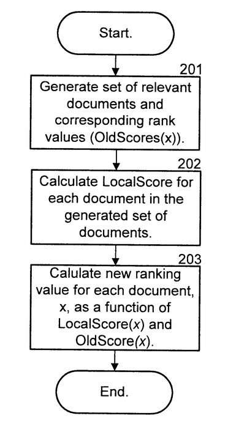
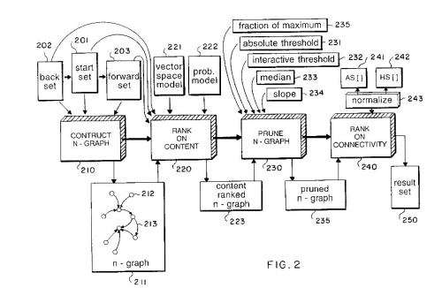
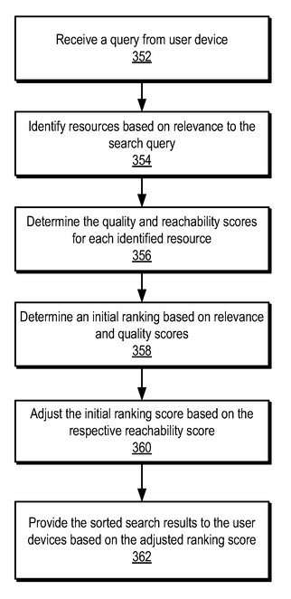
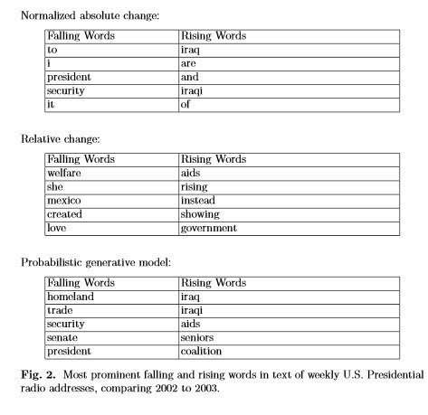
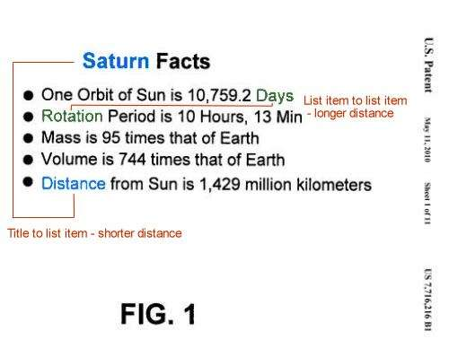
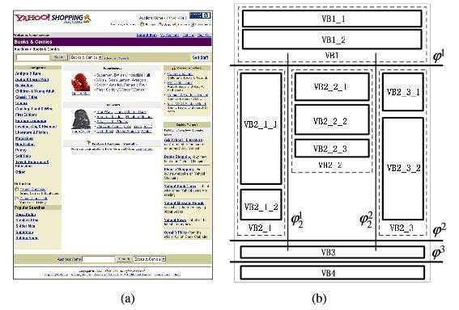
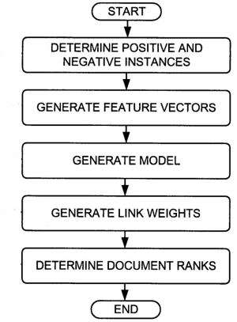
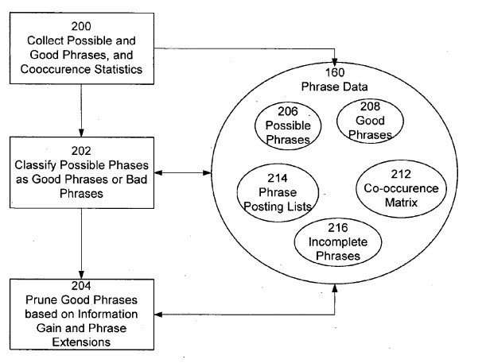

I’ve seen a few long posts lately that list ranking signals from Google, and they inspired me to start writing a series about ranking signals over on Google+. The chances are good that I will continue to work on the series there, especially since I’ve been getting some great feedback on them.

This post includes the first seven, plus an eight signal – the Co-Occurrence Matrix described in Google’s Phrase-Based Indexing patents.

I’m also trying to include links to some of the papers and patents that I think are among some of the most important to people interested in SEO that support the signals that I’ve included.

Here are the first 8 signals:

## 1. Local Inter-Connectivity

This ongoing series will look at some of the different ranking signals that Google has likely used in the past to rank search results. In response to a query.

In 2001, Krishna Bharat filed for a patent with the USPTO that was granted in 2003. What it did was take the top search results (top 100, top 1,000, etc.) and boost some of those results based upon how often they “cited” or linked to each other within that “local” setting.

According to the patent, search results are ordered to normally be based upon things such as relevance and importance (PageRank), and then they are examined again. A local relevance score is added into the mix to use to change the order of those results:

_A Local Rank is considered with an old score for Pages_

> Further, the method ranks the generated set of documents to obtain a relevance score for each document. It calculates a local score value for the documents in the generated set. The local score value quantifies the documents referenced by other documents in the generated set of documents.

You may have heard or read that Krishna Bharat rewrote how Google worked in the early 2000s by applying the Hilltop Algorithm to how it works. The “other references” section of this patent refers to a paper by Bharat from before he joined Google that describes what Hilltop is and how it works:

[Hilltop: A Search Engine based on Expert Documents](ftp://ftp.db.toronto.edu/pub/reports/csrg/405/hilltop.html)

Google has since published several patents and papers that may boost or demote some local results based upon other signals, since then and I’ll be including some of those in this series.

> [Ranking search results by reranking the results based on local inter-connectivity](https://patents.google.com/patent/US6526440)

## 2. Hubs and Authorities

Imagine that pages on the Web might be given 2 sets of scores. These sets of scores are for “broad topic” queries, such as “I wish to learn about motorcycles.”

The first score might be an authority score, based upon how well it answers that broad topic. The second score might be a hub score, where compilations of links have been collected that can be used to find authoritative pages for that broad topic.

The patent I’ve linked to was written when the inventors were at AltaVista and came into ownership by Yahoo when Overture purchased them, and then Yahoo purchased Overture. One of the inventors was the inventor of the patent in the first post of this series, Krishna Bharat, and the other inventor is Monika Henzinger. Reading anything you can from either is recommended.

A paper cited in the patent should be read by anyone studying SEO and studying how pages may be ranked in search results, by Jon Kleinberg:

[Authoritative Sources in a Hyperlinked Environment](http://www.cs.cornell.edu/home/kleinber/auth.pdf) (pdf)

Try to read through as much of the paper as you can before moving on to the patent – it becomes much easier to read and understand if you do so.

The point behind the patent is to improve upon the Hubs and Authorities Algorithm in the Kleinberg paper, to prevent topic drift when the focus is upon terms that may have more than one meaning (for example, Jaguar may refer to a Car brand, a type of Animal, and a football player in the NFL from Jacksonville).

_The content is pruned, and then re-ranked based upon connectivity_

The patent and the paper aren’t from Google, even though Bharat and Henzinger both worked at Google, and you will see elements of Hubs and Authorities scores in their work.

> [Method for ranking hyperlinked pages using content and connectivity analysis](https://patents.google.com/patent/US6738678)

## 3. Reachability

I couldn’t help myself but publish this one – at a rate of one a day, it could take some time to get up to 100-200 ranking signals, and I don’t know if I’m patient enough for that. :)

With the first couple of signals that I’ve written about, the idea of Google wanting to identify authority and hubs plays a strong role, and the idea that some pages are great resources that should rank highly comes out of that.

This patent focuses upon looking at user behavior signals for pages linked to from other pages to determine a reachability score for those pages. Good Hubs are pages that tend to lead to authoritative pages. To a degree, it’s similar to scoring pages that act as good Hubs.

I wrote a post about this patent that describes how it works titled:

[Does Google Use Reachability Scores in Ranking Resources?](https://www.seobythesea.com/2012/11/google-reachability-scores/)

So pages that are great resource pages based upon some measure of the quality of the links from those pages to other resources could boost the rankings of those pages.

_Initial Rankings Changed by Reachability Scores_

In the book about Google by Steven Levy, we are told that Google values “Long Clicks” as a quality signal. The patent does describe how Google might determine what a long click is, but doesn’t use it as a direct ranking signal. Instead, it uses Long Clicks to determine the quality of pages that link to many other pages that result in long clicks. Those pages would likely be good Hubs pages. :)

> [Determining reachability](https://patents.google.com/patent/US8307005)

## 4. Burstiness

Jon Kleinberg noticed one day that at certain times of the year, his email was filled with specific topics, such as around the time that midterms and final exams were going to happen, his emails would focus upon test-taking and extra office hours.

He noticed that this kind of behavior happened on the Web as well, where different events would trigger certain topics, in blogs, in the news, in search queries, and so on. He looked at archives of things like presidential messages, for terms that would recur, and the events that triggered them, and started thinking of information in streams.

_Kleinberg’s study included looking at words in Presidential addresses._

When traffic goes through a network, it isn’t in a steady stream, but rather travels in bursts. Sometimes there are patterns to the bursts. Having a sense of hot topics, topics that have cooled off, others that may be seasonal or influenced by the day or day of the week, could be useful.

Many lists of ranking signals used by the search engines mention things like “freshness,” and algorithms for things like news or blog search do likely use “freshness” as an important signal. Still, when a search engine acts as a reference source, like a library, sometimes more mature results are what is being called for.

When Monika Henzinger published patents for Google on [Document Inception Dates](https://patents.google.com/patent/US8521749) for documents found on the web, those documents were dated based upon when they were first published, or first crawled by a search engine, sometimes the rankings of those might be influenced by that date, this could be influenced by the relative age of a set of search results.

So, if a search for “declaration of independence” turned up more mature documents, there might be a preference to show older documents, and they might be boosted in search results. On a search for “Windows 8.1”, the set of search results might tend to be a lot younger, and so newer documents might be boosted in search results.

If there is a sudden increase in searches for “Justin Bieber Canada,” the bursty nature of the Web might cause fresher documents to rank higher, and we might see a “query deserves freshness” algorithm kick in where news articles and newer pages move up in search results.

Please don’t call it freshness, because sometimes mature pages are the ones that move up.

> Temporal Dynamics of On-Line Information Streams (PDF)

## 5. Semantic Closeness

Some see the word “semantic” and ask where the semantic markup or schema.org markup is. This post isn’t for you.

Some see heading elements and wonder whether or not the fact that they are often bigger and bolder on a page than other text makes those pages rank higher for the words within the heading. This post isn’t for you.

There are those of you who see a list on a page. It doesn’t even technically have to use an HTML list element, which recognizes that any of the items within the list could be ordered differently, such as alphabetically, or by word length, or even randomly, and each of those list items would be equally as valuable a list item as any of the others. And they would be equally as close to the words in the list’s heading as any of the other list items.

And closeness is magical to search engines and SEO. Search for “ice cream,” and the page that includes the phrase “ice cream” should be more relevant and rank higher than the page that includes the phrase, “I went to the store to buy cream, and slipped on the ice.

_I’ve annotated this patent image to show semantic closeness in a list._

Not only are list items equal distances away from the heading of that list, but heading elements on a page are equal distance from every word in the substance that they head. I know this because it’s covered in Google’s definition of “semantic closeness.”

And each word on a page is an equal distance to the words in the title of that page. That’s what the semantic meaning of a page title is, and that’s included in Google’s definition of “semantic closeness” as well.

As I noted above, no schema.org markup was required to have semantic closeness. Meaning happens, and some HTML elements have meaning baked right into them, which goes beyond just how they present things on an HTML page.

So the next time that you see someone state that there is no correlation between using a heating element and ranking at Google, ask them if they accounted for semantic closeness and leave them scratching their head. If they don’t get it, they probably never will.

> [Document ranking based on semantic distance between terms in a document](https://patents.google.com/patent/US7716216)

## 6. Page Segmentation

You may find yourself asking why the Microsoft link. Honestly, it’s probably because Microsoft has written much more about page Segmentation and carried the ideas and concepts behind it much further than Google or Yahoo.

_Microsoft’s VIPS paper image showing segmentation._

Google does have a few patents directly on the concept of page segmentation, and I included in it my “10 most important SEO Patents” series.

Here are some of the things that Microsoft described in white papers and patents, though:

- A [block level PageRank](http://www.cad.zju.edu.cn/home/dengcai/BLLA.html), where links from different blocks or sections on pages would carry and pass along PageRank as if they were pages in the older approach to PageRank.
- A way to decide which was the [most important block](http://www.cs.toronto.edu/~hfliu/papers/www04_liu.pdf) on a page, especially pages that had multiple main content sections like a magazine mode with multiple stories, so that the text in the most important block should carry the most Relevance Value.
- A way to analyze and understand the different blocks or segments of a page based upon [linguistic features of those blocks](https://www.seobythesea.com/2011/02/how-a-search-engine-might-identify-the-functions-of-blocks-in-web-pages-to-improve-search-results/), or sections.

Does the content of that block use mostly full sentences in the Sentence case, with only the first words capitalized, and full punctuation?

Does the block only contain lists of words/phrases, in title case, and mostly links elsewhere?

Does the block contain a copyright notice, so that it’s most likely a footer for a page, and the text within it should be ranked very lowly from a relevance stance?

Here are a few posts I’ve written on web page segmentation, for those of you who want to do a little more investigation on the subject:

- [Google and Document Segmentation Indexing for Local Search](https://www.seobythesea.com/2006/07/google-and-document-segmentation-indexing-for-local-search/)
- [Google’s Page Segmentation Patent Granted](https://www.seobythesea.com/2011/03/googles-page-segmentation-patent-granted/)
- [Search Engines, Web Page Segmentation, and the Most Important Block](https://www.seobythesea.com/2008/05/search-engines-web-page-segmentation-and-the-most-important-block/)
- [Breaking Pages Apart: What Automatic Segmentation of Webpages Might Mean to Design and SEO](https://www.seobythesea.com/2009/07/breaking-pages-apart-what-automatic-segmentation-of-webpages-might-mean-to-design-and-seo/)

> [VIPS: a Vision-based Page Segmentation Algorithm](https://www.microsoft.com/en-us/research/publication/vips-a-vision-based-page-segmentation-algorithm/)

## 7. Reasonable Surfer PageRank

PageRank is the algorithm that seems to have set apart Google from the other search engines of its day, but the chances are that it started changing from the moment that it was set loose on the world. I can’t in good faith write about the PageRank of the late 90s, but I wanted to point to a different model.

Not every link on a page passes along the same weight, the same amount of PageRank, and likely not even the same amount of hypertextual relevance. We heard this from Google Representatives for a few years, and from even search engines like Yahoo and Blekko, where we’ve been told that some links are likely completely ignored, such as those that might show up in comments on blog posts.

_Features of Links determine weights_

As this patent tells us, Google might see the anchor text of “terms of service” on a page, and automatically not send much PageRank to that page.

You see the name “Jeffrey Dean” listed as one of the inventors on this patent, and if you start digging through other Google patents, you’ll see it frequently. He often writes about technical issues involving the planet-wide data center that Google has been building, and how the whole of the machinery works overall. If you have a few days to spare towards looking at patents from Google, it won’t hurt looking for ones written by him. His “Research at Google” page might overwhelm you:

[Jeffrey Dean – Research at Google](https://research.google/people/jeff/)

There have been a lot of things written about PageRank over the years. Still, if you haven’t read about the Reasonable Surfer and don’t understand the transformation it describes from a random surfer model, you really should.

Here’s a blog post I wrote about it that you could use as a kick start:

[Google’s Reasonable Surfer: How the Value of a Link May Differ Based upon Link and Document Features and User Data](https://www.seobythesea.com/2010/05/googles-reasonable-surfer-how-the-value-of-a-link-may-differ-based-upon-link-and-document-features-and-user-data/)

> [Ranking documents based on user behavior and/or feature data](https://patents.google.com/patent/US7716225)

## 8. Co-Occurrence Matrix

I’ve written several posts over the last decade about phrase-based indexing, and it’s probably one of the most important SEO topics of that period. And one of the most ignored and underrated. Several patents from Google describe how phrase-based indexing works, and how Google may have incorporated it into its inverted index.

The inventor behind Phrase-Based Indexing is also the inventor of one of the largest search engines of the 21st century, the Recall search engine, which was used as a beta on the Internet Archive. Patterson left Google to launch the Cuil search engine with her husband, Tom Costello. That search engine supposedly launched with 120 Billion pages. Cuil was a failure, but Patterson was very quickly back at Google as a Director of Research.

In Phrase-Based-Indexing, meaningful good phrases are identified on web pages and are mapped to those pages in an inverted index. In search results sets for queries, the phrases that co-occur within the top 100, or top 1,000, or some other set may be identified. For words or phrases that might have more than one meaning, those results might be clustered so that pages about similar topics are grouped to find their co-occurring phrases.

_An overview of the phrase-based indexing ecosystem_

These co-occurring phrases are called “related words,” When they appear on a page that might rank for the initial query, Google may boost them in search results. If too many “related words” appear on a page, beyond a statistical likelihood, Google might consider that page to be spam beyond a statistical likelihood.

Google may look for these “related words” in the anchor text and may weigh links associated with anchor text differently based on the co-occurrence level. Here’s a passage from one of the patents that describe how that works, and it’s interesting to give our discussion of the HITS algorithm above, how it refers to documents pointed to with highly co-occurring related words as “expert documents.”

> [0206] R.sub.i.Q.Related phrase bit vector*D.Q.Related phrase bit vector.
>
> [0207] The product value here is a score of how topical anchor phrase Q is to document D. This score is here called the “inbound score component.” This product effectively weights the current document D’s related bit vector by the related bit vectors of anchor phrases in the referencing document R. If the referencing documents R themselves are related to the query phrase Q (and thus, have a higher valued related phrase bit vector), then this increases the significance of the current document D score. The body hit score, and the anchor hit score are then combined to create the document score, as described above.
>
> [0208] Next, for each of the referencing documents R, the related phrase bit vector for each anchor phrase Q is obtained. This is a measure of how topical the anchor phrase Q is to the document R. This value is here called the outbound score component.
>
> [0209] From the index 150 then, all of the (referencing document, referenced document) pairs are extracted for the anchor phrases Q. These pairs are then sorted by their associated (outbound score component, inbound score component) values. Depending on the implementation, either of these components can be the primary sort key, and the other can be the secondary sort key. The sorted results are then presented to the user. Sorting the documents on the outbound score component makes documents containing many related phrases to the query as anchor hits rank most highly, thus representing these documents as “expert” documents. Sorting on the inbound document score makes documents that are frequently referenced by the anchor terms the highest ranked.

The Phrase-Based Indexing patents are very rich, and there are many additional elements that need to be explored in more depth. I detailed a number of those in the following post, but going through the remainder of the patents reveals many additional ways that Google may use this Co-Occurrence Matrix.

[Phrase Based Information Retrieval and Spam Detection](https://www.seobythesea.com/2006/12/phrase-based-information-retrieval-and-spam-detection/)

Many of those patents are linked to in my post [10 Most Important SEO Patents, Part 5 – Phrase Based Indexing](https://www.seobythesea.com/2011/12/10-most-important-seo-patents-part-5-phrase-based-indexing/)

> [Multiple index based information retrieval system](http://appft1.uspto.gov/netacgi/nph-Parser?Sect1=PTO1&Sect2=HITOFF&d=PG01&p=1&u=%2Fnetahtml%2FPTO%2Fsrchnum.html&r=1&f=G&l=50&s1=%2220060106792%22.PGNR.&OS=DN/20060106792&RS=DN/20060106792)

## Epilogue

This isn’t the end, by far. But there are many signals that I likely won’t include within this series because there just really isn’t a lot to support them. Some factors that I’ve seen in lists of ranking signals are likely more myth than anything else, and I may address some of those.

The chances are good that Google uses multiple algorithms at any one point, and we’ve been told that the search engine makes around 500 changes or so a year to how they rank pages in search results.

I’ll be exploring those, but I hope that the signals I do include provide enough information to be starting points for anyone who wants to do more research on their own. If you do, let me know!
