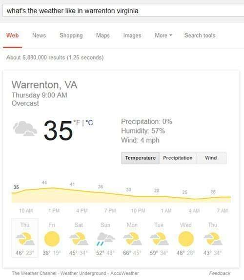
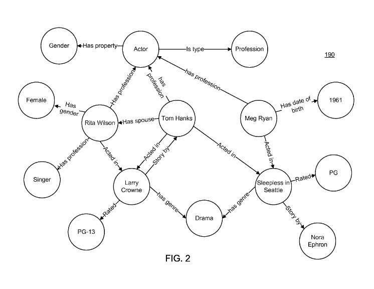
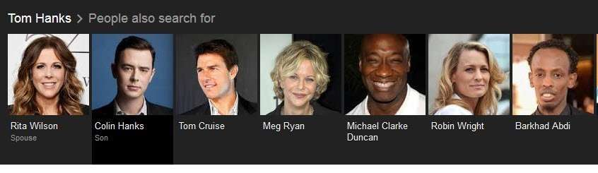
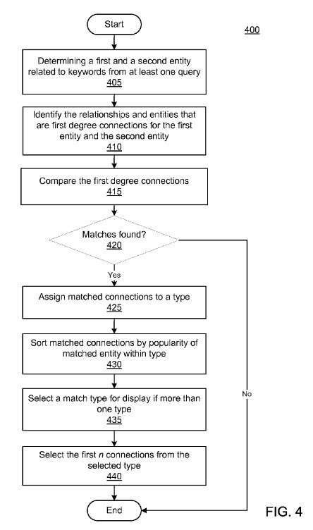
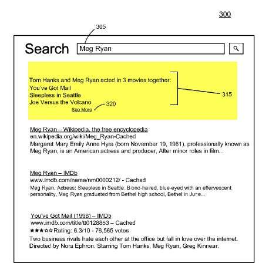
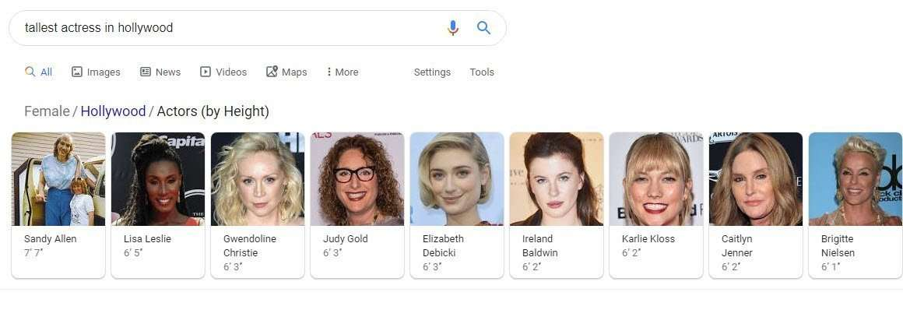

*Added July 14, 2020. The patent application that I wrote about in this post has been granted. The granted patent can be found at: [Generating insightful connections between graph entities](http://patft.uspto.gov/netacgi/nph-Parser?Sect1=PTO1&Sect2=HITOFF&d=PALL&p=1&u=%2Fnetahtml%2FPTO%2Fsrchnum.htm&r=1&f=G&l=50&s1=10,713,261.PN.&OS=PN/10,713,261&RS=PN/10,713,261)*

We’re used to search engines matching the keywords we query, returning pages that contain those words.

But what if search engines worked differently?

It seems like search engines are starting to do that, with more featured snippets in response to queries that show up as a fact, appearing at the top of a set of search results in an “answer box”. And those questions are sometimes something more than just “what’s the weather like in Warrenton, Virginia?”

_An answer box appears in response to this query, but a direct question may produce more interesting responses._

Instead of indexing pages on the web, and what those pages contain, search engines can be used to search other data sources, such as a data graph. Or knowledge bases at Google, through Google’s Knowledge Graph.

## Searching Data Graphs

A data graph stores information in the form of nodes and edges, with nodes being connected by edges.

The node in a data graph may represent an entity, such as people, places, items, ideas, topics, abstract concepts, concrete elements, other things, or combinations of things.

These entities in the graph may be related to each other by edges that connect them. Those may represent relationships between entities. Those entity connections may be interesting themselves.

For example, the data graph may have an entity that corresponds to the actor Tom Hanks and the data graph may also contain information about other entities such as movies that Tom Hanks and others have acted in.

A search engine may search the data graph in addition to just web pages when responding to search queries, to provide entity search results in addition to regular search results, such as whom else performed in movies with Tom Hanks.

The difference is that the first type of search is a search through data about the entity (Tom Hanks) involved, while the second is a search through web pages that might contain the information that we are looking for, or some portion of that information, without actually containing all of the information. If we rely upon the indexed web pages and look through each of those pages, we might be able to compile a list of other performers by visiting every page, and writing down who those other actors were. It could take a while.

It’s much easier if Google might give us information about entities in some manner, like in this carousel:

A search through the indexed data could potentially save us some of that writing and Google could potentially show a carousel-like this of people that other people search for when they search for Tom Hanks.

A Google patent explores looking at the entity connections to see if it can surface interesting and unexpected connections.

[Generating Insightful Connections Between Graph Entities](http://appft.uspto.gov/netacgi/nph-Parser?Sect1=PTO1&Sect2=HITOFF&d=PG01&p=1&u=%2Fnetahtml%2FPTO%2Fsrchnum.html&r=1&f=G&l=50&s1=%2220140280044%22.PGNR.&OS=DN/20140280044&RS=DN/20140280044)
Invented by David Francois Huynh, Guanghua Li, Chen Ding, Yanlai Huang, Ying Chai, Liang Hu, Jingxu Chen
Assigned to Google
US Patent Application 20140280044
Published September 18, 2014
Filed: March 13, 2013

Abstract

> Implementations provide an enhanced search result to improve the user search experience.
>
> For example, the result may include insightful information relevant to the search query that was not specifically requested but that the user may find interesting, such as relationships shared between the two entities related to the query, a relationship between the two entities that do not commonly occur with another relationship shared by the entities, or strong secondary connections for an entity related to the query.
>
> In some implementations, insightful connections may also be unique facts for a particular entity. Unique facts may represent a superlative attribute of an entity such as, for example, the tallest actor, the oldest president, the most expensive stock, etc. Such shared relationships, rare relationships, and/or unique facts may be provided as part of the search results presented to the query requestor and may provide insight to the requestor about the entity

Entity Connections might be found like this:

_A Flow Chart from the patent showing how entity connections might be identified._

It’s possible that Google should show us snippets of information at the top of a set of search results that might be a little more unusual and unexpected, such as:

_A search for Meg Ryan shows off facts about the relationship between her and Tom Hanks._

The patent tells us that the advantages of this approach could be to:

> …Enhance the user’s search experience by providing interesting and insightful connections relating to the subject of the user’s query. Such connections may not have been specifically requested but may be of interest to the user.
>
> Furthermore, the connections may be pre-computed from a large data graph so that information from complex relationships that use large amounts of processing power can be provided as part of a low-latency search result.

We could see such unusual results when a query involves more than one entity or multiple entities that may be related in some way surface in queries that might be searched for near in time to others.

As for those “Insightful Relationships” between multiple entities, those may be shown when:

> An insightful relationship may include a first relationship linking the two entities that do not commonly occur with a second relationship that each entity shares with a third entity. An insightful relationship may also be determined when two entities share a strong secondary connection.
>
> In some implementations, insightful entity connections may also be unique facts. Unique facts may represent a superlative attribute of an entity such as, for example, the tallest actor, the oldest president, the most expensive stock, etc. Such shared relationships, rare relationships, and/or unique facts may be provided as part of the search results presented to the query requestor and may provide insight to the requestor about the entity.

I have to say that I would probably be amused to start seeing trivia like this, or “entity connections” that do go beyond a request for weather information.

I can say that the places I’ve been seeing information about entity connections is in carousels from Google, like the following:

