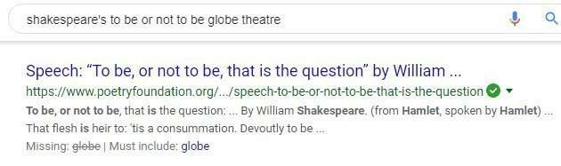

Some terms in a query might be considered insignificant query terms.

The most important step in doing keyword research is entering a keyword phrase into a search engine like Google, and see what results show up, and trying to understand why the pages that appear within results are there. If you can’t do that, then it’s time to dig down and start learning.

Whether you’re a searcher looking for information on the Web, or someone doing keyword research for a website, it’s important to have an idea of the many different ways that a search engine might treat a search you perform. For instance, if your search is one that might trigger Google to show results from a specific web page associated with a named entity (a particular person, place, or thing) at the top of those results, you shouldn’t necessarily be surprised to see that site listed first in search results. This is something that is done algorithmically by Google. Just stating that Google has a “magical” brand preference is a mistake in that instance. It’s better to try to understand how that algorithm might be triggered instead.

Likewise, when you perform a search for a term such as [hospice], Google might decide to show a map result from Google Maps in Web search results because their universal search algorithm suggests that the query has a local intent, and the searcher is likely looking for a nearby hospice. Again, it would be a mistake to assume that Google is favoring their own “property” in Google Maps when the reality is that the vertical search result of Google Maps is what searchers are looking for.

And with a term such as [hospice], Google may also insert within those search results some web results as well, as localized organic results, since searchers are likely looking for a nearby hospice when using that term as a query. If you look at results for a query and how they change when you change the specified location on your browser in Google, you can often see the results change for these localized organic results. For some locations, you might see changes, while for other locations, those localized results might not appear.

## Approaches to Backing Off Insignificant Query Terms

Sometimes when you perform a search, and the results aren’t great, a search engine might remove some of the terms of your query. This has sometimes been referred to as “backing off” on that query.

In the past, these less than helpful terms might have been things like stop words, such as “a,” “the,” “of,” “is,” when they are included in that query. But that doesn’t work well when it comes to a query such as [the matrix], which is usually best served as a movie starting Keanu Reeves rather than an array of numbers or symbols. It also doesn’t work well with a quote such as [to be or not to be], which could be construed as stop words, or as a question about mortality itself.

Or the words that might be pulled from a query could have been “common words” that tend to show up frequently in lots of documents on the web. While these frequently occurring words could also be stop words, they don’t necessarily have to. But removing them might also not work well in returning results to search that searchers want to see.

A Google patent granted today looks at terms within queries and explores how a search engine might ignore some of the words that might be of little significance based upon the context of a query. It might consider such terms as optional.

## Insignificant Query Terms

Instead of classifying words based on whether or not they are stop words or words that frequently appear on the Web, it makes sense to look instead at words that may not appear too frequently within the context of other words within the same query. That is at least if there aren’t many or even any results that show up for the original query performed by a searcher.

The method in this patent would look at query logs to “identify pairs of queries that are the same except that one of the queries in each of the pairs of queries includes an extra term.”

The extra term might be one that could be one of little significance when looking at one query phrase with the additional term and another similar term without the phrase. For example, if I search for [bombastic texas plumbers] and [texas plumbers], I might see a few extra search results at the top of the query list, but then many of the same terms appearing for both phrases. It appears that Google has removed the requirement of the use of the word “bombastic” in results for the longer term of [bombastic texas plumbers] to more results for that term.

The patent is:

[Determining query terms of little significance](http://patft.uspto.gov/netacgi/nph-Parser?Sect1=PTO2&Sect2=HITOFF&p=1&u=%2Fnetahtml%2FPTO%2Fsearch-adv.htm&r=1&f=G&l=50&d=PALL&S1=08346757&OS=PN/08346757&RS=PN/08346757)
Invented by John Lamping and Christophe Bisciglia
Assigned to Google
US Patent 8,346,757
Granted January 1, 2013
Filed: March 28, 2005

Abstract

> A system determines whether a term of a search query is a term with little significance based on a context of the search query. The system performs a search based on the search query while considering the term with little significance as optional when the search query includes the term with little significance and presents a list of search results based on the search.

The patent goes into a fair amount of detail distinguishing between “document selection” and “document ranking.”

Document selection involves identifying documents that may be candidates for retrieval by a search engine. To be a candidate, a document usually needs to include all of the words within a query, with the possible exception of stop words.

Document ranking, on the other hand, looks at how well a candidate document might rank for a specific query.

When searchers include a lot of terms within a query, the number of results that might match it often tends to decrease, and sometimes those queries include extra terms that have little informational significance and don’t describe their actual informational needs.

Consider the query [information about Mazda cars], and whether or not the terms “information,” and “about” really help a searcher who wants to learn more about Mazda cars. They are insignificant query terms because there may be many very relevant pages about that brand of car that doesn’t include either term.

The patent goes into a fair amount of detail about how terms within queries might be analyzed to see whether or not they are significant, based on previous similar queries performed by other searchers. It also includes a few examples as well.

## Take Aways

This particular patent describes how Google might analyze insignificant query terms within a search, and to remove those terms as an absolute requirement to be included within documents selected to be shown as results to a searcher.

The bigger lesson though is to have a sense of when Google might boost some search results and diminish others based upon several different factors, especially when you’re doing keyword research.

Is the search query a [navigational](https://www.seobythesea.com/2012/12/navigational-queries-resources/) one, where Google might prefer to show a certain website first before any others?

Is the query one that might be associated with a particular named entity, which might be [associated with a particular website](https://www.seobythesea.com/2012/01/named-entity-detection-in-queries/)?

Will Google assign specific categories to certain queries, and assign categories to specific websites as well, and [boost search results](https://www.seobythesea.com/2010/10/how-google-may-use-categories-as-a-search-ranking-factor/) in document rankings where the category for the query and the category for the website match?

Websites may also be [implicitly associated](https://www.seobythesea.com/2012/06/how-google-may-identify-implicitly-local-queries/) with specific locations as well.

Some pages may rank well in search results based upon the terms and phrases within them co-occur in other documents returned for the same query terms under a [word relationship](https://www.seobythesea.com/2012/11/ranking-webpages-relationships-co-occurrence-patent/) approach, or which phrases tend to show up repeatedly in documents with search results for a query under a [phrase-based indexing](https://www.seobythesea.com/2011/12/10-most-important-seo-patents-part-5-phrase-based-indexing/) approach.

The more you understand how a specific site might be reranked in search results, and why, the easier it may be to analyze the search results that you see for a specific query phrase and get a sense of what it might take to rank well for a query term. I’ve written about many other reranking approaches from the search engines in the past.
