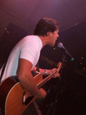
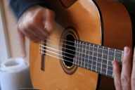

The Internet has transformed the way we find and listen to music over the past few years, and a band can be much more accessible to their audiences than in the days when record labels, distribution chains, album sales, and radio had a much larger role in choosing music for us.

I had the chance to ask Eric Hebert, of Evolvor Media, some questions recently about what those changes might mean to the industry, and to musicians.

**How does one go about marketing music in a world where digital is the most important music format?**

The first thing that needs to be understood is that the distribution and publishing of music has completely changed.

In the past, distribution of music was a very elaborate, expensive process. After music was recorded, it has to be pressed onto a CD, which had to be packaged, put on a truck, and delivered to places that sold music like Best Buy or your local record shop. This process was massive and controlled by the major labels – if you wanted your music in stores, you had to go through them.

Yesterday’s music marketing reflected the large amounts of time and money that it took to make it all happen. In order to get the word out, incredibly large advertising campaigns were unleashed through TV, magazines, and of course the radio.

Labels had a tried and true method of connections to each and every radio station, and had a certain influence on what those stations played.

That’s all changed. The labels no longer control the distribution. WE control the distribution. Now that digital is here, it’s what everyone prefers to use (because of its convenience), there’s no need for physical CD distribution. The Internet takes care of that for us.

And because of this, marketing that music has changed as well.

We don’t need the radio stations to decide what we listen to, we can explore the Internet and find what we like. So marketing music in the digital era is all about understanding the web, the different places where people go to find music online, and how people are using these technologies to discover new music.

**In the past, the major record labels were responsible for building the brands of their artists. Can you elaborate on how and why a band can build their brand in the new music industry?**

Indeed, labels were for the most part building the musician’s brand, in terms of being the people that worked with the band to determine the message they wanted to send.

They probably also offered suggestions on how to look, what to wear, etc., to achieve a sellable image.

And they should have, I mean they invested a lot of money into a band and they needed to groom them in a way that they made their money.

Nowadays, bands have to brand themselves, and that means they need to understand the same principles that the labels would have used, but for their own interests instead of someone else.

Branding is more than just a logo and some colors. It’s about the message you’re sending to your fans, the consistency of that image, and how you interact with fans to get that message across.

It starts with the band name, then a logo that is being used consistently, and that becomes a mantra, something to live by. You fans will wear your t-shirts not just because they like your music, but because you stand for something and show that through your music, your actions, etc.

If you’re a band that is all about being punk and hating authority, then show that to your fans time and time again.

Write music that reflects an idea, have a name that reflects this, and take actions that reflect it as well. It really all depends on what the message is all about. And you’ll use the web to help spread it, by making your presence known in the places that relate to your message.

**How has the relationship between a band and its fans changed?**

First I like to say that because of the web, anybody can be a rockstar, and that means that the perception of being one is changing. In the past musicians were these big celebrities that were untouchable.

Now, because everybody is a point and click away, musicians are more down to earth. They are accessible. And if you want to succeed, you’ve got to be personable.

Through things like social networking, an artist has to reach out and touch their audience. The more MySpace messages a band answers personally, the stronger the bond is between them, and that is probably the most important thing a band can do. It’s all about community, and the stronger is it, the more successful a band will be.

I mentioned before that the distribution has changed, which relates to this relationship as well. Now, instead of going to the store and buying a CD from some big box retailer, I can buy the music directly from the artist. That’s a feeling akin to buying produce from the local farmer or some other small business.

Another way the relationship is changing has to do with the actual music itself. Some artists, Beck would be a good example of this, is giving fans each recorded track of a song so they can do remixes and mashups of their music as they please.

This is a huge way to further interact with an audience because they become more than just a listener, they get to create and get their hands dirty with the music.

The same can be said about live shows. A HUGE part of a band is the live performance, and now bands like Pearl Jam are recording each and every performance and offering it to their fans after the shows digitally. That’s powerful, to buy the actual concert you went to and relive the memories of that particular show.

There is no way that every single band could have done that in the past.

**What kinds of things do you do to help musicians today?**

The main thing that I bring to the table is educating artists, and I’m doing that now through my blog, and as a service. I will also be rolling out an affordable way for bands to stay on top of these newskool marketing techniques and manage their own campaigns very soon.

My services include working with bands to develop their brand visually, their sound musically, and helping them craft the message they are trying to send.

Another thing I do is to help set up the distribution channels for their music because there’s more than one way to go about doing it.

In addition, I help provide artists with ways to interact with their audience and allowing this interaction to help increase awarenes, by understanding their fans and giving them the things they want and need to share with the world.

If a band has a budget and wants to have me actually do the grunt work of their campaign, then obviously who better to do it then the preacher himself. I take on multiple roles and offer different ways to help bands and artists regardless of how much money they have in their pockets.

One thing I strive for is having artists maintain control of their intellectual properties, to own them like a business. You won’t see me trying to get a band to sign their life away in order to use my services.

**What sets a band apart these days?**

What has ever set a band apart?

Being original.

There’s no way else to put it. And that doesn’t mean just being original in your music. You can actually have a similar sound to someone else, but succeed because your originality in your branding or your marketing caught the attention of someone.

You have some bands right now giving music away for free – that’s kind of new, and I would say a good start if you’re trying to set yourself apart.

Maybe you create a persona, or believe in a specific cause. There’s so many ways or aspects that could set a band apart. I think it’s all about the genre you’re in. If you’re into hip-hop, do you create the tired image that you see on TV, or do you try something completely different to stand out?

Does a rock band play the tough guy card, or try to carve a different image? How about your marketing? Do you email that radio station your myspace page, or do something else unique to get their attention? Originality in these areas is what will make you stand out.

**To the musicians of the future – is it easier or harder now to make a living as a musician?**

Easier. I’m not saying it’s easy to do, but there are far more opportunities now then there ever has been to make a living as a musician.

So long as “making a living” is understood realistically. The days of signing to a label and sitting back and partying are over.

The musicians of the future have to be serious about their work and understand that their music is a business, and it will have to be managed like one. So for the kids now thinking about being a professional musician, I suggest gaining some solid business knowledge to help you along the way.

Understand the web and how it can be used to help your music, and your business will grow.

**********

A number of links about the evolving music industry and music marketing, starting with some older articles and ending with some more recent news:

- [The Problem With Music by Steve Albini](https://thebaffler.com/salvos/the-problem-with-music)
- [Courtney Love Does The Math](https://www.salon.com/2000/06/14/love_7/)
- Remixing Culture: An Interview with Lawrence Lessig
- [Gilberto Gil and the politics of music](https://www.nytimes.com/2007/03/12/arts/12iht-gil.4882061.html?_r=3&&mtrref=www.seobythesea.com&gwh=8380C551E616A8B8E315AA5213F58157&gwt=pay)
- [“Year Zero” Project = Way Cooler Than “Lost”](https://www.theninhotline.com/archives/articles/manager/display_article.php?id=338)
- [Unlike Trent Reznor, Saul Williams isn’t disheartened](https://www.cnet.com/news/unlike-trent-reznor-saul-williams-isnt-disheartened/)
- [Radiohead album online: what happened next](https://cafebabel.com/en/article/radiohead-album-online-what-happened-next-5ae0069df723b35a145e0ed6/)
- [Don’t miss lessons Radiohead, Trent Reznor offer](https://www.cnet.com/news/dont-miss-lessons-radiohead-trent-reznor-offer/)
