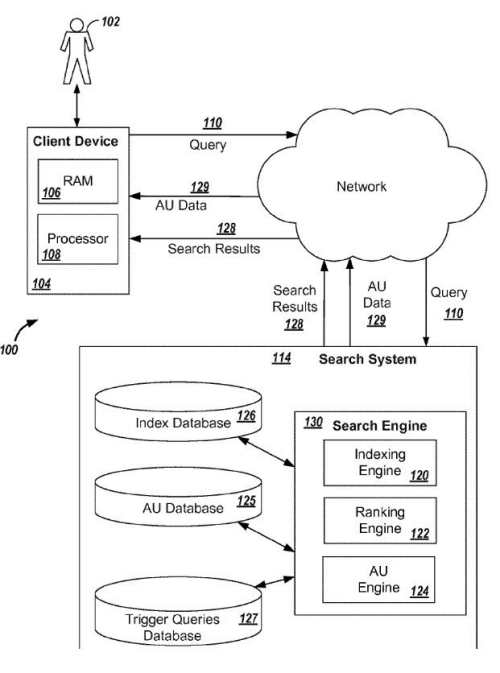
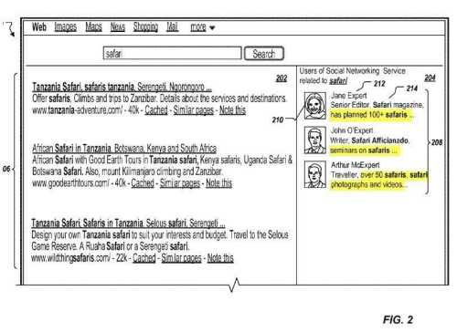
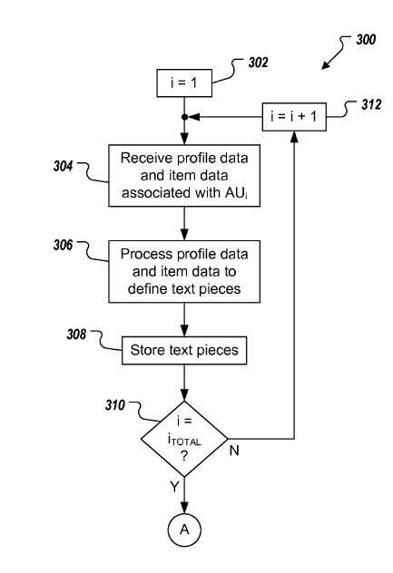
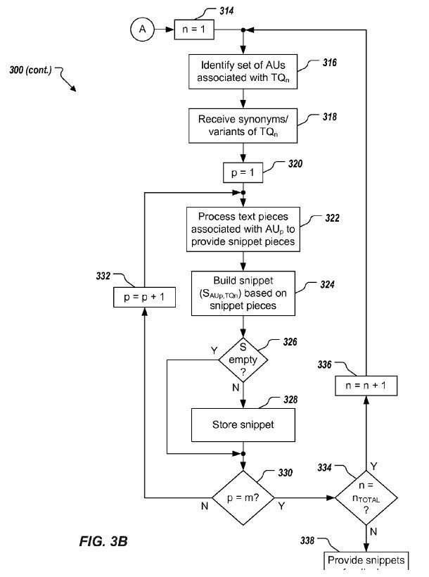

Sometimes, I run across a patent that provides details on things that Google might do but only hints at whether or not it might actually be implemented. For example, a few years back in 2007, I wrote about a Google patent for [Agent Rank](https://searchengineland.com/googles-agent-rank-patent-application-10487), which described reputation scores for authors (to be used as an alternative to PageRank), and looked like an important part of Google’s social network, Google+. It was referred to in the patent as “Agent Rank,” and people commenting upon it started referring to it as “Author Rank.”

It seemed like a good description of how some people you may have connected within Google+ were showing up in response to queries they had some expertise within. Unfortunately, there may have been issues with Google’s version of Agent Rank that the search engine wanted a second bite at. Google has since [removed the Photos](https://moz.com/blog/author-photos-are-gone-does-google-authorship-still-have-value-29334) that were showing up for authors whom you might be connected to, who may have been highly ranked, seemingly based upon a reputation score, for a topic related to a query that you might perform.

Some people wrote that while this authorship markup was removed, and author photos associated with it, the author rank scoring system that came with it was still around, like this Search Engine Land article: [Google Authorship May Be Dead, But Author Rank Is Not](https://searchengineland.com/google-authorship-dead-author-rank-202254).

A short time after Google stopped having people add authorship markup to pages and showing author badges next to content from people whom you had connected within Google+, I ran across a patent that hinted that Google would still show content from people whom you might be connected within Google+ on topics that those authors might be considered “Authoritative” for a specific topic. I wrote about that patent in a post titled, [Has Google Decided that you are Authoritative for a Query?](https://www.seobythesea.com/2014/09/google-decided-authoritative-query/)

Today, Google was granted a patent that appears to be related to that one, which shares 4 inventors with that authoritative query patent.

The images from the patent show off profile images and snippets of “prominent people in response to specific queries, which look like they are related to the topic of a query, rather than just a profile image of a person whom you may have connected with. This appears to be an improvement over the Agent Rank approach because it provides information about why someone might be displayed as having some level of expertise in response to a query that you perform. But, again, that’s much better than just an image of someone you may have connected within Google’s social network and randomly placed within a circle.

It’s worth looking carefully at this patent and seeing if it is a follow-up to Agent Rank or Author Rank. For example, the rankings of pages in search results might be partially based upon a reputation score associated with an individual on a specific topic.

## Authoritative Users and Trigger Query Data

The patent starts by defining the purpose of search engines as identifying resources relevant to a searcher’s needs and presenting information about those resources in a way that might be most useful to that searcher.

The patent uses language that we’ve seen in another recent patent from Google, such as one I wrote about in the post [How Google May Trigger Answer Box Results For Queries](https://www.seobythesea.com/2015/06/how-google-may-trigger-answer-box-results-for-queries/). It refers to receiving trigger query data that identifies one or more trigger queries and sets of authoritative users. Each set of those authoritative users is associated with a respective trigger query. The combinations of authoritative users and trigger queries produce a snippet based upon user data. So, when a query from a searcher might result in search results from authoritative users being returned, profiles of those people might show up along with snippets about them.

The patent tells us that the advantages in using it include:

- Displaying authoritative users and associated snippets in search results enables searchers to discover and connect with other searchers.
- This connection of people is intended to improve user engagement with search services
- The snippets shown are relevant to the search query and can be based on recent information
- The snippets may look as if they were provided from a larger body of text associated with the authorized user and/or the search query

The patent is:

[Generating snippets for prominent users for information retrieval queries](http://patft.uspto.gov/netacgi/nph-Parser?Sect1=PTO1&Sect2=HITOFF&d=PALL&p=1&u=%2Fnetahtml%2FPTO%2Fsrchnum.htm&r=1&f=G&l=50&s1=9,087,130.PN.&OS=PN/9,087,130&RS=PN/9,087,130)
Invented by Bogdan Dorohonceanu, John E. Saalweachter, Kumar Mayur Thakur, Sheng Zhang
Assigned to: Google
US Patent 9,087,130
Granted July 21, 2015
Filed: October 4, 2012

Abstract

> Implementations include receiving trigger query data, the trigger query data identifying one or more trigger queries and one or more sets of authoritative users, each set of authoritative users being associated with a respective trigger query, providing a plurality of trigger query and authoritative user pairs, each trigger query and authoritative user pair identifying a trigger query and an authoritative user from a set of authoritative users associated with the trigger query, for each trigger query and authoritative user pair: generating a snippet based on user data, the user data is associated with the authoritative user in one or more computer-implemented services, each snippet being specific to the trigger query and specific to the authoritative user, and storing one or more snippets in computer-readable memory, each snippet being associated with the trigger query and the authoritative user for which the snippet was generated.

## A Snippet Presents a Difference

One place where this differs from the agent rank patent is in the display of a snippet. A snippet is a text that provides a pseudo-biography of an authorized user concerning a search query. The snippet may include partial sentences or sentence fragments, making it look like a pseudo-biography instead of a biography with complete sentences.

These snippets appear in search results where an authoritative user is shown to respond to a particular query. The patent defines an authoritative user as “an expert, on one or more topics that can be associated with one or more queries.”

This rating system based upon authoritativeness may include each profile section that “reflects the importance of the particular profile section to other profile sections.” Thus, for example, they could be ranked in this order, or others: “occupation, education, work experience, personal biography, hobbies, employment, and places lived.”

The digital content posts that an authoritative user makes on the social network can be in the form of posts made on the social network, responses to other’s posts, and comments on their own posts or other’s posts.

The snippets that show up together with an image of a person could come from any digital content from the authoritative user from within the social network.

That digital content might be processed to clean it up before it’s used as a snippet. This can include “removing redundant punctuation, offensive words, hyperlinks and the like. It might be sorted based upon the importance of the different profile sections or may come from one user’s digital content.

Potential Snippets may include snippet pieces that might be relevant to a particular triggering query.

The patent provides some examples of these snippet pieces.

Synonyms might be used from these different snippet pieces to build better snippets:

## Take-Aways

The related patent I mentioned above told us that Google might associate particular queries with particular authoritative users. This patent doesn’t tell us how those associations are made but rather focuses on the snippets that might be shown with these users. Those snippets provide information that shows off expertise in the query these authoritative users are shown for.

I searched to see if there seemed to be any related patents at the USPTO that might be related and show off more aspects of the process described in these patents. Unfortunately, I didn’t see any, but they may be there.

The Agent Rank patent provided a lot of information about the possibility of using a reputation score being used to rank content created by those users. However, these patents don’t tell us how those might be ranked but tell us how potential snippet content from a person’s profile or content might be ranked to use in snippets for different queries.

These patents may indicate a second attempt to present something like Agent Rank, but Google seems to be not presenting too much of the processes behind the scenes. For example, the kind of reputation scoring found in the original agent rank patent provided a way to rank content based upon reputation scores that might be associated with writers and their expertise on topics. That is an interesting way to rank and order content found on the Web, and it would be nice to see that approach kept with this version of Authoritative Users of a social network.
