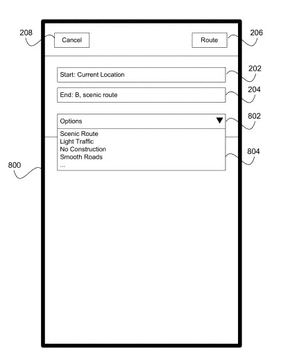
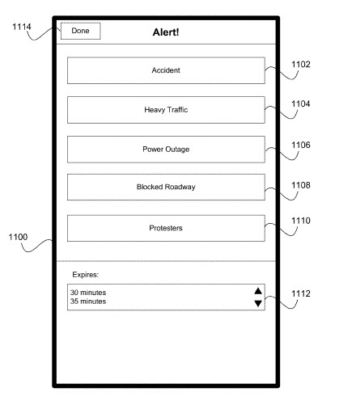

My neighbor has run over my last two phonebooks and rendered them virtually unusable. We share the same driveway, and it appears that running over phonebooks, and then backing up to make sure they are dead has officially become a custom in Virginia, or at least in my neighborhood. It’s OK though since I can’t remember the last time I’ve used a phone book. I may have a couple of times earlier this century, but I’m not sure. I haven’t used one in the past couple of years (my neighbor keeps killing them).

On the Fourth of July, Apple published a patent application that describes Routes based on User Ratings and Real-Time Accident Reporting. Both Apple and Google have been using GPS information to [monitor and report upon](http://web.archive.org/web/20160708091017/http://www.roadtraffic-technology.com:80/features/featurecrowd-sourced-traffic-data-android-smartphone) gridlock and traffic speed estimates, but imagine both providing a richer and fuller social experience involving the world around them. Imagine being able to choose different routes and see social annotations added to different options on those routes. Here’s a screenshot from Apple’s patent filing:

Regardless of the new Apple patent filing, Google has a rich and comparatively mature offering when it comes to roadside maps and navigation. However, like most of the search, it could probably be considered in its infancy. It’s been replacing print versions of both telephone books and streetmaps, with maps and navigation capable of automatically updating in what seems like real-time. Google described their crowdsensus algorithm a couple of years ago, in a whitepaper which talks about how people can help correct maps for the search engine. I wrote about it in the post, [Are You Trusted by Google?](https://www.seobythesea.com/2011/11/trusted-by-google/)

The post was also about Google looking at social signals, and possibly adding a social element to search by creating social reputation scores that might influence Web search results. At the time of the post, Google had published an updated version of the Agent Rank patent that told us that not every endorsement (or +1) might carry the same weight. Different endorsements from different people might have more weight-based on how trusted and authoritative they might be in a specific topic, and others might have less.

The Apple patent appears to focus upon adding a more social element to Apple’s Maps, and one of the features looks like a rating and review aspect showing in the patent:

Apple published a patent application in 2011 that also describes how they might use crowdsourcing to rank different businesses and places on maps as well, by looking at where people go related to Apple’s Maps, and how long they might stay there. My post is [Crowdsourcing Behind New Apple Local Search Patent](https://www.seobythesea.com/2011/09/crowdsourcing-new-apple-local-search-patent/).

For instance, several people who appear to be commuting from their homes in the morning (breakfast time) tend to stop at a diner in Cupertino and spend enough time there to eat breakfast, drink a cup of coffee, and so on. That dinner tends to be more popular than other local dinners, so it might be ranked higher than other diners, even though there isn’t an express form that someone might have filled out. But having people provide more details to maps could be even better than making assumptions like that.

The maps shown in Apple’s Fourth of July patent filing would then be annotated with the locations of reported accidents, heavy traffic, power outages, blocked roadways, protestors, etc. The patent is:

[User-Specified Route Rating and Alerts](http://appft.uspto.gov/netacgi/nph-Parser?Sect1=PTO1&Sect2=HITOFF&d=PG01&p=1&u=%2Fnetahtml%2FPTO%2Fsrchnum.html&r=1&f=G&l=50&s1=%2220130173155%22.PGNR.&OS=DN/20130173155&RS=DN/20130173155)
Invented by Jorge S. Fino
Assigned to Apple Inc.
US Patent Application 20130173155
Published July 4, 2013
Filed: December 28, 2011

Abstract

> In some implementations, a user can provide ratings for routes, streets and/or locations. In some implementations, the user can initiate an alert associated with a location. In some implementations, user-specified ratings and alerts can be included in a route determination. In some implementations, route rating and alert information can be transmitted to other users and/or devices.

## Waze and Social Mapping

Google isn’t sitting still for the socialization of Apple Maps.

Not too long ago, Facebook was supposedly negotiating with a company building social maps, a mapping social software company founded in Israel in 2008. The offer for the company was rumored to be over $ 1 Billion. The transaction supposedly fell through because the Waze team didn’t want to relocate from Israel.

Apple was also a target of rumors about an acquisition of Waze, but that was before the Apple social mapping patent application was made public.

On June 11th, the Official Google Blog announces the acquisition of Waze in the post [Google Maps and Waze, outsmarting traffic together](https://googleblog.blogspot.com/2013/06/google-maps-and-waze-outsmarting.html).

I took a look at the patent filings assigned to Waze at the USPTO, to get a better idea of what they had spent time and effort and energy researching and working upon.

The following patent application describes a navigation system that updates in real-time based upon checking and determining if any alternative routes were more optimal to a final destination:

[Device, system, and method of dynamic route guidance](http://appft.uspto.gov/netacgi/nph-Parser?Sect1=PTO1&Sect2=HITOFF&d=PG01&p=1&u=%2Fnetahtml%2FPTO%2Fsrchnum.html&r=1&f=G&l=50&s1=%2220110098915%22.PGNR.&OS=DN/20110098915&RS=DN/20110098915)
Invented by Israel Disatnik, Yuval Shmuelevitz, and Uri Levine
US Patent Application 20110098915
Published April 28, 2011
Filed: October 28, 200

Abstract

> Device, system, and method of dynamic route guidance. For example, a method includes: calculating an optimal route from a first location, in which a navigation device is located, to a destination point entered by a user of the said navigation device; receiving from the navigation device a travel update, indicating that the navigation device is located in a second location, wherein the second location is on said optimal route; and based on real-time traffic information and real-time road information, determining that an alternate route, from the second location to the destination point, is now an optimal route to the destination point.

This next patent presents what looks like a local TV channel for you, based upon reported local incidents displayed in a live feed.

[Device, System and Method of Television Broadcasting of Live Feed from Mobile Devices](http://appft.uspto.gov/netacgi/nph-Parser?Sect1=PTO1&Sect2=HITOFF&d=PG01&p=1&u=%2Fnetahtml%2FPTO%2Fsrchnum.html&r=1&f=G&l=50&s1=%2220120284755%22.PGNR.&OS=DN/20120284755&RS=DN/20120284755)
Invented by Samuel Keret, Uri Levine, Amir Shinar, Ehud Shabtai, and Yuval Shmuelevitz
Assigned to WAZE, INC.
US Patent Application 20120284755
Published November 8, 2012
Filed: March 28, 2012
Abstract

> Embodiments of the present invention are directed toward a device, system, and method of television broadcasting of live feed from mobile devices. A client application residing on a mobile device allows a user of the mobile device to provide real-time reporting of an event to a central location that is configured to broadcast such live feed. A broadcaster can invite a user to provide the live feed. Besides a user can propose to the broadcaster that the user, who is located in the proximity of a news-worthy event, is willing to commence a live feed. The broadcaster can accept or reject the proposal and modify or negotiate the terms of the transfer of the live feed. The live feed is typically incorporated substantially in real-time within a live broadcast.

This next one describes how traffic might be estimated, and alternative routes might be suggested:

[System and method for real-time community information exchange](http://appft.uspto.gov/netacgi/nph-Parser?Sect1=PTO1&Sect2=HITOFF&d=PG01&p=1&u=%2Fnetahtml%2FPTO%2Fsrchnum.html&r=1&f=G&l=50&s1=%2220090287401%22.PGNR.&OS=DN/20090287401&RS=DN/20090287401)
Invented by Uri Levine, Amir Shinar, and Ehud Shabtai
US Patent Application 20090287401
Published November 19, 2009
Filed: May 19, 2008

Abstract

> System and method for traffic mapping service are disclosed for allowing a plurality of users having each a navigation device to transmit their locations to a server and optionally to signal to the server their requested destination. The system and method are further capable of calculating traffic parameters such as current traffic speed at a given road based on the momentary locations of the users. The system and method of the invention may also calculate and advise the users of preferred roads to take to arrive at the requested location with minimum delay.

Apple, Google, and Yahoo have also shown an interest in [helping people find parking](https://www.seobythesea.com/2010/01/apple-vs-google-vs-yahoo-on-location-awareness-and-parking/) in the past. The following Waze patent also provides ways to find places to park as well:

[System and method for parking time estimations](http://patft.uspto.gov/netacgi/nph-Parser?Sect1=PTO1&Sect2=HITOFF&d=PALL&p=1&u=%2Fnetahtml%2FPTO%2Fsrchnum.htm&r=1&f=G&l=50&s1=7936284.PN.&OS=PN/7936284&RS=PN/7936284)
Invented by Uri Levine, Amir Shinar, and Ehud Shabtai
Assigned to Waze Mobile Ltd
US Patent 7,936,284
Granted May 3, 2011
Filed: August 27, 2008

Abstract

> The invention provides a system for parking time estimations, the system comprising at least one device able to sense at least momentary location and respective time; and an application server to receive from a plurality of the devices time series of location points and to calculate, based on the received time series of location points, duration of searches for parking spots. The invention provides a method for parking time estimations, the method comprising detecting beginning of searching for a parking spot by a user of a device able to sense at least momentary location and respective time; detecting the time of parking, and calculating at least estimated duration of searching for a parking spot.

This last patent is more about making sure that a mobile device using other location-based services applications like the ones described above are properly working, that they have enough power, that GPS is engaged and working the way it should be, and more.

[Condition-based activation, shut-down and management of applications of mobile devices](http://patft.uspto.gov/netacgi/nph-Parser?Sect1=PTO1&Sect2=HITOFF&d=PALL&p=1&u=%2Fnetahtml%2FPTO%2Fsrchnum.htm&r=1&f=G&l=50&s1=8271057.PN.&OS=PN/8271057&RS=PN/8271057)
Invented by Uri Levine, Amir Shinar, and Ehud Shabtai, and Yuval Shmuelevitz
Assigned to Waze Mobile Ltd
US Patent 8,271,057
Granted September 18, 2012
Filed: March 16, 2009

Abstract

> Device, system, and method of condition-based activation, shut-down, and management of applications of mobile devices. For example, a method includes: based on one or more collected information items, determining whether or not a condition related to a mobile device is true; and based on the determination, controlling a monitored application of the mobile device by performing at least one of: activating the monitored application; shutting down the monitored application; activating a feature of the monitored application; deactivating a feature of the monitored application; and switching the monitored application from a first mode of operation to a second, different, mode of operation.

## The Future of Mapping is Social

There’s a certain element of irony to say that our phones have become our phonebooks as well. Carrying around the Yellow Pages in our pockets would never work, at least not a printed copy that doesn’t update as roads change and businesses move locations.

If you go to the [Waze website](https://www.waze.com/), you can read about “community-edited maps,” about local gas prices as reported upon by users, about the real-time locations of speed traps and accidents and road construction. Your driving can be in sync with that of your friends who might be going to the same destination.

Google has provided many location-based services, including advertising in the form of local alerts. With both Apple and Google making driving a more social-based activity, hopefully, people will be keeping their eyes on the road when driving (something commentators in my post on [Parameterless Searches](https://www.seobythesea.com/2013/07/google-parameterless-searches/) were concerned about, worried that people shaking their phones while driving, to see if there was traffic congestion ahead, were concerned about.
