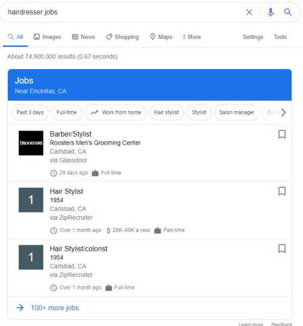
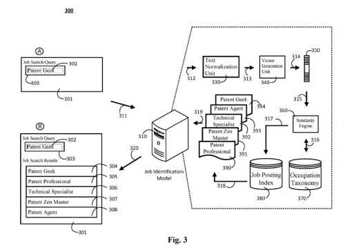
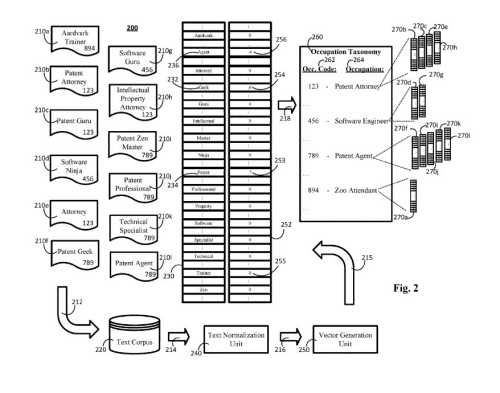

## Job Titles can be Confusing

*I worked for the Courts of Delaware at Superior Court.*

I started working there as the Assistant Criminal Deputy Prothonotary.

I changed jobs after 7 years there, and I became a Mini/Micro Computer Network Administrator.

The Court used an old English title for the first position, meaning I supervised Court Clerks in the Criminal Department of the Court. I never saw a mini/micro-computer in the second position, but it was a much more technical position. Nevertheless, I remembered those titles when writing this post.

What unusual job titles might you have held in the past?

## A Job Search Engine Based on Occupation Vectors and a Job Identification Model

An Example of Job Search at Google:

For two weeks in a row, Google came out with patents that had the same name. This is the first of the two patents during that period granted under the name “Search Engine.”

It is about a specific type of search engine. One that focuses upon a specific search vertical – A Job Search Engine.

## Are there Newer Approaches to Answering Searches in these Example Searches From Google?

There is value in learning about and understanding how these new “Search Engine” patents work. They adopt newer approaches to answering searches than some previous vertical search engines. In addition, understanding how they work provides ideas about how older searches at Google have changed.

This Job Search Engine patent uses a job identification model to enhance job search by improving the quality of search results in response to a job search query.
The job identification model can identify relevant job postings that could otherwise go unnoticed by conventional algorithms. This is because of the inherent limitations of keyword-based searching. What implications does this have for organic search at Google focused upon keyword searches?

The job search may use methods in addition to conventional keyword-based searching. For example, it uses an identification model that can identify relevant job postings. These can include job titles that do not match the keywords of a received job search query.

As an example, the patent tells us that a query using the words “Patent Guru,” the job identification model may identify postings related to it such as:

- “Patent Attorney”
- “Intellectual Property Attorney”
- “Attorney”
- the like

## How Does a Vector Vocabulary Fit into a Job Search at Google Now?

The method behind job searching may include (remember the word “vector.” It is one I am seeing from Google a lot lately):

- Defining a vector vocabulary
- Finding an occupation taxonomy including many different occupations
- Obtaining many labeled training data items. Each labeled training data item is about:
- - (i) a job title
  - (ii) an occupation
- Using an occupation vector including a feature weight for each respective term in the vector vocabulary
- Associating each respective occupation vector with an occupation in the occupation taxonomy based on what was used to generate the occupation vector
- Receiving a search query including a string related to a characteristic of potential job opportunities, generating a first vector based on the received query
- Determining, for each respective occupation of the many occupations in the occupation taxonomy, a confidence score that is indicative of whether the query vector classified in the respective occupation
- Selecting the particular occupation associated with the highest confidence score
- Obtaining job postings using the selected occupation
- Providing the obtained job postings in a set of search results in response to the search query

These operations may include:

- Receiving a search query that includes a string related to a characteristic of job opportunities
- Generating, based on the query, a query vector that includes a feature weight for each respective term in a predetermined vector vocabulary
- Determining, for each respective occupation in the occupation taxonomy, a confidence score indicative of whether the query vector classified in the respective occupation
- Selecting the particular occupation associated with the highest confidence score
- Obtaining job postings using the selected occupation. Also providing the obtained job postings in a set of search results in response to the search query

## Feature Weights for Terms in Vector Vocabularies

It sounds like Google is trying to understand job position titles. It also looks at how they are connected to develop a vector vocabulary and build related positions.

Feature weights may involve:

- A term frequency determined on occurrences of each term in the job title of the training data item
- An inverse occupation frequency determined based on many occupations in the occupation taxonomy where each respective term in the job title of the respective training data item is present.
- An occupation derivative based on a density of each respective term in the job title of the respective training data item across each of the respective occupations in the occupation taxonomy
- Both (i) a second value representing the inverse occupation frequency determined based, on several occupations in the occupation taxonomy where each respective term in the job title of the respective training data item is present and (ii) a third value representing an occupation derivative-based, on a density of each respective term in the job title of the respective training data item across each of the respective occupations in the occupation taxonomy
- A sum of (i) the second value representing the inverse occupation frequency, and (ii) one-third of the third value representing the occupation derivative

The predetermined vector vocabulary may include terms present in training data stored in a text corpus and terms that are not present in at least one training data item stored in the text corpus.

## What Does this New Search Engine Patent Cover?

This Job Search Engine Patent is at:

[Search engine](http://patft.uspto.gov/netacgi/nph-Parser?Sect1=PTO1&Sect2=HITOFF&d=PALL&p=1&u=%2Fnetahtml%2FPTO%2Fsrchnum.htm&r=1&f=G&l=50&s1=10,643,183.PN.&OS=PN/10,643,183&RS=PN/10,643,183)
Inventors: Ye Tian, Seyed Reza Mir Ghaderi, Xuejun Tao), Matthew Courtney, Pei-Chun Chen, and Christian Posse
Assignee: Google LLC
US Patent: 10,643,183
Granted: May 5, 2020
Filed: October 18, 2016

Abstract

> Methods, systems, and apparatus, including computer programs encoded on storage devices, perform a job opportunity search. In one aspect, a system includes a data processing apparatus and a computer-readable storage device having stored thereon instructions that cause the data processing apparatus to perform operations when executed by the data processing apparatus.
>
> The operations include defining a vector vocabulary, defining an occupation taxonomy that includes multiple different occupations, obtaining multiple labeled training data items, wherein each labeled training data item is associated with at least (i) a job title, and (ii) an occupation, generating, for each of the respective labeled training data items, an occupation vector that includes a feature weight for each respective term in the vector vocabulary and associating each respective occupation vector with an occupation in the occupation taxonomy based on the occupation of the labeled training data item used to generate the occupation vector.

## The Job Identification Model

Job postings from many different sources may relate to different occupations.

An occupation may include a category encompassing many job titles describing the same profession.

Many job postings may be about the same or a similar occupation. It can use different terminology to describe a job title for each of the particular job postings.

Such differences to describe a particular job title of a job posting may arise for many reasons:

- Different people from different employers draft each respective job posting
- Unique job titles based on the culture of the employer’s company, the employer’s marketing strategy, or the like

## How an Job Identification Model May Work

An example:

1. At a first hair salon marketed as a rugged barbershop, advertises a job posting for a “barber”
2. At a second hair salon marketed as a trendy beauty salon, advertises a job posting for a “stylist”
3. At both, the job posting seeks a person for the occupation of a “hairdresser” who cuts and styles hair
4. In a search system using keyword-based searching, a searcher seeking job opportunities for a “hairdresser” who searches for job opportunities using the term “barber” may not receive available job postings for a “stylist,” “hairdresser,” or the like if those job postings do not include the term “barber”
5. The process in this patent uses a job identification model seeking to address this problem

The job occupation model includes:

- A classification unit
- An occupation taxonomy

The occupation taxonomy associates job titles from existing job posts with particular occupations.

A job identification model associates each occupation vector generated for an obtained job posting with an occupation in the occupation taxonomy during training.

The classification unit may receive the search query and generate a query vector.

Also, the classification unit may access the occupation taxonomy and calculate a confidence score for each occupation in the occupation taxonomy. That confidence would indicate the likelihood that the query vector is properly classified into each occupation of the many occupations in the occupation taxonomy.

Then, the classification unit may select the occupation associated with the highest confidence score as the occupation related to the query vector. It may provide the selected occupation to the job identification model.

## An Example of a Search Under this Job Opportunities Search Engine

1. A searcher queries “Software Guru” into a search box
2. The search query is received the job identification model
3. The job identification model provides an input to the classification unit, including the query
4. The classification unit generates a query vector
5. It also analyzes the query vector given the occupation vectors generated and associated with each particular occupation in the occupation taxonomy, such as occupation vectors
6. The classification unit may then determine that the query vector associated with a particular occupation based on a calculated confidence score and select the particular occupation
7. The job identification model may receive the particular occupation from the classification unit
8. Or, or beside, the output from the classification unit may include a confidence score that indicates the likelihood that the query vector related to the occupation output by the occupation taxonomy
9. The occupation output from the occupation taxonomy is used to retrieve relevant job postings
10. The references to job postings identified using the job posting index are returned to the user device
11. The obtained references to job postings may be displayed on the graphical user interface
12. Obtained references to job postings were presented at search results and include references to job postings for a “Senior Programmer,” a “Software Engineer,” a “Software Ninja,” or the like
13. The job postings included in the search results were determined to be responsive to the search query “Software Guru” based on the vector analysis of the query vector and occupation vectors used to train the occupation taxonomy. That was not merely based on keyword searching alone

## Takeaways About this Job Search Engine

Besides, the patent tells us how an occupation taxonomy may use training data. It also provides more details about the Job identification model. And then tells us about how job searches use that job identification model.

Also, this job search engine patent and the application search engine patent use methods that we may see in other search verticals at Google. I have written about one possible approach in Organic search in the post [Google Using Website Representation Vectors to Classify with Expertise and Authority](https://gofishdigital.com/website-representation-vectors/)

Another one of those may involve image searching at Google: [Google Image Search Labels Becoming More Semantic?](https://www.searchenginejournal.com/google-image-search-labels-becoming-more-semantic/305157/)

I will be posting more soon about how Google Image Search uses neural networks to categorize and cluster Images to return in search results.
