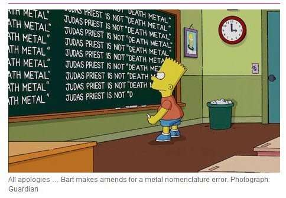
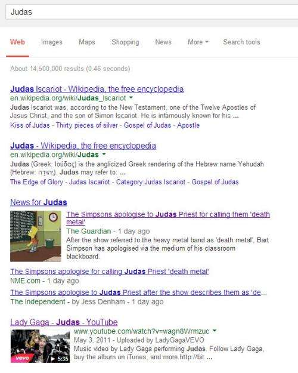

The example for the post I was writing for today appears to have been hijacked by the Simpsons. They made an apology to Judas Priest, after referring to the band as a death metal band. The image below is from a [Guardian news article on the apology](https://www.theguardian.com/music/2014/jan/14/simpsons-apologise-judas-priest-death-metal) which is presently highly ranked on a search for the word “Judas.” See the search results below:

I wanted to show a set of search results from Google that may have been based upon Google matching the topic of a post rather than keywords, which might help improve the relevance of search results for videos and media-rich results, according to a Google patent granted on the last day of 2013, which uses that example.

## Topic-Based Search Results

Here’s the example from the patent, which gives us a view of Google behaving in a way that most of us aren’t accompanied to, even if some of us have written that Google may start focusing more on [concepts rather than specific keywords](https://www.seobythesea.com/2012/05/should-you-be-doing-concept-research-instead-of-keyword-research/), and even though we’ve seen Google returning results under the [Hummingbird update](https://www.seobythesea.com/2013/09/google-hummingbird-patent/) that don’t match all keywords within a query.

> By way of example, consider a search query that includes the word “Judas.” That word, “Judas,” can be mapped to certain domain topics such as “Born This Way” and “Lady Gaga.” “Born This Way” is the name of a popular album that includes a song called “Judas,” and “Lady Gaga” is the artist who created that album and performed the song “Judas.”
>
> A conventional keyword-based search engine would only return results with the word “Judas;” however, the disclosed topic-based results can include relevant results, even if those results do not include the word “Judas.”
>
> For example, such relevant results can include the words “Lady Gaga” or “Born This Way” and so forth.
>
> Therefore, the topic-based search results can, therefore, include many other results from the same album or by the same artist, even when the user is not aware of the titles of those related songs.

Did the video for “Judas” appear in those search results because Google performed a topic-based search, or would Google have returned it highly anyway, based upon PageRank and Relevance?

We can’t be completely certain, but the patent is worth looking at closer and thinking about.

## Multiple Sources to Identify Topics

It can be pretty difficult to read a patent about a possible ranking update and determine whether or not the method within the patent claims and/or description has been used.

There may be some technical limitations presently that might keep Google from completely incorporating topics into such an algorithm, as described in a paper posted this morning on the Freebase Google Plus page.

The paper is [Trust, but Verify: Predicting Contribution Quality for Knowledge Base Construction and Curation](http://www.ipeirotis.com/wp-content/uploads/2014/01/wsdm2014-cqual1.pdf) (pdf) (Highly recommended reading!) Before I provide a link to the patent, this passage from the paper had me wondering how ready Google might be to start using topics to rank web pages:

> While these results are not reported in the paper, during development, we examined which of the concept space and expertise representation are most useful during development during development. Our analysis suggests that the Taxonomy and the Predicates concept spaces are more useful than the large Topics concept space.
>
> This is because the Topics concept space has an order of millions of topics, thus spreading the expertise distribution too sparse for users contributing not a lot of triples.

The paper does a great job of explaining how Google might incorporate user contributions into Freebase. It appears that topic-based contributions might not be useful yet as other contributions. While Freebase does supply information used in Google’s knowledge base, Google might look to other sources to better understand things such as topics, such as [Open Information Extraction](https://www.seobythesea.com/2013/05/wavii-google-acquire-future-search/).

The Google patent is:

[Search query results based upon topic](http://patft.uspto.gov/netacgi/nph-Parser?Sect1=PTO2&Sect2=HITOFF&p=1&u=%2Fnetahtml%2FPTO%2Fsearch-adv.htm&r=1&f=G&l=50&d=PALL&S1=08620951&OS=PN/08620951&RS=PN/08620951)
Invented by Jianming He and Kevin D. Chang
Assigned to Google Inc.
US Patent 8,620,951
Granted December 31, 2013
Filed: June 1, 2012

Abstract

> Systems and methods for returning results to a query-based upon topic are disclosed herein. Aspects disclosed can be particularly useful when searching for videos or other media content for which associated textual information is generally relatively sparse compared to other types of content.
>
> The text associated with a query can be semantically associated with various domain topics by mapping one or more words included in the query to one or more domain topics based upon a conditional probability of the domain topic given the query. A set of results can be identified based upon a conditional probability of the result given the domain topic.

Of course, the question needs to be asked if topic-based information from a knowledge base is even needed at this point.

Can Google get that information elsewhere?

The Open Information extraction approach is one way for Google to find out that kind of information. Google seems to use automated ways to get information and crowdsourced ways such as people contributing to places like Freebase. It’s quite likely that both types of sources help build upon each other.

## Topics For Queries and for Results Based upon Probabilities

The patent tells us that the focus on identifying topics depends upon the calculations of probabilities related to topics, and can be broken down into a couple of steps or tasks:

> First, domain topics can be identified based upon the query. Second, representative results for those domain topics can be located. Such tasks can be accomplished by analyzing suitable statistics associated with past queries and computing various conditional probabilities.

The patent then goes on to provide more details and mentions how some additional information can be used.

> The conditional probability of a domain topic given a query, P(T|Q), can be employed to map domain topics to the query. The conditional probability of a result given a domain topic, P(R|T), can be employed to identify results for a topic-based search. These two probabilities, P(T|Q) and P(R|T), can be determined by various means detailed herein. In some embodiments, certain probabilities used to determine one or both P(T|Q) and P(R|T) can be determined by external components, and those externally-produced probabilities can be leveraged, if available.

I’ve written recently about how Google might be working to identify related entities in the post, [Entity Associations with Websites and Related Entities](https://www.seobythesea.com/2014/01/entity-associations-websites-related-entities/).

This patent tells us that Google may work to better understand topics possibly in similar ways, so that a query for “astronomy” might be seen as within a topic that could include “Hubble images,” including a video that might show off those images, even if the word “astronomy” doesn’t appear on the page that shows the Hubble images. (Another example from the patent.)

## Popularity Based on Things such as Views and (YouTube) Likes

I haven’t seen a Google patent refer to “likes” before as something that could influence rankings, but this one does. What’s not clear here is that the likes being referred to are mostly likely YouTube Likes instead of Facebook Likes (though the patent doesn’t distinguish between one or the other.)

The patent tells us that the Hubble video, without any actual reference to Astronomy, might be returned as a search result because:

> (1) It is established that “astronomy” and “Hubble images” are related concepts, and;
>  (2) The result is popular according to certain indicative metrics (e.g., views, likes, etc.).

“Views” would make sense for a result that’s a video. Still, the patent’s claims section doesn’t limit this approach to just videos, even though the patent’s description says that they might be a good candidate for this approach because the text associated with things like videos tends to be limited.

## Take Aways

The process within this patent doesn’t appear to be in effect yet but seems like something that Google might just do sometime in the future – not so much a question of if they will do it, but rather when.

I’m going to be keeping an eye out for search results now that don’t include keywords within the actual query but appear to be related by topic.

What about you?
