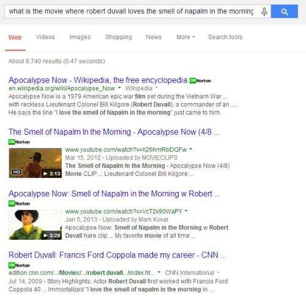
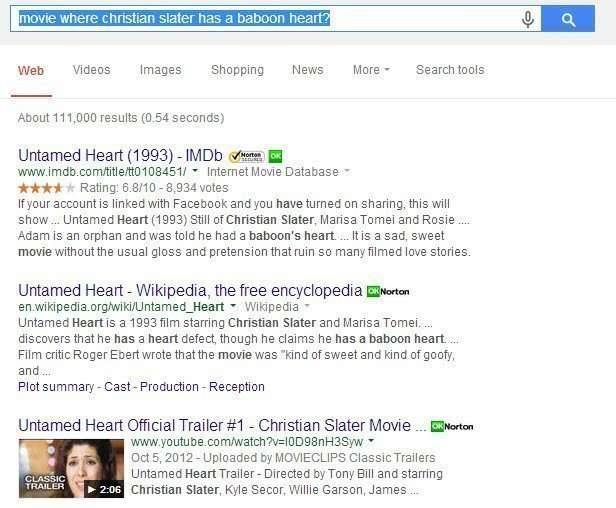
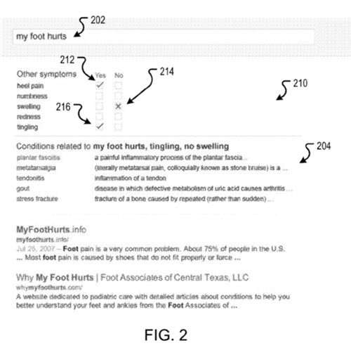

When Google crawls the Web to collect information about objects or entities, it also collects facts about those entities. These facts are separated into different categories or attributes associated with those entities. For example, a book may have attributes such as an author, a publisher, a year published, a website it can call home, a genre, and more.

## Identifying Entities by their Attributes

A search that includes those attributes can be used to identify the entity the attributes might be associated with.

Google was granted a patent recently that describes how those attributes could be searched within an attribute data store to find the entity. The patent shows how the process described within it might be used to answer some complex queries, and some interactive Answerbox type queries. The issue that this patent addresses can be summed up in a single question:

> What entity of a generic type, e.g., book, medical condition, or movie, is associated with the features named in the query?

So, one query that might be answered with this approach might be something such as, “What is the movie where Robert Duvall loves the smell of Napalm in the morning?”

In this first movie, the attribution data store might tell us that Robert Duvall is an actor in the movie, and it might also tell us that he has a memorable quote in the movie about loving the smell of napalm in the morning.

By searching the data store for attributes listed in that query, “Apocalypse Now” is identified with a certain level of confidence as the movie being looked for, and a query for the name of the movie is sent to the search engines so that results for it can be returned.

Another query about a movie might be, “Movie where Christian Slater has a baboon heart.”

In this query, Christian Slater is an actor in the movie, and one of the plot elements is a rumor that he has a baboon heart. So there are two attributes identified with this movie that a search of the attribute data store can be used to identify which entity is being looked for.

A search of the movie is conducted by the search engine so that search results for it can be returned.

As the patent notes, similar queries could be conducted that involve finding other entities, such as books or people or songs.

## An Answerbox where Attributes Could be Checked Off

But the patent also describes a more complicated set of entities, with a [Onebox](https://searchengineland.com/googles-onebox-patent-application-10325) approach which allows you to enter symptoms, and asks you if you would like to include others to identify a specific medical condition.

I tried a few of these searches and didn’t get results like those identified within the patent.

I don’t know if that is a technical limitation or a business decision – should Google be used to identify medical conditions based upon the symptoms associated with it?

The patent does tell us that the medical condition is a specific entity type, and those symptoms are attributes of the entity.

The patent is:

[Identifying entities using search results](http://patft.uspto.gov/netacgi/nph-Parser?Sect1=PTO1&Sect2=HITOFF&d=PALL&p=1&u=%2Fnetahtml%2FPTO%2Fsrchnum.htm&r=1&f=G&l=50&s1=8,775,439.PN.&OS=PN/8,775,439&RS=PN/8,775,439)
Invented by Thomas A. Lasko, Andrew Tomkins, Michael Angelo, Matthew K. Gray, Russell Ryan, Namrata U. Godbole, and Roni F. Zeiger
Assigned to Google
US Patent 8,775,439
Granted July 8, 2014
Filed September 27, 2011

Abstract

> Methods, systems, and apparatus, including computer programs encoded on computer storage media, for identifying entities using search results.
>
> - One of the methods includes the actions of determining that a first search query includes a respective text reference to each of one or more predetermined attributes, wherein each attribute is associated with a first entity type;
> - For each of a plurality of entities of the first entity type, generating a combined search query that includes the first search query and a name of the entity;
> - Obtaining search results for each of the plurality of entities using the combined search query for each respective entity, and using the obtained search results to generate combined search results to include in a response to the first search query.

## Takeaways

I’ve been doing several entity audits for clients looking for and identifying the use of entities on a site, and entities that should be included on those sites.

Getting a sense of the attributes that are associated with those entities is also an important element, as are entities that might appear in search results as related entities.

This patent shows how entities from your website might be found in search results in queries that focus upon the attributes your entities might contain.

This is a different type of semantic search than a Hummingbird search that can involve a long and complex conversational query being re-written

I’ve written a few posts about named entities. These are some that I wanted to share:

- [Do You Have a Named Entity Strategy for Marketing Your Web Site?](https://www.seobythesea.com/2013/12/named-entity-strategy/)
- [How I Came to Love Entities and Start Doing Entity Optimization](https://www.seobythesea.com/2014/10/came-love-entities/)
- [How Google Uses Named Entity Disambiguation for Entities with the Same Names](https://www.seobythesea.com/2015/09/disambiguate-entities-in-queries-and-pages/)
- [How Named Entities Connected to Trending Topics can be used to Address Real Time Search Results](https://www.seobythesea.com/2015/03/how-named-entities-connected-to-trending-topics-can-be-used-to-address-real-time-search-results/)
- [Not Brands but Entities: The Influence of Named Entities on Google and Yahoo Search Results](https://www.seobythesea.com/2010/08/not-brands-but-entities-the-influence-of-named-entities-on-google-and-yahoo-search-results/)
- [How Knowledge Base Entities can be Used in Searches](https://www.seobythesea.com/2014/07/knowledge-base-entities-used-in-searches/)
- [Finding Entity Names in Google’s Knowledge Graph](https://www.seobythesea.com/2014/06/entity-names-in-google/)
- [Google Gets Smarter with Named Entities: Acquires MetaWeb](https://www.seobythesea.com/2010/07/google-gets-smarter-with-named-entities-acquires-metaweb/)
- [Entity Associations with Websites and Related Entities](https://www.seobythesea.com/2014/01/entity-associations-websites-related-entities/)
- [How Google Might Identify Entity Synonyms Using Anchor Text](https://www.seobythesea.com/2014/06/synonyms-for-entities/)
- [Extracting Facts for Entities from Sources such as Wikipedia Titles and Infoboxes](https://www.seobythesea.com/2014/08/extracting-facts-for-entities-from-sources/)
- [Extracting Semantic Classes and Corresponding Instances from Web Pages and Query Logs](https://www.seobythesea.com/2014/09/extracting-semantic-classes-instances-from-web-pages-query-logs/)
- [How Google May Identify Main Entities](https://www.seobythesea.com/2015/04/how-google-may-identify-central-entities-from-resources/)
- [How Google’s Knowledge Graph Updates Itself by Answering Questions](https://www.seobythesea.com/2018/10/how-googles-knowledge-graph-updates-itself-by-answering-questions/)

Last Updated June 26, 2019
