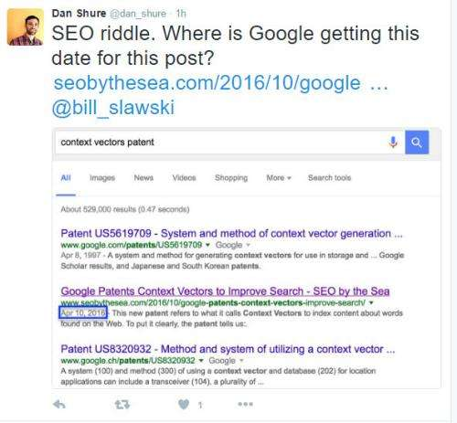
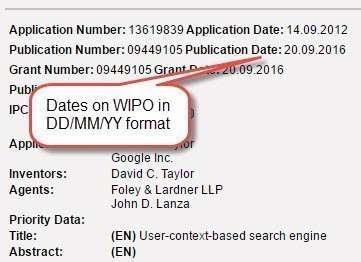
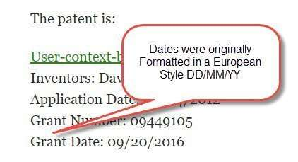
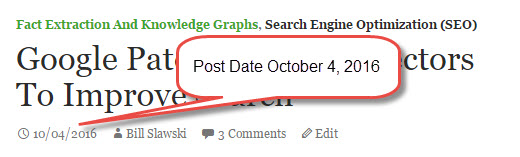

Sometimes one of the best ways to learn is to question why you see something that you possibly shouldn’t be seeing. This can produce more interesting lessons than even digging into things like patents and whitepapers. For instance, I published a post last night, October 4th, 2016, on Context Vectors. On Twitter this morning, [Dan Shure](https://twitter.com/dan_shure) had a question about the snippet for my post, wondering why the snippet date was April 10, 2016. I knew the answer immediately.

Dan’s Questioning Tweet:

When I researched the post, and found the patent I wanted to write about, I used the [WIPO Patentscope](https://www.wipo.int/patentscope/en/) website to find the patent. I copied information from the WIPO pages, including the formatting of the Dates the patent was published and granted:

I copied those dates into my post in exactly the same formatting found on the WIPO site DD/MM/YY instead of the way dates are formatted in the US MM/DD/YY:

It appears that Google decided that it should take a lesson from the context of my blog post, and read the date of my post using DD/MM/YY instead of MM/DD/YY:

Which answers the question that Dan asked about why Google decided that the date in the snippet should be April 10, 2016, instead of the date that it was published on October 4, 2016. Google may have paid more attention to the context of date formatting than it possibly should have in that post. It does show that Google is paying attention to context, though.

There were some others involved in a discussion of this anomaly this morning, and I wanted to give a shout-out to them for getting involved (thanks!):

[Aymen Loukil](https://twitter.com/LoukilAymen)
[Steven Weldler](https://twitter.com/StevenWeldler)
[Tylor Hermanson](https://twitter.com/MyNameIsTylor)

I’m not sure if it will help much, but I have changed the Formatting of the patent dates in the post about context vectors to the Americanized format of MM/DD/YY. However, Google is still showing a snippet date of April 10, 2016.

Aymen Loukil suggested I try using [DateTime Schema](https://schema.org/DateTime). It looks like that is to provide information regarding sites that provide schedules, and Schema.org tells us that it is used on “Between 10 and 100 domains”. Nothing on that page seemed to explain how to explain the formatting used by Dates.

Funny to learn about how Google might use context to format a snippet date based on how the snippet is about may format dates. I decided to write about Dan’s question and its answer to keep it in mind and learn from it (I suspect we won’t see a patent just about how Google decides how to format dates in snippets.

I’ve written some other posts about patents from the WIPO pages and used the European formatting dates from those. So I should go back and look at the snippet dates Google may have given those…
