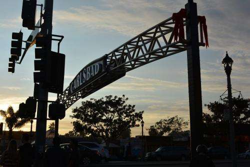
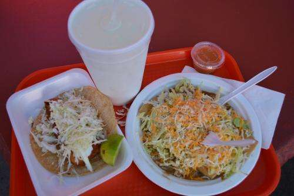
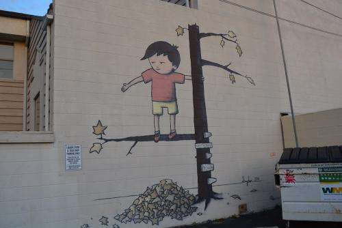
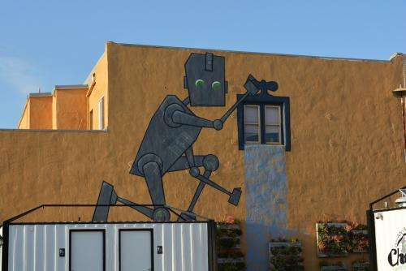
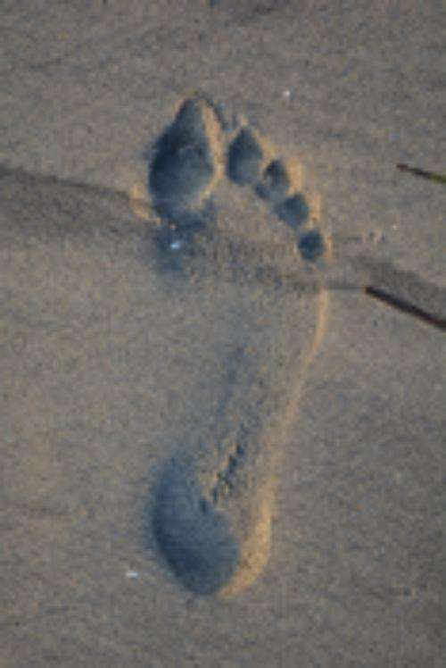
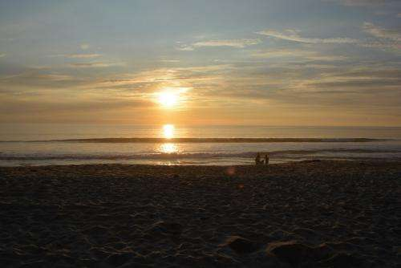

On the first week of my move from Northern Virginia to Carlsbad, California, I got to witness a historical local event last night. A sign was installed along a highway that goes along the Pacific Coast and through towns as it winds through the way. It’s something of a replica of a sign naming the Village of Carlsbad around approximately 100 years ago.

Last night, the town celebrated the lighting of the [new sign](https://www.sandiegouniontribune.com/news/sdut-carlsbad-sign-historic-whimsy-2013nov02-story.html), for the first time.

Seeing all the people who showed up for the sign’s lighting was my first chance to see the local community in action, and they were a lot of fun, with the whimsy of this new sign taking center stage.

_Fish Tacos are considered a topic of much debate and discussion in the area with many different varieties, and a mandate to natives to try out as many as you can._

Before I watched the sign’s lighting with many others, I feasted on a fish taco and a couple of burritos. They were excellent, and the local love of Mexican food stands out.

On my journey to watch the lighting, I took advantage of one of the features of my new home – a long walk around town with many different sights, including natural ones like the bee above diving a colorful flower.

_A mural near where the lighting took place._

I’ve made it a personal mission to find all the murals around Carlsbad that are hidden in plain views, like the one above. It sounds like there are more murals, and more murals are planned. Here is another mural of a robot that I walked past many times before noticing, and it’s so large I wonder how I didn’t see it. It is a robot!

_I love how this robot fits into the side of the building._

As I learn and see more of Carlsbad, I’ll probably be posting something about it here. It’s part of the journey.

_Footprints don’t grow on beaches on the uS East Coast, where I came from. in January._

Of course, I had to visit the beach and look for sunset before the sign took total attention.

_Carlsbad is whimsical, but it’s definitely a resort as well._

It wasn’t easy to eclipse the beach like that, but possible.

_The sign is lit, for the first time._

Of all the things that I saw yesterday, one of the greatest was the joy of the people dancing in the street during the sign’s lighting. I felt it say, “Welcome to Carlsbad.”
