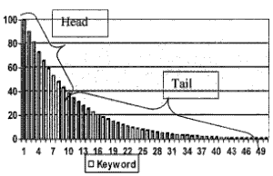

Microsoft researchers are starting to take a closer look at search queries that are common and compare them to those that appear more rarely, in [Heads and Tails: Studies of Web Search with Common and Rare Queries](http://erichorvitz.com/heads_and_tails_sigir.pdf).

The paper immediately had me thinking of the writings of Chris Anderson, who started online marketers and ecommerce site owners thinking about products offered on the Web differently, in an article that he wrote for *Wired Magazine* called [The Long Tale](https://www.wired.com/2004/10/tail/).

The article became a book, and led to a [blog](https://web.archive.org/web/20181023184502/http://www.thelongtail.com:80/) by its author, and has inspired many folks to look at ecommerce while paying attention to the long tail.

EBay was also taken the idea of the long tail enough to file a patent application that works on using it in the context of keywords. The patent filing has the incredibly long name [Computer-Implemented method and System for Combining Keywords into Logical Clusters That Share Similar Behavior with Respect to a Considered Dimension](http://appft1.uspto.gov/netacgi/nph-Parser?Sect1=PTO2&Sect2=HITOFF&u=%2Fnetahtml%2FPTO%2Fsearch-adv.html&r=1&p=1&f=G&l=50&d=PG01&S1=20070143266.PGNR.&OS=dn/20070143266&RS=DN/20070143266).

An image from the patent application:

The Microsoft paper asks some interesting questions:

- Do users behave differently on rare queries than on common ones?
- What portion of rare queries represent rare informational goals, versus atypical means of specifying common goals?
- How might answers to such questions guide research toward enhancing Web search experiences?

Some interesting answers to those questions, too. For instance:

> The data suggests that search engines are less effective on tail queries than on non-tail queries in that users are less likely to click results and more likely to reformulate, and that such reformulations are common.
