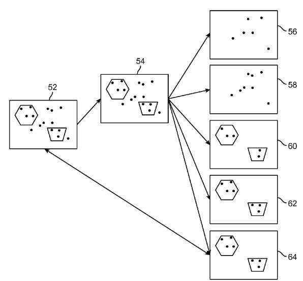
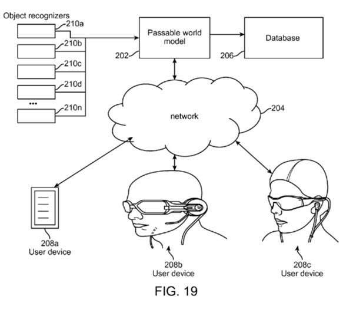
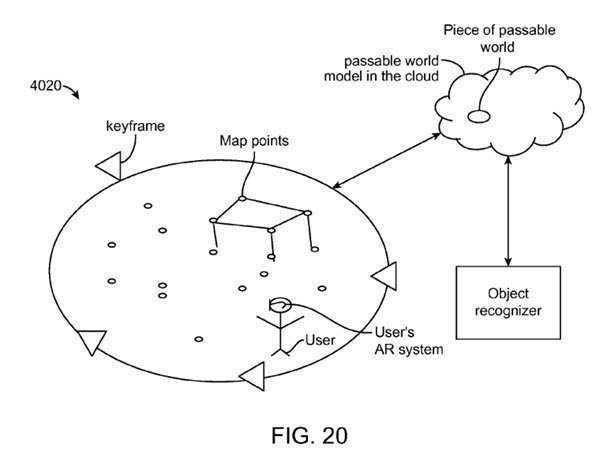
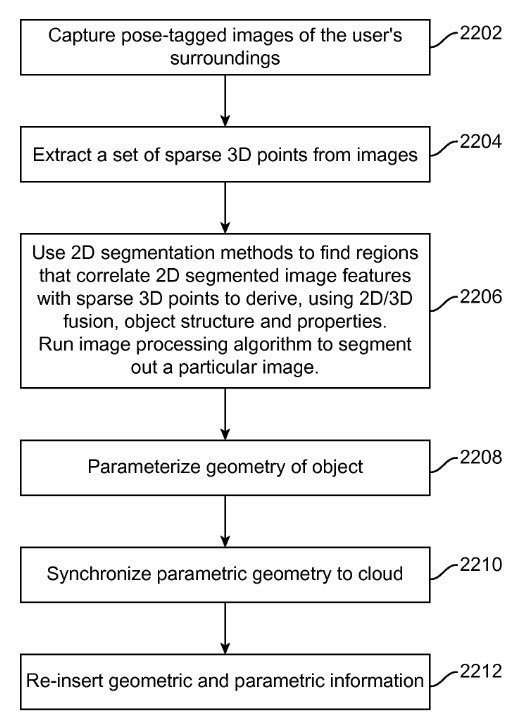
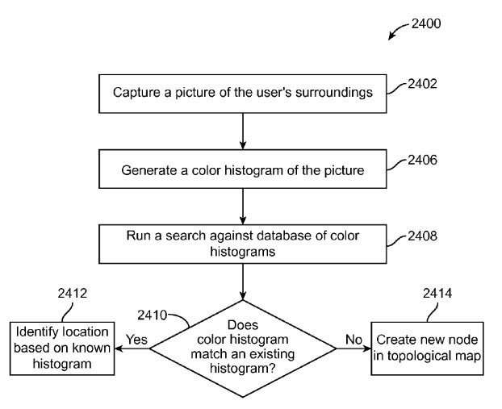
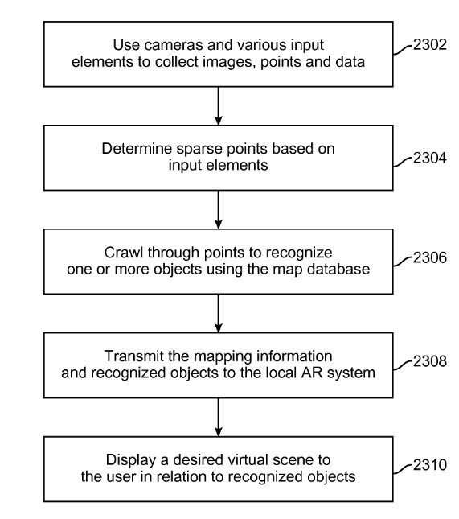
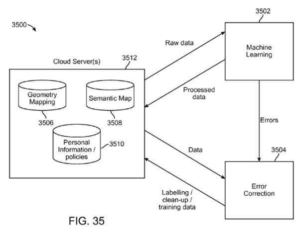

The temptation was to write this blog post mostly in pictures since it’s about visual representations of things, based sometimes on a combination of objects that were understood using object recognition, and virtual semantic images superimposed on those learned from a knowledge base.

Google Ventures and a couple of [partners funded the company Magic Leap](https://www.seobythesea.com/2014/10/google-glass-augmented-reality-magic-leap-virtual-reality-team/) with a substantial amount of money ($542 million), and [Magic Leap responded](https://www.wired.com/2015/01/magic-leaps-vision-for-virtual-reality/) with a new 180 page patent application that shows how it might create a “Cinematic Reality” in the world around us.

With a 180 page long patent, there are a lot of images that go with it, so I’m going to mostly use pictures from the patent, [Planar Waveguide Apparatus With Defraction Element(s) and System Employing Same](http://appft.uspto.gov/netacgi/nph-Parser?Sect1=PTO1&Sect2=HITOFF&d=PG01&p=1&u=%2Fnetahtml%2FPTO%2Fsrchnum.html&r=1&f=G&l=50&s1=%2220150016777%22.PGNR.&OS=DN/20150016777&RS=DN/20150016777) for the rest of this post. Note that at least one of the pictures has a semantic element to it, which is pretty interesting, and there are mentions of the Semantic Web, like this one:

> [0018] In another aspect, a method of recognizing objects is disclosed. The method comprises capturing an image of a field of view of a user, extracting a set of map points based on the captured image, recognizing an object based on the extracted set of map points, retrieving semantic data associated with the recognized objects and attaching the semantic data to data associated with the recognized object and inserting the recognized object data attached with the semantic data to a virtual world model such that virtual content is placed in relation to the recognized object.

Let’s play this back in pieces, filling in a little from the claims section of the patent:

1. Glasses capture an image

2. This system tried to “recognize” the object in the image and maps out and pinpoints parts of that image

3. A knowledge base in the cloud tries to associate semantic data to the mapped out parts of the image to create a new image

4. The new image (with semantic data) is inserted into a virtual world model

5. Augmented Reality is achieved

_Mapping parts of an image to paste a semantic knowledge base image upon_

_The object or objects being mapped out are first recognized._

An important part of this process is to include part of an object from the “passable world” to base a projected image upon.

_Note how the real “passable world” object may be merged with a similar object from a knowledge base to create a new image._

Some of the technical implementations are spelled out in the next flow chart:

_The geometries of the recognized objects are being merged with the ones from the cloud._

It makes sense that there would be some kind of analysis that attempted to understand the wearer’s surroundings:

_I like how no detail is left untouched here, including understanding the surroundings of the viewer._

To summarize:

_The end goal, which may involve many recognized objects and merging with Semantic data from a Knowledge base, is the creation of a virtual scene._

Parts of this process that really excite me are the ones that use Semantic Web and Knowledge base information:

_This flowchart captures much of the basic process._

The patent does fill out a lot more technical details, but since it’s the Semantic Web aspects of this patent application that got me excited, here’s one of those sections that I liked a lot:

> Such recognizers operate within the data of a world model and may be thought of as software “robots” that crawl a world model and imbue that world model with semantic information, or an ontology about what is believed to exist amongst the points in space.
>
> Such recognizers or software robots may be configured such that their entire existence is about going around the pertinent world of data and finding things that it believes are walls, or chairs, or other items.
>
> They may be configured to tag a set of points with the functional equivalent of, “this set of points belongs to a wall”, and may comprise a combination of point-based algorithm and pose-tagged image analysis for mutually informing the system regarding what is in the points.
