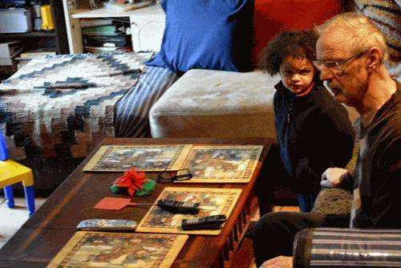

In the days leading up to Christmas, Barbara Starr sent me a link to a patent with a note that it would make a tremendous Christmas blog post. I absolutely agreed and am writing and sharing that post with you now.

_This image of my Great Nephew hiding from the camera is a memorable moment for me._

When you see a patent where it’s based upon sharing joy and happiness, it is the kind of thing that makes you want to share and to find more like it. In this case, it’s a patent that Google acquired when they [purchased Nik Software](https://en.wikipedia.org/wiki/Nik_Software) in 2012 so that it could be used with Google Plus to edit some photos into animations and stories automatically.

The particular patent that Barbara sent me a link to is [Automatic identification of a notable moment](https://patents.google.com/patent/WO2014105816A1). This seemed to be the passage that we both found interesting in the patent and commented upon to each other almost simultaneously:

> Photographers seek to capture moments. In particular, photographers seek to capture those moments when something “magical” or otherwise identifiable happens, for example, a person’s face when his/her partner proposes marriage or when something hysterical happens.

The patent describes many things that might be looked for to determine when magical things happen during a video to identify notable moments and magical moments so that those can be captured and shared.

It inspired some capturing of images in burst mode. The Nik Software enhancements that Google added to Google Plus might use its auto awesome enhancements to animate those images.

My mom and her dogsOne of my favorites visually was this traffic loop:

Thanks to Barbara for inspiring this post. A Christmas and holiday wish to all of you is that you have a year filled with notable and magical moments.
