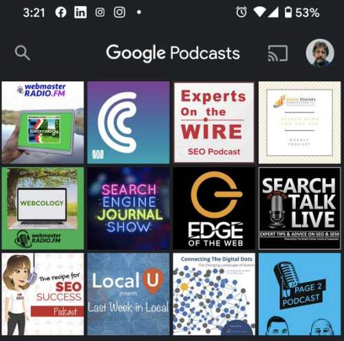

## Podcasts Can Be Hard to Find

I’ve been listening to a lot of podcasts lately. They can be fun to listen to while doing chores around the house, like watering plants, washing dishes, cooking meals, and cleaning up. There are podcasts on many different subjects that I am interested in—a good number about Search Engine Optimization.

Someone asked me If I had seen any patents about podcasts on Twitter recently. I hadn’t at the time, and I told them that. A patent application later appeared on January 9, 2020. I returned to the tweet, where I replied that I hadn’t seen any and tweeted that I had found a new one and would be writing about it. This is that post.

I am not the only one listening more to podcasts. Techcrunch from last year had an article about the growth of audiences for podcasts: [After a Breakout Year: looking ahead to the future of Podcasting](https://techcrunch.com/2019/08/21/after-a-breakout-year-looking-ahead-to-the-future-of-podcasting/).

Google noticed this trend and has worked on making podcasts easier to find in search results and by releasing a Google Podcasts app.

## Google Podcasts Easier to Find

At the Google Blog, the Keyword, a post last August from Sack Reneay-Wedeen, Product Manager at Google Podcasts, called: [Press play: Find and listen to podcast episodes on Search](https://www.blog.google/products/search/press-play-find-and-listen-podcast-episodes-search/)

If you produce a podcast or are looking for one to listen to, you may find this article from last autumn helpful: [Google will start surfacing individual podcast episodes in search results](https://www.theverge.com/2019/8/8/20759394/google-podcast-episodes-search-results-transcriber).

It tells us that:

> Google is taking the next step in making podcasts easier to find. The company will now surface individual podcast episodes in search results. If someone searches for a show about a niche topic or an interview with a specific person, Google will show them potential podcast episodes that fit their query.

In Google Search Help is a page about finding Podcasts titled [Listen to podcasts with Google Podcasts](https://support.google.com/websearch/answer/9049144?co=GENIE.Platform%3DAndroid&hl=en)

There are also Google Developer pages about how to submit your Podcasts for them to be found using Google on this page: [Google Podcasts](https://support.google.com/podcast-publishers/answer/9476656#get_on_google), which offer guidelines, management of podcasts information, and troubleshooting for Google Podcasts.

The [Google Play Music Help](https://support.google.com/googleplaymusic/answer/6343833?hl=en) pages offer information about using that service to subscribe and listen to podcasts.

There are also Google Podcast Publisher Tools, which allows you to submit your podcast to be found on the Google Podcasts App and preview your podcast as it would appear there.

The Google Podcasts App is at: [Google Podcasts: Discover free & trending podcasts](https://play.google.com/store/apps/details?id=com.google.android.apps.podcasts&hl=en_US)

## How the Google Podcast Patent Application Ranks Shows and Episodes

The new Google patent application covers “identifying, curating, and presenting audio content.” That includes audio such as radio stations and podcasts.

The application starts with this statement:

> Many people enjoy listening to audio content, such as by tuning to a radio show or subscribing to a podcast and playing a podcast episode. For example, people may enjoy listening to such audio content during a commute between home and work, exercising, etc. In some cases, people may have difficulty identifying specific content that they would enjoy listening to, such as specific shows or episodes that align with their interests. Additionally, in some cases, people may have difficulty finding shows or episodes that are convenient for them to listen to, such as a duration that aligns with a duration of a commute.

It focuses on solving a specific problem – people being unable to identify and listen to audio content.

The method this patent uncovers for presenting audio content includes:

- Seeing categories of audio content
- Being able to select one of those categories
- Seeing shows based upon that selected category
- Being able to select from the shows in that category
- Seeing episodes from those shows
- Being able to select from an episode, and seeing the duration of playing time for each show
- Ranking the episodes
- Seeing the episodes in order of ranking.

Rankings are based on the likelihood that a searcher might enjoy the episodes being ranked.

The episodes can also be shown based upon a measure of popularity.

The episodes may also be shown based upon how relevant they might be to a searcher.

Identifying a group of candidate episodes is based on an RSS feed associated with shows in the subset of shows.

The patent application about Google podcasts is:

[Methods, Systems, and Media for Identifying, Curating, and Presenting Audio Content](https://patentscope.wipo.int/beta/en/detail.jsf?docId=US280235649)
Inventors Jeannette Gatlin, Manish Gaudi
Applicants Google LLC
Publication Number 20200012476
Filed: July 3, 2019
Publication Date January 9, 2020

The methods described in the patent cover podcasts and can apply to other types of audio content, such as:

- Music
- Radio shows
- Any other suitable type of audio content
- Television shows
- Videos
- Movies
- Any other suitable type of video content

The patent describes several techniques that podcasts are found with.

A group of candidate shows are selected, such as podcast episodes using factors like:

- Popularity
- Inclusion of evergreen content relevant to a listener
- Related to categories or topics that are of interest to a particular user

Recommendations of shows look at whether a show:

1. Is associated with episodic content or serial content.
2. Typically includes evergreen content (e.g., content that is generally relevant at a future time) or whether the show will become irrelevant at a predetermined future time
3. Is likely to include news-related content based on whether a tag or keyword associated with the show includes “news.”
4. Has tags indicating categories or topics associated with the show.
5. Has tags indicating controversial content, such as mature language, related to particular topics, and/or any other suitable type of controversial content
6. Has previously assigned categories or topics associated with a show that are accurate.
7. Has episodes likely to include advertisements (e.g., pre-roll advertisements, interstitial advertisements, and/or any other suitable types of advertisements).
8. Has episodes that are likely to include standalone segments that can be viewed or listened to individually without viewing the rest of an episode of the show.
9. Has episodes often with an opening monologue.
10. Has episodes featuring an interview in the middle part of an episode.
11. Features episodic content instead of serial content, so it does not require viewing or listening to one episode before another.
12. is limited in relevance based on a date (after the fact).

Human evaluators can identify episode based upon features such as:

- General popularity
- Good audio quality
- Associated with particularly accurate keywords or categories
- Any other suitable manner

Some podcasts may have a standalone segment within an episode that may feature:

- A monologue
- An interview
- Any other suitable standalone segment

- Popularity
- Likelihood of enjoyment
- Previous listening history
- Relevance to previously listen to content
- Audio quality
- Reviewed by human evaluators

The patent tells us that this process can rank the subset of the candidate episodes in any suitable manner and based on any suitable information.

It can be based on a popularity metric associated with a show corresponding to each episode and/or based on a popularity metric associated with the episode.

That popularity metric may also be based on any suitable information or combination of information, such as:

- A number of subscriptions to the show
- A number of times a show and/or an episode has been downloaded to a user device
- A number of times links to a show have been shared (e.g., on a social networking service, and/or in any other suitable manner)
- Any other suitable information indicating popularity.

This process can also rank the subset of the candidate episodes based on the likelihood that a particular user of a user device will enjoy the episode.

That likelihood can be based on previous listening history, such as:

- How relevant a category or topic of the episode is to categories/topics of previously listened to episodes (Is it associated with a show the user has previously listened to?)
- Many times, the user has previously listened to other episodes associated with the show
- Any other suitable information related to listening history

This process can also rank candidate episodes based on the audio quality of each episode.

Alternatively, this process may also rank candidate episodes based on whether a human evaluator has identified each episode, and episodes that human evaluators have identified are ranked higher than other episodes.

A combined episode score might be based upon a score from:

- A trusted listener
- The audio quality
- The content quality
- The popularity of the show from which the episode originates

## Takeaways

This patent appears to focus primarily on how podcasts might be ranked on the Google Podcasts App rather than in Google search results.

The podcasts app isn’t as well known as some other places to get podcasts, such as iTunes.

I am curious about how many podcasts are being found in search results. I’ve been linking to ones that I’ve been a guest in from the about page on this site, and that helps many of them show up in Google SERPs on a search for my name.

I guess making podcasts easier to find in search results can be similar to making images easier to find, by the text on the page that they are hosted upon and the links to that page.

## SEO Industry Podcasts

I thought it might be appropriate if I ended this post with several SEO Podcasts.

I’ve been a guest on many podcasts and have been involved in a couple of past few years. I’ve also been listening to some, with some frequency, and have been listening to more, both about SEO and other topics as well. So I decided to list some of the ones that I have either been a guest on or have listened to a few times. They are in no particular order.

[Experts On The Wire Podcast](http://www.evolvingseo.com/category/podcast/)

Hosted by Dan Shure, Dan interviews different guests every week about SEO and Digital Marketing aspects. I’ve been on a couple of podcasts with Dan and enjoyed answering questions that he has asked, and I have listened to him interview others on the show as well. There are some great takeaways in some of the interviews that I have listened to learn from.

[Search News You Can Use – SEO Podcast with Marie Haynes](https://podcasts.apple.com/us/podcast/search-news-you-can-use-seo-podcast-with-marie-haynes/id1376634845)

A Weekly podcast about Google Algorithm updates and news and articles from the digital marketing industry: this is a good way to keep informed about what is happening in SEO. She provides some insights into how to deal with updates and changes at Google.

[Webcology](https://www.stitcher.com/podcast/webmasterradiofm/webcology)

Jim Hedger and Dave Davies have been running this podcast for a few years, and I’ve been a guest on it about 4-5 times. They discuss a lot of current industry news and invite guests to the show to talk about those. My last guest appearance was with David Harry, where we talked about what we thought were the most interesting search-related patents of the last year.

[The Search Engine Journal Show!](https://www.searchenginejournal.com/category/search-engine-journal-show/)

Danny Goodwin, Brent Csutoras, Greg Finn, and Loren Baker take turns hosting and talking with guests from the world of SEO. No two SEOs do things the same way, and learning about the differences in what they do can be interesting.

[Edge of the Web Podcast](https://edgeofthewebradio.com/)

Erin Sparks hosts a weekly show about Internet Marketing, and he takes an investigative approach to this show, asking some in-depth questions. He asks some interesting questions.

[Search Talk Live Digital Marketing Podcast](http://searchtalklive.com/)

Hosted by Robert O’Haver, Matt Weber, and Michelle Stinson Ross. They offer “Expert Advice on SEO and SEM. I had fun talking with these guys – I just listened to half of my last appearance on the show.

[The Recipe For SEO Success Show](https://therecipeforseosuccess.libsyn.com/)

Kate Toon is the host of this show, and she focuses on actionable tips and suggestions from guests on doing digital marketing.

[Last Week in Local](https://open.spotify.com/show/2szaMuuXG1Q7cKSP4evETx)

Hosted by Mike Blumenthal, Carrie Hill, and Mary Bowling. They often discuss news and articles that focus on local search and discuss topics that have a broader impact on sites, such as image optimization.

[#AEO is SEO Podcast](https://kalicube.pro/podcast/)

Jason Barnard hosts this. The “AEO” in the title is “Answer Engine Optimization,” and Jason has been attending conferences to give him a chance to interview people for his podcast. The last time we did a show, it was in a bakery across the street from my hotel in a suburb of Paris, talking about Entities at Google.

[Connecting the Digital Dots](https://www.spreaker.com/user/marthavanberkel)

Martha van Berkel is the host of this show and is one of the people behind Schemaapp. She and I talked about featured snippets.

[Search Engine Roundtable Vlog](https://www.seroundtable.com/category/vlogs)

Barry Schwartz runs the Search Engine Roundtable, which is originally based upon the roundtable in tales of King Author that knights would sit at. In this VLOG, he visits people where they work and asks them questions about what they do. It’s fun seeing where people are from and learning more about them.

[Bill and Ammon’s Bogus Hangout](https://www.youtube.com/channel/UCUIf_sjBNq4Mr38Ibd3xrpg)

This is a weekly conversation between several SEOs having discussions, often about marketing and SEO, but sometimes veering off into different topics. It takes inspiration from the early days of SEO, where conferences such as Pubcon were often meetups in bars, with people sharing stories about what they had been doing. I am one of the hosts, and recently I’ve been joined by Doc Sheldon, Terry van Horne, Zara Altair, and Steve Gerencser.

[Page 2 Podcast](https://page2podcast.fm/)

Hosted by Jacob Stoops and Jeff Louella. They have guests join them from the world of SEO, and they ask them about their origin stories as SEOs. They have added a news section to the show as well,

[Deep Crawl’s Open Dialogue](https://www.deepcrawl.com/blog/tag/open-dialog/)

These shows feature interviews with some sharp and interesting SEOs and provide details on tips and techniques involving digital marketing and technical SEO.

[SEO Training Dojo](https://www.youtube.com/channel/UChU-LFd38KXtq49O6d4EvTw)

With David Harry and Terry van Horne. The Dojo is a center for training and learning SEO. It often includes guests who have been sharing ideas and approaches about SEO for years.
