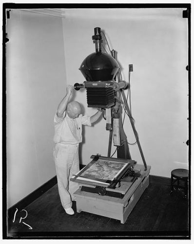
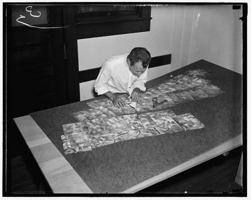
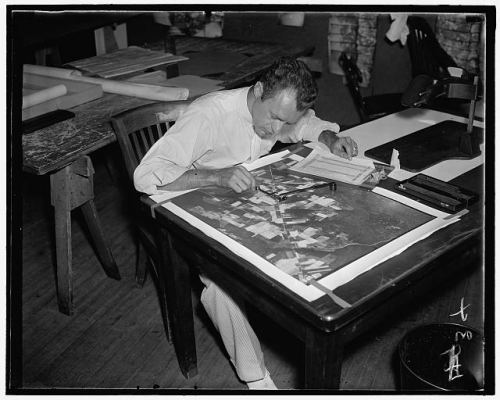

## A Look at How Google Might Index the Deep Web

Many pages on the Web that conventional search engines can’t find, crawl, index, and show to searchers, especially from the Deep Web. The University of California (UC), funded partially by the US Government, has changed that.

When you search the Web at Google or Yahoo or Bing, you really aren’t searching the Web, but rather the indices that those search engines have created of the Web. To some degree, it’s like searching on a map of a place instead of the place itself. The map is only as good as the people mapping it. It only indexes the parts of the Deep Web that it knows about.

Mapmakers have consistently worked to develop new ways to get more information about the areas that they survey. For example, a New Deal program in the 1930s under the Agricultural Adjustment Administration [led to the creation](https://www.maxwell.syr.edu/geo/Monmonier,_Mark/) (pdf) of a $ 3,000,000 map.

> In 1937, 36 photographic crews flew 375,000 square miles (970,000 square km), and by late 1941 AAA officials had acquired coverage of more than 90 percent of the country’s agricultural land.
>
> From its initial goal of promoting compliance, the Agriculture Department’s aerial photography program became a tool for conservation and land planning and an instrument of fair and accurate measurement instruments.
>
> Local administration and a widely perceived need to increase farm income fostered the public acceptance of a potentially intrusive program of overhead surveillance.

The map created was pieced together from many prints that scaled roughly so that one inch on the map equaled 660 ft. This post includes images from the Library of Congress of people preparing to map and measure images from it.

## There are Blind Spots On Google’s Index of the Deep Web

Regardless of efforts like that, there are still blind spots on maps.

Regardless of the efforts of search engines, there are also many blind spots on their indices of the Web. The number of pages online that search engines know about is probably a much smaller number than the number of pages that they don’t know about.

Some of those blind spots on the deep web are from web admins inadvertently blocking content on their web pages, by using javascript in navigation that search engines can’t crawl, or requiring visitors to accept cookies to see pages when search engine crawling programs can’t accept cookies, or due to a good number of other factors.

Some of those blind spots are from sites that might like to share the information contained on their pages but have made it accessible only through search forms on their websites.

A patent from three researchers on behalf of the Regents of the University of California explores ways to index pages on the Web that are publicly accessible but require visitors to enter query terms in a search box to find pages. Of course, the search engines aren’t standing still on finding these kinds of pages either. See my post from a few years back: [Google Diving into Indexing the Deep Web](https://www.seobythesea.com/2006/10/google-diving-into-indexing-the-deep-web/).

## Inaccessible Web Pages Exist On the Deep Web

There are a few different ways that search engines get information about web pages. One of them is to use programs to spider or crawl Web pages and collect the addresses or URLs of other pages on the Web. Another is the XML sitemaps that search engines will use to learn about new pages. Search engines will also accept data from XML and RSS feeds from sites to discover new URLs and information at those URLs.

Places like the US Patent Office make copies of many granted patents and published pending patent applications [available to the public](http://patft.uspto.gov/), but those are hidden from search engines because the patent office has set up that information so that queries from searchers can only access it. Google started their own [patent search engine](https://www.google.com/?tbm=pts), but it doesn’t have as timely information as the patent office’s databases.

The University of California patent uses the example of Pubmed, Amazon.com, and DMOZ as three sites that search engines might have trouble with. I’m not sure that it’s true that the setup of those sites is difficult for search engines to index anymore, but there are sites like the patent office’s that the search engines can’t easily index.

## Why Explore The Deep Web, And Make More Information Available For Search Engines To Index?

We’re told in the deep web patent:

> The method and system would improve the overall user experience by reducing wasted time and effort searching through many site-specific search interfaces for Hidden Web pages.
>
> Finally, current search engines introduce a significant bias into search results because of how Web pages are indexed.
>
> By making a larger fraction of the Web available for searching, the method and system can mitigate the bias introduced by the search engine to the search results.

Interestingly, one of the inventors listed on the patent is Junghoo Cho, whose paper [Efficient Crawling Through URL Ordering](http://citeseerx.ist.psu.edu/viewdoc/download?doi=10.1.1.55.6710&rep=rep1&type=pdf), co-authored by Hector Garcia-Molina and Larry Page, was cited on a now missing page on Stanford’s site amongst a list of papers that influenced the early days of Google. It may be one of the first papers that explained what metrics a web crawling program might look at when deciding which pages to crawl on the Web when faced with a choice of URLs found on other pages.

That paper was published more than a decade ago, and while there has been news of Google experimenting with [crawling through forms](https://webmasters.googleblog.com/2008/04/crawling-through-html-forms.html) to find inaccessible pages to index, it’s hard to gauge how effective their efforts have been.

## Identifying Queries at Site Search Interfaces

The process described in the UC patent describes how a crawling program might attempt to uncover pages that have site-specific search interfaces by entering query terms into those search forms. It might attempt to start with a “seed” term, possibly found on the search interface itself. After trying other queries, it may create a results index from searches that discover pages.

The next step would be to download those pages and explore them for possible other queries that could be searched with on the site, estimating from words and phrases found on those pages which terms might be most efficient in finding other pages through the search interface.

Many site search interfaces include more than one form field for multiple attributes, and potential keywords might be identified for each of those attributes.

The UC patent is:

[Method and apparatus for retrieving and indexing hidden pages](http://patft.uspto.gov/netacgi/nph-Parser?Sect1=PTO2&Sect2=HITOFF&u=%2Fnetahtml%2FPTO%2Fsearch-adv.htm&r=1&p=1&f=G&l=50&d=PTXT&S1=7,685,112.PN.&OS=pn/7,685,112&RS=PN/7,685,112)
Invented by Alexandros Ntoulas, Junghoo Cho, and Petros Zerfos
Assigned to The Regents of the University of California
US Patent 7,685,112
Granted March 23, 2010
Filed: May 27, 2005

Abstract

> A method and system for autonomously downloading and indexing Hidden Web pages from Websites include the steps of selecting a query term and issuing a query to a site-specific search interface containing Hidden Web pages.
>
> A results index is then acquired, and the Hidden Deep Web pages are downloaded from the results index. A plurality of potential query terms is then identified from the downloaded Hidden Web pages.
>
> The efficiency of each potential query term is then estimated, and a next query term is selected from the plurality of potential query terms, wherein the next selected query term has the greatest efficiency.
>
> The next selected query term is then issued to the site-specific search interface using the next query term. The process is repeated until all, or most of the Hidden Web pages are discovered.

While the patent provides many details on how a hidden web crawler would work, the inventors of this patent have also published a much easier readable whitepaper that covers much of the same territory: [Downloading Hidden Web Content](http://oak.cs.ucla.edu/~cho/papers/ntoulas-hidden.pdf).

Accessing pages on the Web that contain publicly accessible documents like patents or health information can yield many benefits, much like the 1937 mapping project I mentioned at the start of this post.
