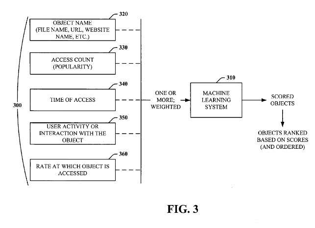

## User Popularity Data and Machine Learning

I haven’t written too much about Microsoft’s search recently, and a friend wrote an email earlier today asking me a little about what they try to do to rank pages. It’s a timely question with Microsoft’s Chairman Bill Gates announcing during a keynote address yesterday a renewed focus of his time at the company upon online services, including search.

Microsoft has been writing about some interesting sounding stuff with Ranknet (as described in [Learning to Rank using Gradient Descent](https://www.microsoft.com/en-us/research/publication/learning-to-rank-using-gradient-descent/) (pdf)) and [fRank](http://courses.cse.tamu.edu/caverlee/csce470/beyondpagerank.pdf) (pdf), a feature-based ranking which works with ranknet. Don’t know if that is what they are using.

Some more recent papers on search, which cover even more intriguing ground, have been showing up on the home page of [Susan Dumais](http://web.archive.org/web/20161028165802/http://research.microsoft.com/en-us/um/people/sdumais/), who is one of the chief researchers at Microsoft Research. She has many papers linked to 2007 and 2006 that focus on user behavior.

A patent application from Microsoft, published last week, explores incorporating user statistics on page visits into their machine learning-based ranking systems.

> [0044] In practice, imagine this scenario: Sam is browsing the web. PQR Browser Plug-in, for users who have opted in, sends back to QWE Ranking System a list of what URLs the user visited, what time he visited them, etc. This data is stored on QWE servers.

## User Popularity Data Has Been Opted Into

I like how they emphasize a few times in this patent application that collecting user data is something people have opted for. Such information collection is through a voluntary system, using a browser plug-in. This User Popularity Data sounds a little similar to [Google’s Web History](https://www.seobythesea.com/2007/04/googles-web-history-patent-applications/) news from not too long ago.

> QWE can go through that list and count how many times a user has viewed each page, how many times a user has viewed a given domain, how many times a domain+toplevel (e.g., w w w. qwerank. com /i.e.) has been viewed, etc.
>
> These statistics can then improve the query-independent ranking of web pages (their static rank). For instance, QWE may take a weighted sum of the logs of these counts, where the weights for each count are learned using machine learning.

## User Popularity Data Accuracy Performance Gain Greater than 50%

The patent document provides some numbers on the effectiveness of this process during some experiments conducted upon it, citing an accuracy performance gain of more than 50%.

> [0045] The resulting ranking helps the search engine provide more relevant results to the people searching the web since it is more likely to return pages many people have visited. According to actual experiments performed, the accuracy of search results for a given search query using the popularity-based system described hereinabove increased over the conventional rank system.
>
> It was determined that 50% of the performance gain observed by the testers is due to the browser tracking count. Thus, popularity-based rankings can improve the quality of search results, and such rankings also help the search engine order its index to retrieve good pages more efficiently.
>
> Finally, they can help the search engine determine which pages to crawl and re-crawl since it is more useful to re-crawl pages that are highly relevant and good rather than re-crawling poor or fraudulent pages.

The User Popularity Data Patent application is:

[Using popularity data for ranking](http://appft1.uspto.gov/netacgi/nph-Parser?Sect1=PTO2&Sect2=HITOFF&u=%2Fnetahtml%2FPTO%2Fsearch-adv.html&r=1&p=1&f=G&l=50&d=PG01&S1=20070100824.PGNR.&OS=dn/20070100824&RS=DN/20070100824)
Inventors: Matthew R. Richardson, Eric D. Brill; Eric D., Robert J. Ragno, and Robert L. Rounthwaite
Assigned to Microsoft
Filed: November 3, 2005
US Patent Application 20070100824
Published May 3, 2007

Abstract

> A unique ranking system and method facilitates improving the ranking and ordering of objects to enhance further the quality, accuracy, and delivery of search results in response to a search query. The system and method involve monitoring and tracking an object regarding the number of times it’s been accessed and optionally by whom, when, for how long, and an access rate. The user’s interaction with the object can be tracked as well.
>
> By tracking the objects, a popularity measure can be determined. Popularity-based rankings can be computed based on the popularity measure or some function thereof. The popularity measure can be affected by the access time who accessed it. And the access duration of the user’s interaction with the object upon a search component can utilize the popularity-based rankings next to improve the quality and retrieval of search results.
