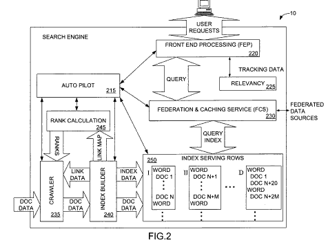
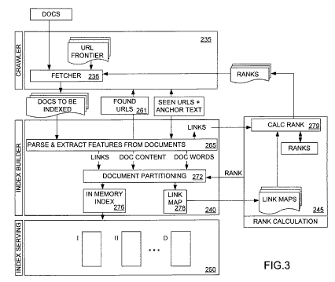
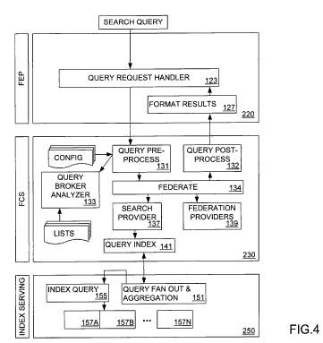

What’s a good way to organize the index of a search engine?

A way that is fast and returns a lot of relevant results? Maybe one that doesn’t need to be search the whole index to find results?

A newly granted patent from Microsoft provides some interesting insights into indexing by document, and how static ranking factors may influence whether a document is in the main index partition, or if it might be found in a later partition acting like an extended index.

In a recent post from Dan Thies, Why Google Can’t Just “Dump” PageRank, he discusses the importance of PageRank as a mechanism for a search engine to use to decide which pages to put in its main index, and which ones to put in its extended index.

It’s an excellent point, and references from Google on how they may manage their index seem to support it well. Here are a couple of posts that I’ve written on patents issued to Google about main and extended databases:

- [On Supplemental Results, Partitioned Indexing, and Extended Indexes](https://www.seobythesea.com/2007/08/on-supplemental-results-partitioned-indexing-and-extended-indexes/)
- [Google Patent on Extended Search Indexes](https://www.seobythesea.com/2007/02/google-patent-on-extended-search-indexes/)

We don’t know if those describe how Google’s indexes work, but they are interesting to compare to the methods described in the Microsoft patent.

Microsoft refers to its “query independent ranking factor” in this document as a “static” ranking.

The granted patent is:

[Index partitioning based on document relevance for document indexes](https://patents.google.com/patent/US7293016B1/en)
Inventors: Darren Shakib, Gaurav Sareen, and Michael Burrows
Assigned to Microsoft
United States Patent 7,293,016
Granted November 6, 2007
Filed: January 22, 2004

The abstract of the document sets out the concept behind the document pretty well:

> Indexed documents are arranged in the index according to a static ranking and partitioned according to static ranking. Index queries reference the first partition and move to a subsequent partition when a static rank for the subsequent partition is higher than a weighted portion of the target score added to a weighted portion of a dynamic rank corresponding to the relevance of the results set generated thus far. By changing the weight of the target score and dynamic ranks in the subsequent partition score, searches can be stopped when no more relevant results will be found in the next partition.

The patent goes into a lot of detail, and if you’re interested in how it works, it’s worth a look.

While I was doing some research on this patent, I came across an excellent article about one of the inventors listed, Mike Burrows, who worked at Microsoft and is now at Google. It’s from Stanford University’s Cardinal Inquirer – The Genius: Mike Burrows’ self-effacing journey through Silicon Valley. (Unfortunately, the article seems to be no longer available on the Web.)

Here’s a brief snippet:

> One of the highest-ranking computer scientists at Google, Mike works on Google’s distributed system, a non-centralized network consisting of numerous computers that can communicate with one another and that appear to users as parts of a single storehouse of shared hardware, software, and data. In the circle of high-tech experts, Mike has a special place for his role in inventing Alta Vista, the first multilingual search engine.

This Cardinal Inquirer story is one of the better articles on the history of search engines that I’ve read in quite a while. Highly recommended.
