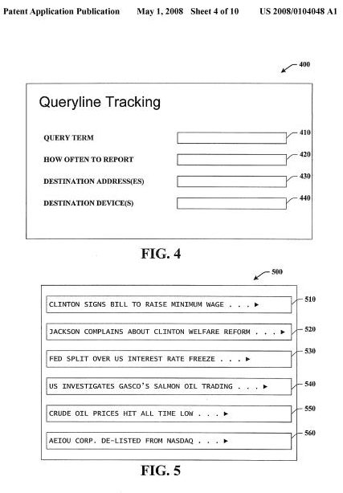

What will the search interfaces of tomorrow look like? How might we be presented with information that we are interested in differently than we are today, and how might that information be delivered to us in manners that we find helpful?

On Google’s corporate [Quick Profile](https://about.google/) page, they tell us that their mission is

> …organizing the world’s information and making it universally accessible and useful

That seems to be a pretty tall offer, and it causes me to think about the many different ways that information might be organized in accessible and useful ways.

A newly published patent application from Microsoft takes an interesting spin on presenting information, pulling together news from a mix of sources to present topics in storylines, and providing ways to have that information delivered to us over computers, smart phones, watch interfaces, and in other ways.

One example of how information presented in this manner might be useful is that of a stock broker who might want to be timely informed over every news item and piece of information associated with corporations that could have a profound impact on the value of a stock portfolio, and the corporations within it.

The authors of the patent filing tell us that there really isn’t presently a way of displaying such information into stories that can easily track such changes over time in a useful and accessible way. They might have a solution, as seen in the image below.

Presenting information like this could help many more people than just stockbrokers, including government policy makers, business decision makers, nonprofit directors, and people interested in keeping track of specific storylines who might yearn to find easier ways to keep abreast of the news that interests them, whether that’s sports scores, or news of global warming.

[Tracking Storylines Around a Query](http://appft1.uspto.gov/netacgi/nph-Parser?Sect1=PTO2&Sect2=HITOFF&u=%2Fnetahtml%2FPTO%2Fsearch-adv.html&r=1&p=1&f=G&l=50&d=PG01&S1=20080104048.PGNR.&OS=dn/20080104048&RS=DN/20080104048)

Invented by Arungunram C. Surendran
Assigned to Microsoft
US Patent Application 20080104048
Published May 1, 2008
Filed September 15, 2006

Abstract

> The claimed subject matter relates to a system and method that effectuates queryline tracking by constructing and utilizing incremental aspect models that employ probabilistic and/or spectral techniques to discover themes within documents delivered in a stream over time.
>
> The system and method upon discovery of a theme or enhancements to already induced or surfaced themes can generate a notification for propagation to a user via one or more user specified communications and/or computing modalities.

**Queryline Tracking and Evolving Topic Models**

In simple terms, what this patent filing describes is a way that allows people to track stories over time that relate to a particular person, place, or thing.

This is referred to as “queryline tracking,” and it is different from a web search or news alert in that it will collect the results to a submitted query over time, and divide and summarize the results of that query into themes. It will then track and update those themes as new information becomes available, and alert the person tracking when new themes are discovered.

The tracking system can use a few different statistical models (topic models) to analyze the documents it receives and discover themes within those documents, and will rank or score those documents in terms of relevance to the topics it discovers within them.

The queryline tracking method doesn’t only break documents down into themes using topic models, but it also tracks the addition of new documents and storylines. Topic models that can change over time could be referred to as “evolving topic models”. These evolving topic models might be created where new data constantly arrives.

Ideally, an evolving topic model will not only grow as new data is added, but will also shrink to eliminate old or unused topics as is necessary.

**An Example of Queryline Tracking**

A query of “Clinton” is chosen for a body of data that is made up of Reuters news articles from Aug. 20-Aug. 31, 1996. On the first day, there were five themes (or stories) associated with Clinton;

- Stories about the presidential election,
- The signing of a bill to raise the minimum wage,
- The Whitewater case,
- A complaint by a Senator to the president about an increase in drug use, and;
- A caution by Newt Gingrich to President Clinton about the ability of the country to pre-emptively deal with external nuclear threats.

Those themes might each be presented where there is a column for each theme, and associated keywords that can be used to create appropriate notifications to be sent to a person who searched for the information, on their computer, or smart phone, or other device.

The patent filing provides more details on the additional days, describing the introduction of other real storylines during that time period, to illustrate how useful this method might be.

**Conclusion**

Microsoft’s patent application points out a number of types of technologies and statisitical models that could be used to analyze documents, and break them down into topics.

While I was reading it, I was wondering how Google collects and breaks down documents in Google News Search, when it displays those in “relevance mode.”

This approach from Microsoft seems to go beyond the method that Google uses, by tracking more additions over time, deliverying the storylines to them in a manner like an alert, and allowing someone to track new and related storylines as they are discovered. This does seem like an accessible and useful way of organizing information.
