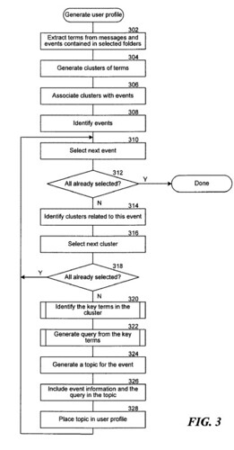

Many patent filings and papers from the search engines discuss ways that they might shuffle around search results to try to provide more relevant responses to people’s searches.

Imagine a search engine changing around the results that you see, not based upon the time that a page is published, but rather on some estimate of the importance of a page to you, and how that importance might vary with time and your calendar. It sounds like a tricky proposition, doesn’t it?

Microsoft adds an element of time to search results by introducing a search system that pays more attention to what is happening on your computer and within your company intranet.

This more complex search system could be used to index both search results and information found on a person’s desktop and local network. The search system would pay more attention to the context of searches and add personalization to those searches by building a user profile to distinguish how important different information might be to each searcher.

It might look at calendar entries, emails, documents, and other information in this attempt to define importance, and understanding different events and times related to things like emails and calendars may be essential in providing relevant results to a searcher.

For example, you may be planning on traveling someplace to attend a conference, and information about the conference is contained in your emails and on your calendar. Keywords and search terms from your personal information might be created and used to rerank the search results that are presented to you if they are relevant to those terms.

The patent application is:

[Temporal Ranking of Search Results](http://appft1.uspto.gov/netacgi/nph-Parser?Sect1=PTO2&Sect2=HITOFF&u=%2Fnetahtml%2FPTO%2Fsearch-adv.html&r=1&p=1&f=G&l=50&d=PG01&S1=20080027921.PGNR.&OS=dn/20080027921&RS=DN/20080027921)
Inventors: Raman Chandrasekar, Dean A. Slawson, Michael K. Forney
Assigned to Microsoft
US Patent Application 20080027921
Published January 31, 2008
Filed: July 31, 2006

Abstract

> An information dissemination system ranks the search results based on a temporal weight assigned to each search result. The temporal weight is an indication of the importance of a user that varies with time. For each search result, the information dissemination system calculates a temporal weight that is based on the temporal proximity of the event that is related to the search result. The temporal weight may be used to re-rank the search results.

An example of how this could work:

You may have two events scheduled in your calendar – a meeting in New York, and a flight to New York for the meeting.

At some point in time before that meeting, the importance of the meeting is high, and search results related to the time of the meeting and the subject involved could be given a stronger weight in search results that you see when you perform searches that might be related to New York, or the topic of the meeting expressed in your calendar and emails.

Information about the flight may also increase in importance, and information related to the flight becomes more important, such as flight delay information.

After you take the actual trip, information about the flight decreases in importance. After attending the meeting, information about the topic and time of the meeting also diminishes in importance.

**Conclusion**

How useful would a system like this be, that looks at your personal information, and changes your search results around based upon your calendar, your emails, and documents that you might have on your computer?

Does this mean that if you are planning to go to New York during a certain period, that searches for Broadway plays might be shuffled to show you plays that are happening during the time you are in New York City?

Maybe.
