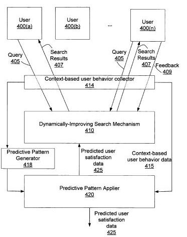
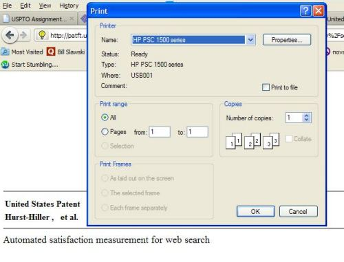

When we see a change at one of the major search engines like the Panda update at Google, it’s not a bad idea to look at whether or not one of the other search engines has done something similar, or at least published some research on it a similar approach.

Interestingly, a patent granted to Microsoft this week (though originally filed back in 2004) describes how the quality of search results might be judged, and those results possibly changed, based upon user feedback. The patent is:

[Automated satisfaction measurement for web search](http://patft.uspto.gov/netacgi/nph-Parser?Sect1=PTO2&Sect2=HITOFF&u=%2Fnetahtml%2FPTO%2Fsearch-adv.htm&r=1&p=1&f=G&l=50&d=PTXT&S1=7,937,340.PN.&OS=pn/7,937,340&RS=PN/7,937,340)
Invented by Oliver Hurst-Hiller, Eric Watson, and Susan T. Dumais
Assigned to Microsoft
US Patent 7,937,340
Granted May 3, 2011
Filed March 22, 2004

Abstract

> Context-based user behavior data is collected from a search mechanism. For a given query, this data includes user feedback (implicit and explicit) on the query and context information on the query. A predictive pattern is applied to the context-based user behavior data to produce predicted user satisfaction data.
>
> Data mining techniques may be used to create and improve one or more predictive patterns. Predicted user satisfaction data can be used to monitor or improve search mechanism performance, via a display reporting the performance or identification of any queries with a shared characteristic and sub-par user satisfaction.
>
> A dynamically improving search mechanism uses the predicted user satisfaction data to improve the performance of the search mechanism.

A whitepaper from Microsoft which shares an author with the patent and seems to be somewhat related is [Improving Web Search Ranking by Incorporating User Behavior Information](http://www.mathcs.emory.edu/~eugene/papers/sigir2006ranking.pdf). We’re told in the paper that:

> In this paper, we explored the utility of incorporating noisy implicit feedback obtained in a real web search setting to improve web search ranking.
>
> We performed a large-scale evaluation of over 3,000 queries and more than 12 million user interactions with a major search engine, establishing the utility of incorporating “noisy” implicit feedback to improve web search relevance.

**Implicit Feedback**

Implicit feedback about how satisfied a searcher is with a web page that they found in a search result might be collected by a search engine. This kind of information isn’t provided explicitly by a searcher, but rather is implicit in the searcher’s actions or inactions.

For instance, someone printing a page that they’ve found through a search may mean that they found value in that page.

While there’s a chance that the reason they are printing maybe because they found something of interest on the page unrelated to their search, chances are that there is some relationship between the search and the act of printing in many cases.

Some user behavior signals tracked may involve navigation through a site or the display of a page, such as when:

- A hyper link has been clicked to navigate to a different page
- The history is used for navigation to a different page
- The address bar is used to navigate to a different page
- The favorites list is used to navigate to a different page
- A document has been completely loaded and initialized
- Scrolling is taking place
- A document is printed
- A document is added to the favorites list
- The window gains focus
- The window loses focus
- A window has been closed
- The user selects, cuts, or pastes portions of the displayed page
- Navigation back to the search results page

Other signals could involve:

- User dwell time on a page
- A new query initiated by the same user
- Other sequences of user behaviors

Other information about searchers’ behaviors are likely to be collected, such as when a hyperlink is clicked, the position of the link may be recorded, the size of the content involving that element (image, anchor text length, area of content where the link is located, and the type of content may be identified as well.

**Explicit Feedback Data**

The patent also tells us that it might consider using more explicit feedback to measure the satisfaction of a searcher with a page that they’ve found in search results.

This might be as simple as asking, via a dialog box, a question such as, “Did this answer your question?” and allowing a response to be entered.

The ability for searchers to block certain sites from their search results is an explicit form of user feedback, and in the Google interview I mentioned above, we are told that it’s a signal that Google looked at to see if their approach with Panda resulted in similar sites or pages being identified as less than satisfactory results.

Google’s +1 button might be seen as an explicit feedback mechanism. However, as many have pointed out when writing about the button, the button presently appears in search results before a searcher visits a page, and it’s hard to determine how good a result might be before you visit it.

A recent Google advertisement that is being shown on television for Google Chrome [shows a +1 button](https://techcrunch.com/2011/05/04/google-plus-1-extension/) built into the browser. That may be one way to get around the problem of seeing the +1 button in the search results before you visit the page itself. Watch for the +1 button on the toolbar in the Chrome browser on the video below:

**Predictive Patterns**

The kind of implicit and explicit feedback above might be associated with the contexts in which they were found, and patterns identified with that information might be used to predict a user’s satisfaction with particular search results for particular queries.

This type of pattern prediction might be part of a data mining system that uncovers possible trends and patterns, and relationships from a range of data, including classification methods involving things such as support vector machines, decision trees, neural networks, and language models.

That kind of prediction might drive a “dynamically improving search mechanism” to improve how a search engine performs.

> For example, the predicted user satisfaction data 425 may indicate that, of two different presentations of search results, one of the presentations results in higher predicted user satisfaction. The dynamically improving search mechanism adjusts to provide a better presentation for search results more often, thus improving predicted user satisfaction for the future.
>
> Other refinements may occur using this same mechanism. In addition to providing different presentations of search results (such as different orderings of results on a results page), spell-correction, query refinement suggestions, news or shopping results, or categorization, the user interface may be provided to the user in different situations.
>
> The dynamically improving search mechanism 410 can be used to compare the user satisfaction with these solutions or features.

**Conclusion**

It’s hard to tell if Google has incorporated user feedback into their scoring of the quality of pages, or focusing upon are using it to evaluate their system for grading quality, and then making tweaks to the signals being used.

Google’s Amit Singhal and Matt Cutts told us in [The ‘Panda’ That Hates Farms: A Q&A With Google’s Top Search Engineers](https://www.wired.com/2011/03/the-panda-that-hates-farms/) that the Panda update looks “for signals that recreate that same intuition, that same experience that you have as an engineer and that users have.” These signals may be using some kind of classification system that might either incorporate user behavior signals into page rankings, or use it as feedback to evaluate the signals chosen to rerank pages in search results.

The kind of algorithmic approach that I pointed to in [Searching Google for Big Panda and Finding Decision Trees](https://www.seobythesea.com/2011/03/searching-google-for-big-panda-and-finding-decision-trees/) may be in part what’s behind the Panda update. Still, it’s clear that user behavior plays a role in how Google might evaluate a page or site.
