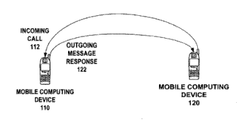
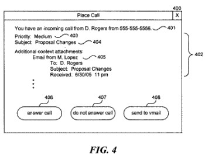
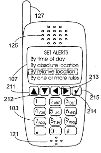

Like people to be able to spell out a word on their phone, and have that associated with a Plain Old Telephone Service line, as an alternative to an 800 number? I wouldn’t mind having a single phone number could be used for either my mobile phone, or my landline – with me chosing which phone calls go to. Those are two of the subjects of a number of new patent applications involving mobile phones.

[Method and device for enabling message responses to incoming phone calls](http://appft1.uspto.gov/netacgi/nph-Parser?Sect1=PTO1&Sect2=HITOFF&d=PG01&p=1&u=%2Fnetahtml%2FPTO%2Fsrchnum.html&r=1&f=G&l=50&s1=%2220070036286%22.PGNR.&OS=DN/20070036286&RS=DN/20070036286)
Palm, Inc. (2007003628)

Allows for text messages to automatically respond to pre-specified calls from particular callers.

[Personalized telephone number](http://appft1.uspto.gov/netacgi/nph-Parser?Sect1=PTO1&Sect2=HITOFF&d=PG01&p=1&u=%2Fnetahtml%2FPTO%2Fsrchnum.html&r=1&f=G&l=50&s1=%2220070036288%22.PGNR.&OS=DN/20070036288&RS=DN/20070036288)
Lucent Technologies Inc. (20070036288)

An improvement on an “800” number, this allows a person or business to be given a number, which can vary in length, and be used to spell out a word (with possibly some additional numbers) on a phone touchpad, with the call being forwarded to a Plain Old Telephone Service (POTS) number.

[Augmenting a call with context](http://appft1.uspto.gov/netacgi/nph-Parser?Sect1=PTO1&Sect2=HITOFF&d=PG01&p=1&u=%2Fnetahtml%2FPTO%2Fsrchnum.html&r=1&f=G&l=50&s1=%2220070036284%22.PGNR.&OS=DN/20070036284&RS=DN/20070036284)
Microsoft (20070036284)

Picture sending someone an email that they can receive on their phone. Amongst the options that they have when reading the email is to respond with a phone call.

If they make that choice, the phone screen may provide some information to the person receiving the call that it is in response to the email, and may show more information. The incoming call would look like this:

[System and Process for Switching Between Cell Phone and Landline Services](http://appft1.uspto.gov/netacgi/nph-Parser?Sect1=PTO1&Sect2=HITOFF&d=PG01&p=1&u=%2Fnetahtml%2FPTO%2Fsrchnum.html&r=1&f=G&l=50&s1=%2220070037550%22.PGNR.&OS=DN/20070037550&RS=DN/20070037550)
(20070037550)

A docking station could be used to decide whether it should route a current call through a cell phone or through a land line service such as a POTS service or a voice over IP or VOIP service.

[Mobile communication devices, systems, and methods for dynamic update of map data](http://appft1.uspto.gov/netacgi/nph-Parser?Sect1=PTO1&Sect2=HITOFF&d=PG01&p=1&u=%2Fnetahtml%2FPTO%2Fsrchnum.html&r=1&f=G&l=50&s1=%2220070037558%22.PGNR.&OS=DN/20070037558&RS=DN/20070037558)
Giga-Byte Communications Inc. and Giga-Byte Technology Co., LTD. (20070037558)

A smart phone could contain map information with points of interest included on the map. This system enables the map to be updated, and new points of interest added dynamically.

[Mobile communication terminal](http://appft1.uspto.gov/netacgi/nph-Parser?Sect1=PTO1&Sect2=HITOFF&d=PG01&p=1&u=%2Fnetahtml%2FPTO%2Fsrchnum.html&r=1&f=G&l=50&s1=%2220070038952%22.PGNR.&OS=DN/20070038952&RS=DN/20070038952)
Nokia (20070038952)

An improved Web or Wap history navigation system for smart phones and handhelds with internet access.

[Methods and apparatus for controlling cellular and portable phones](http://appft1.uspto.gov/netacgi/nph-Parser?Sect1=PTO1&Sect2=HITOFF&d=PG01&p=1&u=%2Fnetahtml%2FPTO%2Fsrchnum.html&r=1&f=G&l=50&s1=%2220070037605%22.PGNR.&OS=DN/20070037605&RS=DN/20070037605)
(20070037605)

The abstract describes this one well:

> A system for controlling the magnitude or timing of the alert signal (e.g. ringing) generated to notify the user of a portable (e.g. cellular) telephone of an incoming phone call.
>
> Data values that indicate the status of the telephone are processed to control the character of the alert signals.
>
> These data values may include position data indicating the absolute location of the phone or the relative location of the phone with respect to another object, the level of ambient light or sound in the vicinity of the telephone, the time of day, the movement of the telephone, and/or whether the telephone is being held by the user.

[Method, apparatus, and computer program product providing image controlled playlist generation](http://appft1.uspto.gov/netacgi/nph-Parser?Sect1=PTO1&Sect2=HITOFF&d=PG01&p=1&u=%2Fnetahtml%2FPTO%2Fsrchnum.html&r=1&f=G&l=50&s1=%2220070038671%22.PGNR.&OS=DN/20070038671&RS=DN/20070038671)
Nokia (20070038671)

For a camera enabled handheld device, this allows a person to take a picture and have the system create a playlist of audio files based upon a mood conveyed by the image. Here’s a snippet from the patent filing:

> [0019] With particular reference to the extraction of the attribute of an average color of an image, a mapping is performed between the extracted attribute and the available audio files, for example those stored in memory 231, so as to generate a playlist as illustrated in step 3 of FIG. 1.
>
> In an exemplary embodiment, a default mapping is provided that maps a color attribute of an image to a genre of music. For example, bright images composed of light colors may cause the selection of songs for a playlist that have slower tempos and are more ambient than songs which would be selected in the case of a darker picture.
>
> An example of one such mapping is as follows: TABLE-US-00001 Image Attribute Song Genre Black, dark images -> Aggressive, fast tempo music White, yellow, light, bright -> Slow, relaxed, classical, etc. music Blue -> Blues music Purple -> Funk, soul music Pink -> Glam rock

I’m going to have to see this one in action.
