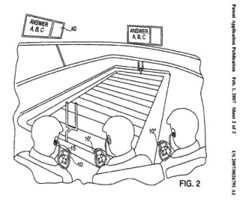
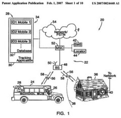

Imagine having a stadium scoreboard in your hand, that you can interact with, or the ability to create “augmented reality” games with your camera phone.

Would you like an early warning device for when the school bus approaches, or the ability to custom tailor your own smart codes for SMS based services?

How about a personal GPS navigation device that adjust to when you are walking or driving and can show you the kinds of points of interest in your surroundings that you specify in advance, as it helps lead you to your predetermined destination?

Would you accept email advertisements on your phone if you could pre-register for them and viewing them earns you some kind of discount towards a purchase? How about using your phone as if it were a debit card?

If you could access a smarter directory assistance from your phone that worked with information on the web, would you use it? Or a mobile search system that let you find multimedia on the web, and play it on your phone?

A company that provides a “next generation mobile search” unveils a service that provides richer content summaries instead of snippets in search results.

And, Microsoft gives us a glimpse at a display advertisment system that could be used in a wide range of contexts to provide custom and personalized ads to people, including streaming additional information to their phones.

Here are some of the mobile patent applications published this last week:

[Method and apparatus for interactive audience participation at a live entertainment event](http://appft1.uspto.gov/netacgi/nph-Parser?Sect1=PTO1&Sect2=HITOFF&d=PG01&p=1&u=%2Fnetahtml%2FPTO%2Fsrchnum.html&r=1&f=G&l=50&s1=%2220070026791%22.PGNR.&OS=DN/20070026791&RS=DN/20070026791)
(2007002679)

Allows for audience members to actively participate with each other at live sporting events. An interactive device is provided which can send users promotional messages and allow them to participate in polls and receive information about what they are watching. Things like scores, trivia, trivia contest, and traffic and weather reports can be shown to people using the devices.

[Method and device for augmented reality message hiding and revealing](http://appft1.uspto.gov/netacgi/nph-Parser?Sect1=PTO1&Sect2=HITOFF&d=PG01&p=1&u=%2Fnetahtml%2FPTO%2Fsrchnum.html&r=1&f=G&l=50&s1=%2220070024527%22.PGNR.&OS=DN/20070024527&RS=DN/20070024527)
Nokia (2007002152)

There are a number of augmented reality games that people can play using mobile devices. Some pages about these games:

- [MIT Handheld Augmented Reality Simulations](https://education.mit.edu/)
- [Human PacMan hits real city streets](https://www.newscientist.com/article/dn6689-human-pacman-hits-real-city-streets/)
- The Invisible Train

Nokia’s process enables people to use mobile devices equiped with cameras to take pictures, and add hidden text to them that can be unhidden during the course of game play. The kinds of games that could be played using this method are ones like [paper chase](https://en.wikipedia.org/wiki/Paper_Chase_(game)) or a [Scavenger hunt](https://en.wikipedia.org/wiki/Scavenger_hunt).

[Personal short codes for SMS](http://appft1.uspto.gov/netacgi/nph-Parser?Sect1=PTO1&Sect2=HITOFF&d=PG01&p=1&u=%2Fnetahtml%2FPTO%2Fsrchnum.html&r=1&f=G&l=50&s1=%2220070026878%22.PGNR.&OS=DN/20070026878&RS=DN/20070026878)
Cingular Wireless (20070026878)

There are a number of services that require sending an SMS text message to receive a response, such as sports scores, stock quotes, and others. This system allows users to create their own individualized lists of personal short codes to access those services through a mobile telephone, PDA, or laptop, or via a web browser. They could also be used to send messages to a predefined list of others through email or SMS or phone calls.

[School bus tracking and notification system](http://appft1.uspto.gov/netacgi/nph-Parser?Sect1=PTO1&Sect2=HITOFF&d=PG01&p=1&u=%2Fnetahtml%2FPTO%2Fsrchnum.html&r=1&f=G&l=50&s1=%2220070024440%22.PGNR.&OS=DN/20070024440&RS=DN/20070024440)
Lucent Technologies (2007002444)

A school bus tracking system where the buses each have their own mobile station and ID. The ID’s and station phone numbers are contained in a tracking application/database. Parents can send messages with the ID to the tracking program, and when the bus comes within a certain radius, the parent is notificed. The system could be used to track other vehicles, objects (such as packages), and/or people.

[A Personal GPS Navigation Device](http://appft1.uspto.gov/netacgi/nph-Parser?Sect1=PTO1&Sect2=HITOFF&d=PG01&p=1&u=%2Fnetahtml%2FPTO%2Fsrchnum.html&r=1&f=G&l=50&s1=%2220070027628%22.PGNR.&OS=DN/20070027628&RS=DN/20070027628)
Palmtop Software B.V. (20070027628)

A personal GPS navigation device which can show a map, the position of the device on the map, a GPS signal strength, speed traveling, and icons which indication Points of Interest. When it calculates the speed of the device, it can use that to change the zoom of the map. It can also change the map zoom as it approaches route situations requiring complex decisions.

[Advertisement method using mobile telephone electronic mail](http://appft1.uspto.gov/netacgi/nph-Parser?Sect1=PTO1&Sect2=HITOFF&d=PG01&p=1&u=%2Fnetahtml%2FPTO%2Fsrchnum.html&r=1&f=G&l=50&s1=%2220070027748%22.PGNR.&OS=DN/20070027748&RS=DN/20070027748)
First Dream Co., LTD. (20070027748)

This allows people to sign up to receive advertisements on their handheld devices through email from stores that they have registered with, and accumulate points towards the purchase of something from those stores everytime they view an advertisement. I get the sense that I’m missing some aspects of this patent filing while reading it. It appears to have originally been written in Japanese, and translated into English, and something seems to have been lost – like why it focuses upon mobile phones instead of all computers. The images that come with it do show mobile phone sized screen shots a registration system. Might the sending of the ads be triggered by being within a certain distance from the stores showing the ads?

[System and process for remote payments and transactions in real time by mobile telephone](http://appft1.uspto.gov/netacgi/nph-Parser?Sect1=PTO1&Sect2=HITOFF&d=PG01&p=1&u=%2Fnetahtml%2FPTO%2Fsrchnum.html&r=1&f=G&l=50&s1=%2220070027803%22.PGNR.&OS=DN/20070027803&RS=DN/20070027803)
Mobipay International, S.A. (20070027803)

A very simplified explanation of what is described in this patent application; imagine using your mobile phone as if it were a debit card, and entering a PIN number to make a purchase at a store, or online, or at a vending machine.

[Information-paging delivery](http://appft1.uspto.gov/netacgi/nph-Parser?Sect1=PTO1&Sect2=HITOFF&d=PG01&p=1&u=%2Fnetahtml%2FPTO%2Fsrchnum.html&r=1&f=G&l=50&s1=%2220070027842%22.PGNR.&OS=DN/20070027842&RS=DN/20070027842)
SBC Knowledge Ventures L.P. (20070027842)

A juiced up directory assistance process for a mobile phone that has internet connectivity, where the type of information that you request could be more than just what we think of when we think of directory assistance. An example, from the document:

> For example, when a caller asks for “Motel 6” reservations, a reservations web page might include room rates and availability. As another example, when a caller asks for information on a baseball game, a reservations web page might include game time, seat locations, etc. The IVR may parse the reservation page and conduct a verbal reservation session between the user and an IVR or live agent for the hotel front desk or the ticket concessionaire for the ball game. IVR sessions (IVR options/queries and user response/selections) can be stored in the database or SIM card as well for access for return sessions to the same vendor. For example, a second call to the same hotel or ticket concessionaire IVR can be directed by the IVR responses from the prior session. The responses can read back to the user and overridden as necessary for selections that have changed.

[System and method for searching multimedia and download the search result to mobile devices](http://appft1.uspto.gov/netacgi/nph-Parser?Sect1=PTO1&Sect2=HITOFF&d=PG01&p=1&u=%2Fnetahtml%2FPTO%2Fsrchnum.html&r=1&f=G&l=50&s1=%2220070027857%22.PGNR.&OS=DN/20070027857&RS=DN/20070027857)
(20070027857)

Enables people to search for multimedia files on the web such as audio and video and images, and download those to their mobile devices.

[Processing and sending search results over a wireless network to a mobile device](http://appft1.uspto.gov/netacgi/nph-Parser?Sect1=PTO1&Sect2=HITOFF&d=PG01&p=1&u=%2Fnetahtml%2FPTO%2Fsrchnum.html&r=1&f=G&l=50&s1=%2220070027839%22.PGNR.&OS=DN/20070027839&RS=DN/20070027839)
JAMTAP LTD. (20070027839)

Developing what they call a “next generation mobile searching technology,” Jamtap is supposedly in stealth mode. The patent describes delivery of content summaries of search results that are richer than the snippets you might see from something like Google Mobile search. The kinds and content of summaries presented may be based the kind of mobile device requesting the information.

[Smart search for accessing options](http://appft1.uspto.gov/netacgi/nph-Parser?Sect1=PTO1&Sect2=HITOFF&d=PG01&p=1&u=%2Fnetahtml%2FPTO%2Fsrchnum.html&r=1&f=G&l=50&s1=%2220070027852%22.PGNR.&OS=DN/20070027852&RS=DN/20070027852)
Microsoft (20070027852)

Describes a method for “smart searching” which would possibly make it easier to enter searches on a limited keyboard of a mobile device, though the focus of the abstract, and a good part of the patent application appears to be associating keywords with paid advertisements that a searcher could see, and might be paid to view.

[Interactive display device, such as in context-aware environments](http://appft1.uspto.gov/netacgi/nph-Parser?Sect1=PTO1&Sect2=HITOFF&d=PG01&p=1&u=%2Fnetahtml%2FPTO%2Fsrchnum.html&r=1&f=G&l=50&s1=%2220070024580%22.PGNR.&OS=DN/20070024580&RS=DN/20070024580)
Microsoft (20070024580)

This one reminds me some of the advertisements from the movie Minority Report where displays provided personalized information to shoppers. In addition to showing information to people walking past the displays, this method could also send information to their handheld phones or PDAs. The scope of use that they describe seems on the ambitious side:

> While the description provides some examples in the context of a bank branch, the techniques described herein are not limited to banking contexts and, rather, can be applied in any type of environment associated with computing devices, including environments associated with other commercial activities besides banking, home environments, environments at sporting events, retail environments, manufacturing environments, workplace environments, customer service environments, entertainment environments, science or research environments, educational environments, transportation environments, etc. Depending on the environment, increasing the richness and productivity of user experiences in accordance with some embodiments may improve customer retention, increase the value of individual customer relationships, reduce costs, result in higher sales, drive sales to new customers, and provide many other personal and/or commercial benefits.

While the display could be set up to customize ads for people that they don’t know, it could work with profiles of people that it does know and recognize.
