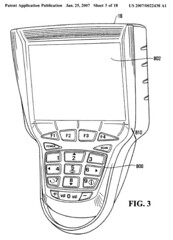
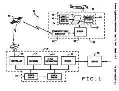
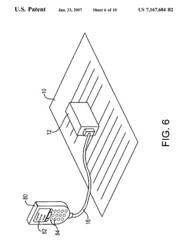

This week’s granted patents and published patent applications sees an old patented system from Google with a new reranking feature, a mobile sports tv, a multimodal wireless device from Microsoft, a cancelled internet access service for air travel which provided a geographic search service, a context aware user interface, wireless vending machine auditing, mobile scanning, and a platform for mobile services.

**Patent Applications**

[System and Methods for Perfoming Online Purchase of Delivery of Service to a Handheld Device](http://appft1.uspto.gov/netacgi/nph-Parser?Sect1=PTO1&Sect2=HITOFF&d=PG01&p=1&u=%2Fnetahtml%2FPTO%2Fsrchnum.html&r=1&f=G&l=50&s1=%2220070022438%22.PGNR.&OS=DN/20070022438&RS=DN/20070022438)
4121856 Canada Inc. (20070022438)

Imagine attending a sporting event, and having a handheld device that you can watch the race or the game upon from the stands, and from your tailgate party in the parking lot. That’s part of the premise behind Kangaroo.tv.

[Methods and apparatus for providing search results in response to an ambiguous search query](http://appft1.uspto.gov/netacgi/nph-Parser?Sect1=PTO1&Sect2=HITOFF&d=PG01&p=1&u=%2Fnetahtml%2FPTO%2Fsrchnum.html&r=1&f=G&l=50&s1=%2220070022101%22.PGNR.&OS=DN/20070022101&RS=DN/20070022101)
Google (20070022101)

Google was granted [a patent](https://patents.google.com/patent/US7136854B2/en) under the same name last November, and this newer version is a continuation of the old one which describes using numeric keypad entries to stand for letters of a query term in a search. What the new filing adds is a reranking of search result received by a searcher based upon the language that they use.

[Multimodal note taking, annotation, and gaming](http://appft1.uspto.gov/netacgi/nph-Parser?Sect1=PTO1&Sect2=HITOFF&d=PG01&p=1&u=%2Fnetahtml%2FPTO%2Fsrchnum.html&r=1&f=G&l=50&s1=%2220070022372%22.PGNR.&OS=DN/20070022372&RS=DN/20070022372)
Microsoft (20070022372)

Describes a portable device that accepts many different input types, including optical character recognition, voice, handwriting, and visual, and allows for those to be fused together into a single documents that incorporate the different forms of input.

[Apparatus and methods for providing geographically oriented internet search results to mobile users](http://appft1.uspto.gov/netacgi/nph-Parser?Sect1=PTO1&Sect2=HITOFF&d=PG01&p=1&u=%2Fnetahtml%2FPTO%2Fsrchnum.html&r=1&f=G&l=50&s1=%2220070022097%22.PGNR.&OS=DN/20070022097&RS=DN/20070022097)
The Boeing Company (20070022097)

Appears to have offered geographic related search capabilities based upon the destination of a commercial flight. The [Connexion service](http://appft1.uspto.gov/netacgi/nph-Parser?Sect1=PTO1&Sect2=HITOFF&d=PG01&p=1&u=%2Fnetahtml%2FPTO%2Fsrchnum.html&r=1&f=G&l=50&s1=%2220070022097%22.PGNR.&OS=DN/20070022097&RS=DN/20070022097) offered by Boeing is mentioned here, which Boeing was offering, and then abandoned.

[Context aware task page](http://appft1.uspto.gov/netacgi/nph-Parser?Sect1=PTO1&Sect2=HITOFF&d=PG01&p=1&u=%2Fnetahtml%2FPTO%2Fsrchnum.html&r=1&f=G&l=50&s1=%2220070022380%22.PGNR.&OS=DN/20070022380&RS=DN/20070022380)
Microsoft (20070022380)

A mobile device might show different types of tasks on a context sensitive menu, such as one set of applications when it senses that its user is driving, and another set when it can determine from a calendar that its user is on vacation.

**Granted Patents**

[System, method and apparatus for vending machine wireless audit and cashless transaction transport](https://patents.google.com/patent/US7167892B2/en)
Isochron, Inc. (7,167,892)

Auditing the use of a vending machine with a wireless device. There’s a nice business school case study of the company behind the technology.

[Portable document scan accessory for use with a wireless handheld communications device](https://patents.google.com/patent/US7167604B2/en)
Hewlett-Packard (7,167,604)

A scanner accessory that can be used with a mobile handheld device such as a smart phone or PDA, and possibly even integrated into the device.

[Mobile application service container](https://patents.google.com/patent/US7167861B2/en)
Nokia (7,167,861)

A programmatic framework that can be used to make it easier to develop and use different services for mobile devices. It includes mobile service resource application programming interfaces as well as a resource driver manager and mobile service resource drivers.
