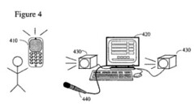
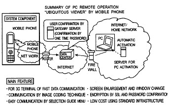

Quite a few new granted patents and published patent applications this week in the world of mobile devices. I’ve pulled out a number of the odder ones, and the more interesting.

Amongst those are a search platform that can use plugins to search locally and on the web, a way to remotely control a personal computer from a mobile phone using a cursor, peer to peer advertising via phones, a method of creating collaborative music using phones, and some others that stood out.

**Granted Patents**

[System and method of music generation](http://patft.uspto.gov/netacgi/nph-Parser?Sect1=PTO1&Sect2=HITOFF&d=PALL&p=1&u=%2Fnetahtml%2FPTO%2Fsrchnum.htm&r=1&f=G&l=50&s1=7,164,906.PN.&OS=PN/7,164,906&RS=PN/7,164,906)
Magix AG (7,164,906)

A way for one or more folks to create music together using mobile phones, and other portable electronic devices as instruments. Specialized music creation software would be on the phones enabling people to create songs together.

[Optical user interface for controlling portable electric device](https://patents.google.com/patent/US7164411B2/en)
Nokia (7,164,411)

An optical user interface that can control a pointer on a mobile phone screen, and which can also record fingerprints for user authentication purposes.

[Apparatus and methods for detecting emotions in the human voice](https://patents.google.com/patent/US7165033B1/en)
(7,165,033)

I’d summarize this one, but I appreciate the abstract that came with it enough to reproduce it here:

> The present invention relates to an apparatus for monitoring emotional states of an individual by using a voice analysis of said individual.
>
> The apparatus comprises a voice analyzer operative to input speech specimens, comprising an analog to digital converter operative to perform a digitization process of analog audio vocal segments, and a general emotion reporter, operative to produce an indication of any kind for the monitored general emotions.
>
> According to preferred embodiment of the present invention, the speech specimens are provided over the telephone to the voice analyzer and the report of the subject’s emotional state includes a “love detection” report based on the individual’s sub-conscious emotional state.

That might be fun to have on your phone. Wonder why they chose to detect love instead of something like lies?

[Mobile lottery games over a wireless network](http://patft.uspto.gov/netacgi/nph-Parser?Sect1=PTO1&Sect2=HITOFF&d=PALL&p=1&u=%2Fnetahtml%2FPTO%2Fsrchnum.htm&r=1&f=G&l=50&s1=7,163,459.PN.&OS=PN/7,163,459&RS=PN/7,163,459)
Nokia (7,163,459)

Real time scratch-off lottery like games over a wireless network. I can’t say for certain that this is the first instance of online gambling made expressly for use on a mobile phone, but it could be.

**Patent Applications**

[Method, apparatus and computer program product providing an application integrated mobile device search solution using context information](http://appft1.uspto.gov/netacgi/nph-Parser?Sect1=PTO1&Sect2=HITOFF&d=PG01&p=1&u=%2Fnetahtml%2FPTO%2Fsrchnum.html&r=1&f=G&l=50&s1=%2220070016570%22.PGNR.&OS=DN/20070016570&RS=DN/20070016570)
Nokia (20070016570)

While web browsers can be used on some phones to search the web through something like Google, they aren’t necessarily the idea interface to search for information on the phone itself.

This patent filing describes a search platform to use that would allow for search plugins to find local files such as image, video or audio files, as well as ones that might be tied to search services from sources like Google and Yahoo. Made me think of the sections of Steve Yegge’s most recent post, [The Pinnochio Problem](http://steve-yegge.blogspot.com/2007/01/pinocchio-problem.html), on the importance of plugins in software.

[Method for providing phone book using business card recognition in mobile communication terminal and mobile communication terminal using the method](http://appft1.uspto.gov/netacgi/nph-Parser?Sect1=PTO1&Sect2=HITOFF&d=PG01&p=1&u=%2Fnetahtml%2FPTO%2Fsrchnum.html&r=1&f=G&l=50&s1=%2220070013769%22.PGNR.&OS=DN/20070013769&RS=DN/20070013769)
Samsung (20070013769)

Business card recognition software for your phone that would take information from a business card and create a phone book entry which could then be used to dial a number from the card. Eliminating button pushing seems to be big in mobile patent filings.

[Mobile phone and mobile phone control method](http://appft1.uspto.gov/netacgi/nph-Parser?Sect1=PTO1&Sect2=HITOFF&d=PG01&p=1&u=%2Fnetahtml%2FPTO%2Fsrchnum.html&r=1&f=G&l=50&s1=%2220070015534%22.PGNR.&OS=DN/20070015534&RS=DN/20070015534)
Kabushiki Kaisha Toshiba (20070015534)

Remotely and securely operate a PC with a mobile phone, even through a corporate firewall.

[Method and system for peer-to-peer advertising between mobile communication devices](http://appft1.uspto.gov/netacgi/nph-Parser?Sect1=PTO1&Sect2=HITOFF&d=PG01&p=1&u=%2Fnetahtml%2FPTO%2Fsrchnum.html&r=1&f=G&l=50&s1=%2220070016921%22.PGNR.&OS=DN/20070016921&RS=DN/20070016921)
Aztec Systems, Inc.(20070016921)

Impression-based advertising before and after calls, Instant Messages, and other communications.

[Pushing Rich Content Information to Mobile Devices](http://appft1.uspto.gov/netacgi/nph-Parser?Sect1=PTO1&Sect2=HITOFF&d=PG01&p=1&u=%2Fnetahtml%2FPTO%2Fsrchnum.html&r=1&f=G&l=50&s1=%2220070016690%22.PGNR.&OS=DN/20070016690&RS=DN/20070016690)
Microsoft (20070016690)

A mobile gateway that transforms digital content (email, calendar, contact, task, Web, notification, financial, sports data, etc.) to an appropriate form for the device that it is sending information to. This addresses what seems to be another common issue in mobile patent filings – finding a way around the incredible variety found in mobile phones, PDAs, and other handheld devices.
