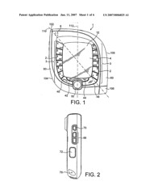
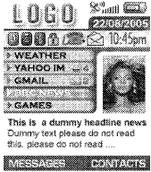

My second roundup of mobile patents and patent applications, with short summaries of what they have to offer. These are only some of the many patent documents published or granted this week involving mobile technology.

**Patent Applications**

[Casing for a handheld device](http://appft1.uspto.gov/netacgi/nph-Parser?Sect1=PTO1&Sect2=HITOFF&d=PG01&p=1&u=%2Fnetahtml%2FPTO%2Fsrchnum.html&r=1&f=G&l=50&s1=%2220070006825%22.PGNR.&OS=DN/20070006825&RS=DN/20070006825)
*Nokia (20070006825)*

I’m not sure why this was filed as a utility patent instead of a design patent, but I guess the folks at Nokia thought that having the speaker and microphone diagonal, from one corner to the opposite, was of some [value beyond ornamentation](https://www.uspto.gov/patents-getting-started/patent-basics/types-patent-applications/design-patent-application-guide#differ).

I’m not completely sold on that, but I’m including the patent application on this list so that I can use the image of this phone at the top of this post.

[Automatically sending rich contact information coincident to a telephone call](https://patents.google.com/patent/US20070010264A1/en)
*Microsoft (20070010264)*

This invention may not sound the death knell to exchanging business cards, but imagine being able to quickly and easily send your contact information from one mobile phone to another.

[System and method of applying databases to mobile sales](http://appft1.uspto.gov/netacgi/nph-Parser?Sect1=PTO1&Sect2=HITOFF&d=PG01&p=1&u=%2Fne
tahtml%2FPTO%2Fsrchnum.html&r=1&f=G&l=50&s1=%2220070011022%22.PGNR.&OS=DN/20070011022&RS=DN/20070011022)
*Singletap, Inc. (20070011022)*

You’re in a store, or on the lot of a car dealership, and you have a question for the salesperson about something you are looking at. The person waiting on you doesn’t know the answer, and pulls out their phone, where they can quickly check a database of “product features, specifications, comparisons, pricing, and inventory.” This is something I’d like to see most stores and car dealerships doing.

[Customized Mobile Device Interface System And Method](http://appft1.uspto.gov/netacgi/nph-Parser?Sect1=PTO1&Sect2=HITOFF&d=PG01&p=1&u=%2Fnetahtml%2FPTO%2Fsrchnum.html&r=1&f=G&l=50&s1=%2220070011610%22.PGNR.&OS=DN/20070011610&RS=DN/20070011610)
(20070011610)

I’m getting flashbacks of push style screen savers for your desktop with this invention, which would populate the screen of your phone with your choice of information when the device was on but idle. Anyone remember Microsoft’s [Active Desktop](https://en.wikipedia.org/wiki/Active_Desktop)?

Maybe it will work better on a mobile device. Especially if it would add some customization features that might not come with a phone otherwise.

[System and method for providing object-oriented tag assisted trading](http://appft1.uspto.gov/netacgi/nph-Parser?Sect1=PTO1&Sect2=HITOFF&d=PG01&p=1&u=%2Fnetahtml%2FPTO%2Fsrchnum.html&r=1&f=G&l=50&s1=%2220070011087%22.PGNR.&OS=DN/20070011087&RS=DN/20070011087)
*Nokia (20070011087)*

Using a radio frequency identification system or a visual barcode or tag reader, you could use a phone to identify a product and include it in an online auction, such as eBay or Yahoo. You could also use that reader to signal that you’ve received a product, and trigger payment for it.

[Sender location identifier, method of identifying a sender location and communication system employing the same](http://appft1.uspto.gov/netacgi/nph-Parser?Sect1=PTO1&Sect2=HITOFF&d=PG01&p=1&u=%2Fnetahtml%2FPTO%2Fsrchnum.html&r=1&f=G&l=50&s1=%2220070010258%22.PGNR.&OS=DN/20070010258&RS=DN/20070010258)
*Agere Systems Inc. (20070010258)*

Imagine an SMS system that includes location information in the message sent to someone. Why would you want to do this? According to the patent application:

> For example, users may “check-on” their loved ones by exchanging SMS messages with them and being able to determine their approximate location. This capability is of particular benefit when communicating with teenage children or caregivers of aging parents. Additionally, embodiments of the present invention may typically be implemented on existing communications hardware by employing software modifications, thereby adding both utility and value to an existing installed equipment base.

**Granted Patents**

[Single point notification for a mobile device](https://patents.google.com/patent/US7161496B2/en)
*Research In Motion Limited (7,161,496)*

The folks who make the [Blackberry](http://www.rim.net/) were awarded a patent for a light on a mobile device that changes colors to alert its user of a few different possibilities: it’s connected to another device, it has established a connection with a base station, it has received a message; and the charge on the battery is low. Not exciting, but I like the simplicity, which is part of the point, as well as power savings.

[Method and system of advertising in a mobile communication system](https://patents.google.com/patent/US7162226B2/en)
*Global Direct Management Corp. (7,162,226)*

This granted patent for requesting and receiving advertisements on a mobile phone seems pretty broad, and maybe more than a little obvious.

[Non-GPS navigation](https://patents.google.com/patent/US7162365B2/en)
*Intel Corporation (7,162,365)*

This patent describes a way for the user of a phone that isn’t global positioning satellite enabled to find their location based upon which cell towers they are, and have been connected to. Someone using this system might also be able to put in the phone number at the destination they are traveling to so that they can get address information about their destination location, and directions to where they are traveling.

[Apparatus and method for distributing electronic messages to a wireless data processing device using a multi-tiered queuing architecture](https://patents.google.com/patent/US7162513B1/en)
*Danger, Inc. (7,162,513)*

The subject of this patent is a single interface that can receive and store messages from multiple email accounts, and allow a user to view and respond to emails from those different services all from the same area. The emails remain on the external accounts, but can also be seen on this internal system, which makes it easier to maintain and use multiple email accounts.
