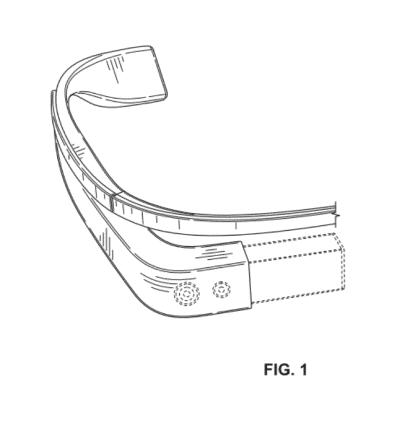

Google’s Project Glass seems to be moving closer and closer to reality, with the granting of 7 more patents today. Last week, I pointed out 4 patents related to the project in [Google Glasses Design Patents and Other Wearables](https://www.seobythesea.com/2012/05/google-glasses-design-patents-other-wearables/). Of those, 3 were design patents filed to protect the look and feel of the glasses, and the fourth patent described a way of using an infrared (IR) reflective surface on rings or gloves or even fingernails to provide input for the eyeglass display device. The patents granted today include only 1 design patent, and 6 patents that describe some of the more technical details about how Google’s Heads Up Display might work.

The First patent is a design patent from inventors who worked on the three design patents granted last week, Matthew Wyatt Martin and Maj Isabelle Olsson (Mitchell Joseph Heinrich was a co-inventor of one of the earlier three).

[Wearable display device section](http://patft.uspto.gov/netacgi/nph-Parser?Sect1=PTO1&Sect2=HITOFF&d=PALL&p=1&u=%2Fnetahtml%2FPTO%2Fsrchnum.htm&r=1&f=G&l=50&s1=D660,341.PN.&OS=PN/D660,341&RS=PN/D660,341)
Invented by Maj Isabelle Olsson and Matthew Wyatt Martin
Assigned to Google
Granted May 22, 2012
Filed: October 26, 2011
CLAIM: The ornamental design for a wearable display device section, as shown and described.

Some of the comments that I’ve seen from people about Google Glasses is the concern that people might walk into the side of a building or in front of a bus while watching a virtual world through Google Glasses. This first patent describes how a pair of glasses like these might instead act to augment and improve our perception of the real world around us by telling us about sounds, the direction they are coming from, and the intensity of those sounds. We’re told that this application might also help people who might have difficulty hearing, or be hearing impaired.

Someone attempting to cross a street might not be aware of an approaching car honking to warn that pedestrian. The glasses could indicate the direction the honks are coming from, and how intense they might be to “indicate how close the oncoming car is to the user.”

[Displaying sound indications on a wearable computing system](http://patft.uspto.gov/netacgi/nph-Parser?Sect1=PTO1&Sect2=HITOFF&d=PALL&p=1&u=%2Fnetahtml%2FPTO%2Fsrchnum.htm&r=1&f=G&l=50&s1=8,183,997.PN.&OS=PN/8,183,997&RS=PN/8,183,997)
Invented by Adrian Wong and Xiaoyu Miao
Assigned to Google
US Patent 8,183,997
Granted May 22, 2012
Filed: November 14, 2011

Abstract

> Example methods and systems for displaying one or more indications that indicate (i) the direction of a source of sound and (ii) the intensity level of the sound are disclosed. A method may involve receiving audio data corresponding to sound detected by a wearable computing system.
>
> Further, the method may involve analyzing the audio data to determine both (i) a direction from the wearable computing system of a source of the sound and (ii) an intensity level of the sound. Still further, the method may involve causing the wearable computing system to display one or more indications that indicate (i) the direction of the source of the sound and (ii) the intensity level of the sound.

There are a number of different types of sensors that might be used with a pair of glasses, and those might be part of a nose bridge, primarily because it’s part of the glasses that are forward facing (as opposed to the sidearms of the glasses. Some of the different types of sensors could include a video camera, a sonar sensor, an ultrasonic, and possibly a microphone that might monitor patterns associated with breathing.

A sensor between two sides of a nose bridge might also recognize the appearance of a nose between them, and turn on the glasses when that happens.

The patent mentions the possibility of finger-operable touch pad input devices on the sidearms of the glasses. As for the display, it could be:

> …a transparent or semi-transparent matrix display, such as an electroluminescent display or a liquid crystal display, one or more waveguides for delivering an image to the user’s eyes, or other optical elements capable of delivering an in focus near-to-eye image to the user. A corresponding display driver may be disposed within the frame elements 104 and 106 for driving such a matrix display. Alternatively or additionally, a laser or LED source and scanning system could be used to draw a raster display directly onto the retina of one or more of the user’s eyes.

[Nose bridge sensor](http://patft.uspto.gov/netacgi/nph-Parser?Sect1=PTO1&Sect2=HITOFF&d=PALL&p=1&u=%2Fnetahtml%2FPTO%2Fsrchnum.htm&r=1&f=G&l=50&s1=8,184,067.PN.&OS=PN/8,184,067&RS=PN/8,184,067)
Invented by Max Braun, Ryan Geiss, Harvey Ho, Thad Eugene Starner, Gabriel Taubman
Assigned to Google
US Patent 8,184,067
Granted May 22, 2012
Filed: July 20, 2011

Abstract

> Systems and methods for selecting an action associated with a power state transition of a head-mounted display (HMD) in the form of eyeglasses are disclosed. A signal may be received from a sensor on a nose bridge of the eyeglasses indicating if the HMD is in use. Based on the received signal, a first powers state for the HMD may be determined. Responsive to the determined first power state, an action associated with a power state transition of the HMD from an existing power state to the first power state may be selected.
>
> The action may be selected from among a plurality of actions associated with a plurality of state transitions. Also, the action may be a sequence of functions performed by the HMD including modifying an operating state of a primary processing component of the HMD and a detector of the HMD configured to image an environment.

The next patent describes some of the display aspects of these devices, as they might be implemented in “helmet, contact lens, goggles, and glasses.” It tells us about things such as how foreground and background images might be displayed, with the foreground images in sharper focus than the background images.

[Processing objects for separate eye displays](http://patft.uspto.gov/netacgi/nph-Parser?Sect1=PTO1&Sect2=HITOFF&d=PALL&p=1&u=%2Fnetahtml%2FPTO%2Fsrchnum.htm&r=1&f=G&l=50&s1=8,184,068.PN.&OS=PN/8,184,068&RS=PN/8,184,068)
Invented by Charles C. Rhodes and Babak Amirparviz
Assigned to Google
US Patent 8,184,068
Granted May 22, 2012
Filed: August 23, 2011

Abstract

> Disclosed are embodiments for methods and devices for displaying images. In some example embodiments, methods may include receiving data corresponding to an image with a processor. The image data may include at least one image object. In additional example embodiments, each image object may be assigned to either a foreground image set or a background image set using a processor, for example. An example embodiment may also include rendering a first display image based on at least the foreground image set. The first display image may include the objects assigned to the foreground image set.
>
> Additionally, the objects assigned to the foreground image set may be in focus in the first display image. Embodiments may also include rendering a second display image based on at least the background image set. The second display image may include the objects assigned to the background image set. Additionally, the objects assigned to the background image set may be in focus in the second display image.

When we’re looking forward and we have a wide field of vision in front of us, our actual gaze might be directed towards something specifically within that field of vision. The glasses might track where we are actually looking to prioritize what is within that visual area. Head movements, such as turning our heads to the right or left, might also inform the glasses of a change of visual attention, and audio samples of ambient audio miught also trigger an application that might be based upon direction of attention.

We’re told that this might be used with a number of different applications, but not given any examples of what those might be.

[Systems and methods for adaptive transmission of data](http://patft.uspto.gov/netacgi/nph-Parser?Sect1=PTO1&Sect2=HITOFF&d=PALL&p=1&u=%2Fnetahtml%2FPTO%2Fsrchnum.htm&r=1&f=G&l=50&s1=8,184,069.PN.&OS=PN/8,184,069&RS=PN/8,184,069)
Invented by Charles C. Rhodes
Assigned to Google
US Patent 8,184,069
Granted May 22, 2012
Filed: June 20, 2011

Abstract

> The present disclosure describes systems and methods for transmitting, receiving, and displaying data. The systems and methods may be directed to providing a constant or substantially constant data transmission rate (e.g., frame rate per second) to a device and controlling bandwidth by presenting information directed to an area of interest to a user.
>
> Bandwidth can be lowered, for example by presenting high resolution data directed to the area of interest to the user (e.g., an area to which the user is looking or “gazing” using a heads-up display), and lower resolution data directed to other areas. Data can be transmitted and received at a constant frame rate or substantially constant frame rate, and gaze direction and progressive compression/decompression techniques can be used to transmit data focused on areas directed to an area of interest to the user.

An accelerometer system, including a gyroscope and/or a compass built into the glasses might be able to understand the kinds of activities that a wearer is engaged in, such as “sitting, walking, running, traveling upstairs, and traveling downstairs.” The user interface shown to someone might vary based upon their activity.

Someone standing still might be more likely to find a data intensive display more useful than someone walking. Someone running might want an interface that may also include some statistics about their run.

[Method and system for selecting a user interface for a wearable computing device](http://patft.uspto.gov/netacgi/nph-Parser?Sect1=PTO1&Sect2=HITOFF&d=PALL&p=1&u=%2Fnetahtml%2FPTO%2Fsrchnum.htm&r=1&f=G&l=50&s1=8,184,070.PN.&OS=PN/8,184,070&RS=PN/8,184,070)
Invented by Gabriel Taubman
Assigned to Google
US Patent 8,184,070
Granted May 22, 2012
Filed: July 6, 2011

Abstract

> Example methods and systems for selecting a user interface for a wearable computing device are disclosed. An accelerometer system may determine a user activity of a user wearing a wearable computing device. Based on the user activity determined by the accelerometer system, the wearable computing device may select a user interface for the wearable computing device such that the user interface is appropriate for the determined user activity.

This last patent focuses primarily upon data transmission and reception of a wearable computing device, as well as how different body movements, audio commands, viewed gestures, and even touch commands might be used to send and receive data.

[Wireless directional identification and subsequent communication between wearable electronic devices](http://patft.uspto.gov/netacgi/nph-Parser?Sect1=PTO1&Sect2=HITOFF&d=PALL&p=1&u=%2Fnetahtml%2FPTO%2Fsrchnum.htm&r=1&f=G&l=50&s1=8,184,983.PN.&OS=PN/8,184,983&RS=PN/8,184,983)
Invented by Harvey Ho, Babak Amirparviz, Luis Ricardo Prada Gomez, and Thad Eugene Starner
Assigned to Google
US Patent 8,184,983
Granted May 22, 2012
Filed: June 9, 2011

Abstract

> Disclosed are methods, devices, and systems for exchanging information between a first wearable electronic device and one of a second wearable electronic device and an account at a remote computing device associated with a user of the second wearable electronic device. The first wearable electronic device intermittently emits directed electromagnetic radiation comprising a beacon signal, and receives, via a receiver coupled to the first wearable electronic device, a signal from the second wearable electronic device identifying one of the second wearable electronic device and the account at the remote computing device.
>
> An input may then be detected at the first wearable electronic device, and in response to receiving the signal and detecting the input, the first wearable device may transmit additional data to one of the second wearable electronic device and the remote computing device associated with the second user.

## Takeaways

These patents don’t contain all the answers about how Google’s Project Glass might work, but they provide a number of interesting possibilities and alternatives. I’m somewhat surprised at the attention to details, like tracking the actual gaze of someone looking through the lenses of these devices instead of just tracking where they are pointed. Or enhancing someone’s ability to understand where sounds are coming from around them, as well as the intensity of those sounds.
