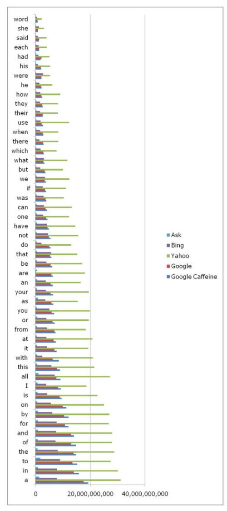

Which words show up most frequently on the Web? I’m not sure that question can be answered, but it’s something I’ve wondered for a while.

With a beta version of Google’s [future update](https://webmasters.googleblog.com/2009/08/help-test-some-next-generation.html), code named [Caffeine](http://web.archive.org/web/20090818052233/http://www2.sandbox.google.com:80/?) recently released to allow people to [experiment](https://www.mattcutts.com/blog/caffeine-update/) with, I thought I would do a few comparisons.

I found a few lists of the most common words in the English language and came up with a top 50 to see how frequently those were estimated to show up in Google, Yahoo, Bing, Ask, and Google Caffeine. Those are shown in a table and a chart below.

I’m not sure how informative this might be, even after looking at it. It’s not a very scientific test as well. There are a few reasons for that:

One of them is that when you search at one of the search engines, you’ll see a message that says something like:

*Results 1 – 100 of about xxx,xxx,xxx for [query term]*

From at least one previous Google patent filing, we can guess that the total amount (xxx,xxx,xxx) of results listed is likely only an estimate and not an actual count. That patent application told us that the number shown might be estimated based upon a look at anywhere from 2 percent to 10 percent of Google’s index. Since the Caffeine update is a complete infrastructure/database update, we may not even guess that the estimates are shown for the present day Google is created in the same way that the Caffeine updates might be.

We also can’t be sure that the numbers for Yahoo, Bing, and Ask are calculated in the same manner either.

Another is that while I may see one total count at Google for each term, if you looked up the same terms at Google, you might see different numbers because you may be searching at a different data center. There may be differences from one data center to another.

A third thing to keep in mind is that we aren’t searching the Web when we search at one of the search engines. Instead, we’re searching the indexes of the Web that the search engines have created. That means that some pages may be indexed more than once under different URLs, that many pages on the Web may not be included since they haven’t been indexed yet, and that words that might appear on the Web as text in images or which are presented in Flash or hidden behind javascript or log-in screens aren’t going to be counted.

The table below is the number of total results in Millions. I sorted them by how frequently the terms tested appeared in Google Caffeine.

<table border="1" cellpadding="1" cellspacing="1" width="500"><tr><td align="right">Query</td><td align="right">Google Caffeine</td><td align="right">Google</td><td align="right">Yahoo</td><td align="right">Bing</td><td align="right">Ask</td></tr><tr><td>a</td><td align="right">19,320</td><td align="right">17,570</td><td align="right">31,200</td><td align="right">7,800</td><td align="right">1,280</td></tr><tr><td>in</td><td align="right">15,850</td><td align="right">13,980</td><td align="right">30,200</td><td align="right">7,850</td><td align="right">900</td></tr><tr><td>to</td><td align="right">15,220</td><td align="right">13,500</td><td align="right">27,500</td><td align="right">8,920</td><td align="right">1,740</td></tr><tr><td>the</td><td align="right">14,850</td><td align="right">13,900</td><td align="right">28,800</td><td align="right">8,170</td><td align="right">747</td></tr><tr><td>of</td><td align="right">14,760</td><td align="right">12,990</td><td align="right">28,000</td><td align="right">7,310</td><td align="right">794</td></tr><tr><td>and</td><td align="right">13,980</td><td align="right">12,950</td><td align="right">28,000</td><td align="right">7,490</td><td align="right">789</td></tr><tr><td>for</td><td align="right">12,110</td><td align="right">10,720</td><td align="right">26,800</td><td align="right">7,740</td><td align="right">769</td></tr><tr><td>by</td><td align="right">12,080</td><td align="right">10,420</td><td align="right">27,000</td><td align="right">6,120</td><td align="right">956</td></tr><tr><td>on</td><td align="right">11,260</td><td align="right">9,940</td><td align="right">25,100</td><td align="right">5,610</td><td align="right">598</td></tr><tr><td>is</td><td align="right">9,580</td><td align="right">8,870</td><td align="right">22,600</td><td align="right">4,250</td><td align="right">699</td></tr><tr><td>I</td><td align="right">9,220</td><td align="right">8,250</td><td align="right">18,600</td><td align="right">3,860</td><td align="right">686</td></tr><tr><td>all</td><td align="right">9,110</td><td align="right">7,580</td><td align="right">27,200</td><td align="right">6,990</td><td align="right">1,020</td></tr><tr><td>this</td><td align="right">8,890</td><td align="right">7,870</td><td align="right">21,500</td><td align="right">5,790</td><td align="right">585</td></tr><tr><td>with</td><td align="right">8,490</td><td align="right">6,300</td><td align="right">20,900</td><td align="right">2,440</td><td align="right">636</td></tr><tr><td>it</td><td align="right">7,700</td><td align="right">6,860</td><td align="right">19,300</td><td align="right">4,190</td><td align="right">542</td></tr><tr><td>at</td><td align="right">7,410</td><td align="right">6,600</td><td align="right">20,800</td><td align="right">3,930</td><td align="right">552</td></tr><tr><td>from</td><td align="right">7,340</td><td align="right">6,920</td><td align="right">18,400</td><td align="right">4,160</td><td align="right">521</td></tr><tr><td>or</td><td align="right">7,030</td><td align="right">6,210</td><td align="right">19,500</td><td align="right">3,940</td><td align="right">567</td></tr><tr><td>you</td><td align="right">6,760</td><td align="right">5,930</td><td align="right">19,900</td><td align="right">5,080</td><td align="right">543</td></tr><tr><td>as</td><td align="right">6,460</td><td align="right">5,750</td><td align="right">15,400</td><td align="right">3,550</td><td align="right">884</td></tr><tr><td>your</td><td align="right">6,360</td><td align="right">5,470</td><td align="right">19,500</td><td align="right">3,790</td><td align="right">495</td></tr><tr><td>an</td><td align="right">6,260</td><td align="right">5,520</td><td align="right">16,500</td><td align="right">3,780</td><td align="right">489</td></tr><tr><td>are</td><td align="right">6,260</td><td align="right">5,760</td><td align="right">18,100</td><td align="right">163</td><td align="right">578</td></tr><tr><td>be</td><td align="right">6,120</td><td align="right">5,460</td><td align="right">17,100</td><td align="right">3,990</td><td align="right">473</td></tr><tr><td>that</td><td align="right">5,780</td><td align="right">5,260</td><td align="right">15,200</td><td align="right">5,650</td><td align="right">405</td></tr><tr><td>do</td><td align="right">5,500</td><td align="right">5,020</td><td align="right">13,000</td><td align="right">2,090</td><td align="right">410</td></tr><tr><td>not</td><td align="right">5,500</td><td align="right">4,870</td><td align="right">15,600</td><td align="right">4,550</td><td align="right">418</td></tr><tr><td>have</td><td align="right">4,870</td><td align="right">4,390</td><td align="right">14,500</td><td align="right">4,130</td><td align="right">468</td></tr><tr><td>one</td><td align="right">4,330</td><td align="right">3,870</td><td align="right">12,300</td><td align="right">2,750</td><td align="right">375</td></tr><tr><td>can</td><td align="right">4,150</td><td align="right">3,690</td><td align="right">13,300</td><td align="right">3,030</td><td align="right">367</td></tr><tr><td>was</td><td align="right">3,930</td><td align="right">3,610</td><td align="right">10,400</td><td align="right">2,960</td><td align="right">361</td></tr><tr><td>if</td><td align="right">3,810</td><td align="right">3,500</td><td align="right">11,200</td><td align="right">2,660</td><td align="right">345</td></tr><tr><td>we</td><td align="right">3,780</td><td align="right">3,370</td><td align="right">12,400</td><td align="right">3,430</td><td align="right">358</td></tr><tr><td>but</td><td align="right">3,610</td><td align="right">3,340</td><td align="right">10,100</td><td align="right">1,680</td><td align="right">327</td></tr><tr><td>what</td><td align="right">3,290</td><td align="right">2,850</td><td align="right">11,600</td><td align="right">3,080</td><td align="right">322</td></tr><tr><td>which</td><td align="right">3,020</td><td align="right">2,810</td><td align="right">7,750</td><td align="right">1,810</td><td align="right">300</td></tr><tr><td>there</td><td align="right">2,970</td><td align="right">2,770</td><td align="right">8,340</td><td align="right">1,450</td><td align="right">262</td></tr><tr><td>when</td><td align="right">2,850</td><td align="right">2,600</td><td align="right">8,360</td><td align="right">1,580</td><td align="right">306</td></tr><tr><td>use</td><td align="right">2,730</td><td align="right">2,250</td><td align="right">12,300</td><td align="right">1,830</td><td align="right">327</td></tr><tr><td>their</td><td align="right">2,690</td><td align="right">2,680</td><td align="right">8,210</td><td align="right">1,650</td><td align="right">254</td></tr><tr><td>they</td><td align="right">2,650</td><td align="right">2,440</td><td align="right">8,260</td><td align="right">1,670</td><td align="right">293</td></tr><tr><td>how</td><td align="right">2,470</td><td align="right">2,170</td><td align="right">9,050</td><td align="right">1,730</td><td align="right">289</td></tr><tr><td>he</td><td align="right">2,200</td><td align="right">2,040</td><td align="right">6,060</td><td align="right">1,420</td><td align="right">190</td></tr><tr><td>were</td><td align="right">2,130</td><td align="right">2,100</td><td align="right">5,320</td><td align="right">2,770</td><td align="right">203</td></tr><tr><td>his</td><td align="right">2,030</td><td align="right">1,880</td><td align="right">5,310</td><td align="right">858</td><td align="right">182</td></tr><tr><td>had</td><td align="right">1,860</td><td align="right">2,240</td><td align="right">5,090</td><td align="right">966</td><td align="right">191</td></tr><tr><td>each</td><td align="right">1,370</td><td align="right">1,290</td><td align="right">4,150</td><td align="right">1,090</td><td align="right">164</td></tr><tr><td>said</td><td align="right">1,210</td><td align="right">1,350</td><td align="right">4,060</td><td align="right">857</td><td align="right">128</td></tr><tr><td>she</td><td align="right">953</td><td align="right">882</td><td align="right">3,030</td><td align="right">1,200</td><td align="right">95</td></tr><tr><td>word</td><td align="right">780</td><td align="right">685</td><td align="right">2,280</td><td align="right">469</td><td align="right">80</td></tr></table>

I thought it would be helpful to present this information in a visually different manner as well. Therefore, the chart that follows is in reverse order of the table above.

As I mentioned above, this is a completely unscientific view.

It definitely won’t do is provide an idea of how large the databases might be for each of the search engines. However, according to a post at the Cuil blog on Bing (no longer available), there is a way to try to make that comparison. Still, it relies upon looking at the number of search results for rare terms rather than looking at the most frequently appearing words as I have.
