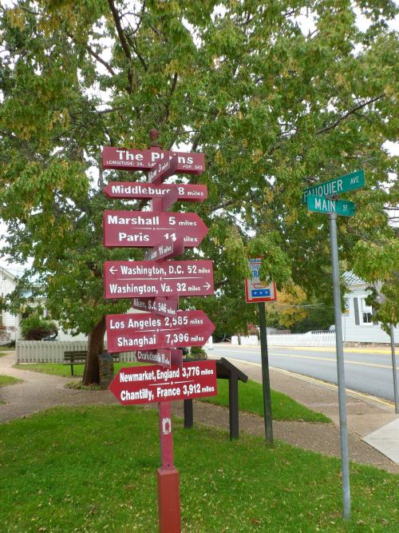

PageRank is a measure that stands for a probability that if someone starts on any page on the Web, and randomly clicks on links they find on pages, or gets bored every so often and teleports (yes, that is official technical search engineer jargon) to a random page, that eventually they will end up at a specific page.

Larry Page referred to this person clicking on links as following a “random surfer model.” The thing is, most people aren’t so random. It’s not like we’re standing at some street corner somewhere and just randomly set off in some direction. (OK, I confess that I do sometimes do just that, especially when faced with a sign like that below.)

Imagine someone from Google waking up in the middle of the night with the thought, “Hmmm. Maybe we’re not quite doing [PageRank](https://www.seobythesea.com/2011/12/10-most-important-seo-patents-part-1-the-original-pagerank-patent-application/) quite right. Maybe we should be doing things like paying attention to [where links appear](https://www.seobythesea.com/2011/12/10-most-important-seo-patents-part-3-classifying-web-blocks-with-linguistic-features/) on a page, and other things as well.”

That’s the scenario I envisioned when reading the Google Reasonable Surfer Model patent [Ranking documents based on user behavior and/or feature data](http://patft.uspto.gov/netacgi/nph-Parser?Sect1=PTO2&Sect2=HITOFF&u=%2Fnetahtml%2FPTO%2Fsearch-adv.htm&r=1&p=1&f=G&l=50&d=PTXT&S1=7,716,225.PN.&OS=pn/7,716,225&RS=PN/7,716,225), which took away some of the randomnesses and introduced us to a different model of surfer – the reasonable surfer model.

Back in 2008, when Yahoo had their own search engine, Yahoo’s Priyank Garg told Eric Enge in an [interview](https://blogs.perficient.com/2008/07/07/eric-enge-interviews-yahoos-priyank-garg/) about how Yahoo treated some links:

> The irrelevant links at the bottom of a page, which will not be as valuable for a user, don’t add to the quality of the user experience, so we don’t account for those in our ranking. All of those links might still be useful for crawl discovery, but they won’t support the ranking.

Was Google doing the same thing?

In a 2009 blog post on PageRank Sculpting, Google’s Matt Cutts added the following [Disclaimer](https://www.mattcutts.com/blog/pagerank-sculpting/):

> Disclaimer: Even when I joined the company in 2000, Google was doing more sophisticated link computation than you would observe from the classic PageRank papers. If you believe that Google stopped innovating in link analysis, that’s a flawed assumption.
>
> Although we still refer to it as PageRank, Google’s ability to compute reputation based on links has advanced considerably over the years. I’ll do the rest of my blog post in the framework of “classic PageRank” but bear in mind that it’s, not a perfect analogy.

So imagine that instead of Google giving every link is found on a page the same amount of PageRank to distribute, it gave different amounts of PageRank through each link after a detailed analysis, looking at a range of features associated with each link.

The patent behind the Reasonable Surfer model, which I wrote a detailed post about in [Google’s Reasonable Surfer: How the Value of a Link May Differ Based upon Link and Document Features and User Data](https://www.seobythesea.com/2010/05/googles-reasonable-surfer-how-the-value-of-a-link-may-differ-based-upon-link-and-document-features-and-user-data/), doesn’t just look at the location of a link on a page to gauge how much PageRank to pass along.

The Reasonable Surfer model doesn’t just look at how emphasized the text of a link might be concerning text around it to determine whether to boost the amount of PageRank to pass through that link, whether the link is in a different color or different font family or is larger or bolder or underlined or decorated in some other way.

The Reasonable Surfer model might also look at how many words there are associated with a link, what those words are themselves, how commercial the words might be, and many other features.

So if a link appears near the top of the main content area on a page about a pie-eating contest at the local county fair, and it uses the anchor text “cheap NFL jerseys” in bold letters, the algorithm behind the Reasonable Surfer model might determine that even though the link is prominently placed and stands out from the rest of the text is an important part of a page, the text of the link has nothing to do with the content of the rest of the page. That text evidences a very commercial intent.

And it’s reasonable that most people who visited the page to learn about things to do at the county fair aren’t going to click upon that link. So, therefore, it really shouldn’t pass along very much PageRank.

Why did I choose this particular Reasonable Surfer Model patent as one of the 10 most important SEO patents?

One of the reasons is that it’s a great illustration of how an algorithm might be modified when the assumptions and models that support it are changed over time, with the experience and hindsight that running a search engine might bring. What happens when you think of a reasonable surfer model

Another is that it’s been fairly obvious for a few years that Google hadn’t been passing along the same amount of PageRank for different links on the same page and that we had statements like the one above from Matt Cutts that PageRank had evolved, even in its early days. Still, we didn’t have anything we could point to from Google itself about how the search engine might have been calculating PageRank differently.

This Reasonable Surfer model patent was filed way back in 2004, but it didn’t become publicly accessible until it was granted in 2010. So while I was reading it, I kept on saying to myself, “Yeah, that makes sense. It explains a lot of things.”

Several valid criticisms could be made of the original PageRank algorithm, including the Random Surfer model not being an example of how people use the Web.

To put it as succinctly as possible, the Reasonable Surfer model changed that by looking at a combination of factors that might help determine which link or links on a page someone was most likely to follow and pass along the most PageRank through those links. So again, it’s likely that Google has continued to evolve how PageRank works, but it seems much more reasonable now than it did before.

**All parts of the 10 Most Important SEO Patents series:**

[Part 1 – The Original PageRank Patent Application](https://www.seobythesea.com/2011/12/10-most-important-seo-patents-part-1-the-original-pagerank-patent-application/)
[Part 2 – The Original Historical Data Patent Filing and its Children](https://www.seobythesea.com/2011/12/10-most-important-seo-patents-original-historical-data-patent-filing-children/)
[Part 3 – Classifying Web Blocks with Linguistic Features](https://www.seobythesea.com/2011/12/10-most-important-seo-patents-part-3-classifying-web-blocks-with-linguistic-features/)
[Part 4 – PageRank Meets the Reasonable Surfer](https://www.seobythesea.com/2011/12/most-important-seo-patents-reasonable-surfer/)
[Part 5 – Phrase Based Indexing](https://www.seobythesea.com/2011/12/10-most-important-seo-patents-part-5-phrase-based-indexing/)
[Part 6 – Named Entity Detection in Queries](https://www.seobythesea.com/2012/01/named-entity-detection-in-queries/)
[Part 7 – Sets, Semantic Closeness, Segmentation, and Webtables](https://www.seobythesea.com/2012/01/sets-semantic-closeness-segmentation-and-webtables/)
[Part 8 – Assigning Geographic Relevance to Web Pages](https://www.seobythesea.com/2012/02/assigning-geographic-relevance-web-pages/)
[Part 9 – From Ten Blue Links to Blended and Universal Search](https://www.seobythesea.com/2012/02/ten-blue-links-to-blended-universal-search/)
[Part 10 – Just the Beginning](https://www.seobythesea.com/2012/03/just-the-beginning/)
