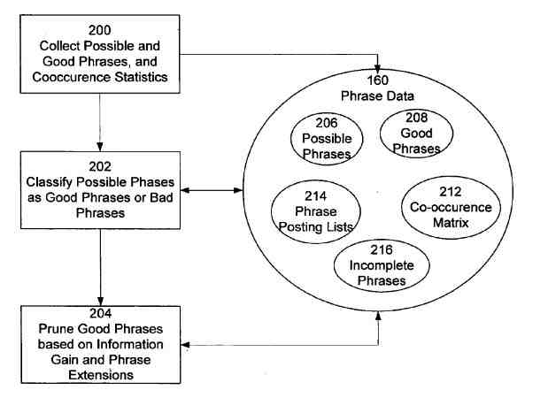

## The First Phrase-Based Indexing Patent Application

Google isn’t the biggest search engine that Anna Lynn Patterson has worked upon. That distinction probably falls to the [Internet Archives](http://archive.org/web/web.php), which she worked on before joining Google. It likely has a few billion more pages in its database than Google. The archive has 55 billion web pages right now.

Besides to that feat, Anna is the writer of a pretty good article on search engines. That is at the ACM Queue, titled [Why Writing Your Own Search Engine is Hard](https://queue.acm.org/detail.cfm?id=988407).

## There are Many Benefits From Using a Search Engine that Ranks Pages Using Phrase-Based Indexing

The latest search engine description from Anna Patterson, published yesterday, involves a search engine immune from Google Bombing. It could reward authors for well-written HTML and good punctuation. It can find relevant pages that don’t include the query terms on those pages, even though immune to Google Bombing. She also finds a way to perform personalization with the search engine and detect and drop duplicates. It introduces the concept of phrase-based indexing to search as well.

The search engine she conceived of can serve a mix of relevant pages from different topics in search results to searchers. For example, a search for “Blues” could easily be set to display pages on the first page of search results that lead to:

- Information about the hockey team in Saint Louis
- Articles on the medical condition
- Essays on the music type
- The color Blue
- News on the cricket team in Australia
- Other relevant topics

It can create document descriptions for a page, These can be both general descriptions and personalized ones.

## The Patent was filed in 2004.

This search engine and its related algorithms are in several patent applications from Anna Patterson (some published, and some still unpublished). This one, on phrase-based indexing, assigned to Google on December 6, 2004:

[Phrase-based searching in an information retrieval system](http://appft1.uspto.gov/netacgi/nph-Parser?Sect1=PTO1&Sect2=HITOFF&d=PG01&p=1&u=%2Fnetahtml%2FPTO%2Fsrchnum.html&r=1&f=G&l=50&s1=%2220060031195%22.PGNR.&OS=DN/20060031195&RS=DN/20060031195)
Inventor: Anna Lynn Patterson
US Patent Application 20060031195
Published February 9, 2006
Filed July 26, 2004

Abstract:

> An information retrieval system uses phrases to index, retrieve, organize, and describe documents. Phrases that predict the presence of other phrases in documents. Indexed documents according to their included phrases. Related phrases and phrase extensions are also identified. Identified phrases in a query get used to retrieve and rank documents. Phrases are also used to cluster documents in the search results, create document descriptions, anddrope duplicate documents from the search results and the index.

## Information Retrieval Using Phrase-Based Indexing

Some of the ideas behind the phrase-based indexing patent application are like those explored in a patent application from Yahoo! published last April, titled [Systems and methods for search processing using superunits](http://appft1.uspto.gov/netacgi/nph-Parser?Sect1=PTO1&Sect2=HITOFF&d=PG01&p=1&u=%2Fnetahtml%2FPTO%2Fsrchnum.html&r=1&f=G&l=50&s1=%2220050080795%22.PGNR.&OS=DN/20050080795&RS=DN/20050080795). That one focused more upon concepts within queries that people use to search with than upon phrases used within documents on the web.

According to the patent application, the need that it addresses is for an information retrieval system and method that can:

> (a) Identify phrases in a large scale corpus,
>  (b) Index documents according to phrases,
>  (c) Search and rank documents under their phrases, and
>  (d) Provide more clustering and descriptive information about the documents.

Is this something that Google will use or have started to use? It isn’t easy to tell. A search for the googlebomb “miserable failure” still returns results that don’t have those words on their pages, so it’s possibly not in use right now. Will phrase-based indexing be something that Google might turn to in the future? There’s a possibility that they could.

It is worth looking at and thinking about. After all, the inventor of the phrase-based indexing system and method described has built at least one search engine bigger than Google
