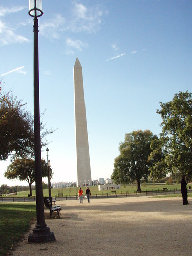

Ok, I don’t usually refer to myself in the third person, but I will be hopping on a train a little later this morning to head down to Washington, D.C., and spending part of the day (ok, a lot of the day) there. I couldn’t resist the allusion to one of my [favorite movies](https://www.imdb.com/title/tt0031679/quotes) while growing up. I’m looking to seeing some of the memorials while I’m there, including the World War II memorial and the Vietnam War Memorial.

I had the chance to visit with Jim Hedger and Dave Davies yesterday afternoon on their weekly radio show on Webmaster Radio. Don’t miss Dave’s post on personalization.

I also had the chance to talk with Eric Enge in a podcast presentation at Stone Temple Consulting, a couple of weeks back, about how search engines may rerank results based upon any number of factors. Eric has a write up of the podcast at Search Engine Watch – [Search Engines and User Query Intent](http://web.archive.org/web/20160506122841/https://searchenginewatch.com/sew/news/2055348/search-engines-user-query-intent), and the the podcast itself (with transcript) is at [Bill Slawski Podcast with Eric Enge](https://www.stonetemple.com/podcasts/Bill-Slawski-Podcast-101907.shtml).

Have a good Friday.

Added, from our tour around the mall.

