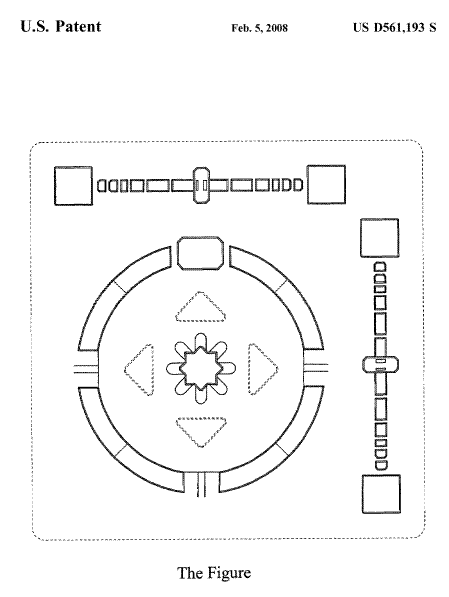

Google was awarded a design patent today on an interesting looking interface, in a patent titled [Display device showing user interface](http://web.archive.org/web/20140428121758/http://patft.uspto.gov/netacgi/nph-Parser?Sect1=PTO2&Sect2=HITOFF&u=%2Fnetahtml%2FPTO%2Fsearch-adv.htm&r=1&p=1&f=G&l=50&d=PTXT&S1=D561,193.PN.&OS=pn/D561,193&RS=PN/D561,193).

[Design patents](https://www.uspto.gov/patents-getting-started/patent-basics/types-patent-applications/design-patent-application-guide) sometimes leave you guessing as to what it is that you are actually looking at, and they can appear somewhat unusual.

With two sliders, and what seems to be a circular area where different choices could be selected, this design from Google looks somewhat mysterious. Upon seeing it, I wondered if it were something from a phone:

The Patent listed a number of references to other interfaces, which were also misleading. One was an [electronic horoscope game](https://patents.google.com/patent/USD260660) from Mattel. Another was a [watch dial](https://patents.google.com/patent/USD76445) from 1928. Three others were display icons for computer screens, like one from [Apple Computer](https://patents.google.com/patent/USD505135?oq=patent:D505135).

A little digging around provided an answer to how this is used. One of the inventors listed, Beth Ellyn O’Mullan, was a User Experience Design Lead on Google Earth at the time that the patent was filed.

She’s also one of the inventors listed on a patent application for an [Embedded navigation interface](http://appft1.uspto.gov/netacgi/nph-Parser?Sect1=PTO2&Sect2=HITOFF&u=%2Fnetahtml%2FPTO%2Fsearch-adv.html&r=1&p=1&f=G&l=50&d=PG01&S1=20070273712.PGNR.&OS=dn/20070273712&RS=DN/20070273712).

Ok, so it’s not something new from a “Google Phone.”
