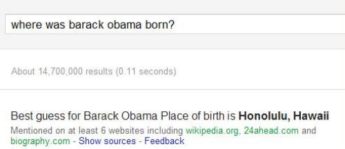

In the last installment of this series, we looked at how Google may be using [phrase based indexing](https://www.seobythesea.com/2011/12/10-most-important-seo-patents-part-5-phrase-based-indexing/) to use the fact that many phrases often tend to co-occur with other phrases within the content of web pages, to re-rank those pages. When we look at phrases, we also need to drill down to a special set of phrases describing named entities, or specific people, places, or things.

In addition to trying to understand which phrases might tend to co-occur with those named entities, the search engines may look to other sources such as Wikipedia, Freebase from [Metaweb](https://www.seobythesea.com/2010/07/google-gets-smarter-with-named-entities-acquires-metaweb/), the Internet Movie Database (IMDB), and different map databases to attempt to understand when a phrase indicates an actual (or fictional) entity and may perform named entity detection on queries searching for those pages

Google, Bing, and Yahoo all look for named entities on web pages and in search queries, and will use named entity detection to do things like answer questions such as “where was Barack Obama born?”

This type of named entity detection is having an increased role in Search.

The search engines associate attributes and facts associated with named entities, and when it comes to local search, they will associate addresses and websites as well. I described how Google may be associating specific websites with specific businesses at specific locations back in 2006 in the post [Authority Documents for Google’s Local Search](https://www.seobythesea.com/2006/07/authority-documents-for-googles-local-search/).

How search engines treat named entities especially can be pretty clearly seen in the following Yahoo search results, where a search for “Justin Timberlake” includes a display of both “related people” and “related movies” in the left column on a search using his name. Named Entity detection has impacts like this:

![On a Yahoo search for \[Justin Timberlake\], the left column of the search result shows related people such as NSync, Andrew Garfield, Mike Myers, and Joey Fatone, and related movies such as Alpha Dog, and The Love Guru.](media/named-entities-related.jpg)

There are other cases where it’s not so obvious that a search engine is using its recognition of a named entity to affect search results, and the number 6 patent in this series of the 10 most important SEO patents is one that has sometimes been pointed at as proof that Google is biased towards brands, but in reality, has a broader impact than that. The patent is [Query rewriting with entity detection](http://patft.uspto.gov/netacgi/nph-Parser?Sect1=PTO2&Sect2=HITOFF&u=%2Fnetahtml%2FPTO%2Fsearch-adv.htm&r=1&p=1&f=G&l=50&d=PTXT&S1=7,536,382.PN.&OS=pn/7,536,382&RS=PN/7,536,382).

I wrote about this particular patent in the post [Boosting Brands, Businesses, and Other Entities: How a Search Engine Might Assume a Query Implies a Site Search](https://www.seobythesea.com/2009/05/boosting-brands-businesses-and-other-entities-how-a-search-engine-might-assume-a-query-implies-a-site-search/). The Official Google Webmaster Central Blog also described the impact of the approach behind this patent in their post, [Showing more results from a domain](https://webmasters.googleblog.com/2010/08/showing-more-results-from-domain.html). Yahoo was granted a patent that is similar in a number of ways, which I wrote about in the post [Not Brands but Entities: The Influence of Named Entities on Google and Yahoo Search Results](https://www.seobythesea.com/2010/08/not-brands-but-entities-the-influence-of-named-entities-on-google-and-yahoo-search-results/).

Sometimes Google will show more than one result from a domain when it recognizes that people may be interested in seeing results from that site, after doing named entity detection on a query, and recognizing that a particular site might show multiple relevant results.

Microsoft also uses its recognition and knowledge of named entities in a number of ways as well. For example, in the third part of this series, we looked at how Microsoft might be [Classifying Web Blocks with Linguistic Features](https://www.seobythesea.com/2011/12/10-most-important-seo-patents-part-3-classifying-web-blocks-with-linguistic-features/). One of the “linguistic features” described in the [Microsoft patent](http://patft.uspto.gov/netacgi/nph-Parser?Sect1=PTO2&Sect2=HITOFF&u=%2Fnetahtml%2FPTO%2Fsearch-adv.htm&r=1&p=1&f=G&l=50&d=PTXT&S1=7,895,148.PN.&OS=PN/7,895,148&RS=PN/7,895,148) are named entities.

> The classification system uses linguistic features to help classify the function of a block because developers of web pages tend to use different linguistic features within blocks having different functions. For example, a block with a navigation function will likely have very short phrases with no sentences. In contrast, a block with a function of providing the text of the primary topic of a web page will likely have complex sentences. **Also, a block that is directed to the primary topic of a web page may have named entities, such as persons, locations, and organizations.**

In the *Named Entity Detection* patent from Google, the search engine attempts to identify when there is a named entity included within a search query, and if it has associated a specific website with that named entity, it may show more than one or two results from that website at the top of search results.

For example, on a search that includes a specific person such as [Barack Obama campaign], it might show a number of results from the same site:

![A search result for the query \[barack obama campaign\] showing 4 results.](media/named-entities-people.jpg)

In a search that includes a particular place or landmark such as [spaceneedle hours], Google may also show a number of results from a particular domain:

![A search result for the query \[space needle hours\] showing 4 results.](media/named-entities-places.jpg)

In addition, a search query that includes a business name or brand, such as [seo by the sea named entities] may also include a number of results from a site that it has associated the named entity with:

![A search result for the query \[space needle hours\] performing named entity detection.](media/named-entities-things.jpg)

More than one named entity might be associated with a particular website, which we can see for the query [bill slawski named entity], which shows 4 results similar to those from the “seo by the sea named entities” query above:

![A search result for the query \[bill slawski named entity\] showing 4 results.](media/named-entities-more-than-one.jpg)

The results for the queries that include the entities “SEO by the Sea,” and “Bill Slawski” (yes, I’m an entity according to Google, but likely so are you), show the same pages but in a slightly different order. Google was treating my name as a named entity associated with my site before Google launched their Authorship markup, but it’s possible that the authorship markup that enables the search engine to associate specific people with content they’ve created on the web might help Google make associations between named entities and websites.

**Conclusion**

Knowing that queries that include named entities might be treated differently than queries that don’t is important to both searchers and SEOs, and can result in special features appearing within search results such as the “related people” display at Yahoo, or the expanded results (like an implied site search) at Google, or possibly in a number of other ways.

I’ve written about named entities a number of times in the past, beyond named entity detection, and how search engines might be using them:

- [Google and Metaweb: Named Entities and Mashup Search Results?](https://www.seobythesea.com/2010/08/google-and-metaweb-named-entities-and-mashup-search-results/)
- [Search Taxonomies and Search Engines: Answering Questions vs. Indexing Webpages](https://www.seobythesea.com/2009/11/search-taxonomies-and-search-engines-answering-questions-vs-indexing-webpages/)
- [Google News Rankings and Quality Scores for News Sources](https://www.seobythesea.com/2009/08/google-news-rankings-and-quality-scores-for-news-sources/)
- [Google Using Novel Content as a Ranking Signal?](https://www.seobythesea.com/2008/11/google-using-novel-content-as-a-ranking-signal/)
- [How a Search Engine Might Add Related Information about People, Places, and Things into Search Results](https://www.seobythesea.com/2008/09/how-a-search-engine-might-add-related-information-about-people-places-and-things-into-search-results/)
- [How Google May Blend Information From Feeds and Extracted Data For Search Results](https://www.seobythesea.com/2007/10/how-google-may-blend-information-from-feeds-and-extracted-data-for-search-results/)
- [Google on Using a Knowledge Base of Articles to Make Searches Smarter](https://www.seobythesea.com/2007/10/google-on-using-a-knowledge-base-of-articles-to-make-searches-smarter/)
- [Can Web Search Use Wikipedia to Understand References to Names?](https://www.seobythesea.com/2007/07/can-web-search-use-wikipedia-to-understand-references-to-names/)
- [Ask.com on Trends, Freshness, Personalization, and Better Search Results](https://www.seobythesea.com/2007/06/askcom-on-trends-freshness-personalization-and-better-search-results/)
- [Providing related links to documents](https://www.seobythesea.com/2006/01/providing-related-links-to-documents/)

Seems like this was the week for people to write about named entity detection, with some excellent posts from Justin Briggs – [Entity Search Results – The On-Going Evolution of Search](https://www.briggsby.com/entity-search-results-the-on-going-evolution-of-search) and David Harry, who had a 2 part series on the subject – Named Entities; associations for SEO and SEO & Named Entities; what can we learn?

**All parts of the 10 Most Important SEO Patents series:**

[Part 1 – The Original PageRank Patent Application](https://www.seobythesea.com/2011/12/10-most-important-seo-patents-part-1-the-original-pagerank-patent-application/)
[Part 2 – The Original Historical Data Patent Filing and its Children](https://www.seobythesea.com/2011/12/10-most-important-seo-patents-original-historical-data-patent-filing-children/)
[Part 3 – Classifying Web Blocks with Linguistic Features](https://www.seobythesea.com/2011/12/10-most-important-seo-patents-part-3-classifying-web-blocks-with-linguistic-features/)
[Part 4 – PageRank Meets the Reasonable Surfer](https://www.seobythesea.com/2011/12/most-important-seo-patents-reasonable-surfer/)
[Part 5 – Phrase Based Indexing](https://www.seobythesea.com/2011/12/10-most-important-seo-patents-part-5-phrase-based-indexing/)
[Part 6 – Named Entity Detection in Queries](https://www.seobythesea.com/2012/01/named-entity-detection-in-queries/)
[Part 7 – Sets, Semantic Closeness, Segmentation, and Webtables](https://www.seobythesea.com/2012/01/sets-semantic-closeness-segmentation-and-webtables/)
[Part 8 – Assigning Geographic Relevance to Web Pages](https://www.seobythesea.com/2012/02/assigning-geographic-relevance-web-pages/)
[Part 9 – From Ten Blue Links to Blended and Universal Search](https://www.seobythesea.com/2012/02/ten-blue-links-to-blended-universal-search/)
[Part 10 – Just the Beginning](https://www.seobythesea.com/2012/03/just-the-beginning/)
