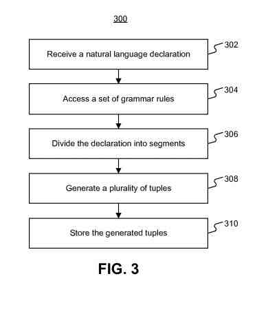
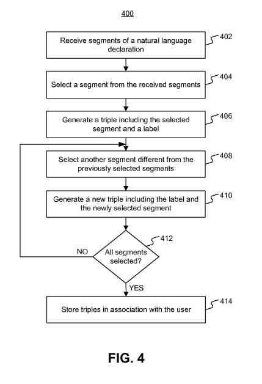
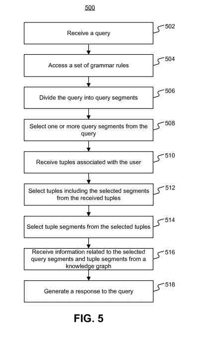
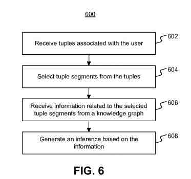
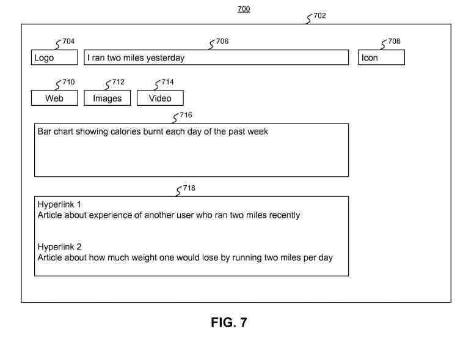

## Natural Language Query Responses at Google

The nature of the Internet and the ease with which searchers can access the Web comes from many sources. This can enable searchers to share information and search for information related to their interests.

Searchers may share or search for things such as:

- Photographs
- Videos
- Music
- Blogs
- Messages
- Comments
- Other information

This patent solves this problem:

> Much information does not get recorded or shared because conventional communication and recording information can be cumbersome to set up.

You’ve seen this and wondered how the information you may be recording might become useful.

## A Natural Language Application Example

Some devices and applications allow searchers to record and store certain information and receive summaries of the recorded information.

Fitness and exercise tracking devices allow searchers to enter the types and amount of food items eaten every day. They also track the amount of exercise performed, a weight loss or calorie goal, etc.

Most devices can only store a limited amount of information.

They cannot derive information from natural language declarations and text entries.

Other solutions need searchers to enter information in predetermined formats explicitly.

Usually, devices give searchers a limited amount of feedback in the form of summary information. This is from the information entered by the searcher and/or the limited information stored on these devices.

When people share information with a computer system, they might want to search for that information too.

## Finding Data to Use in Natural Language Query Responses

This patent lets you search for information on a computer. It aggregates information from natural language declarations provided by a searcher and inferences from that information.

Information from natural language declarations is in the form of structured tuples. This patent doesn’t tell us how this information might be set up on the Web to make it useful for this patent.

I have written about Google collecting entity information and tuple information to make this information searchable. Another post was [Entity Extractions for Knowledge Graphs at Google](https://gofishdigital.com/entity-extractions-knowledge-graphs/) and [Extracting Entities with Automated Data Wrappers](https://www.seobythesea.com/2021/04/extracting-entities-with-automated-data-wrappers/). These both describe how Google might better understand entity information and tuples that it finds on web pages. And how it might extract that information. Those extraction processes fit well with this patent, describing using that data.

But we know what happens to those entities and tuples once they are on web pages.

This patent tells us that:

> Segments of the tuples may be linked to knowledge graphs, social graphs, and/or entity graphs of structured information, which may provide inferences and feedback to the searcher.

## How to Respond to a Natural Language Query

The patent shows the analyzing and responding to a searcher query.

That system would store instructions and a processor to execute the instructions to receive a searcher’s query and divide the query into query segments based on grammar rules.

This works to:

- Choose a first segment from the query segments
- Receive a tuple stored in association with the searcher
- Select a second segment from the at least one tuple

The instructions receive information about the first and second segments and respond to the query based on the information.

A method of analyzing and responding to a searcher query.

## Answering a Query Starts by Breaking the Query Into Segments

A search query is received and divided into query segments based on grammar rules.

The processors then:

- Decide on a first segment from the query segments
- Take at least one tuple stored in association with the searcher
- Pick a second segment from at least one tuple

In addition, the instructions cause the processors to:

- Receive information related to the first and second segments
- build a response to the query based on the received information
- Transmit information to a display device for displaying the response to the searcher

## This Natural Language Query Responses Patent is at:

[Systems and methods for generating responses to natural language queries](http://patft.uspto.gov/netacgi/nph-Parser?Sect1=PTO2&Sect2=HITOFF&u=%2Fnetahtml%2FPTO%2Fsearch-adv.htm&r=1&p=1&f=G&l=50&d=PTXT&S1=10,990,603.PN.&OS=pn/10,990,603&RS=PN/10,990,603)
Inventors: Ian Macgillivray, Engin Cinar Sahin, Emma Sarah Persky, Max Bogue, Angela Ni-Hwey Chang, and Konrad Piotr Delong
Assignee: Google LLC
US Patent: 10,990,603
Granted: April 27, 2021
Filed: February 20, 2019

Abstract

> Computer-implemented systems and methods analyze and respond to a searcher query.
>
> The search engine receives a query from the searcher and divides the query into query segments based on grammar rules.
>
> When the first segment from the query segments is received, at least one tuple stored in association with the searcher selects a second segment from at least one tuple.
>
> Those systems and methods receive information about the first and second segments and respond to the query based on the received information.
>
> Then the information is transmitted to a display device to present the response to the searcher.

## How Grammar Rules Help Understanding Natural Language Declarations?

This patent presents aggregating and storing information derived from natural language declarations made by searchers.

A searcher may receive that natural language declaration.

The searcher may evaluate the natural language declaration using grammar rules. These can include nouns, verbs, prepositions, adverbs, adjectives, subject, predicate, etc.

That information may be in tuples and stored in association with the searcher.

## Natural Language Query Responses to a Searcher

This patent also tells us how it may generate natural language query responses to a searcher.

The natural language query may be from a searcher at a client device.

After the natural language declaration is evaluated to identify query segments, those can be based on a set of grammar rules (e.g., nouns, verbs, subject, predicate, etc.).

The searcher may then access a knowledge graph to retrieve information about one or more query segments. The searcher can also look for data items associated with the searcher.

The search engine could create query responses based on the retrieved information.

## Storing Natural Language Query Responses

The system may include computers owned or operated by searchers, who add information to the Web.

These computing devices include smartphones, tablets, netbooks, electronic readers, personal digital assistants (PDAs). They also include web-enabled television sets, personal computers, laptop computers, desktop computers, and/or other types of electronics or communication devices.

They may transmit a natural language declaration or a natural language query based on input provided by searchers through the network to an appropriate server, such as a server.

The searcher may also receive information (e.g., natural language query responses), to requests, from the server through a network.

Those servers may implement or provide search engines, natural language interpretation and classification engines, sets of grammar rules. They may also issue applications or programs to receive and store natural language declarations or generate natural language query responses.

## Information Contained in Knowledge Graphs

A knowledge graph may include both logically and/or physically separate databases configured to store data.

The data stored in the knowledge graph may be from the server, client devices, and/or provided as input using conventional methods.

Data stored in the knowledge graph may be documents, presentations, textual content, audio files, video files, information, and data items stored in the form of tuples. The data can also include grammar rules and various other electronic data any other combination thereof.

A knowledge graph item about any subject or data item may include a corpus of information and content items associated with the subject of the data item.

A body of information can include names, places, things, events, and/or content items.

The knowledge graph may include links to the corpus of information. It can also include references or links to other knowledge graph items and/or databases containing the corpus of information.

## An Example of Data in a Knowledge Graph

A knowledge graph item for a data item “banana” may include a body of information including:

- Varieties of banana
- Where banana are cultivated
- Pricing and availability of banana
- Nutritional content in a banana
- Recipes based on the use of banana
- Festivals or events associated with banana
- Etc.

The knowledge graph item may include additional information such as the frequency with which searchers may have searched for information or posted comments regarding “banana.” It can also include comments, messages, and/or blog posts about bananas, etc.

These are only examples. Audio and video information may also be in the knowledge graph items.

## This Information may be stored in a Tuples Database

The tuples database may store information obtained from natural language declarations and social graphs of the searcher.

That information could include documents, presentations, news items, articles, blog posts, books, book reviews, magazines, magazine articles. It can also include audio or video recordings, text messages, e-mail messages, social media content, or any other type of information authored by a searcher. These can also be from the searcher’s social media contacts or by preferred contacts identified by the searcher.

It may also contain search logs with search strings used by the searcher to search for content items and/or quotes.

## Natural Language Query Responses May be in Tuples

The search engine may store information in the tuples database in the form of tuples associated with the searcher.

The knowledge graph may use a single computer-readable storage medium.

A device that stores the Knowledge Graph may be on a network-attached storage device, a storage area network, or a combination.

It can use numerous languages, such as SQL, MySQL, and IBM DB2.RTM., Microsoft Access.RTM., PERL, C/C++, Java.RTM., etc.

It may also be a standalone database accessible through a network or associated with the part of a system or environment that may be accessible to client devices and/or other components.

## The Tuples Database May Have a Structure and Function Like the Knowledge Graph

The tuples database may have a structure and function like the knowledge graph and maybe like the knowledge graph.

The system may include only a knowledge graph, which may perform as both a knowledge graph and tuples database.

Or, the system may include only a tuples database, which may perform as both a knowledge graph and a tuples database.

Or it may include both knowledge graph and tuples database.

It could really include any number of knowledge graphs, tuples databases, and/or any other databases.

## Behind Using Natural Language Query Responses

To define a natural language declaration, it may be a sentence, quote, phrase, question, etc., written or expressed in some form by a searcher.

“Natural language” as used here refers to how searchers may communicate with each other using spoken or written words in a language.

A sentence, such as “I ate an apple,” may represent a natural language declaration.

A phrase such as “love yogurt” or “go USA” may represent a natural language declaration.

A natural language declaration could also include a paragraph or a collection of sentences or phrases.

This process includes receiving a natural language declaration, including accessing or receiving a natural language declaration from a storage or database, such as a storage or database associated with the system.

Receiving a natural language declaration may include retrieving the natural language declaration from data stored in the main memory or storage medium of client devices and/or servers.

That natural language declaration may also include receiving the natural language declaration when the searcher inputs or provides the natural language declaration. They would use the I/O devices associated with client devices with the server.

## Grammar Rules for Natural Language Query Responses

The natural language query responses process can also include accessing a set of grammar rules.

Grammar rules can identify or classify words or phrases of a natural language declaration and associate contextual meaning with the phrases.

Those Grammar rules based on the English language may help determine if a word or phrase used in the natural language declaration forms a noun, pronoun, verb, preposition, adjective, adverb, conjunction, subject, predicate, etc.

They may help categorize words in the natural language declaration.

As an example, grammar rules may state that “banana,” “an apple,” “carrot,” “milk,” etc. are food items and further that “banana” and “apple” are fruits, “carrot” is a vegetable, and “milk” is a dairy product.

Those grammar rules can help associate words in a natural language declaration with contextual meanings.

Rules about natural language declarations can also relate to mathematics or scientific disciplines to help to assign meanings to symbols or scientific terms. These can provide context to the jargon used in a particular branch of mathematics or science.

## Some Grammar Rules Work With Mathematics

For example, grammar rules related to mathematics may help identify symbols such as “=” (equal), “>” (greater than), “<” (less than) etc.

A relation to mathematics can help recognize shapes such as a triangle, square, pentagon, and hexagon, including three, four, five, or six sides, respectively.

These grammar rules may work with positional relationships of the words or phrases in the natural language declaration.

A declaration could contain a matrix of text and/or numbers with column headings. Those column headings and/or the relative positions of the columns, for example, from left to right, may identify and/or classify the text and/or numbers.

## The Grammar Rules Also Allow Interpretation of Natural Language Terms

These rules may also include rules to allow interpretation of certain natural language terms.

For example, articles “a” or “an” maybe with a quantity of “one.”

Similarly, for example, the words “double,” “triple,” or “quadruple” maybe with a quantity of “two,” “three,” or “four,” respectively.

By way of another example, terms like “exercise,” “running,” “walking,” “aerobics,” etc., maybe with a decrease in calories and/or increase in muscle mass.

The grammar rules may be in a knowledge graph, tuples database, and/or any other storage associated with the system.

Or, the rules may be in an entity graph of known entities such as nouns (objects of things), verbs (activities), etc.

## There May Be Information Indicating that Certain Nouns Represent Entities in an Entity Graph

Information indicating that certain nouns represent food items, fruits, or vegetables, maybe in an entity graph.

That entity graph may include information regarding the nutritional content of various foods or calories burnt in a certain activity.

Also, commonly known information such as the number of days in a year, number of hours in a day, etc., maybe in an entity graph.

Accessing grammar rules may include processes similar to those described above about natural language declarations from storage or database associated with the system.

## Grammar Rules Can Tell You A Lot, and Learned New Grammar Rules

This process may allow a searcher to provide one or more natural language declarations and identify and/or classify each word or group of words in the one or more natural language declarations provided by the searcher.

The searchers’ natural language declarations may train the system to classify and/or identify words or phrases.

The system may then derive grammar rules based on the classifications provided by the searcher and store the grammar rules in a knowledge graph, tuples database, or any other storage associated with the system.

## Breaking Natural Language Declarations into Segments

The natural language declaration may be divided into segments.

A segment may constitute a data item represented by one word or groups of words selected from the natural language declaration.

Segments in a natural language declaration may use classifications based on grammar rules.

By way of example, classifications based on English language grammar rules maybe divide the natural language declaration into parts of speech, for example, nouns, pronouns, verbs, etc.

## A Segmented Example Of a Natural Language Declaration

The natural language declaration “I ate a banana yesterday” could make up five portions, the pronoun “I,” the verb “ate,” the noun “banana,” the article “a,” and the date indicator “yesterday.”

And grammar rules may interpret one or more of these portions and associate contextual meanings with generating segments corresponding to the natural language declaration.

The article “a” may be an indicator of the number of bananas that the searcher ate and maybe a segment of “one.”

The word “yesterday” may be a date when the declaration happened.

A searcher could make a declaration on Jun. 15, 2014, and the word “yesterday” may be a segment “20140614,” indicating that the searcher ate the banana on Jun. 14, 2014.

## Other Ways Natural Language Declarations May be Segmented

Natural language declarations may be segments based on grammar rules in many other ways.

A list or matrix of text or numbers may be on the separator symbol separating the text or numbers.

The list of text or numbers separated by commas, tabs, or spaces may be segmented by the text or numbers between a pair of commas, tabs, or spaces.

Similarly, a matrix of numbers or text may be segments based on the row and column position of the numbers or text in the matrix.

Another example is that the word “hexagon” may work with segments characterizing the geometric shape based on mathematical grammar rules.

Thus, the word hexagon may work with segments including, for example, “shape,” “polygon,” “regular,” “six-sided,” etc.

## Using Tuples Based on Segments from Natural Language Declarations

Google would be generating several tuples as part of this process.

These tuples can consist of two or more segments stored in association with each other.

Triples may be from the segments of a natural language declaration.

A triple, as used here, is a tuple, which consists of three segments.

Tuples or triples may have selected one or more segments corresponding to a natural language declaration.

A tuple may also include segments such as labels and/or segments representing characteristics of a segment included in the tuple.

## Grammar Rules May Divide The Natural Language Declaration into Segments

Characteristics of segments may from the grammar rules used to divide the natural language declaration into segments.

Or those characteristics of segments may be from an entity graph.

As an example, the following triples may represent the natural language declaration “I ate a banana yesterday” provided by a searcher “XYZ”: “XYZ/action-eat/label 1,” “label 1/food/banana,” “label 1/quantity/1,” and “label 1/date/20140614.”

A segment “label 1” may represent each triple corresponding to a particular natural language declaration. That could help to identify triples associated with that particular natural language declaration.

The searcher identifier such as “XYZ” may serve the same function as a label.

The number of triples generated for different natural language declarations may be different. For example, it may depend on the amount of information included in each natural language declaration and/or the amount of information derived from grammar rules or entity graphs used to process the natural language declaration.

## Personal Tuples for Natural Language Query Responses

Besides tuples related to the natural language declaration, the process may generate personal tuples based on a searcher’s profile information or other social graph information associated with the searcher.

Personal triples may include three data items, at least one of which may comprise, for example, gender, age, physical characteristics, hobbies, and/or interests of the searcher.

The personal triples may also be from natural language declarations made by the searcher. This is true for emails, search queries, blogs, personal electronic diaries or journals, information in a searcher profile. It would also work with information, including photos, music, or other hobbies and interests shared by searchers on social media.

By way of example, personal triples for a searcher “XYZ” may include “XYZ/age/28,” “XYZ/gender/male,” “XYZ/hobby/photography,” etc.

Searchers may have an opportunity to control whether the disclosed systems or methods collect searcher information. The searcher information can be information about a searcher’s social network, social actions or activities, profession, a searcher’s preferences, or a searcher’s current location. It can also control whether and/or how to receive natural language declarations that may be more relevant to the searcher.

## Removing Personally Identifiable Information

Certain data may be used to remove personally identifiable information.

For example, a searcher’s identity may determine no personally identifiable information. Or a searcher’s geographic location may be general with location information (such as to a city, ZIP code, or state level) so that there is no particular location of the searcher.

Thus, that searcher may control how information about the searcher and personal triples use the disclosed systems and methods.

This can include storing the generated tuples.

In association with the searcher who provided the natural language declaration, Tuples may be in the tuples database.

Tuples may also be in a knowledge graph or any other database or storage associated with the system in other embodiments.

These tuples can also be in separate databases associated with the system, and an association table may link the tuples to a searcher.

## Generating Triples From a Natural Language Declaration

The patented process may run on the server without access to client devices and/or networks.

It may work on client devices without accessing the server and/or network.

It could also use one or more of the client’s devices and/or servers communicating via the network.

Modifications to the process by adding, combining, removing, and/or rearranging the steps for the process.

The search engine may receive segments of a natural language declaration.

The client device may receive the segments, including processes similar to those described above concerning accessing a natural language declaration. That could come from storage or the database associated with the system.

It may also include selecting a segment previously.

## Selecting The Segment May Include Arbitrarily Selecting a Segment from the List of Segments

Picking the segment may include arbitrarily selecting a segment from the list of segments associated with the natural language declaration.

And the Choice of the segment may also include selecting a segment based on a relative ordering or ranking of the segments associated with the natural language declaration.

The grammar rules may rank or order the segments associated with the natural language declaration.

For example, a word identified as a “subject” may represent an actor in the natural language declaration. It may rank higher than a word identified as a “verb,” representing an action performed by the actor. Similarly, the “verb” may rank higher than a noun identified as a “predicate,” on which or related to which the actor may act.

Other segments of the natural language declaration may assign lower rankings compared to the subject, verb, and/or predicate.

The natural language declaration segment may rank based on their position in the natural language declaration.

## Grammar Rules for Ranking Segments Associated with a Natural Language Declaration

A variety of grammar rules may rank segments associated with a natural language declaration.

In the natural language declaration “I ate a banana yesterday,” the subject “I” may be a segment “XYZ” corresponding to an identifier of the declarant. It may have a higher rank than the verb “ate” or the predicate “banana.”

The segment “one” corresponding to the article “a” and the segment “20140614” corresponding to “yesterday” may be lower than the subject, verb, and predicate.

A segment “XYZ” maybe from among all the segments corresponding to the natural language declaration “I ate a banana yesterday.”

This generating of a triple could include the selected segment and two other segments.

One of the other two segments may be a label, “label 1,” which may associate or relate triples corresponding to a particular natural language declaration.

The searcher identifier “XYZ” may perform a label function.

The remaining segment of the triple may be a segment selected from the segments associated with the natural language declaration but may differ from the previously selected segments.

Thus the previously unselected segment corresponding to the verb “eat” may be a second segment for generating the triple “XYZ/action-eat/label 1.” That segment could correspond to the natural language declaration “I ate a banana yesterday.”

The process may also include selecting another segment different from the previously selected segments.

Another segment may include selecting a data item not included in previously generated triples.

## When the Search Engine Generates a New Triple

When the search engine generates a new triple, that might include using a previously unselected segment of the natural language declaration and/or the label used to generate the triple.

Some of the triple segments may include segments representing characterized selected segments. This could be determined by the grammar rules used to generate the segments.

For example, a new triple such as “label 1/food/banana” may work in this step.

The data item “label 1” may be the same as the label used in the triple “XYZ/action-eat/label 1.”

The previously unselected data item “banana,” corresponding to the example natural language declaration “I ate a banana yesterday,” maybe for the generation of the new triple.

Information or Grammar Rules from the knowledge graph, entity graph, or database associated with the system may determine that “banana” is a “food.”

The characteristic of “banana,” namely “food,” maybe a segment to generate the new triple “label 1/food/banana.”

As seen in this example, “label 1” relates the triple “label 1/food/banana” generated to the triple “XYZ/action-eat/label 1” because the data item “label 1” occurs in both triples.

There may be a determination of whether all segments of the natural language declaration have been for the generation of triples.

When all segments are not for the generation of triples, the process may return to select another segment different from the previously selected segments.

And when all the segments received have generated triples, the process may store the triples associated with the searcher.

## Generating Inferences in Natural Language Query Responses or Declarations

We may also see the receiving of a natural language query or declaration.

Natural language queries may take many different forms.

A natural language query may be a natural language declaration that ends with a question mark.

Such a query may use natural language to include text such as “Am I eating enough potassium?”

The symbol “?” may identify the natural language declaration as a natural language query.

## Words in a Natural Language Declaration that Indicate it is a Query

Specific words in the natural language declaration may be used to determine whether it is a query.

Question words, such as “who,” “what,” “why,” “when,” “where,” “how,” etc., may state that the natural language declaration is a natural language query.

The grammar rules may determine whether a natural language declaration may be a natural language query.

A natural language declaration such as “Can I eat more apples” may be a natural language query by detecting that the words “Can I” precede the verb “eat.”

For example, many other grammar rules based on the usage, position, or contextual meaning of the natural language declaration, may identify a natural language query.

A searcher may input the natural language query into the client device using one or more I/O devices associated with the client device.

A client device may receive the natural language query from the server or vice-versa.

A part may also include accessing grammar rules.

Those Grammar rules may determine whether a natural language declaration is a natural language query.

## The Grammar Rules May Ientify and Classify Various Segments of the Natural Language Query.

And the grammar rules may identify and classify various segments of the natural language query.

Another step may include dividing the natural language query into query segments.

The process may also include selecting one or more query segments from the query segments corresponding to the natural language query.

Deciding on a query segment may include arbitrarily selecting the query segment from the query segment list corresponding to the natural language query.

## Query Segments May Have Different Ratings

In the natural language declaration “Am I eating enough potassium?” the subject “I” may have a higher rank compared to the verb “eat,” which may have a higher rank than the predicate “potassium.”

Further, for example, the subject “I” may be a query segment “XYZ,” corresponding to an identifier of the declarant or searcher who provided the natural language query.

In this example, “XYZ” and “eat” may be the query segments.

Receiving tuples associated with the searcher could also take place.

The search engine may access or receive tuples from any storage or database associated with the system.

This may include retrieving the tuples from data stored in the main memory or storage medium of client devices and/or servers.

Receiving tuples may include accessing the tuples stored in association with the searcher in the tuples database.

Deciding on tuples could take place related to the query segments.

## How the Process of Choosing Tuples May Take Place

Choosing tuples may include comparing the selected query segments with tuple segments included in the tuples associated with the searcher.

A vector distance or cosine distance between the selected query segments and the tuples associated with the searcher may identify tuples related to the selected query segments.

Determining which tuple may include selecting one or more tuples, representing vector distance or cosine distance less than a threshold distance, from the selected query segments.

Query segments “eat” and “potassium” may be from the natural language query “Am I eating enough potassium?”

Tuples Associated with searcher “XYZ” related to “eat” may be from the tuples stored in association with searcher “XYZ.”

For example, the triples “XYZ/action-eat/label 1” and “label 1/food/banana” may be from the tuples associated with searcher “XYZ.”

Seeing tuples related to more than one selected query segment may occur sequentially or simultaneously.

For example, in a sequential process, selected tuples having vector or cosine distance values lower than a threshold distance from a first query segment.

This process of selecting tuples works for each of the selected query segments.

The totality of the selected tuples related to each of the selected query segments may form the set of selected tuples.

Vector or cosine distances are computed between all selected query segments and all tuples associated with the searcher. Besides, tuples with vector or cosine distance below a threshold distance from the entire set of tuples associated with the searcher for further processing.

The chosen tuple segments may include selecting one or more segments from each of the selected tuples.

The tuple segments may be that the selected tuple segments are different from the selected query segments.

By way of example, the tuple segment “banana” is selected from the triple “label 1/food/banana” associated with searcher “XYZ.”

This process may include receiving information related to the selected query segments and/or the selected tuple segments from a knowledge graph or entity graph.

## Receiving Information May Include Receiving Information Related to the Selected Query Segment

Receiving information may include receiving first information related to the selected query segments. It can also mean receiving second information related to the selected tuple segments from a knowledge graph.

Knowledge graph and/or any entity graph associated with the system may also store information in the form of tuples.

The first and second information may include knowledge graph tuples associated with the selected query segments and selected tuple segments.

Identifying knowledge graph tuples and/or entity graph tuples may include processes similar to those described above-concerning computing vector distances or cosine distances.

Thus, the first information related to query segment “potassium” may be from the knowledge graph.

For example, triples such as “potassium/min_daily_amount/1.5 g” and “potassium/max_daily_amount/2.3 g,” provide information about the USDA recommended amount of potassium. Maybe many triples related to the query segment “potassium.”

Similarly, second information related to the tuple segment “banana” may be from a knowledge graph tuple or an entity graph tuple such as “banana/potassium/422 mg.”

Third, information from prior unselected tuples associated with searcher “XYZ.”

For example, triples “label 1/quantity/1” and “label 1/date/20140614” associated with searcher “XYZ” may indicate the number of bananas and, therefore, the amount of potassium consumed by the searcher “XYZ” in one day.

## Generating Natural Language Query Responses

This approach may also include generating natural language query responses.

Generating the response may include selecting data items from the received information comprising knowledge graph tuples, entity graph tuples, and/or tuples associated with the searcher.

The selected data items may generate natural language query responses.

For example, tuple segments may be selected from the knowledge graph tuples “potassium/min_daily_amount/1.5 g,” “potassium/max_daily_amount/2.3 g,” and “banana/potassium/422 mg.” They can be combined with the tuples “label 1/quantity/1,” and “label 1/date/20140614” associated with searcher “XYZ.” It could be inferews that searcher “XYZ” only ate one banana yesterday and thus only consumed 422 mg of potassium. That could be much smaller than the minimum recommended amount of potassium of 1.5 g.

Thus, a response indicating to searcher “XYZ” that searcher “XYZ” should eat more potassium works in the process.

## Pushed Inferences Based on Tuples Associated with a Searcher

“Pushed inferences” used in this patent refer to inferences generated without receiving any natural language queries from searchers.

This could work without the need to access client devices and/or networks.

And it may use one or more of the client’s devices and/or servers communicating via the network.

Modifications to this process may add, combine, remove, and/or rearrange the steps for the process.

We may see this as an offline process periodically.

Each time one of the client devices or server receives a natural language declaration from the searchers, the process may occur.

The process may be from the searchers and/or a server administrator.

In addition, the process may include receiving tuples associated with the searcher.

Receiving tuples may include accessing or receiving tuples from any storage or database associated with the system.

The receiving of tuples may include retrieving the tuples from data stored in the main memory or storage medium of client devices and/or servers.

They may also include accessing the tuples stored in association with the searcher in the tuples database.

Receiving tuples may include processes like those described above about accessing grammar rules from storage or database associated with the system.

The patented process may include selecting tuple segments from the tuples received.

Selecting tuple segments may include selecting one or more segments from each of the received tuples.

By way of example, the tuple segment “banana” is selected from the triple “label 1/food/banana” associated with searcher “XYZ.”

This may include receiving information related to the selected tuple segments from a knowledge graph or entity graph.

Knowledge graph and/or any entity graph associated with the system may also store information in the form of tuples.

## Information From the Knowledge Graph or Entity Graph may Include Knowledge Graph Tuples or Entity Graph Tuples

This Information received from the knowledge graph and/or entity graph may include knowledge graph tuples or entity graph tuples associated with the selected tuple segments.

Identifying knowledge graph tuples and/or entity graph tuples may include processes like those described above concerning computing vector distances or cosine distances.

Thus, the first information related to the tuple segment “banana” may be from a knowledge graph.

For example, triples such as “banana/potassium/422 mg,” which provides information about the amount of potassium in a banana, maybe from the knowledge graph.

Triples such as “potassium/min_daily_amount/1.5 g” and “potassium/max_daily_amount/2.3 g,” which provide information about the USDA recommended amount of potassium, could be triples related to the query segment “potassium.”

The second information may be from other tuples associated with searcher “XYZ.” For example, triples “label 1/quantity/1” and “label 1/date/20140614” associated with searcher “XYZ” may indicate the number of bananas. They would tell us about the amount of potassium consumed by the searcher. “XYZ” in one day.

The process may also include generating an inference based on the tuples associated with the searchers.

Generating the inference may include selecting data items from the received information taken from knowledge graph tuples, entity graph tuples, and/or tuples associated with the searcher.

The selected data items may generate natural language query responses.

The tuple segments selected from the knowledge graph tuples “potassium/min_daily_amount/1.5 g,” “potassium/max_daily_amount/2.3 g,” and “banana/potassium/422 mg” combined with the tuples “label 1/quantity/1,” and “label 1/date/20140614” associated with searcher “XYZ” may infer that searcher “XYZ” has only eaten one banana yesterday. Thus, they have only consumed 422 mg of potassium, which is much smaller than the minimum recommended amount of potassium of 1.5 g.

Thus, a created inference indicating to searcher “XYZ” that searcher “XYZ” should eat more potassium.

A knowledge graph may contain tuples related to other searchers.

These tuples could indicate how mother searchers in New York ate many bananas. It could determine the average amount of potassium consumed by other searchers in New York.

The amount of potassium consumed by searcher “XYZ,” for example, 422 mg, may work with the average amount of potassium to infer that searcher “XYZ” eats less potassium than other searchers in New York.

## Natural Language Query Responses

The searcher interface may present one or more natural language query responses.

A display window may be included in the searcher interface.

The display window may include a logo portion displaying a logo, a natural language declaration or query input portion, and an icon portion.

The Logo portion may display a logo related to a provider of the searcher interface or a system provider.

The natural language declaration or query input portion may allow a searcher to enter a natural language query or declaration.

A searcher may enter a natural language declaration or query using conventional methods. These include data entry, data transfer, data uploading, etc.

The searchers may enter a natural language declaration or query using one or more input/output devices associated with client devices and/or servers.

Natural language declarations or query portion displays the natural language declaration such as, “I ran two miles yesterday.”

The Icon portion may display an icon indicating that the searcher may request a response to the natural language declaration or query by activating the icon portion.

For example, the icon part may display an icon of a magnifying glass. Activating the icon part could cause the searcher interface to display information related to the natural language declaration or query entered in the part. The searchers may activate the icon part using one or more input/output devices.

## Filtering Natual Language Query Responses

That display window may additionally or include links that may enable searchers to filter natural language query responses.

The link may allow searchers to filter the responses to show only websites.

A link may also allow searchers to only display images corresponding to the natural language declaration or query.

Searchers may only display videos corresponding to a natural language declaration or query.

## A Display Window May Display Iimages Showing Charts and Graphs

D

The display window may display images showing charts and graphs in response to the natural language declaration or query entered.

An example would be a bar chart showing the number of calories burnt by the searcher on each day of the week based on the exercise regimen followed by the searcher.

The bar chart may include a data item showing the number of calories burnt by the searcher the previous day by running two miles.

The display part may be part of the display window and it could display links to articles, blogs, reports. Also to messages, comments, and/or other content related to the natural language query entered.

Hyperlink 1 may be a universal resource locator (“URL” or another pointer to an article about the experience of another searcher when that searcher ran two miles.

Similarly, hyperlink 2 may be a URL or pointer to another article indicating how much weight the searcher may lose by running two miles each day.

Although the display part displays only two links, the display part may display any number of links.

A display part may initially display only one or two links. It may include a scroll bar or other graphical widget to allow searchers to scroll the text to see additional links not initially displayed in the display portion.
