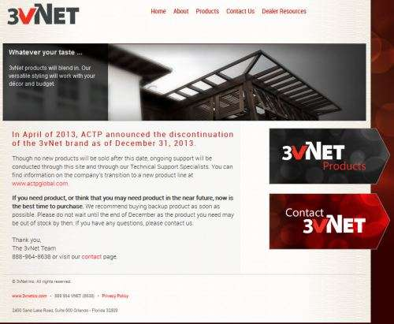
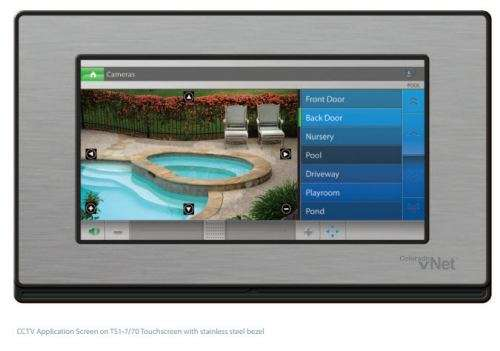

News came out in a Google Press release yesterday, [Google to Acquire Nest](https://abc.xyz/investor/index.html), that Google had purchased Nest, a company focused on connecting things found in your home to the internet, including the [Nest Learning Thermostat](https://store.google.com/us/product/nest_learning_thermostat_3rd_gen?hl=en-US&GoogleNest), and recently released [Protect](https://store.google.com/product/nest_protect_2nd_gen?hl=en-US), a Smoke + CO Alarm.

It’s exciting to see Google venturing out into business lines such as the control and security of house hold items such as alarms and thermostats and lighting and media controls. What does it mean for search and knowledge collection? I don’t think it signals any less interest in running a search engine, but it does show off a growing interest in selling internet related hardware, which is an area of experience that Google has been lacking in, though with devices such as Chromecast and Google Glass, may be really useful in the future.

There’s a lot of press and blog posts circulating around the Web about Google’s multi-billion dollar purchase of Nest, including some speculation that it gives Google a legitimate stance as a seller of hardware.

But it’s not Google’s first major investment in home automation products. That involved a company that had been successfully selling similar projects, but appears to have put new sales on hold while they developed new ones. The company was 3vNet, and their home page states that they will not be selling any new products after April 2013.

The story, [3vNet To Phase Out As CEO Forms New Company](https://www.twice.com/news/3vnet-phase-out-ceo-forms-new-company-39273), published on April 8, 2013, tells about a decision to rebrand 3vNet and start over on the products they had been making. Another story published on the same day, Interview: Why Mike Anderson is Closing, Reinventing 3vNet, provides some other details.

In there, we are told:

> Former Russound executive Mike Anderson bought Colorado vNet from his former employer one year ago, but he is closing that business, now called 3vNet, and reinventing the home automation technology under a new company called Automated Control Technology Partners, Inc. (ACTP) … not 4vNet.

The patent assignment database at the United States Patent and Trademark Office (USPTO) shows that Automated Control Technology Partners, Inc. assigned 33 pending and granted patents to Google, with an execution date of August 19, 2013, which have a recording data of October 28, 2013 at the patent office. I’ve provided a list of the patent filings involved in this assignment below, though the 3vNet web site still resolves correctly and shows off the kinds of products that they have been selling, including digital audio, lighting control, wireless lighting and control, and other home automation, such as the cctv module shown below, which allows views from multiple cameras installed in a house:

The patent filings show that 3vNet assigned the patents originally to Automated Control Technology Partners, Inc., which then assigned them to Google in August.

There are a lot more patent filings involved in the Nest purchase, but I thought it might be interesting to share the 3vNet patent filings, since that transaction appears to have been lost in the path Google is following to home automation. Perhaps Google felt the same way as the former CEO of 3vNet, and thought that it needed different products. It’s hard to say if this earlier patent purchase was a misstep, or if it makes Google’s foray into this field stronger than if they had purchased Nest to begin with.

I haven’t been able to find any financial information related to this earlier transaction, but if [Automated Control Technology Partners](http://web.archive.org/web/20170516132813/http://actpglobal.com/) is building new technology to replace their 3vNet technology, maybe the transaction has helped fund their research towards that goal.

Here are the patent filings:

Load control system and method – (Patent # 7417384)
Global and local command circuits for network devices – (Patent # 7472203)
CAN communication for building automation system – (Patent # 7650323)
Keypad and keypad housing – (Patent # D494585)
Keypad and keypad housing – (Patent # D502466)
Light control housing – (Patent # D532384)
Transparent keypad and keypad housing – (Patent # D538234)
Building automation system and method – (Patent Application # 20040176877)
Bridge apparatus and methods of operation – (Patent Application # 20040218591)
Media distribution systems and methods – (Patent Application # 20040237107)
Input device for building automation – (Patent Application # 20050049726)
Keypad for building automation – (Patent Application # 20050049730)
Power and data configurations for building automation systems – (Patent Application # 20050049754)
Keypad and methods of operation – (Patent Application # 20050050478)
Configuration application for building automation – (Patent Application # 20050119767)
Secure network connection – (Patent Application # 20050120204)
Secure authenticated network connections – (Patent Application # 20050120223)
Secure authenticated network connections – (Patent Application # 20050120240)
Can bus router for building automation systems – (Patent Application # 20050288823)
User interface builder application for building automation – (Patent Application # 20060052884)
Smart card systems and methods for building automation – (Patent Application # 20060112421)
Hot Reprogrammability of Building Automation Devices – (Patent Application # 20060271204)
Audio distribution over internet protocol – (Patent Application # 20070217400)
Secure Network Connection – (Patent Application # 20080222416)
Water measurement auto-networks – (Patent Application # 20090198458)
Arc Fault Circuit Interrupter (AFCI) Support – (Patent Application # 20090262471)
Status Indication for Building Automation Systems – (Patent Application # 20090184858)

If you want more details on any of these, you can use the [USPTO search page](http://patft.uspto.gov/) with granted patents on the left, and published patent applications on the right.
