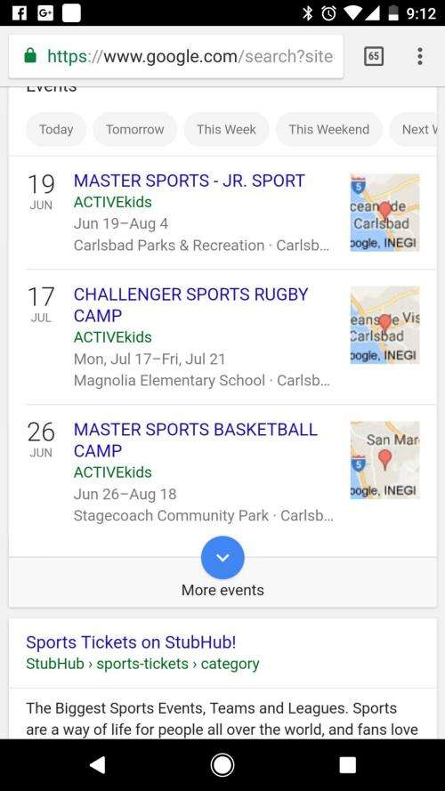
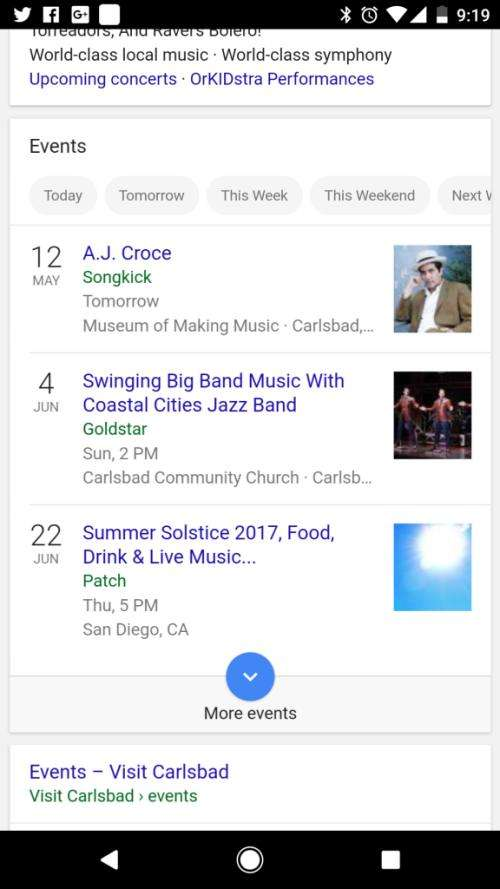

## Events Finder at Google

This week Google rolled out an event finder on its mobile search app. You can read about it on:

[Google Search will now help you find nearby events](https://techcrunch.com/2017/05/10/google-search-will-now-help-you-find-nearby-events/)

The TechCrunch article tells us that Google is working on suggestions for developers to have their events listed in search results – so we should be keeping an eye out for those as they get published.

I wrote about a patent here, in a post in November that talked about [Ranking Events in Google Search Results](https://www.seobythesea.com/2016/11/ranking-events-in-google-search-results/), which focused upon a Google patent that had been granted August 23, 2016 titled [Ranking events](https://patents.google.com/patent/US9424360).

This Google Event Finder is available in the United States starting today, but the Techcrunch article tells us that there are no plans for international expansion.

I tried a search for “sports events near me” on my phone this morning, and I did get the following result:

I’m wondering what events results look like in more urban areas. I did also search for music events:

I suspect that this new Google event finder might get a lot of use from people looking for something to do.

I like that it is including events from local schools and museums. It looks useful.

Updated May 22, 2019
