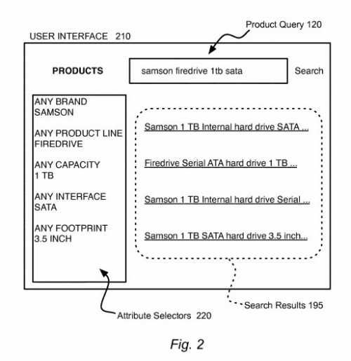
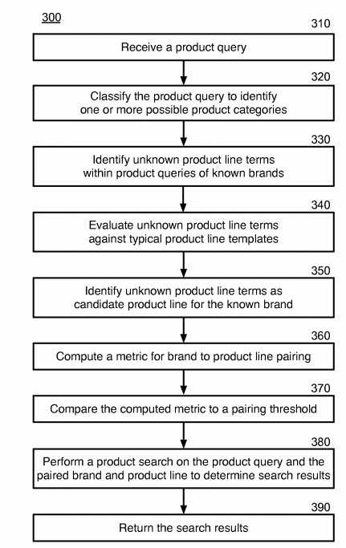

## New Product Lines in Product Search

It’s interesting seeing patents from Google that focus on eCommerce topics such as product lines. The last one had Google distinguishing between products and accessories in search results. I wrote about it in [Ranking Search Results and Product Queries](https://gofishdigital.com/ranking-search-results-and-product-queries/).

A new patent from Google is on new products appearing in existing product lines. An example is a laptop with more Ram or a bigger hard drive or a camera with a zoom lens that it didn’t have before.

This patent determines in product searches whether a query is looking for a specific product line from within a specific brand.

## Google is Trying to Understand the Intent Behind Shopping Queries

Searchers often search for products offered for sale. Google is trying to understand the intent behind shopping-related search queries.

For Google to do that well, it has to understand different aspects of product categories. This can include such things as whether a product :

- Gets associated with a brand
- Is in a specific product line

The patent tells us it needs to detect terms designating product lines from within product queries from searchers.

That includes associating detected product line terms along with their corresponding brands. That would let Google keep up with new product lines and retiring product lines soon after changes occur.

Under the new Google patent is a process aimed at determining product lines from product search queries:

- Classifying a product query to identify a product category
- Identifying a brand for the product query
- Choosing the brand from a list of known brands for the product category

## Unknown Product Lines

The patent tells us that it may identify unknown product line terms within a product query.

A metric may state how well the unknown product line terms correspond to an actual product line within the brand.

The metric may get compared to a specified threshold. For example, the unknown product line terms may get designated as a new product line if the metric compares to the specified threshold.

A product search may get performed using the product query. Product search results may become returned according to the product search.

This product lines patent is at:

[Detecting product lines within product search queries](http://patft.uspto.gov/netacgi/nph-Parser?Sect1=PTO1&Sect2=HITOFF&d=PALL&p=1&u=%2Fnetahtml%2FPTO%2Fsrchnum.htm&r=1&f=G&l=50&s1=10,394,816.PN.&OS=PN/10,394,816&RS=PN/10,394,816)
Inventors: Ritendra Datta
Assignee: GOOGLE LLC
US Patent: 10,394,816
Granted: August 27, 2019
Filed: December 27, 2012

Abstract

> Systems and methods can determine product lines product searches.
>
> Computing devices can receive a product query of search terms. The product query may get classified to identify a product category. A brand may become identified for the product query. The brand may get selected from a list of known brands for the product category.
>
> Unknown product line terms may get identified within the product query. A metric may get computed to state how well the unknown product line terms correspond to an actual product line within the brand. The metric may get compared to a specified threshold. The unknown product line terms may become a new product line if the metric favorably compares to the specified threshold. A product search may get performed on the product query. Product search results may get returned according to the product search.

## High Precision Query Classifiers

This product patent shows Google tries to identify new products and product lines to distinguish them from older product lines.

Interestingly, Google is looking at search queries to identify products and product lines. As the patent tells us:

> Product lines associated with product brands may get determined from analyzing the received product search queries.

A “high-precision query classifier,” is mentioned in the patent, and that is the first time I have seen that mentioned anywhere at all.

How does a “high precision query classifier” work?

As described in this patent:

- A search query may be automatically mapped to a product category
- It may use a list of known brands within the product category to identify terms within the product query specifying the product brand
- A list of known category attributes may identify terms within the product query specifying attributes of the product getting searched

## Attributes of Products

The patent provides some examples of attributes of products:

- Amount of megapixels for digital cameras
- RAM memory for laptop computers
- Cylinders for a motor vehicle

## Product Query Forms

The forms that a product query may take may vary a bit, but we see some examples.

A product query could take the form “[B] [PL] [A].”

> In such a query form, one or more terms [B] may indicate a brand that is a known brand within a list of known product brands, and one or more terms [A] may state attributes that become known attributes of the category. One or more unknown terms [PL] may then get identified as a potential new product line. Such identification may get strengthened where [PL] is in a form associated with product lines. The identification may also get strengthened where [PL] gets found with a brand [B] frequently within various product queries. The identification may be further strengthened where the terms [PL] are infrequently or never found with brands other than the brand [B] throughout many products queries over time.

A metric compares the attributes of products from a new product line with attributes of an actual product line associated with a brand.

The metric may consider the number of unique product queries containing the terms [PL] having the correct structure and/or category along with the extent to which [B] dominates among every query that has a brand preceding [PL].

Why would Google look at Queries to learn about new product lines from brands instead of from product pages describing the attributes of products?

## Identifying Product Lines

How this identification process may work using:

- Software for product line resolution, which may identify product lines associated with brands for product categories determined by the query classifier
- Product line resolution may use a category attribute dictionary and a product brand dictionary to establish pairings between brands and product lines
- The product query and the determined brands and product lines may get provided to a product search engine
- A product search engine may then provide search results to the searcher
- The query classifier may map the product query to a product category
- That Product line resolution can use product category information with the category attribute dictionary and the product brand dictionary to identify terms from the product query about specific product lines relate to product lines
- The unknown terms identified by the product line resolution module for a category may get fed back into the category attribute dictionary as attributes for that category
- Each identified product line may become related to a particular brand listed in the product brand dictionary
- A brand-product dictionary can provide a list of known brands within various product categories
- The known brands may determine and resolve terms associated with product lines within each brand
- Also, the product line terms may then identify a potential new product line

## Strengthening the Identification of New Product Lines

The identification of a new product line may get strengthened:

- When unknown terms information is in a form associated with product lines
- Where the unknown terms get found with a brand frequently over time within various product queries
- Unknown terms are infrequently, or never, found with brands other than the brand identified throughout many products queries over time

## Identifying When Unknown Terms Maybe in a Form Associated with Product Lines

Here are some observations about the form of product lines:

- Generally start with a letter
- Contain few or no numbers (differentiating product line terms from model numbers or serial numbers
- Related to a category or a brand (One brand may generally have single word product lines while a second brand may use two-word product lines where the first word relates to performance and a second word is a three-digit number

These kinds of patterns or forms about product lines could associate unknown terms within a product query as product line terms.

## Using a Category Attribute Dictionary to Resolve Product Line Terms within Product Queries

The category attribute dictionary can provide a dictionary of attributes associated with various product categories and brands.

Terms from the category attribute dictionary may get used to resolving product line terms within the product query.

When unknown terms are often found within product queries along with brand information, those unknown terms could become seen as product line terms associated with a specific brand, when known attribute terms get found in the category attribute dictionary to be consistent with a brand [B] or the category associated with the product query by the query classifier.

## Product Query Processing

The patent includes this flowchart to describe the process behind the product search patent:

## Where does Google Learn About Product Lines?

The product patent doesn’t mention product schema, or merchant product feeds. However, it does tell us that it is getting a lot of information about product lines from searcher’s queries.

Google also collects information about products and product attributes from websites that sell those products, in addition to looking at product queries, as described in this patent.

Collecting such information from site owners may be the starting source of much information that can get found in the product and category dictionaries and product attribute categories mentioned in this patent.

The process of updating information about products and product lines from product queries from searchers is a way to crowdsource information about products from searchers and get an idea of how much interest there might be in specific products.

## Google Can Learn About Products From Product Data Feeds

Google can learn a lot about products from [product data feeds](https://support.google.com/merchants/answer/7439882?hl=en) that merchants submit to Google. Google is trying to get merchants to submit product feeds even if they don’t use paid product search, to make those products visible in more places on Google in Surfaces across Google as described on this Google Support page: [Show your products on Surfaces Across Google](https://support.google.com/merchants/answer/9199328?hl=en).

We saw that Google is using product feed information to help it distinguish between product pages and accessory pages for those products, as I wrote about in the blog post I linked to at the start of this post.

And, Google also describes product markup on their developers page [Product](https://developers.google.com/search/docs/data-types/product). We also see Google telling site owners that they should include that markup for their products because:

> Product markup enables a badge on the image in mobile image search results, which can encourage more users to click your content.

The search engine is collecting information about products from product feeds, product schema, product web pages, and product queries from searchers. Google is collecting a lot of data about products. That could enable Google to be pretty good at providing answers to product queries. It can also help them to understand when new product lines have gotten launched.
