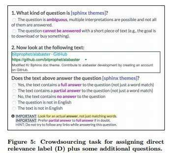

## A Search Results Evaluation Model Whitepaper

Search Results (SERPS) are no longer about showing pages ordered by rankings for a query term. A Google paper shows us a different way of thinking about them in this age of structured Snippets and featured snippets mixed with URL search results, with a Search Results Evaluation Model. The Search Results Evaluation Model paper is:

[Incorporating Clicks, Attention and Satisfaction into a Search Engine Result Page Evaluation Model](https://static.googleusercontent.com/media/research.google.com/en//pubs/archive/45562.pdf) by Aleksandr Chuklin, Google Research Europe & University of Amsterdam and [Maarten de Rijke](https://staff.fnwi.uva.nl/m.derijke/), University of Amsterdam

Search engine results have gone through some significant changes over the past couple of years. A paper from the CIKM 16 conference on October 24-28, 2016, recently published on the Research at Google pages, describes some user behavior that may take place around search results. The benefit that the paper brings us is that it describes:

> In this paper, we propose a model of user behavior on a SERP that jointly captures click behavior, user attention, satisfaction, the CAS model and demonstrates that it gives more accurate predictions of user actions and self-reported satisfaction than existing models based on clicks alone.

## Good Abandonment

Sometimes people search and expect to find answers to their questions in search results. These days of featured snippets may happen more frequently than when answers appear in snippets for pages featured in results. So, sometimes a set of SERPS can answer questions without any clicks.

This paper doesn’t describe the idea of entity metrics. Still, it reminds me of how the Google patent presented SERPS differently than just a presentation of URLs ordered based on Information Retrieval and PageRank scores. It is a slightly different set of things to think about when doing a Search Results Evaluation. It’s recommended reading:

[Structured Data & The SERPs: What Google’s Patents Tell Us About Ranking In Universal Search](https://searchengineland.com/structured-data-serps-googles-patents-tell-us-ranking-universal-search-219205)

There are different reasons why some pages or entities show up in search results than just a rank, and they can have value, satisfy searchers, and even lead to clicks that may educate or entertain.

Back seven years ago, I wrote about a paper from Google and Yahoo researchers that talked about satisfaction with search results. It was titled, [Evaluating the Relevancy of Search Results Based upon Position](https://www.seobythesea.com/2009/09/evaluating-the-relevancy-of-search-results-based-upon-position/). The paper focused on the importance of where results were ranking in search results. There are possibly other things to consider these days.

Like the idea that a searcher might find an answer to their question and not have to click through to a page to find their answer. It can save them time and effort in finding pages pointed out by search results. That would be a case of “good abandonment.”

## Click Models

This new paper also talks about user clicks being a sign of possible satisfaction. Very different from the kind of biometric satisfaction that I wrote about in, [Satisfaction a Future Ranking Signal in Google Search Results?](https://www.seobythesea.com/2016/04/satisfaction-future-ranking-signal-google-search-results/).

This paper instead talks about a Clicks, Attention, and Satisfaction (CAS) model. It provides some information about each of those things in the context of human raters that might interact with search results.

The paper tells us about some of the crowdsourcing approaches used with human evaluators, including a glimpse at some questions asked to determine the relevance of results.

## Takeaways

The Search Results Evaluation Model doesn’t tell you how to show up in search results or rank higher. It does tell you how search results are changing and evolving. For example, search engines are trying to understand better when results might answer questions posed by searchers in search results. They also tell us that they are using human evaluators to understand how relevant search results might be. They are also looking at how satisfied searchers might be with the search engine.

Human Evaluators might start judging how well question-answering snippets satisfy people looking for answers to their questions, which is good to see.
