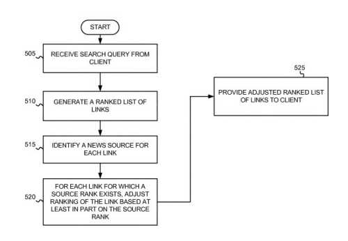

Image: Photo by [Nathan Dumlao](https://unsplash.com/@nate_dumlao?utm_source=unsplash&utm_medium=referral&utm_content=creditCopyText) on Unsplash

## Did Google’s News Ranking Algorithm Change?

A Google Patent about how Google ranks news articles was updated this week, and in this case, it suggests how entities in those documents can impact ranking.

## How Has the News Ranking Algorithm worked at Google?

This News Ranking Algorithm Patent was first filed in 2003.

The beta version of [Google News](https://en.wikipedia.org/wiki/Google_News) was first launched by Google in 2002. This was one of the early patents that described how Google ranked news articles.

One of the inventors of the original patent was [Krishna A. Bharat](https://www.linkedin.com/in/krishna-bharat-a1a1805a/), known as a founder of Google News.

The newest Google News Ranking Algorithm (a continuation patent) was granted and is the Sixth Version of the patent. It can be found at:

[Systems and methods for improving the ranking of news articles](http://patft.uspto.gov/netacgi/nph-Parser?Sect1=PTO1&Sect2=HITOFF&d=PALL&p=1&u=%2Fnetahtml%2FPTO%2Fsrchnum.htm&r=1&f=G&l=50&s1=10,459,926.PN.&OS=PN/10,459,926&RS=PN/10,459,926)
Inventors: Michael Curtiss, Krishna A. Bharat, and Michael Schmitt
Assignee: Google LLC
US Patent: 10,459,926
Granted: October 29, 2019
Filed: April 27, 2015

This version of the patent tells us about previous versions of the news ranking algorithm. It showed when they were filed and what the patent numbers of the earlier 5 versions were:

> This application is a
>
> **(1)** continuation of U.S. patent application Ser. No. 14/140,108, filed on Dec. 24, 2013, which is a
>
> **(2)** continuation of U.S. patent Ser. No. 13/616,659, filed on Sep. 14, 2012 (now U.S. Pat. No. 8,645,368), which is a
>
> **(3)** continuation of U.S. patent application Ser. No. 13/404,827, filed Feb. 24, 2012, (now U.S. Pat. No. 8,332,382), which is a
>
> **(4)** continuation of U.S. patent application Ser. No. 12/501,256, filed on Jul. 10, 2009, (now U.S. Pat. No. 8,126,876), which is a
>
> **(5)** continuation of U.S. patent application Ser. No. 10/662,931, filed Sep. 16, 2003, (now U.S. Pat. No. 7,577,655),
>
> the disclosures of which are hereby incorporated by reference herein.

## What is a Continuation Patent?

Continuation Patents use the date of the original patent filing they continue (or the ones those patents continue). They show how the process described by the patents has changed. The processes are shown in the claims sections of the patents. Those are the parts of the patents which the prosecuting patent officer reviews when deciding to grant the new patents.

Looking at the first claim of each patent can often help identify important aspects that have changed from one version to another. It is rare (in my experience) to see a patent that has been updated 6 times as this one has. Google’s Universal Search Interface patent was also recently updated a fourth time – [Google’s New Universal Search Results](https://gofishdigital.com/new-universal-search-results/).

## What Caused A Recent News Ranking Change at the New York Times?

A post on Twitter this week suggested that The New York Times may have been negatively impacted by a new Algorithm called Bert that was just released at Google, which was announced in [Understanding searches better than ever before](https://www.blog.google/products/search/search-language-understanding-bert/).

> Feels huge to us at NYT. But it coincided with the move to mobile-1st indexing — so we're not sure what's causing changes
>
> — Hannah Poferl (@HannahPoferl) [October 30, 2019](https://twitter.com/HannahPoferl/status/1189508560364998656?ref_src=twsrc%5Etfw)

That Tweet tells us that BERT may have impacted, or a move to Mobile-First Indexing may have caused a loss of rankings at the Newspaper’s site. But seeing that tweet and seeing a new version of this patent made me curious to see what it contained and the changes it may have brought about.

## The Changing Claims from the News Ranking Algorithm

Other changes at Google could also have an impact on rankings at news sites. One way to tell how Google changed it is how ranks articles look at how the patent covering the ranking of news articles has changed over time.

*Compare How the first 4 claims from this patent have changed over time.*

The latest first claim in this patent introduces some new things to look at

> What is claimed is:
>
> 1. A method for ranking results, comprising: receiving a list of objects; identifying a first object in the list and a first source with which the first object is associated; identifying a second object in the list and a second source with which the second object is associated; determining a quantity of named entities that (i) occur in the first object that is associated with the first source, and (ii) do not occur in objects that are identified as sharing a same cluster with the first object but that are associated with one or more sources other than the first source; computing, based at least on the quantity of named entities that (i) occur in the first object that is associated with the first source, and (ii) do not occur in objects that are identified as sharing a same cluster with the first object but that are associated with one or more sources other than the first source, a first quality value of the first source using a first metric, wherein a named entity corresponds to a person, place, or organization; computing a second quality value of the second source using a second metric that is different from the first metric; and ranking the list of objects based on the first quality value and the second quality value.
>
> 2. The method of claim 1 wherein identifying the first source with which the first object is associated includes: identifying the first source based on a uniform resource locator (URL) associated with the first object.
>
> 3. The method of claim 1 wherein the first source is a news source.
>
> 4. The method of claim 1 wherein computing the first quality value of the first source is further based on one or more of several articles produced by the first source during the first period, an average length of an article produced by the first source, an amount of important coverage that the first source produces in a second period, a breaking news score, network traffic to the first source, a human opinion of the first source, circulation statistics of the first source, a size of a staff associated with the first source, several bureaus associated with the first source, breadth of coverage by the first source, many different countries from which traffic to the first source originates, and a writing style used by the first source.

From the version of the patent that was filed on Sep. 14, 2012 (now U.S. Pat. No. [8,645,368](http://patft.uspto.gov/netacgi/nph-Parser?Sect1=PTO1&Sect2=HITOFF&d=PALL&p=1&u=%2Fnetahtml%2FPTO%2Fsrchnum.htm&r=1&f=G&l=50&s1=8,645,368.PN.&OS=PN/8,645,368&RS=PN/8,645,368)):

> What is claimed is:
>
> 1. A method comprising: determining, using one or more processors and based on receiving a search query, articles and respective scores; identifying, using one or more processors, for an article of the articles, a source with which the article is associated; determining, using one or more processors, a score for the source, the score for the source is based on a metric that represents an evaluation, by one or more users, of the source, and an amount of traffic associated with the source; and adjusting, using one or more processors, the score of the article based on the score for the source.
>
> 2. The method of claim 1, where identifying the source includes identifying the source based on an address associated with the article.
>
> 3. The method of claim 1, where determining the score includes accessing a memory to determine the score for the source.
>
> 4. The method of claim 1, where the score for the source is further based on a length of time between an occurrence of an event and publication, by the source, of an article associated with the event.

From the Version of the patent filed on Feb. 24, 2012, (now U.S. Pat. No. [8,332,382](http://patft.uspto.gov/netacgi/nph-Parser?Sect1=PTO1&Sect2=HITOFF&d=PALL&p=1&u=%2Fnetahtml%2FPTO%2Fsrchnum.htm&r=1&f=G&l=50&s1=8,332,382.PN.&OS=PN/8,332,382&RS=PN/8,332,382)):

> What is claimed is:
>
> 1. A computer-implemented method comprising: obtaining, in response to receiving a search query, articles and respective scores; identifying, using one or more processors, for an article of the articles, a source with which the article is associated; determining, using one or more processors, a score for the source, based on polling one or more users to request the one or more users to provide a metric that represents an evaluation of a source and based on a length of time between an occurrence of an event and publication, by the source, of another article associated with the event; and adjusting, using one or more processors, the score of the article based on the score for the source.
>
> 2. The method of claim 1, where identifying the source includes identifying the source based on an address associated with the article.
>
> 3. The method of claim 1, where adjusting the score of the article includes: determining, using the score for the source, a new score for the article associated with the source, and adjusting the score of the article based on the determined new score.
>
> 4. The method of claim 1, where the score for the source is further based on a usage pattern indicating traffic associated with the source.

From the version of the patent filed on February 10, 2009, (Now U.S. Pat. No. [8,126,876](http://patft.uspto.gov/netacgi/nph-Parser?Sect1=PTO1&Sect2=HITOFF&d=PALL&p=1&u=%2Fnetahtml%2FPTO%2Fsrchnum.htm&r=1&f=G&l=50&s1=8,126,876.PN.&OS=PN/8,126,876&RS=PN/8,126,8768,126,876)):

> What is claimed is:
>
> 1. A method, performed by one or more server devices, the method comprising: receiving, at one or more processors of the one or more server devices, a search query, from a client device; generating, by one or more processors of the one or more server devices and in response to receiving the search query, a list of references to news articles; identifying, by one or more processors of the one or more server devices and for each reference in the list of references, a news source with which each reference is associated; determining, by one or more processors of the one or more server devices and for each identified news source, whether a news source rank exists; determining, by one or more processors of the one or more server devices and for each reference with an existing corresponding news source rank, a new score by combining the news source rank and a score corresponding to a previous ranking of the reference; and ranking, by one or more processors of the one or more server devices, the references in the list of references based, at least in part, on the new scores.
>
> 2. The method of claim 1, where determining whether each news source rank exists, includes accessing a database to locate the news source rank.
>
> 3. The method of claim 1, further comprising: providing the ranked list of references to the client device.
>
> 4. The method of claim 1, where determining the new score comprises: determining, for each reference with an existing corresponding news source rank, a weighted sum of the news source rank and the score corresponding to the previous ranking of the reference.

And the Very First Version of the patent filed on September 16, 2003, (Now U.S. Pat. No. [7,577,655](http://patft.uspto.gov/netacgi/nph-Parser?Sect1=PTO1&Sect2=HITOFF&d=PALL&p=1&u=%2Fnetahtml%2FPTO%2Fsrchnum.htm&r=1&f=G&l=50&s1=7,577,655.PN.&OS=PN/7,577,655&RS=PN/7,577,655)):

> What is claimed is:
>
> 1. A method comprising: determining, by a processor, one or more metric values for a news source based at least in part on at least one of a number of articles produced by the news source during a first time period, an average length of an article produced by the news source, an amount of coverage that the news source produces in a second time period, a breaking news score, an amount of network traffic to the news source, a human opinion of the news source, circulation statistics of the news source, a size of a staff associated with the news source, a number of bureaus associated with the news source, a number of original named entities in a group of articles associated with the news source, a breadth of coverage by the news source, a number of different countries from which network traffic to the news source originates, or a writing style used by the news source determining, by the processor, an importance metric value representing the amount of coverage that the news source produces in a second time period, where the determining an importance metric includes: determining, by the processor, for each article produced by the news source during the second time period, a number of other non-duplicate articles on a same subject produced by other news sources to produce an importance value for the article, and adding, by the processor, the importance values to obtain the importance metric value; generating, by the processor, a quality value for the news source based at least in part on the determined one or more metric values; and using, by the processor, the quality value to rank an object associated with the news source.
>
> 2. The method of claim 1 where the determining includes: determining, by the processor, a plurality of metric values for the news source.
>
> 3. The method of claim 2 where the generating includes: multiplying, by the processor, each metric value in the plurality of metric values by a factor to create a plurality of adjusted metric values, and adding, by the processor, the plurality of adjusted metric values to obtain the quality value.
>
> 4. The method of claim 3, where the plurality of metric values includes a predetermined number of highest metric values for the news source.

## How the News Ranking Algorithm Claims Differ

An analysis of changes over Time to the patent for “Systems and methods for improving the ranking of news articles” should reflect how Google has changed how they have been implementing that patent.

In the claims for the very first patent (filed in 2003), we can see that Google was looking at metric values for different news sources to rank the content that those sources were creating. So that very long first claim from that version of the patent list several metrics to use to rank news sources, and that ranking influenced the ranking of news articles. So a story from a very well-known news agency would tend to rank higher than a story from a lesser-known agency.

The version of the patent filed in 2009 still focuses upon news sources (and a “news source rank”), along with references to the news articles generated by those news sources.

The version of the patent filed in February 2012 again tells us about a score for a news article that is influenced by a score for a news source, but it doesn’t include the many metrics that the 2003 version of the patent does.

The version of the patent filed in September 2012 Holds on to the score for the source but tells us that score is based on a metric that represents an evaluation, by one or more users, the amount of traffic associated with the source, and a score for the article based upon a score for the source.

The most recent published version of this news ranking algorithm patent, filed in April 2015 and granted in October 2019, introduces some changes in how Google may rank news articles. For example, it tells us how articles covering different topics are placed in clusters (which isn’t new in itself) and how those articles may rank higher than other articles by covering more entities covered by articles in the same clusters.
