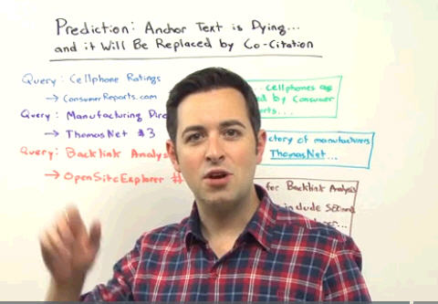
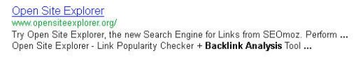
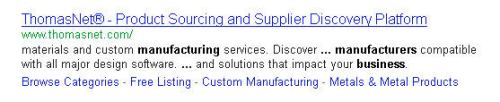

Last Friday, in a well-received and thoughtful White Board Friday at SEOmoz titled Prediction: Anchor Text is Dying…And Will Be Replaced by Co-citation (title changed at SEOmoz) [Prediction: Anchor Text is Weakening…And May Be Replaced by Co-Occurrence](https://moz.com/blog/prediction-anchor-text-is-dying-and-will-be-replaced-by-cocitation-whiteboard-friday), Rand Fishkin described how some unusual Search Results caused him to question how Google was ranking some results.

I’m a big fan of looking at and trying to analyze and understand search results for specific queries, especially when they include results that appear somewhat puzzling, and I think those provide some great fodder for discussions about how Google might be ranking some search results. Thanks, Rand.

In Rand’s presentation, he pointed out that:

- **Consumerreports.com** ranks well for the term “cell phone ratings,” without using the terms “cell phone” or “ratings,” or uses some of those words, but not in the page title, or in other prominent places on the page.

- **Thomasnet.com** ranks very well for the term “manufacturing directory,” without using those words, and without appearing to try to rank for them, based upon the content that appears on the page.

- SEOmoz’s **Open Site Explorer** also ranks very well for the term “backlink analysis,” again without using those words (except maybe in alt text on the page, and in the past as part of the title for the page).

While these are all terms that those pages might be assumed to rank for because they are pretty descriptive of what those sites do, It doesn’t appear that any of the pages were purposefully optimized for those terms with the content of those pages.

**The Death of Anchor Text?**

We do know that many pages tend to rank well for some query terms because of links to those pages that include anchor text for those terms, even if the terms don’t appear on the pages, and this has been part of how Google has operated for years.

But I’m looking at the search results that Rand mentioned, and the pages do seem somewhat (ok, poorly) optimized for those terms.

In the snippet for Open Site Explorer, we do see “backlink analysis” appear highlighted, and that is taken from alt text for an image on the page.

In the snippet for Consumerreports, on a search for [cell phone ratings] I’m seeing “cell phones” and “reviews” highlighted in the Title for the page (which is http://www.consumerreports.org/cro/cell-phones-services.htm – Google shows the breadcrumb for that page in its search result rather than its URL), and shows the following as a snippet for the page which also shows those terms and a synonym for one of the terms as highlighted as well:

In the snippet for the Thomasnet homepage on a query of [manufacturing directory], we also see some terms from Rand’s query highlighted in the snippet for the page, including the word “business” which Google might be using in this context as a synonym for “manufacturing”:

The term “directory” doesn’t appear on the page, or within its HTML code, but if Google hasn’t categorized the site as a directory at some point in the past, it’s time for Google to start over. The site is a manufacturing directory. Google has published a patent on reranking search results when a category for a query and a category for a page matches, and can boost a result in search results based upon their matching (more on that below).

But let’s ignore the fact that these terms and/or synonyms for them do show up on the pages in some ways.

Regardless of whether pages are optimized on-page for certain terms, the relevance for hypertext using certain terms can also help pages rank for those terms, even if the terms don’t appear upon the pages themselves. It used to be that when you looked at the cached copy of a page in a search, it would tell you whether or not the page ranked for your query terms if the terms didn’t appear on the page. None of the cached versions of these pages tell us that, but it’s possible that Google no longer shares that information with us.

For example, the page to download the Adobe Reader has ranked #1 for years for the term [click here] without having the phrase on the page (it does have the word “clicking,” but there are a lot of links on the Web pointing to the page that uses the anchor text “click here”. It’s presently at # 2 right now, but that’s still pretty impressive.

The lack of Rand’s query terms on these pages in substantial ways and the fact that they rank for the terms seems to be an argument that Anchor text relevance potentially could be as strong and powerful as ever, especially if there are a lot of links to those pages that use that anchor text.

But let’s say that there aren’t, even though it wouldn’t be surprising at all if Thomasnet has some nice links to it from some high-quality pages using the link text “manufacturing directory,” or the Consumer Reports page on Cell phone services was linked to with anchor text using the phrase “cell phone ratings,” or that the Open Site Explorer was linked to with the anchor text “backlink analysis.”

Rand’s presentation doesn’t tell us whether or not he did some kind of backlink analysis (using OSE may be) to see how many links are pointed at consumer reports or Thomasnet or the Open Site Explorer that might have included those terms in anchor text pointing to the pages. It would have helped answer the question in Rand’s presentation about whether anchor text is dead or not, but it might have helped change how we believe anchor text works if there weren’t a lot of links using those phrases pointing to those pages as well.

So, let us ignore the use of some of the terms in the queries on the pages (especially since those pages are mostly poorly optimized for the terms), and let’s ignore whether or not anchor text pointing to those pages might influence how they rank.

**Co-Citation or Co-Occurrence?**

Before we dig further into those though, the term Rand used to describe this phenomenon (co-citation) stirred up some cognitive dissonance in me. Things that co-cite cite things together. Here he’s not describing citations but rather whether or not terms tend to appear on the same pages. Citations don’t necessarily have to be linked, and if you search through Google scholar, you’ll see lots of scientific documents that contain lots of footnotes and citations to other documents within them. PageRank could be easily said to be based upon those types of academic citations, and it has been many times.

Jim Boykin called Co-Citation a potential ranking factor back in 2006, in his post [Co Citation – understanding how it affects your SEO](https://www.internetmarketingninjas.com/blog/jim/co-citation-understanding-how-it-effects-your-seo/), but he was talking about a very different concept, which has its roots in how different pages with similar content might be cited by third party sites, and the more frequently that kind of co-citation happens, the more similar the pages being linked to might be considered to be.

Rand does tell us that he has noticed that the ranking pages he pointed out, and the terms they ranked well for tend to co-occur frequently on the same pages.

It does seem that Rand is referring to co-occurrence, and his mention of how words do co-occur on many of the same pages made me think of Google’s Phrase-Based Indexing approach, which I’ll discuss in more detail a little later. Co-occurrence is an important part of Phrase-Based Indexing, and how “related” some terms might be can be based upon it. Perhaps Rand meant to use co-occurrence?

Under the Phrase-Based Indexing patents, the anchor text that uses related terms might also carry more or less weight based upon the strength of those relationships. Link to a page about sailboat rudders with the anchor text “doggie treats,” and the hypertext relevance of that link might not be the same as if you used something like “sailboats,” or “rudders” (The Phrase-Based Indexing patents are the only ones I’ve seen from Google that describe how they can be used to overcome “Google Bombing.”)

So let’s take a quick peek at some reranking approaches that could cause pages to rank well for a query term even though on their faces they might not seem as relevant for a term.

**Reranking Algorithms on Top of Traditional Ranking Approaches**

The examples that Rand provided do seem to go against a traditional ranking approach that looks at words and content used on a page to create an information retrieval ranking score when combined with a link analysis approach like PageRank, that can be used as an importance score for a page.

Many of the ranks of pages for a query are often based upon such a combination. I have written several posts though that describes how these original rankings might then be influenced by a re-ranking approach that can boost some pages in rankings, and reduce the rankings of other pages.

Here are a few of those:

- [20 Ways Search Engines May Rerank Search Results](https://www.seobythesea.com/2006/10/20-ways-search-engines-may-rerank-search-results/)
- [20 More Ways that Search Engines May Rerank Search Results](https://www.seobythesea.com/2007/09/20-more-ways-that-search-engines-may-rerank-search-results/)
- [Another 10 Ways Search Engines May Rerank Search Results](https://www.seobythesea.com/2010/06/another-10-ways-search-engines-may-rerank-search-results/)

I’ve written many additional posts about methods described in patents and papers that cover other reranking approaches as well. It’s probably time for one or more in this reranking series covering things like results for recency sensitive queries, results influenced by social signals, rerankings where if categories for queries and categories for web pages match then those pages might be boosted in results, and others as well.

**Localized Organic Results as a Reranking Approach**

Google’s localized organic search results that may insert local results for certain competitive query terms into the first page of search results, like for dentists or hospice, is another example of a reranking approach in use. Those local pages may not be as relevant and/or as important (based upon PageRank in part or full) as the other results surrounding them, but they’ve been boosted in rankings because they are relevant for the locations of people performing those searches – even though the queries don’t include geographic terms.

In a search for [hospital] from my location in Virginia, Google shows local maps results first, an entry from Wikipedia, and then several results showing hospitals around me. These hospital pages likely don’t rank as highly as other pages for the query [hospital], but since they are nearby and are likely organically ranked well for the term, they have been boosted in search results via a reranking approach. There is a hospital within my town that isn’t there, but the localized organic algorithm isn’t the same one that powers Google’s local search.

![Some first page search results for the query term \[hospital\] that only rank that highly because of Google's localized organic search algorithm.](media/hospital-serps.jpg)

**Other Reranking Approaches**

***Phrase-Based Indexing and Anchor Text Weight***

Under Phrase-Based Indexing, not all anchor text carries an equal relevance weight, and Google’s phrase-based indexing patents describe how anchor text might be weighted based upon whether or not links use “related” phrases, which are found in documents where phrases returned in response to a particular query tend to **co-occur**. The more related the phrase, the more hypertext relevance it might pass along.

See Google’s patent [Phrase-based indexing in an information retrieval system](http://patft.uspto.gov/netacgi/nph-Parser?Sect1=PTO2&Sect2=HITOFF&p=1&u=%2Fnetahtml%2FPTO%2Fsearch-adv.htm&r=1&f=G&l=50&d=PALL&S1=07536408&OS=PN/07536408&RS=PN/07536408), and the section in the description with the heading “b) Ranking Documents Based on Anchor Phrases.”

**Reasonable Surfer Model**

The reasonable surfer model also shows how different links might be weighted, based upon a combination of several features associated with those links, including the location on pages (a higher weight to main content links than blog comments, as one of the features, considered), how they are presented (font size, color, style), relevance to the content on the page they are located upon and on the page targeted by the link.

I wrote about the patent in the post, [Google’s Reasonable Surfer: How the Value of a Link May Differ Based upon Link and Document Features and User Data](https://www.seobythesea.com/2010/05/googles-reasonable-surfer-how-the-value-of-a-link-may-differ-based-upon-link-and-document-features-and-user-data/), and the patent is at [Ranking documents based on user behavior and/or feature data](http://patft.uspto.gov/netacgi/nph-Parser?Sect1=PTO2&Sect2=HITOFF&u=%2Fnetahtml%2FPTO%2Fsearch-adv.htm&r=1&p=1&f=G&l=50&d=PTXT&S1=7,716,225.PN.&OS=pn/7,716,225&RS=PN/7,716,225)

The patent doesn’t mention the word PageRank at all, though the inventor’s reference to a “reasonable surfer model” is a play upon the “random surfer model” that Lawrence page used to describe how PageRank works. Instead of “PageRank,” the patent refers to the amount of ranking “weight” that a link might pass along from one page to another, and it includes some examples of how the anchor text used could influence that weight:

The patent includes many features associated with a link, and I’ve included a handful that involves which text is used within a link, and how they might be analyzed.

- Actual words in the anchor text associated with the link
- Commerciality of the anchor text associated with the link
- A topical cluster with which the anchor text of the link is associated
- A degree to which a topical cluster associated with the source document matches a topical cluster associated with anchor text of a link

Under the Reasonable Surfer model, the relevance value of a link possibly might be increased or decreased based upon not only the text used in a link, but also how relevant that text might be to the text of the page it appears upon, and the text of the page that the link targets. It might also be increased or decreased in value based upon how and where it’s displayed on a page.

Is the weight discussed only about PageRank, or is it also about hypertext relevancy? Given under this approach that the actual text with links, and the text on both the source and target pages matter, its possible that both are impacted.

**Reranking Based on Categories**

Google may assign categories to web pages, and categories to query terms. When search results for a query that has been given a category are returned, web pages that fit that category might be boosted in search results. Chances are good that the query [manufacturing directory] is in a “directory” category, and maybe even in a “business directory” category. Chances are also good that the home page of Thomasnet.com is also in the same categories.

If this reranking based on categories algorithm is being used, then the Thomasnet page could have been boosted in search results. See: [How Google May Use Categories as a Search Ranking Factor](https://www.seobythesea.com/2010/10/how-google-may-use-categories-as-a-search-ranking-factor/)

**Entity Association**

There’s likely also some kind of entity association or category association or both involving the brands involved (one type of entity) and the terms used. This is another factor that could easily boost those particular pages in search results, regardless of the Information Retrieval score and PageRank score. See [10 Most Important SEO Patents: Part 6 – Named Entity Detection in Queries](https://www.seobythesea.com/2012/01/named-entity-detection-in-queries/) for some discussion on one approach that Google uses to rerank search results based upon entity associations.

ConsumerReports.org, Thomasnet.com, and the Open Site Explorer could all be considered entities, and the query terms in Rand’s presentation are all terms that could be considered by Google’s entity approach to be associated with those specific entities.

**Synonyms and Rankings**

Google has several patents involving synonyms and meeting informational needs that describe how a page that ranks highly for one term might also rank highly for terms that are synonyms or that fulfill an equivalent informational need. So we see in the snippet above for Thomasnet.com, that on a search for [manufacturing directory], the word “business” is highlighted.

Google has told us in the past that when a synonym is used to determine the relevance of a result, that if it appears in the page title or snippet shown to searchers within a search result, that they would highlight the term. See: [Helping computers understand language](https://googleblog.blogspot.com/2010/01/helping-computers-understand-language.html)

In that post, we are told:

> Historically, we have bolded synonyms such as stemming variants — like the word “picture” for a search with the word “pictures.” Now, we’ve extended this to words that our algorithms very confidently think mean the same thing, even if they are spelled nothing like the original term. This helps you to understand why that result is shown, especially if it doesn’t contain your original search term. In our [pictures developed with coffee] example, you can see that the first result has the word “photos” bolded in the title:

Since the word “business” was bolded in the Thomasnet snippet on a search for [manufacturing directory], it seems that the page was likely partially determined to be relevant for that term based upon the inclusion of the word “business.” on the page.

**Conclusions**

Given both the Reasonable Surfer patent and the Phrase-Based indexing patents, it’s possible that hypertext relevance isn’t necessarily weighted the way most people think that it is.

Not every link using the specific anchor text carries the same weight, and a link with anchor text that is “related” to the query a page is found for might carry more weight with to help rank for that term than other anchor text that isn’t related.

The phrase “business” co-occurs on very many highly-ranked pages in response to a query for [manufacturing directory], so those could be considered very related terms. Given that, if links are pointing to a site like Thomasnet.com that contain the word “business” or even “business directory,” under phrase-based indexing, those links are votes for the page being relevant for the query [manufacturing directory].

As I mentioned above, Google has published a large number of reranking approaches, and I probably could have covered several others that might have played a role in where the pages Rand pointed to were ranking.

Rand’s point about co-citations does really seem to be about co-occurrence, and how frequently terms tend to co-occur on the same pages (a link is a citation because it cites other pages, and Rand’s point is that these terms tend to appear together on pages without necessarily being links).

I don’t think that anchor text is dead, or that Rand’s presentation proved that. But maybe it’s a little different than most people might believe?

Thanks for starting this discussion, Rand. Trying to understand odd search results is always fascinating.

Happy Thanksgiving, everyone.
