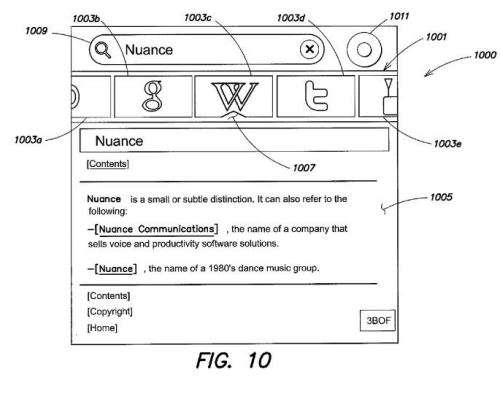

Nuance Communications, which [partners](https://techcrunch.com/2011/05/06/apple-nuance-ios-siri/) with Apple Computers to provide the voice recognition software behind Apple’s [intelligent assistant](https://www.seobythesea.com/2012/01/apples-siri-patent-application/) Siri, had 4 patent applications published today at the USPTO that focus upon search and search technology. While the company has at least 274 granted patents and 104 pending patents listed as assigned to it at the US patent and trademark office, these appear to be the first that focus upon the operations of a search engine. They reference the [Dragon Search](https://web.archive.org/web/20120303220001/http://www.dragonmobileapps.com/apple/search_overview.html) application built for iPhones:

The topics covered in the Nuance patent portfolio primarily involve speech recognition technology, but include some areas that companies like Google have been focusing upon within a few of their patents as well, such as statistical language models and document segmentation algorithms, as well as a browser for the voice web which was filed in 1998.

The pending patents share a common patent description and describe a metasearch engine that can simultaneously send queries to general search engines such as Google or Yahoo or Bing, as well as site-specific search engines. The choices as to which search engines to send a particular query to might be based upon a user preference or request, or upon the content of the query, or “historical browsing information or access patterns of” the particular searcher or aggregated historic browsing and access patterns of other searchers who may have searched using the same query.

So, if people search for information about Miles Davis, for instance, and the results include results from Google, Bing, and Wikipedia, and people tend to select the Wikipedia results, future results may boost the Wikipedia results above the other two.

Requests for searches may also come in the form of a request for a restaurant review for a specific restaurant from a source such as Yelp, or a site search from a particular shoe store on a search for shoes, or from a piece of particular weather information providing site on a search for weather information.

The newly published pending patents are:

[Method and Apparatus for Processing Spoken Search Queries](http://appft.uspto.gov/netacgi/nph-Parser?Sect1=PTO1&Sect2=HITOFF&d=PG01&p=1&u=%2Fnetahtml%2FPTO%2Fsrchnum.html&r=1&f=G&l=50&s1=%2220120059810%22.PGNR.&OS=DN/20120059810&RS=DN/20120059810)
Invented by Vladimir Sejnoha, William F. Ganong, III, Paul J. Vozila, Nathan M. Bodenstab, and Yik-Cheung Tam
Assigned to Nuance Communications, Inc.
US Patent Application 20120059810
Published March 8, 2012
Filed: September 8, 2010

Abstract

> Some embodiments relate to a method of performing a search for content on the Internet, in which a user may speak a search query and speech recognition may be performed on the spoken query to generate a text search query to be provided to a plurality of search engines. This enables a user to speak the search query rather than having to type it, and also allows the user to provide the search query only once, rather than having to provide it separately to multiple different search engines.

[Method and Apparatus for Selecting a Search Engine to Which to Provide a Search Query](http://appft.uspto.gov/netacgi/nph-Parser?Sect1=PTO1&Sect2=HITOFF&d=PG01&p=1&u=%2Fnetahtml%2FPTO%2Fsrchnum.html&r=1&f=G&l=50&s1=%2220120059814%22.PGNR.&OS=DN/20120059814&RS=DN/20120059814)
Invented by Vladimir Sejnoha, William F. Ganong, III, Paul J. Vozila, Nathan M. Bodenstab, and Yik-Cheung Tam
Assigned to Nuance Communications, Inc..
US Patent Application 20120059814
Published March 8, 2012
Filed: September 8, 2010

Abstract

> Some embodiments relate to a method of performing a search for content on the Internet, in which a user may issue a search query, and the search engine or engines to which that query is provided may be determined dynamically based on any of a variety of factors. For example, in some embodiments, the search engine or engines to which the query is provided may be determined based on the content of the search query, this historical access patterns of the user that issued the query, or the historical access patterns of other users.

[Method and Apparatus for Performing an Internet Search](http://appft.uspto.gov/netacgi/nph-Parser?Sect1=PTO1&Sect2=HITOFF&d=PG01&p=1&u=%2Fnetahtml%2FPTO%2Fsrchnum.html&r=1&f=G&l=50&s1=%2220120059658%22.PGNR.&OS=DN/20120059658&RS=DN/20120059658)
Invented by Vladimir Sejnoha, Gary B. Clayton, Victor S. Chen, Steven Hatch, William F. Ganong, III, Gunnar Evermann, Marc W. Regan, Stephen W. Laverty, Paul J. Vozila, Nathan M. Bodenstab, and Yik-Cheung Tam
Assigned to Nuance Communications, Inc.
US Patent Application 20120059658
Published March 8, 2012
Filed: September 8, 2010

Abstract

> Embodiments of the present invention relate to searching for content on the Internet. A user may supply a search query to a device, and the device may issue the search query to a plurality of search engines, including at least one general-purpose search engine and at least one site-specific search engine. In this way, the user need not separately issue search queries to each of the plurality of search engines.

[Method and Apparatus for Searching the Internet](http://appft.uspto.gov/netacgi/nph-Parser?Sect1=PTO1&Sect2=HITOFF&d=PG01&p=1&u=%2Fnetahtml%2FPTO%2Fsrchnum.html&r=1&f=G&l=50&s1=%2220120059813%22.PGNR.&OS=DN/20120059813&RS=DN/20120059813)
Invented by Vladimir Sejnoha, Gunnar Evermann, Marc W. Regan, Stephen W. Laverty
Assigned to Nuance Communications, Inc.
US Patent Application 20120059813
Published March 8, 2012
Filed: September 8, 2010

Abstract

> Some embodiments relate to performing a search for content via the Internet, wherein user input specifying a search query is supplied to a mobile communications device, such as, for example, a smartphone. The mobile communications device separately issues the search query to a plurality of search engines and can receive the results from each search engine and display the results to the user. Thus, the user does not have to separately issue the query to each of the plurality of search engines.

**Takeaways**

An Apple event yesterday introduced the newest version of the iPad, which has a Siri Lite version of the more complex voice recognition interface found on the iPhone 4S. A few weeks after the iPhone 4S was released last year, sites like Forbes were explaining to us [Why Siri Is a Google Killer](https://www.forbes.com/sites/ericjackson/2011/10/28/why-siri-is-a-google-killer/#1b1df4874307).

What we see in the patent filings is more like Dogpile than Google or Bing, and the pending patents do reference Dogpile a few times, though provide examples of how the Nuance search differs from older meta-search engines like Dogpile. However, what Nuance and Apple have going for them in this partnership to provide search is a headstart on a voice-enabled search interface that Google is working hard on providing with an announcement of the release of Google Assistant in Q4 of 2012.

The patent filings do provide some hints as to when results from one search engine might be presented over results from another, but not as much about when a particular site search result might be shown, such as displaying pages from a particular shoe store site search in results to a search for [boots] for example.

Are the metasearch results from Nuance a sign of the possibility of a search of their own in the future to rival Bing and Google, or will they continue to develop more building upon their core strength of speech recognition?
