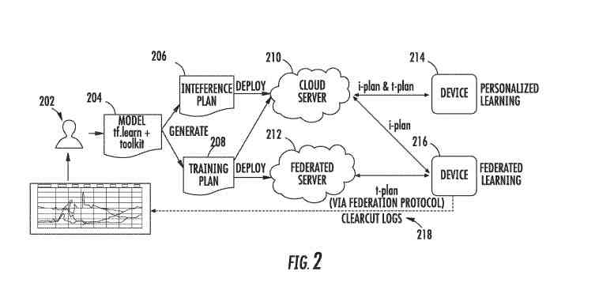
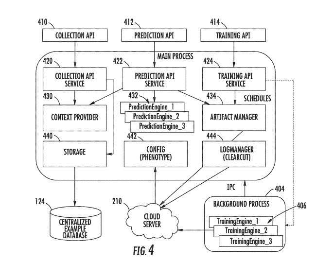
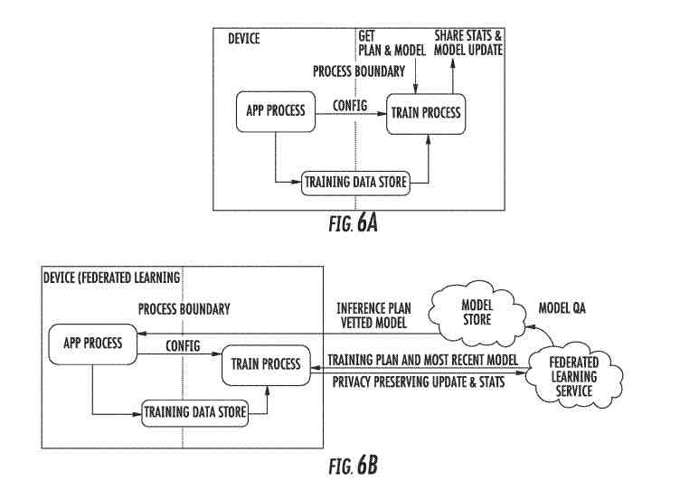
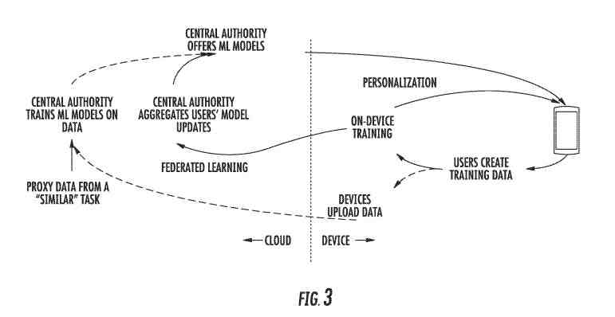
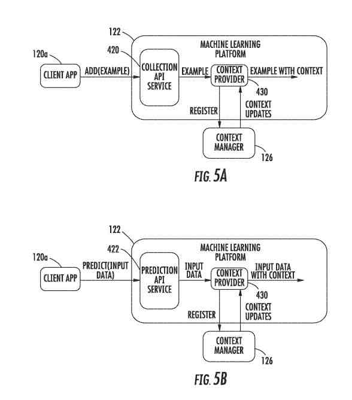
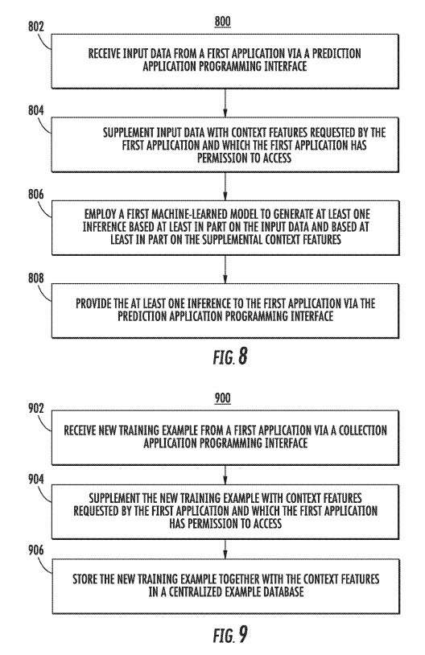
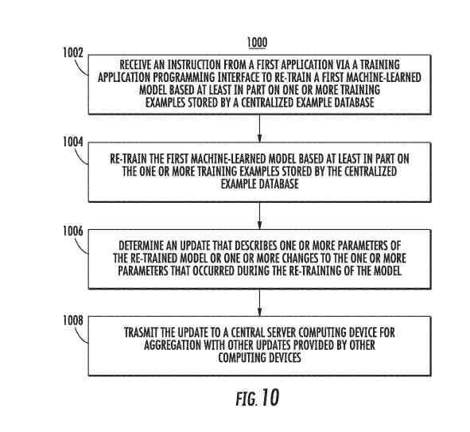

## On-Device Machine Learning Tasks Such As Prediction, Training, and Example Collection

This newly granted patent relates an on-device machine learning platform and associated techniques that enable on-device prediction, training, example collection, and other machine learning tasks or functionality.

Before reading this post, there are many help, support, and Blog pages from Google about On-Device Machine Learning and Federated Learning worth a look. Theseare not getting much discussion in the SEO industry, and they probably should get more. There are support and information pages from Google that are a few years old, already:

- Federated Learning online comic from Google AI: [Federated Learning](https://federated.withgoogle.com/)
- Federated Learning at the Google AI Blog: : [Collaborative Machine Learning without Centralized Training Data](https://ai.googleblog.com/2017/04/federated-learning-collaborative.html)
- Google Developer’s Page: [On-Device Machine Learning](https://developers.google.com/learn/topics/on-device-ml)
- On-Device Machine Learning at the Google AI Blog: [On-Device Machine Intelligence](https://ai.googleblog.com/2017/02/on-device-machine-intelligence.html)
- Tensorflow Website: [TensorFlow Federated: Machine Learning on Decentralized Data](https://www.tensorflow.org/federated)
- Federated Learning Simulation at the Google AI Blog: [FedJAX: Federated Learning Simulation with JAX](https://ai.googleblog.com/2021/10/fedjax-federated-learning-simulation.html)
- Google Developer Advocate for Tensorflow on Youtube: [Intro to On-device Machine Learning (TF Fall 2020 Updates)](https://www.youtube.com/watch?v=Zg0t3f90n6Q)

In recent years, machine learning has gotten used to provide improved services to users of computers. In particular, many applications or other computing programs or systems rely on machine-learned models to produce inferences based on input data associated with the program, device, and user. The applications can use the assumptions to perform or influence any task or service.

One conventional training scheme for solving machine learning problems can include collecting at a centralized location, like a server device, for training examples from many computers and smartphone user devices. A machine-learned model can then get trained at the centralized location based on the collected training examples.

Besides, the trained model can get stored at a centralized location.

The user computing device must send input data to the server computing device to infer the model. The device can wait for the server device to put the machine-learned model to produce inferences based on the transmitted data. The device can then receive the assumptions from the server computing device again over the network.

## Inferences and Training Examples Go-Between A Computing Device and A Server

In such scenarios, the training examples and inferences get transmitted between the user computing device and the server computing device over a network. Such network transmission represents a security risk as the data sent over the network may become susceptible to interception. Besides, such network transmission increases network traffic which can result in reduced communication speeds. Further, the latency associated with transmitting the data back and forth over the network can cause delays in providing the application’s services.

More recently, specific applications have included machine-learned models stored and implemented on the user device. But, this architecture is both challenging to put in place and resource-intensive. For example, the application must keep, manage, train, and put machine-learned models in such a scenario. The inclusion of the model and related support services within the application itself can increase the data size of the application, resulting in a larger memory footprint.

Machine learning within the application can also must more frequent application updates. For example, the application may need to get updated as the underlying machine learning engine gets updated or otherwise advances. Application updates can network usage and downtime for the user as the update gets downloaded and installed.

Furthermore, machine learning within the application can also complicate application development, as more services need to get built into the application itself. Thus, developers may get required to learn and stay abreast of the intricacies of different machine learning engines.

One aspect of this patent gets directed to a computing device. The computing device includes processors and non-transitory computer-readable media. The non-transitory computer-readable media store: applications implemented by the processors; a centralized example database that stores training examples received from the applications; and instructions that, when executed by the processors, cause the computing device to put in place an on-device machine learning platform that performs operations.

## On-Device Machine Learning Operations

The operations include:

- Receiving a new training example from a first application of the applications via a collection application programming interface
- Determining context features descriptive of a context associated with the computing device
- Storing the new training example together with the context features in the centralized example database for use in training a machine-learned model

Another aspect of the present disclosure gets directed to non-transitory computer-readable media that store instructions that, when executed by processors, cause a computing device to put in place an on-device machine learning platform that performs operations. The operations include receiving input data from the first application of applications stored on the computing device via a prediction application programming interface.

The operations include:

- Deciding context features descriptive of a context associated with the computing device
- Employing at least a first machine-learned model of the models stored on the computing device to generate at least one inference based at least in part on the input data and further based at least in part on the context features
- Providing at least one deduction generated by the first machine-learned model to the first application via the prediction application programming interface

The patent is at:

[On-device machine learning platform applications or other clients](https://patft.uspto.gov/netacgi/nph-Parser?Sect1=PTO1&Sect2=HITOFF&d=PALL&p=1&u=%2Fnetahtml%2FPTO%2Fsrchnum.htm&r=1&f=G&l=50&s1=11,138,517.PN.&OS=PN/11,138,517&RS=PN/11,138,517)
Inventors: [Pannag Sanketi](https://www.linkedin.com/in/pannag-sanketi-bb91142/), [Wolfgang Grieskamp](https://www.linkedin.com/in/wgrieskamp/), [Daniel Ramage](https://www.linkedin.com/in/daniel-ramage-bbb7544/), [Hrishikesh Aradhye](https://www.linkedin.com/in/aradhye/), and [Shiyu Hu](https://www.linkedin.com/in/shiyu-hu-112b1118/)
Assignee: Google LLC
US Patent: 11,138,517
Granted: October 5, 2021
Filed: August 11, 2017

Abstract

> The present disclosure provides systems and methods for on-device machine learning.
>
> In particular, the present disclosure gets directed to an on-device machine learning platform and associated techniques that enable on-device prediction, training, example collection, and other machine learning tasks or functionality.
>
> The on-device machine learning platform can include a context provider that securely injects context features into collected training examples and client-provided input data to generate predictions/inferences.
>
> Thus, the on-device machine learning platform can enable centralized training example collection, model training, and usage of machine-learned models as a service to applications or other clients.

## Performance of the On-Device Machine Learning Functions

This patent is about building systems and methods for on-device machine learning. It describes an on-device machine learning platform. It also includes associated techniques that enable on-device prediction, training, example collection, and other machine learning tasks or functionality, which may get referred to as “machine learning functions.”

The on-device machine learning platform is from computer programs stored locally on a computing device or terminals, such as a smartphone or tablet. Those get configured when executed by the user device or terminal to perform machine learning management operations. They can enable on-device machine learning functions on behalf of locally-stored applications, routines, or other local clients.

At least some of the on-device machine learning functions may get performed using machine learning engines implemented locally on the computing device or terminal. Performance of the on-device machine learning functions on behalf of the locally-stored applications or routines may get referred to as “clients.” These may provide a centralized service to those clients, which may interact with the on-device machine learning platform via application programming interfaces (APIs).

## Generating Predictions and Inferences Using Context Features

The on-device machine learning platform can include a context provider that securely injects context features into collected training examples and client-provided input data to generate predictions or inferences. Thus, the on-device machine learning platform can enable:

- Centralized training
- Example collection
- Model training
- Usage of machine-learned models as a service to applications or other clients

More particularly, a computing device such as, for example, a mobile computing device, like a smartphone, can store or otherwise include applications (e.g., mobile applications). The computing device can also include and put in place the on-device machine learning platform and machine-learned models. For example, the device can store the machine-learned models in a centralized model layer managed by the platform.

According to one aspect of the present disclosure, the applications can communicate with the on-device machine learning platform via an API. It may get referred to as the “prediction API.” It may also provide input data and get predictions based on the input data from the machine-learned models.

The on-device machine learning platform can download the URI content with a uniform resource identifier (URI) for a prediction plan.

These can be instructions for running the model to get inferences or predictions, or model parameters. These get created by interacting with a machine learning engine to build the model.

It can show the prediction plan and parameters, and we can get inferences or predictions with the model. Besides, the platform can store the content so that it can get used for later prediction requests.

Thus, on-device machine-learned models can communicate with the on-device machine learning platform via a client and service relationship. In particular, the machine-learning platform can be a standalone multi-tenant service that can get referenced by applications. A given application is not required to store, manage, train for machine-learned models. You can simply communicate with the on-device machine learning platform to request and receive inferences from the models.

## Storing Training Models Received From Applications

According to another aspect of the present disclosure, the computing device can include a centralized example database that stores training examples received from the applications. For example, each application that is a client or tenant of the platform can have its collections of models stored within the centralized example database.

The groups can get supplemented and managed in an online fashion. In particular, the on-device machine learning platform can receive training examples from the applications via an API (which may get referred to as the “collection API”) and manage the standards’ storage in the centralized example database.

The on-device machine learning platform can cause storage of each training example received from an application (e.g., within its corresponding collection) according to options parameters associated with the application providing the training example. As one example, the options parameters can include a time-to-live parameter that defines a period for which training examples get stored (e.g., and are after that deleted). The options parameters can get predefined and adjusted through instructions provided to the platform via the collection API.

## Injecting Context Features Descriptive of a Context Associated With the Computing Device

The on-device machine learning platform can securely inject context features descriptive of a context associated with the computing device into the training examples. For example, upon receiving a training example from an application, a context provider component of the on-device platform can determine context features and store such context features together with the training example in the centralized example database.

For example, the context features and the data provided in the new training example can get stored as a single database entry. The particular context features that get determined and then injected or otherwise associated and stored with a training example received from a specific application can get specified by the options parameters for such particular application.

As described above, these options features can get adjusted or predefined via the collection API. Thus, an application can control (e.g., via defining the options parameters) which context features or context types get injected into its training examples.

Context features get injected on the service side, such that the context features never need to become directly available to applications. The centralized example database is not directly accessible by the applications. The context information stored with a specific training example is not accessible even to the application that provided the training example.

## Grouping or Categorizing Context Features According to Different Context Types

The context features can get grouped or otherwise categorized according to many different context types. In general, each context type can specify or include a set of context features with well-known names and well-known types. One example context type is device information, consisting of the following context features: audio state, network state, power connection, etc.

The content provider requests the value injected for a given context feature from the device (e.g., from a context manager) at the time/point of injection. Alternatively or additionally, the context provider can register as a listener to context updates and maintain a context feature cache of current values for the context features based on the context updates. Then, when context features get injected, the context provider can simply access the context feature cache and inject the current value maintained in the store for the particular context feature.

Besides context features to training examples at storage time, the context provider can also inject context features at inference time. In particular, when a specific application or other client requests to use the prediction API for an inference generated based on client-provided input data. The context provider can inject or provide supplemental context features for input into the corresponding machine-learned model alongside the input data. Thus, inferences can get made on context information and the client-provided input data, which may improve the accuracy of the stereotypes.

The training examples and context features described herein get provided to illustrate example data stored with training examples or used to provide inferences by the on-device platform. But, the data is not collected, used, or analyzed unless the user provided consent after knowing what gets collected and how it gets used. Besides, certain information or data can get treated in or more ways before it gets stored or used so that personally identifiable information gets removed or stored in an encrypted fashion. Further, the user can get supplied with a tool to revoke or change the scope of permissions.

According to another aspect, since specific applications or other clients may have permission to access only certain context features or context types (e.g., defined or controlled by a device user), the context provider can perform client permission control. The on-device machine learning platform or another device component can maintain a mapping of which clients can access context types.

When context features get injected, such as a training example for storage or to supplement client-provided input data at inference time, the context provider can check the permission status of the application or another client relative to the context features or context types to get injected.

For example, the permission status for a particular application and a context type can describe whether such application has permission to access such context type. The context provider will inject features included in context types that the application has permission to access. This permission prevents an application from accessing, even in second-hand parts or types that it can not access.

Like the time-to-live options parameter described above, each context feature can have an end period associated in addition to that or assigned to that. This end period information can get related to each training example that contains context features.

After the end period for a particular context feature provided in a specific training example, the value for such a feature can get deleted or otherwise removed from such a training example. Or the entire training example can get deleted or otherwise removed.

In response to a change to a permission status for a particular application or another client relative to a specific context or context type feature, the on-device platform can delete any entries for such context features associated with training examples from the centralized example database related to the particular application. Besides, the corresponding models can be re-trained on the remaining data after deleting the context feature values.

## Training The On-Device Machine Learning Model With Applications

According to yet another aspect of the patent, the applications can communicate with the on-device machine learning platform using an API. It may get referred to as the “training API” to cause re-training or updating of a machine-learned model based on training examples stored in the centralized example database. Given a URI for a training plan, such as instructions for training the model, the on-device machine learning platform can train the model by interacting with a machine learning engine to cause movement of the model by the engine. It can do this based on prior collected examples. For example, the training can get performed in the background at scheduled times and when the device is idle.

After re-training the model, the re-trained model can provide inferences as described elsewhere herein. These inferences will have higher accuracy since the model has been re-trained on data specific to the user. Thus, the on-device machine learning platform can enable centralized example data collection and corresponding personalization of machine-learned models as a service to applications or other clients.

The machine learning platform can upload logs or other updates about the machine-learned models to the cloud for detailed analytics of machine learning metrics. The on-device platform can determine an update that describes the parameters of a re-trained machine-learned model or changes to the parameters of the machine-learned model that occurred during the re-training of the model.

## Updating the Learning Modle Using Federated Learning

The platform can send the update to a central server computing device, such as “the cloud.” for aggregation with other updates provided by other computers. Thus, the platform can enable participation in a process known as “federated learning.” “Federated Learning” is when a device determines a local update to a model based on locally stored data and then communicates the local update to a cloud service (e.g., in a privacy-preserving and communication efficient manner) for aggregation to generate a global update to the model.

Each application can enclave certain functionalities (e.g., for every functionality) offered by the on-device platform. For example, the platform can authenticate an application before accessing the platform gets returned to the application via a factory. The returned interface can then represent a sole view of the application’s enclave in the venue. In one example implementation of this process, when an application connects to an API of the platform, the application can provide a signed package token that verifies the application’s identity. The application is not able to get the API interface without passing this authentication.

## Machine Learning Engine Variations

According to another aspect of the present disclosure, the on-device machine learning platform can completely abstract from an underlying machine learning engine. For example, the machine learning engine can be a TensorFlow engine, a neural network library, or other engines that enable the implementation of machine-learned models for inference and training.

Due to such abstraction, the machine learning platform can treat model artifacts as blobs generated in the cloud and then shipped to devices (e.g., via dynamic model download). They are then interpreted by matching engines. In such a fashion, the machine learning platform and its supported applications can be resilient against changes to the machine learning engine and agnostic/flexible to a particular motor or engine type employed.

According to another aspect, a toolkit that is complementary to the on-device platform can provide a set of tools (e.g., Python tools) to create and simulate models in the cloud before they get shipped as artifacts to devices. The toolkit can generate from the same source artifacts (e.g., Python source artifacts) for different versions of machine learning engines or even different engine types (e.g., mobile-focused TensorFlow Lite versus a neural network library, etc.).

The on-device machine-learning platform can get included in or implemented as an application, such as, for example, a mobile application. For instance, in the context of the Android operating system, the on-device machine-learning platform can get included in an Android Package Kit (APK) that can get downloaded and updated. In one example, the on-device machine-learning platform can fit in or implement as a part of a more extensive application that provides many different support services to other applications or the device itself.

For example, besides the on-device machine-learning platform, the more extensive application can enable the computing device to interact with a digital distribution service (e.g., downloading applications and updates from an “app store”) and other services. In another example, the on-device machine-learning platform can be included in or implemented as part of the device’s operating system rather than a standalone application.

## The On-Device Machine Learning Model and Technical Impact and Help

The systems and methods of the patent provide many technical effects and benefits. As one example of technical impact and help, the on-device machine-learning platform can personalize machine-learned models based on locally-stored device-specific training examples, thereby leading to higher accuracy inferences. Similarly, as described elsewhere, the on-device platform can enable participation of the device in “federated learning,” in which local updates get aggregated to generate a global update, thereby leading to improved global model accuracy for all individuals.

Another example of technical effect and benefit is that the on-device machine-learning platform can enable the secure inclusion of contextual signals into training examples and inference inputs. That is, context features can get added to training examples or inference inputs in a manner that maintains privacy and complies with user-defined permissions. By including context information, the accuracy of the inferences provided by the machine-learned models can improve.

Another example of technical effect and benefit, the on-device machine-learning platform can provide a centralized service so that applications do not need to manage (e.g., train and run) machine-learned models or interact with machine-learning engines. As such, a given application does not have to store, manage, train, and put in place machine-learned models but can instead communicate with the on-device machine learning platform to request and receive inferences from the models. Focusing on communication can enable the data size of applications to be smaller. It can also simplify the development and deployment of applications or other clients as application developers are not required to learn the intricacies of each different machine learning engine but can instead rely upon the usage of the platform APIs.

Like the previous effect and benefit, the on-device machine-learning platform can also easily update a single centralized service rather than all applications. For example, when a new version or type of machine learning engine gets launched, only the on-device platform must update to interact with the new engine because the applications do not interact with the machine but can use the forum to do so on.

This updated approach can drop the need for applications to ensure that they are compatible with the latest versions of machine learning engines. They can instead rely upon the on-device platform to stay up-to-date as the engine technology advances.

Yet another example of technical effect and benefit, the on-device machine-learning platform can improve communication network efficiency and usage. That is, under past paradigms where machine learning gets performed by a server rather than on-device, various types of information (e.g., input data, training examples, inferences, model parameters, etc.) got transmitted by the server to the device over a communications network (e.g., the Internet). But, since the present disclosure enables on-device prediction, training, example collection, and other machine learning tasks or functionality, such information is not required to get transmitted (at least in every instance) over a communications network. Thus, communications network traffic, efficiency, and usage get improved. Since the input data, training examples, is not transmitted to and from a server, the security of the data may get increased.

## An Example Computing Device That Includes An On-Device Machine Learning Platform

The computing device can be any type of computing device, including, for example, a desktop, a laptop, a tablet computing device, a smartphone, a computing device that can get worn, a gaming console, an embedding computing device, or other forms of computers. The computing device can be a mobile computing device and a user computing device.

The on-device machine learning platform can enable on-device prediction, training, example collection, and other machine learning tasks or functionality, which may get referred to as “machine learning functions.”

The on-device machine learning platform may be a computer program stored on a smartphone or tablet, which gets configured to perform machine learning management operations that enable on-device machine learning functions on behalf of locally-stored applications or other local clients.

At least some of the on-device machine learning functions may get performed using machine learning engines implemented on the computing device. Performance of the on-device machine learning functions on behalf of the locally-stored applications or routines (which may get referred to as “clients”) may get provided as a centralized service to those clients, which may interact with the on-device machine learning platform via application programming interfaces (APIs).

The on-device machine learning platform can include a context provider that injects context features into collected training examples and client-provided input data to generate predictions/inferences. Thus, the on-device machine learning platform can enable centralized training, example collection, model training, and usage of machine-learned models as a service to applications or other clients.

More particularly, the computing device can store or otherwise include applications (e.g., mobile applications). The computing device can also include and put in place the on-device machine learning platform and machine-learned models. For example, the device can store the machine-learned models in a centralized model repository managed by the platform.

## Predictions Based On The Input Data From The Machine-Learned Models

According to one aspect of the present disclosure, the applications can communicate with the on-device machine learning platform via an API (which may get referred to as the “prediction API”) to provide input data and get predictions based on the input data from the machine-learned models. Given a uniform resource identifier (URI) for a prediction plan, such as instructions for running the model to get inferences or predictions or model parameters, the on-device machine learning platform can download the URI content – the prediction plan and parameters and get assumptions or projections by running the model. This approach is by interacting with a machine learning engine to cause the implementation of the model by the engine. Besides, the platform can cache the content (e.g., within the repository) to get used for later prediction requests.

Thus, on-device machine-learned models can get accessed by an application by communicating with the on-device machine learning platform via a client/service relationship. For example, a respective machine-learned model can be provided for each application and managed by the platform. Applications can share a single machine-learned model, or a single application can have two or more models.

The machine-learning platform can be a standalone multi-tenant service that can get referenced by applications. As such, a given application does not have to store, manage, train, and put in place, machine-learned models. It can instead communicate with the on-device machine learning platform to request and receive inferences from the models.

## The Computing Device Can Include A Centralized Example Database That Stores Training Examples Received From The Applications

According to another aspect of the present disclosure, the computing device can include a centralized example database that stores training examples received from the applications. In particular, the on-device machine learning platform can receive training examples from the applications via an API (which may get referred to as the “collection API”) and manage the standards’ storage in the centralized example database. For example, each application that is a client or tenant of the platform can have its collections of models stored within the centralized example database. The displays can get supplemented and managed in an online fashion.

The on-device machine learning platform can cause storage of each training example received from an application (e.g., within its corresponding collection) according to options parameters associated with the application providing the training example. As one example, the options parameters can include a time-to-live parameter that defines a period for which training examples get stored (e.g., and are after that deleted). The options parameters can get predefined and adjusted through instructions provided to the platform via the collection API.

The on-device machine learning platform can securely inject context features descriptive of a context associated with the computing device into the training examples. For example, upon receiving a training example from an application, a context provider component of the on-device platform can determine context features. It can store such context features together with the training example in the centralized example database.

## The Injection of Context Features

For example, the context features and the data provided in the new training example can get stored as a single database entry. The particular context features that get determined and then injected or otherwise associated and stored with a training example received from a specific application can get specified by the options parameters for such particular application. As described above, these options features can get adjusted or predefined via the collection API. Thus, an application can control (e.g., via defining the options parameters) which context features or context types get injected into its training examples.

Context features get injected on the service side, such that the context features never need to become available to applications. In particular, the centralized example database is not accessible by the applications. The context information stored with a specific training example is not accessible even to the application that provided the training example.

The context features can get grouped or otherwise categorized according to many different context types. In general, each context type can specify or include a set of context features with well-known names and well-known types. One example context type is device information, consisting of the following context features: audio state, network state, power connection, etc.

The context provider requests the value injected for a given context feature from the device (e.g., from a context manager) at the time/point of injection. Or additionally, the context provider can register as a listener to context updates from the context manager and maintain a context feature cache of current values for the context features based on the context updates. Then, when context features get injected, the context provider can access the context feature cache and inject the current value maintained in the store for the particular context feature.

Besides injection of context features to training examples at storage time, the context provider can also inject context features at inference time. When a specific application or other client requests, via the prediction API, for an inference to be generated based on some client-provided input data, the context provider can inject or provide supplemental context features for input into the corresponding machine-learned model alongside the input data. Thus, inferences can get made based on context information besides the client-provided input data, which may improve the accuracy of the assumptions.

According to another aspect, since specific applications or other clients may have permission to access only certain context features or context types (e.g., defined or controlled by a device user), the context provider can perform client permission control. The on-device machine learning platform or another device component can maintain a mapping of which clients have permission to access which context types or context features. When context features get injected, either into a training example for storage or to supplement client-provided input data at inference time, the context provider can check the permission status of the corresponding application or another client relative to the context features or context types to get injected.

For example, the permission status for a particular application and a context type can describe whether such application has permission to access such context type. The context provider will inject only context features that get included in context types that the application has permission to access, thereby preventing an application from accessing (even in a second-hand fashion) context features/types to which it does not have permission to access.

Like the time-to-live options parameter described above, each context feature can have an end period associated in addition to that or assigned there. This end period information can get related to each training example that contains context features. After the end period for a particular context feature provided in a specific training example, the value for such a feature can be deleted or otherwise removed from such a training example. Or, the entire training example can get deleted or otherwise removed.

Furthermore, in response to a change to a permission status for an application or another client relative to a feature of context or context type, the on-device platform can delete from the centralized example database any values or entries for such context features or types that get associated with training examples related to the particular application. Besides, the corresponding models can be re-trained on the remaining data after deleting the context feature values.

## Re-Training Using the ‘Training API’

According to yet another aspect of the patent, the applications can communicate with the on-device machine learning platform via an API, referred to as the “training API,” to cause re-training or updating of a machine-learned machine model based on training examples stored in the centralized example database. As an example, given a URI for a training plan (e.g., instructions for training the model), the on-device machine learning platform can run training of the model (e.g., by interacting with a machine learning engine to cause movement of the model by the engine) based on earlier collected examples. For example, the activity can get performed in the background at scheduled times and when the device is idle.

After re-training the model, the re-trained model can provide inferences as described elsewhere herein. These inferences will have higher accuracy since the model has been re-trained on data specific to the user. Thus, the on-device machine learning platform can enable centralized example data collection and corresponding personalization of machine-learned models as a service to applications or other clients.

According to another aspect, the machine learning platform can upload logs or other updates about the machine-learned models to the cloud for detailed analytics of machine learning metrics. For example, the on-device platform can determine an update that describes the parameters of a re-trained machine-learned model or changes to the parameters of the machine-learned model that occurred during the re-training of the model (e.g.,,, a “gradient”).

The platform can send the update to a central server computing device (e.g., “the cloud”) for aggregation with other updates provided by other computers. Thus, the platform can enable participation in a process known as “federated learning,” in which a device determines a local update to a model based on stored data and then communicates the local update to a cloud service (e.g., in a privacy-preserving and communication efficient manner) for aggregation to generate a global update to the model.

According to another aspect, to protect the applications from each other, each application can have its enclave for certain functionalities (e.g., for every functionality) offered by the on-device platform. For example, the platform can authenticate an application before accessing the platform gets returned to the application via a factory. The returned interface can then represent a sole view of the application’s enclave in the medium. In one example, when an application connects to an API of the platform, the application can provide a signed package token that verifies the application’s identity. The application is not able to get the API interface without passing this authentication.

## Machine Learning Appplications and Permissions

Each application’s enclave within the platform is account independent. Thus, many charges associated with the same user profile on the computing device can share the same training data and state. This reflects that many accounts are for the same user, and different users on a computing device would use other user profiles instead.

For certain functionality (e.g., accessing context), permissions get required. An application that wants to use a particular context in the platform, even if it never directly touches the context because it stays within the forum, has permission to access the specific context.

All relevant permissions can get verified in the client and then passed on to the platform called, letting the platform operate with this set of permissions. The platform can request that the user consent to the venue having access to all licenses. Context may also need that a particular user gets logged in. Such users can get specified by the application for those cases or determined by an optional field for context injection. But the user may not get detected by the platform. The API itself does not need authentication with such a specific user account.

According to another aspect of the present disclosure, the on-device machine learning platform can completely abstract from an underlying machine learning engine. For example, the machine learning engine can be a TensorFlow engine, a neural network library, or other engines that enable the implementation of machine-learned models for inference and training.

Due to such abstraction, the machine learning platform can treat model artifacts as blobs generated in the cloud and then shipped to devices (e.g., via dynamic model download). They are then interpreted by matching engines. The machine learning platform and its supported applications can be resilient against changes to the machine learning engine and agnostic/flexible to a particular engine or engine type employed.

According to another aspect, a toolkit that is complementary to the on-device platform can provide a set of tools (e.g., Python tools) to create and simulate models in the cloud before they get shipped as artifacts to devices. The toolkit can generate from the same source artifacts (e.g., Python source artifacts) for different versions of machine learning engines or even different engine types (e.g., mobile-focused TensorFlow Lite versus a neural network library, etc.).

The on-device machine-learning platform can get included in or implemented as an application, such as, for example, a mobile application. For instance, in the context of the Android operating system, the on-device machine-learning platform can get included in an Android Package Kit (APK) that can get downloaded and updated.

In one example, the on-device machine-learning platform can get included in or implemented as a part of a more extensive application that provides many different support services to other applications or the device itself. For example, besides the on-device machine-learning platform, the more extensive application can enable the computing device to interact with a digital distribution service (e.g., downloading applications and updates from an “app store”) and other services. In another example, the on-device machine-learning platform can be included in or implemented as part of the device’s operating system rather than a standalone application.

## An Example Machine-Learned Model Deployment

In particular, an application developer can interact with a toolkit to generate and test a model. The model can get split into or represented by an inference plan and a training plan.

A “plan” can include a protocol buffer (AKA “protobuf”) that contains a graph (e.g., a TensorFlow graph) and instructions on how to run the graph. For example, a plan can be a declarative description of a sequence of operations to perform on a graph (e.g., a TensorFlow graph) that embeds the chart itself. The plan can describe how to query the collection for training data, feed it into the graph, and produce and deliver outputs.

The patent illustrates two alternatives (but complementary) deployment schemes. In a first scheme, the inference and training plans are deployed to a cloud server. The cloud server provides the inference plan and the training plan to a device.

The device can put in place the inference plan to generate inferences. The device can additionally put in place the training plan to perform on-device training based on stored data, which can also get referred to as “personalization” or “personalized learning.”

In a second deployment scheme, the inference plan gets deployed to the cloud server as described above. The cloud server provides the inference plan to a device. The device can place the inference plan to generate inferences.

But, alternatively, to deploying the training plan to the cloud server, the training plan gets deployed to a federated server in the second scheme. The federated server provides the training plan to the device. The device can put in place the training plan to perform on-device training based on stored data. After such on-device learning, the device can provide an update to the federated server. For example, the update can describe parameters of the re-trained model or changes to the model’s parameters that occurred during the re-training of the model.

The federated server can receive many such updates from many devices and total the updates to generate an updated global model. The updated global model can then be re-sent to the device.

The device can further provide logs or other updates about the machine-learned models that can get used by the developer (e.g., in conjunction with the toolkit) to get detailed analytics of machine learning metrics. Example metrics that can be computed based on the logs include plots, graphs, visualizations of check-in request outcomes, traffic (e.g., volume), loss and accuracy model metrics, phase duration, or other metrics.

## Example Personalization and Federated Machine Learning Data Flows

The patent depicts three different learning data flows, which may, in some instances, get used in a complementary fashion.

In a first data flow, training data gets generated on a user device. The training data gets uploaded to a central authority which then trains or re-trains a machine-learned model based on the uploaded data. The model goes to the user device for use (e.g., on-device inference).

In a second data flow which can get referred to as personalization or personalized learning, the training data created on the user device gets used to train or re-train the model on the device. Such a device then uses the re-trained model. This personalized learning enables per-device models to get acquainted and evaluated without centralized data collection, thereby enhancing data security and user privacy.

In a third data flow which can get referred to as federated learning, the training data created on the user device gets used to train or re-train the model on the device. Thus, the actual user-specific training data is not uploaded to the cloud, thereby enhancing data security and user privacy.

After such on-device learning, the user device can provide an update to a central authority. For example, the update can describe parameters of the re-trained model or changes to the model’s parameters that occurred during the re-training of the model.

The central authority can receive many such updates from many devices and add the updates to generate an updated global model. The updated global model can then get re-sent to the user device. This scheme enables cross-device models to get trained and evaluated without centralized data collection.

## The On-Device Machine Learning Platform

Many different implementations of the on-device machine learning platform described herein are possible. The example on-device machine learning platform can include or put in place the primary process and a background process.

The primary process can handle all API requests. The main function can provide a collection API service that provides training examples, collection services via a collection API; a prediction API service that provides inference generation services via a prediction API; and a training API service that provides model training services via a training API.

The collection API service can persist training examples with automatic retention policies. The training API service can execute training sessions at scheduled times and conditions as an invisible process, drawing data from an example collection. The prediction API service can allow clients to run inference based on a given model, resulting from the trainer or external sources.

The background process can only host training and other periodic maintenance tasks. It can be transactional and designed to get teared down. The background process obtains its state solely from the primary process.

As discussed further below, the context provider injects context information into examples, both for the collection API service and the prediction API service. The storage component can enable and perform storage of models (e.g., in the centralized example database) and bookkeeping state. It can get based on LevelDB.

Many prediction engines can get accessed by the prediction API service, depending on the prediction plan type. Prediction and training plans and model parameters get provided by or otherwise managed by the artifact manager. The artifact manager can support retrieving artifacts from a cloud server, from application assets, and files. It can also help mutable artifacts, for example, store training results consumed by a predictor or another trainer.

The background process can host many training engines which get chosen based on the training plan. For Federated Learning, the background process can communicate with a federated learning server to upload training results for accumulation using privacy-preserving techniques (e.g., secure aggregation).

The log manager can upload logs about the machine-learned models to the cloud server for detailed analytics of machine learning metrics.

The collection API service is a facility that allows, manages, and performs storage of training examples in a centralized example database for later retrieval by the background process, such as to perform background training. For example, the collection API service can interact with a storage component to manage the storage of the training examples in the centralized example database.

The collection API can look like this: once a client has gotten authenticated, it gets access to an object as demonstrated in the example code below (where the task is an approach to represent asynchronous API calls; Task may get ignored or listened to for observing errors):

The `options` parameter can contain at least the name of a collection. If no further options get provided, the default or earlier configured options can get used. Example options include time-to-live content and context for a learning event before it goes to the database.

The training API and corresponding training API service can schedule the background process to perform training. The background process can implement or interact with training engines to pull data from an example collection and execute a training plan. A plan can be a declarative description of a sequence of operations to perform on a graph (e.g., a TensorFlow graph) that embeds the graph itself.

The plan can describe how to query the collection for training data, feed it into the graph, and produce and deliver outputs.

Each training plan type can get associated with a training plan engine. The on-device machine learning platform can thus get extended by new kinds of plans, making it capable of representing any machine learning execution that fits into the general model of background training.

## An Example API To The Trainer

Learning.getTrainerClient(options) can take chances that contain at least a trainer session name and create or reconfigure a training session. Session names can be constants, like package names, chosen by the application, and the session itself can be eternal. The options can also specify the plan type, the method of obtaining the plan, and any parameters specific to a plan type. Plans may get obtained in different ways depending on the plan type; for example, for federation, the program can get downloaded from the federated learning server; for personalization, it might get contained in the assets or downloaded from a cloud server.

The schedule can be either continuous or one-off. In both cases, training will only get scheduled if device conditions allow. Exercise will only get scheduled or otherwise performed if the device is both idle and charging.

TrainerClient.stop( ) can allow cancellation and removal of a training session.

The prediction API can allow a client to feed input and derive predictions based on a trained model. As the trainer, the predictor can be plan-driven, where the plan is what to perform on a graph and how to get inputs and outputs.

As one example, an example prediction API code is as follows:

Learning.getPredictorClient( ) can return a predictor based on the given options. The options can specify how to get plan and model parameters for prediction. They can also specify which context features should get automatically injected into candidate examples before getting passed into the prediction engine.

predictRank( ) can return a prediction for a ranking problem derived from the given context example and the specified candidates. More application-specific prediction methods can get introduced over time.

The below code illustrates one example usage of the three example APIs.

First, options for configuration can get defined. Typically those options can get obtained by the application from the phenotype config component, but for reasons of simplification, they can get defined as static constants:

Note how URIs can get used to referring to artifacts describing training and prediction plans, as well as model parameters. The methods can encode a graph (e.g., a TensorFlow graph) and information on how to execute the graph. The plans can get created by the tools, such as python tools, included in the toolbox. The model parameters can be opaque representations of weights associated with a plan. URIs can refer to a “model repository” (mrepo:), implying that they get downloaded to the device (e.g., from the cloud server), but can also refer to files cached locally (file:). For example, an artifact manager can manage the download of the model artifacts from the server and other model management tasks.

In the case of a file artifact, dependencies can get defined between the APIs. For example, TrainerOptions can get limited to generating a file artifact with trained parameters consumed by the prediction API service. The on-device machine learning platform can internally deal with such input-output dependencies by delaying operations or rejecting them with an appropriate error code if a required input has not yet become produced.

Given that configuration, the platform can include some API code where training examples are continuously fed into the collection. As one example, the following code can consist of adding training examples:

Each time an example gets added to the cache, the context specified with the COLLECTION_OPTIONS can get added as a feature. The user does not need to limit the size or lifetime of added data, which can get dealt with based on the provided options.

To schedule training, an application can typically, at creation time, ensure that background training gets configured using current options and scheduled. If training has gotten already designed before and configuration has not changed, it will be not affected by this example call:

Finally, another piece of example code can use the prediction API to leverage training results. As one example, this can look as provided in the example code below:

The context provider of an on-device machine learning platform can inject context features into learning events. This can happen on the service side, such that context never needs to become directly available to applications.

## Example Points Where Context Might Get Injected

1. Before an example gets stored into instance collection. The injected context can become specified by CollectionOptions.

2. Before an example gets passed to the prediction engine. The injected context can become specified by PredictorOptions.

In general, each context category can specify a set of features with well-known names and well-known types that get added to the example (e.g., TensorFlow model proto). The value that gets injected for a given context feature might get requested from the system at the point of injection, or it might be a cached value that the platform’s internal context provider periodically updates.

Example context features include: Audio State; Day Attributes; Calendar; Detected Activity; User-Specific Places (e.g., “home” vs. “work”; Network State; Power Connection; Screen Features; User Location; User Location Forecast; WiFi Scan Info; Weather; or other context features.

A user may get provided with controls allowing an election about both if systems, programs, or features may enable the collection of user information. These may include such as training examples and context features. That is if the user sent the content or communications from a server. Besides, specific data may get treated in ways before it gets stored or used to remove personally identifiable information.

For example, a user’s identity may get treated so that no personally identifiable information can get determined, or geographic location may get generalized where location information gets obtained so that a particular area of a user cannot get determined. Thus, the user may control what data gets collected about the user, how that information is used, and what information is provided.

The on-device platform does not need context, so the context provider collects context for client applications. For example, a client application may need “location” as a feature for its machine learning model. Such an application can explicitly inform the on-device platform that the “location” context gets required.

The on-device platform can first check whether the client application has permission to access the device location. If not, the platform does not give context to the client. Otherwise, if the application does have permission, the location context will get populated for the client once it sends the platform a training example.

At each instance in which a client sends the on-device platform an example, the platform examines their permissions and decides whether the client has the permissions to access the context they claimed.

The actual context content is not provided to the application. Instead, the context is simply populated with the training example for the client. The training examples will get kept within the on-device platform database, so the client cannot access the accurate context content.

Certain types of context need a user account to access, like place alias and calendar. The context provider itself does not state which account to use for context. In such cases, the client application should specify the account. If no account gets set by the client, only context that does not need a bill will get provided for the client.

A context manager generally provides the context the on-device platform is using. The context manager can get located in many places, including, for example, within the forum, within an application that includes the platform, and within an operating system of the device. The context provider can register a listener to the context manager and always keeps the latest context updates in the on-device platform memory to improve performance.

The on-device platform can perform or include stale context end. If users turn off a context signal on the device (e.g., turn off location or activity recognition), the context manager does not inform the on-device platform that the context gets turned off. Instead, the context manager simply stops sending the on-device platform the context updates for these contexts. Thus, to avoid using stale context for future events, the platform can cause the stale context to expire. In particular, based on the context properties, different end-time periods can get defined for each context feature or context type. Once the context has reached its end time is can get deleted.

Another example context feature includes the place aliases context feature. In particular, whether a user is at home or work is an essential feature for many client applications. Considering that the user’s home/workplaces do not change frequently, the platform can ask for the current home/work alias once the context provider gets constructed. If the user has consented to such information, the users’ home/workplaces can contact cached. The context provider can use location context to determine whether a user is at home or work by comparing the location context to the cached locations. The place’s alias information can get received from the context manager or a place’s API.

The context manager can deliver contexts in at least the two following ways. In a first example, the on-device platform can register as a listener. In this case, the on-device platform can maintain a cache of updated contexts, which also means that the on-device platform is an always-on service. With a listener, the updated data can get kept in the cache.

## The Benefits of Registering An Application as a Listener

1. Low latency. All contexts get cached within the on-device platform and get transformed to machine learning-friendly formats.

2. If IPCs (Inter-Process Call) to the on-device platform is at a high rate, caching contexts saves battery.

In a second example, the on-device platform can get current contexts in one shot. In this case, the context manager can provide another API to get all contemporary contexts in one go. If this API gets used, the on-device platform typically will not maintain a cache of contexts but instead gets current contexts on demand.

In this mode, the context manager gets asked to keep the updated contexts for the platform, so the platform typically obtains extra UDC permissions, which are not needed in the first option.

The benefits of the one-shot mode include that if IPCs to the on-device platform is at a low rate, it may save battery.

The on-device platform may get user permissions to all contexts listed above. Specific clients may not have the same permissions as the on-device platform has. So the platform can control the permissions for clients. This can get done by using a package manager to extract the permissions associated with a client application. The platform can maintain a mapping between contexts to permissions. Thus, a client will typically explicitly claim what contexts it wants to use when it registers itself with the on-device platform. The platform checks whether the client has the permissions to access the requested contexts. Only contexts to which the application has permission will get used to train and inference the corresponding model.

Besides, the permissions of a client may get changed on the fly. For example, a user may approve an application to use his location when he feels the application may be useful but then revoke the permission. To handle this case, each time a new event comes from the client, the platform can check their existing permissions and involve the corresponding contexts with the possibility to train.

During the inference, the platform can also analyze current client permissions to allow the context features for the prediction. The machine-learned models can accept missing parts for training and inference.

To use the on-device platform API, clients can add an API key to their application. The application can get the key by registering with a central authority that manages the API. For example, applications can get signed with a digital certificate for which clients hold the private key.

## An Example Machine Learning Authorization

One example authorization procedure can include:

1. The on-device platform gets a package name and API key pair when a client registers to the on-device platform. The on-device platform sends the package name and API key pair to a central authority for verification.

2. Once the client gets verified, the on-device platform will generate a platform key for the client to use on that device.

3. For future API calls in that device, the client should provide the platform key to the on-device platform.

The on-device platform can check whether the platform key matches the package name and API key. But, the on-device platform typically does not send them to the central authority to verify again.

In some instances, a device can get shared by more than one user. As such, the on-device platform can extract a primary account from a list when an API gets used. The on-device platform can tie the training data to the primary account and update the related model. Suppose the model for the performance is not available on the device. In that case, the on-device platform can download the model for the client application from the cloud or use a base model (e.g., average model in Federated Learning).

A user can clear his location history or account history. In such instances, the on-device platform can remove all the corresponding contexts. The platform can re-train the model using the remaining contexts for this user in this case.

## Machine Learning Platform Injecting Context Features

In particular, the patent depicts the context provider injecting context features before a training example. An example gets stored in an example collection. The patent describes the context provider injecting context features before an example gets passed to a prediction engine implementing a machine-learned model.

## Example Devices Performing Machine Learning Model Training

In particular, the patent shows a background training process.

An application process can feed training data into a training data store. A training process can get scheduled in the background. Suppose allowed by certain device conditions such as, for example, idle and plugged in.

The training process can pick up a model state and training plan. It can repeatedly pick data from the cache to train the model. It can also eventually publish statistics and model update messages to a cloud server. The training phase may belong, in minutes, so the training process can suspend and resume based on changing device conditions.

It includes a federated learning service that enables federated learning. The training plan and model can get distributed by the federated learning service. The training process can perform training in the background to generate a model update. The model update can be uploaded to the federated learning service (e.g., aggregation). Besides, a quality assurance (e.g., a semi-automated quality assurance) can extract learned models and distribute the models back to the devices.

## An Example Method to Generate Inferences Using Machine-Learned Models

A computing system can receive input data from a first application via a prediction application programming interface.

The computing system can supplement the input data with context features requested by the first application and which the first application has permission to access. Next, the computing system can determine a permission status for the first application relative to each context type. The input data gets supplemented only with context features included in context types that the first application has permission to access.

This computing system can use a first machine-learned model to generate at least one inference based at least in part on the input data and based at least in part on the supplemental context features. And, the computing system can provide at least one inference to the first application via the prediction application programming interface.

## An Example Method to Collect Training Examples for Performing Machine Learning

A computing system can receive a new training example via a collection application programming interface from a first application. A computing system can supplement the recent training example with context features requested by the first application and which the first application has permission to access. Also, the computing system can determine a permission status for the first application relative to each of the context types. The new training example gets supplemented only with context features included in context types that the first application has permission to access.

The example in the centralized example database according to options parameters that have been previously defined for the first application via the collection application programming interface. As one example, the options parameters can include a time-to-live parameter that defines a period for which training examples get stored.

Storing the new training example can include assigning an end period to at least a first context feature of the context features. The method can further include deleting the first context feature or the entire new training example from the centralized example database at the end period assigned to the first context feature.

The method can further include receiving a sign of a change to a permission status for the first application relative to at least one context type. In response to the transition to the permission status, deleting from the centralized example database any context features of at least one context type that gets associated with training examples related to the first application. After deleting the context features, the method can further include re-training machine-learned models associated with the first application using the training examples associated with the first application in the centralized example database.

## A Method to Train Machine-Learned Models

A computing system can receive an instruction from a first application via a training application programming interface to re-train a first machine-learned model based at least in part on training examples stored by a centralized example database.

The computing system can re-train the first machine-learned model based at least in part on the training examples stored by the centralized example database.

Also, the computing system can determine an update that describes parameters of the re-trained model or changes to the parameters that occurred during the re-training of the model.

And, the computing system can send the update to a central server computing device for aggregation with other updates provided by other computers.
