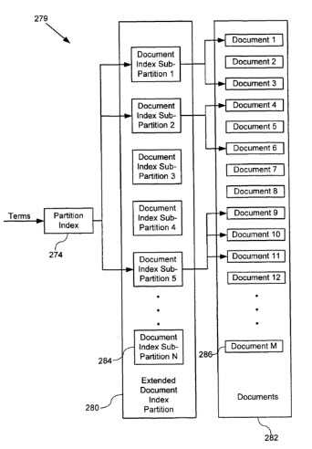

In [The Anatomy of a Large-Scale Hypertextual Web Search Engine](http://infolab.stanford.edu/~backrub/google.html), Sergey Brin and Lawrence Page officially presented Google and its use of hypertext to index documents on the Web and produce better search results.

If you’re interested in discovering how search engines work, there aren’t too many other starting points that might be better than that document.

A new patent granted to Google this week, [System and method for selectively searching partitions of a database](https://patents.google.com/patent/US7254580B1/en), gives us a deeper glimpse into the inner workings of a search engine and its index.

It describes how partitions can be used to make it faster and easier to search through the index of a search engine, and how rarer and less common results for queries might be kept in an extended index, which is also the topic of another patent granted to Google earlier this year that shares the same list of inventors and was filed on the same day, which I wrote about in [Google Patent on Extended Search Indexes](https://www.seobythesea.com/2007/02/google-patent-on-extended-search-indexes/).

Is this extended index what we have been referring to as including Google’s supplemental index results? It could be or could have been. A recent blog post at the Official Google Webmaster Central Blog on supplemental results, [Supplemental goes mainstream](https://webmasters.googleblog.com/2007/07/supplemental-goes-mainstream.html), tells us that Google is going to stop labeling supplemental index results as “supplemental” because the differences between the main index and supplemental index results are growing narrower, and supplemental index results are now fresher and more comprehensive than they have ever been.

Interestingly, it also tells us that supplemental index results were introduced in 2003, which is when these two patents were originally filed.

The patent describes such things as:

- The use of a cache to return results for popular searches,
- Filtering of search results,
- How terms may be mapped to different partitions and sub partitions,
- The role of PageRank in in partitioning results,
- The use of document index sub-partitions, which contain information associating documents with the terms in those documents,
- How snippets for results might be requested,
- How a search of an extended database is triggered and which signals might be used to trigger such a search,
- How extended results are aggregated with results from the standard index,
- When an alternative approach might be used to tell a searcher that there are additional results that can be shown if they click upon a link.

We are also told that while this document describes web search results, this method of using partitions and extended results might also be used for other collections of documents such as books, catalogs, news, etc.

The system used for supplemental results may have evolved since 2003 when these documents were filed. The Google Webmaster Central blog post tells us that the system that crawls and indexes supplemental results had been overhauled in 2006. Note also that nowhere in these patents is the phrase “supplemental results” actually used, yet they do seem to explain how supplemental results work.
