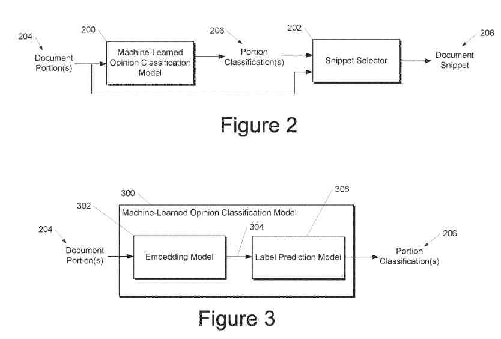
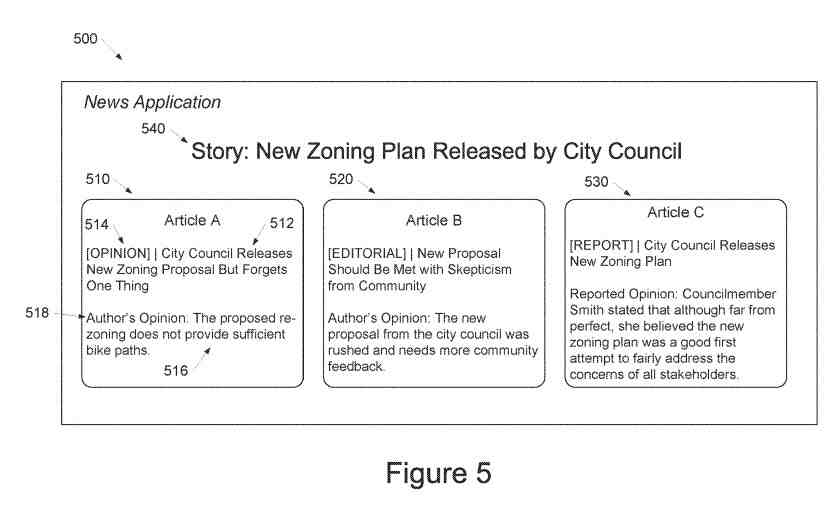

## Opinion News in Top Stories

Earlier this year, I wrote a post about news stories in carousels in [Google Top Stories Are Chosen By Importance Scores](https://www.seobythesea.com/2020/01/google-top-stories-are-chosen-by-importance-scores/)

In that post, the patent I wrote told us that Google might attempt to show opinion pieces related to topics that were being identified as top stories, but it didn’t tell us much about those opinion pieces. So a patent that is on identifying opinions in documents that might be news articles based on some importance measure.

A patent granted earlier this month tells us about how Google may use machine learning to identify opinions in documents on the Web.

## Machine-Learned Models to Classify Portions of Documents as Opinion or Not Opinion.

In more detail, this patent is about systems and methods that use one or more machine-learned models to classify portions of documents as opinion or not opinion. So that portions classified as opinion can work in an informational display.

The description for the patent starts by telling us that “understanding of content (e.g., textual content) contained in a document by a computing system is a challenging problem.”

It points out that is especially true in the professional news journalism space, which has articles that are typically written in high-quality language and syntax. And that computing systems have difficulty understanding only very little about the actual content of those news articles. So this new patent is telling us that it is focusing on news information.

It also tells us about difficulties in determining how one article compares to others and that related news articles written by other journalists are an even more challenging task. The top stories patent didn’t really tell us how it might choose one article over another to display in carousels, so this is good to see more about.

## The Challenge of Comparing Documents to Each Other

**We know that production systems that can select and provide documents (e.g., news articles) to searchers from almost only on shallow content signals (such as salient terms and entities, etc.) and/or metadata (e.g., how important a publisher is, when the content comes out (e.g., relative to other articles), references (e.g., links) between articles, etc.).**

The patent identifies several problems, telling us that such production systems typically do not rely on a nuanced understanding of the actual content of the articles themselves.

The solution involves many research areas related to the computerized understanding of document content and that work in subjectivity detection attempts to identify subjective text.

These kinds of subjectivity detection techniques will often use either a lexicon or a model trained using a lexicon. Unfortunately, the use of such a lexicon can be inherently limiting.

We are also told that subjectivity in itself is not particularly informative. So, for example, “This is great!” is a subjective sentence, but it is not very informative by itself.

## The Use of Sentiment Analysis

Sentiment analysis will try to capture sentiment (i.e., positive, negative, or neutral) of text generally. Or the sentiment about some particular aspect/topic/entity (e.g., positive or negative view on an international treaty) that content may be about.

But, that sentiment analysis at the sentence level does not understand what the text actually says.

And that sentiment analysis at the aspect/topic/entity level can be more insightful, but it has restrictions:

That aspect/topic/entity must exist in some knowledge base, and it can be difficult to determine how two aspects/topics/entities relate to each other.

Also, work in the related area of stance detection is usually about finding for or against a specific topic (such as a proposed legislative action).

But, the resulting systems only work for the topics trained on and can have limited applicability to new or developing topics.

This patent attempts to provide a solution in the face of all these problems.

## This Approach Starts With A Machine-Learned Opinion Classification Model

It starts with a machine-learned opinion classification model configured to classify portions of documents as either opinion or not opinion.

Once that classification happens, several operations take place.

A first step may involve obtaining data descriptive of a document that comprises one or more portions.

Then inputting at least part of the document into a machine-learned opinion classification model.

Afterward, receiving, as an output of the machine-learned opinion classification model, a classification of that portion of the document as being opinion or not opinion.

This patent is at:

[Machine learning to identify opinions in documents](http://patft.uspto.gov/netacgi/nph-Parser?Sect1=PTO1&Sect2=HITOFF&d=PALL&p=1&u=%2Fnetahtml%2FPTO%2Fsrchnum.htm&r=1&f=G&l=50&s1=10,832,001.PN.&OS=PN/10,832,001&RS=PN/10,832,001)
Inventors: Boris Dadachev and Kishore Papineni
Assignee: Google LLC
US Patent: 10,832,001
Granted: November 10, 2020
Filed: April 26, 2018

Abstract

> Example aspects of the present disclosure are directed to systems and methods that use a machine-learned opinion classification model to classify portions (e.g., sentences, phrases, paragraphs, etc.) of documents (e.g., news articles, web pages, etc.) as being opinions or not opinions. Further, in some implementations, portions classified as opinions can be considered for inclusion in an informational display. For example, document portions can be ranked according to the importance and selected for inclusion in an informational display based on their ranking. Additionally or for systems that access and consider many documents, the portions of a document shown as opinion can looked at compared to similar classified portions of other documents to perform document clustering, to ensure diversity within a presentation, and/or other tasks.

## How to Identify Opinions in Documents

This patent tells us about systems and methods employing a machine-learned opinion classification model used to classify portions such as sentences, phrases, paragraphs, etc., of news articles, web pages, and other documents, as being opinions or not opinions.

Those portions chosen as opinions may display in an informational display.

Document portions may rank according to the importance and then display for inclusion based on their ranking.

The patent tells us that the portions of documents classified as opinions may compare to similarly classified portions of other documents. That could be done to perform document clustering when considering multiple documents. This would help ensure diversity within a presentation and in other tasks.

### Classifying Opinion and Importance

So this computing system would have two main components:

1. A machine-learned opinion classification model, which obtains portions from a document and classifies them as opinionated or not opinionated
2. A summarization algorithm, which would rank portions from a document by a portion importance approach (as well as possibly other example criteria such as the ability to stand alone without further context)

### How Opinions would Display in Search Results

These two components may work to show a searcher a document part that is both important and opinionated.

An example would be showing a display identifying some documents, with a summary or “snippet” for each, where each snippet comes from a part of the document classified as an opinion and/or ranked as having high importance.

That snippet could provide search results in response to a query, as part of a “top stories” or “what to read next” feature for a news aggregation/presentation application. They could also be used in other scenarios, that could include a presentation of several different news articles that relate to the same overarching news “story.”

This patent would leverage machine learning to generate improved summaries or “snippets” of documents such as news articles to a user.

By providing snippets that better reflect actual opinionated content, instead of generic facts or quotes, the searcher can more quickly comprehend the true nature of the document. They could decide whether he or she wants to read the document in full.

A searcher can load and read documents that she may not want to read.

### Informational Displays Can Give Improved Diversity, Structure, and Other Features

By identifying and comparing portions of documents classified as actual opinionated content, informational displays can give improved diversity, structure, and other features. They can take into account the actual content of the documents.

The searcher can avoid reading articles featuring redundant opinions.

And opinions, as seen in editorials, “op-eds,” commentaries, and the like, fulfill an essential role in the news journalism ecosystem.

They give editorial teams, outside experts, and ordinary citizens a chance to take part in the public debate on a given issue or event.

This can help the public see different sides of a story and break filter bubbles.

An opinion can include a viewpoint or conclusion that an author of a document explicitly writes into that document.

Sometimes, opinions or opinionated portions of a document can be less explicitly recognized as such.

For example, a rhetorical question can be a form of opinion depending on phrasing, such as sarcasm.

As another example, a summary of facts can be an opinion or state an opinion depending on which:

- The selection of sections of the facts
- The presentation order of those facts
- Interstitial wording
- Other factors

### What will This Information Display Look Like, and How will We Get there?

The patent tells us that determining whether a portion of a document is opinion is challenging and requires a nuanced understanding of human communication.

The computer system aggregating and presenting news articles to a searcher may include or show a snippet for a particular article.

The snippet may mimic or mirrors the headline of articles.

In other instances, the snippet may be from the output of a generic multi-document extractive summarization algorithm.

A generic summarization algorithm typically does not consider the subjectivity of a piece of text.

So, in trying to highlight and summarize the subjective portions of an opinion piece, a generic summarization algorithm would typically not identify a summary that effectively conveys the actual opinion put forth by the article.

The patent tells us that stance detection would be extremely useful to understand better stories. They could use clusters of articles from different publishers on the same news event.

### How Might Stance Detection Help Here?

But stance is hard to define and, as such, to quantify.

Because of these challenges, the present patent recognizes that news documents typically come in two main flavors, neutral reporting of news events and opinions cast on these events.

Being able to separate opinionated from the neutral text in news articles can be useful to filter out non-stance carrying text, which can assist in performing stance detection.

The present disclosure can be useful in performing stance detection or other related tasks by:

- Identifying opinionated portions in documents
- Relating opinionated portions inside the document and/or across other documents (e.g., that relate to the same story)
- To surface opinionated snippets or quotes to users of a news aggregation/presentation application and/or in the form of search results
- To identify portions of a document that convey opinion (e.g., as contrasted with quotes and facts)

**The patent tells us that this classification model will be used to filter “un-interesting” portions for stance detection purposes, such as quotes and facts.**

## Classifying Portions of Documents for Opinions

The computing system described in this patent can input each part into the opinion classification model, and the model can produce a classification for the input part.

The documents it will classify include:

- News articles
- Web pages
- Transcripts of a conversation (e.g., interview)
- Transcripts of a speech
- Other documents

Portions of classified documents would include:

- Sentences
- Pairs of consecutive sentences
- Paragraphs
- Pages
- Etc.

These portions can be overlapping or non-overlapping.

## Determining Opinion in Documents

The patent tells us that “opinionatedness” (i.e., the degree to which something is or conveys opinion) is subjective and topic- and context-dependent.

And it tells us that for this reason, and because simpler methods have clear limitations, the systems and methods from the patent use a machine learning approach.

A drawback of existing approaches is that using a pre-defined lexicon does not work for the context in which a part displays.

For example, the term “short-sighted” is clearly an opinionated word in a political article but is probably not in a medical article.

And as another example, “dedicated” is about a person but does not work when qualifying an object.

So the basic use of a lexicon to identify opinionated portions does not appropriately capture or account for context.

The use of a machine-learned model as described herein provides superior results that evince contextual and/or topic-dependent understanding and classification.

## Using a Neural Network Model

As one example, the machine-learned opinion classification model can include one or more artificial neural networks (“neural networks”).

Some example neural networks can include:

- Feed-forward neural networks
- Recurrent neural networks
- Convolutional neural networks
- Other forms of neural networks

We are also told that neural networks can include layers of hidden neurons and can, in such instances, can work as deep neural networks.

And the machine-learned opinion classification model can include an embedding model that encodes a received portion of the document.

The embedding model can produce an embedding at a final or a close to final, but not the final layer of the model.

It can encode information about the portion of the document in an embedding dimensional space.

The machine-learned opinion classification model may also include a label prediction model generating a classification label based on the encoding or embedding.

The embedding model can include a recurrent neural network (e.g., a unidirectional or bidirectional long short-term memory network). The label prediction model can be or include a feed-forward neural network (e.g., a shallow network with only a few layers).

The embedding model can be or include a convolutional neural network that has one-dimensional kernels designed over words.

## The Machine-Learned Opinion Classification Model

That machine-learned opinion classification model can include or leverage:

- Sentence embeddings
- Bag-of-word models (e.g., unigram, bigram and/or trigram levels)
- Other forms of models

The opinion classification model could be a binary classifier, which means that it could produce a label of “Opinion” or “Not Opinion” for each portion of the document input into the model.

Or the opinion classification model can be a multi-class classification model.

For example the classification model can output one of following three classes:

- Not Opinion
- Reported Opinion (e.g., representing the opinion of a third party such as, for example, quoting someone’s opinion)
- Author Opinion (e.g., representing the opinion of the author of the document)

The portions can show “Opinion” or “Author Opinion” and maybe in an informational display (e.g., in the form of opinionated snippets).

## Additional and/or Different Labels May Be Used

It is possible that additional and/or different labels work rather than those.

For example, extra labels may work (e.g., besides “Opinion” or “Not Opinion”) that account for cases in which a portion of the document is challenging to classify. These documents may exist on the border between opinion and not opinion, or may contain a mix of fact and opinion.

These lables could be such things as a:

- “May Be Opinion” label
- A “Possible Author’s Perspective” label
- A “Mixed Fact and Opinion” label

The classification model might output a classification score. A label might then work using the classification score. by comparing the score to a threshold.

Or the classification score might display as a confidence score.

Usually, a larger classification score indicates that the corresponding part is more opinionated or more probably opinionated.

For example, a classification model may output a classification score ranging from 0 to 1, with 0 corresponding to wholly not opinion and 1 corresponding to wholly opinion.

Following that, a classification score of 0.5 may indicate a mix of opinion or not opinion.

Or, the classification model may output a single score, and a label may come from a single classification score. It may compare the score to one or more thresholds.

Or, the classification model may output a respective score for each available label. Labels may work with the portion based on the multiple scores, by comparing each respective score to a respective threshold and/or by selecting the label that received the highest score.

Or, more features may provide input alongside the document itself to the model or used as extra selection logic).

## Examples of Additional Features

Examples of additional features could include:

- A lexicon
- Main article topic(s)
- Surrounding context
- Story context
- Document type (e.g., news article vs. medical academic paper)
- Context on publisher and/or journalist
- Other features

As another example, only portions of a document classified as an opinion and have at least two subjective words according to a subjectivity lexicon will work.

## Opinion Training Datasets

The machine-learned opinion classification model may work based on many different training schemes or training datasets.

The patent tells us of two training datasets.

- A first training dataset can include opinion pieces from a news corpus, where opinion labels are set up at the document level
- And a second, better quality training dataset that includes documents with portions that have been individually and manually labeled using crowdsourcing

For example, the labels can be set up according to two classes:

1. Sentence reflects the opinion of the author
2. Everything else; or following three classes which include a distinction between author opinion and reported opinion

The first training dataset could improve or seed the classification model (e.g., to learn an embedding, to leverage labeled but noisy data).

The second training dataset would enable the training of a higher precision classifier.

The machine-learned opinion classification model could look at only the second training dataset.

## How A Pre-Trained Language Processing Model Might Be Used

A pre-trained language processing model that could come from other tasks. It may be re-trained on the first and/or second training datasets to generate the opinion classification model.

This pre-trained language processing model could include the Word2vec ground of models.

The first training dataset may work by identifying opinion articles by the application of various search rules.

This process could extract opinion and non-opinion articles from a news corpus by looking at keywords such as “opinion” or “oped” in the URL or the body of the article.

From the first training dataset, all sentences from the identified articles come from.

The labeling of documents may come from each part (e.g., sentence) from such a document. This would provide a relatively simple and fast technique to generate a large first training dataset.

This first training dataset would have a drawback due to its set up: the resulting classification model learns to predict whether the sentence is likely to be part of an opinion piece rather than whether it expresses an opinion.

This is why training on the more fine-grained second training dataset would result in a significant improvement.

The patent tells us that sometimes training of the model may work only using the second training dataset and not the first.

## More Data From Related Aspects

The training for the second dataset may involve that more data comes from many related aspects:

- Boilerplace in the sentence (“Sign up to receive our awesome newsletter!”
- The opinion expressed is the author’s own (as opposed to reported opinions in, for example, quotes

The example training schemes described would enable the machine-learned opinion classification model to learn how opinions could come from a large annotated corpus.

This model would take the entire portion as input. Models that include a recurrent neural network take each word as input sequentially. The model would understand and leverage structural information included in the portions, including sentence structure.

The training system would obtain document data that includes opinion labels.

And tThe training computing system may determine correlations between aspects of the document data such as:

- Sentence structure
- Word choice
- Punctuation
- Syntax
- Formatting
- Document features
- Opinion classifications

This training system could iteratively update correlations on receiving new document data to form the opinion classification model.

Once the model is set up, the opinion classification model can identify opinions within documents.

Machine-learned classification model would work using a narrow domain (such as a specific dictionary or lexicon) but instead can process any language inputs.

The opinion classification model would be easily extensible to other languages. It could generate training datasets for such other languages.

## Displaying Opinion Information from Documents

Following another aspect of the patent, this system could generate a snippet or summary for the document based on classifications. The opinion classification model may have generated those.

The system may perform a ranking process to determines which sentence would serve best as a standalone snippet.

That selected sentence should be relevant to the story and read well without context.

The ranking works by:

- Summarization of each respective portion
- Identification of respective entities mentioned by each respective portion
- A respective classification score assigned to each respective portion by the machine-learned opinion classification model

Determining the importance can work by either looking at the document only or looking at clusters of documents.

Looking at the clusters allows the system to diversify the point-of-views highlighted in the snippets.

The system can perform document summarization algorithms to rank portions of the document in selecting a snippet.

## Using Document Summarization Algorithms

The document summarization algorithm may:

- Choose a set of candidate portions for each document
- Taking into account portion importance, portion opinionatedness (e.g., as reflected by the portion’s corresponding classification score)
- Snippet diversity across articles in the cluster (e.g., story)

The system can perform a standard document summarization algorithm. But, it may restrict the input to the algorithm to only portions labeled as opinions by the classification model.

Summarization algorithm can discard all sentences unsuitable as snippets. It could then select the most opinionated sentence, chosen by the scores produced from the classification model.

A document summarization algorithm can combine sentence importance and opinionatedness to re-rank sentences.

It may:

Present sentences in decreasing order of importance_score*opinion_confidence.

If no opinionated sentence displays, a non-opinionated sentence may show.

This approach is the most flexible and allows more heuristics. The snippet could limit what it shows to the top three portions according to the summarization algorithm.

So, the patented process can select snippets that reflect the author’s opinion for opinion pieces in a news aggregation/presentation application.

## Displaying Opinion Pieces in News

The Opinion pieces can display in:

- Opinion blocks (e.g., alongside more opinion pieces for a given news story)
- Alongside non-opinion pieces
- Standing alone

One goal would be to provide snippets enticing the users to read an opinion piece.

Other goals would include:

- A way to filter sentences that cast a light on authors’ opinions
- Discarding factual sentences and other un-interesting sentences (e.g., quotes)

The opinion classification model also provides a way to select only neutral or factual sentences for non-opinion articles (e.g., removing sentences labeled as opinions).

Respective opinion sentences in articles across an entire news story can join together to bring understanding about which articles may share the same perspective.

This can provide a better understanding of individual articles and compare articles on the same news event or overarching story.

By isolating the point-of-view/opinions of an author, the system can determine how perspectives show or differ between several authors and newspapers to allow for clustering, diversification, and/or other tasks.

Clustering based on opinionated portions can bring a more nuanced understanding of different positions about a subject.

A typical sentiment analysis or stance detection may uncover a fixed and finite set of sentiments (e.g., generally “for,” “against,” or “neutral”).

## Clustering Based on Opinion

Clustering based on opinion might reveal six or seven overlapping but distinct positions about a certain subject.

The opinion identification and snippet selection techniques described here will not provide a fixed, finite set of positions to train on. Still, instead, a more natural and nuanced clustering of opinions can take place.

Thus, the patented process can leverage machine-learning for improved summaries or “snippets” of documents such as news articles to a searcher.

With snippets that better reflect actual opinionated content (e.g., rather than generic facts or quotes), the searcher can more quickly comprehend the true nature of the document. He or she could find out whether to read the document in full.

A searcher can avoid loading and reading documents that she has no interest in reading.

By identifying and comparing portions of documents that are actual opinionated content (e.g., rather than generic facts or quotes), the patented process can provide informational displays with improved diversity, structure, and other features. These could take into account the actual content of the documents.

Searchers can find out a more diverse representation of the different stances included in the documents and avoid reading articles featuring redundant opinions.

## Opinion News Take Aways

This patent provides more details about how a machine learning approach might identify opinion news. It would show those with top stories or in Google News results potentially.

I like the idea that such opinions are likely penned by people who aren’t necessarily journalists. They could be consumers or people in industries involved in the subject matter of a story (such as an employee of a company, a professional athlete, or a scientist).

If you write about news on different topics, writing opinion pieces that people would like to see, and they are worth sharing.

It’s good seeing Google find a way to identify opinion news and incorporate those opinions into content such as top stories in the news.
