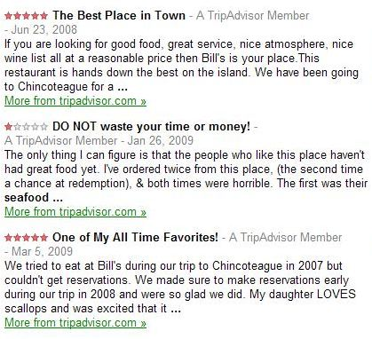
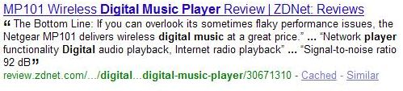
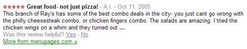
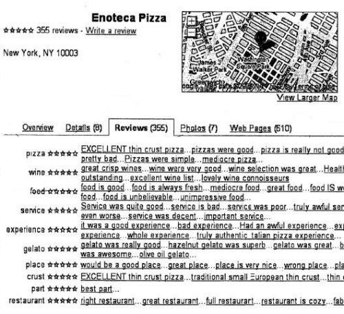

## Opinion Summaries in Google Maps Show Sentiment

You buy a new phone, and it doesn’t work as advertised, and customer service is even worse. Many people in your shoes would go online and write a negative review somewhere.

You go on a vacation and stay at an inexpensive and charming bed and breakfast. You have a wonderful time, in no small part to the thoughtfulness and suggestions of your hosts, and their incredible hospitality. Chances are, you write a glowing review about the experience on the Web.

The number of reviews and review sites on the Web has been growing over the past few years. Google’s recent “review” search option is one attempt to help people find both positive and negative reviews.

Google also presents reviews in Google Maps results. If you search for businesses and organizations in Google Maps, you’ll see under each listing a link to “write a review” for each business listed. If you click upon the “more info” link for a listed business, you’ll see a “review” tab in the box that appears in the middle of the map for that business. The results that show reviews are summaries, which often contain some level of sentiment about the businesses listed.

How does Google come up with those opinion summaries from reviews?

**Sentiment and Reviews**

In providing reviews, Google had to try to find a way to bring meaningful and helpful reviews to their search results. This means going past ratings that might be limited to a certain number of stars out of five, or that provide ratings on aspects of a product or service that might be immaterial to someone looking for more information.

For example, someone looking for a digital music player might be more concerned about the quality of sound and the battery life of the player than its weight or the number of colors it is available in.

A trio of patent applications from Google provides some insights into their approach for finding opinions from people who write reviews online about music, books, films, restaurants, hotels, electronics, and many other products and services.

I wrote about one of the patent filings in a recent post, titled [Google’s New Review Search Option and Sentiment Analysis](https://www.seobythesea.com/2009/06/googles-new-review-search-option-and-sentiment-analysis/). It explored how the language that expresses different sentiments in reviews of different types. For example, “very small” might be a positive phrase when it comes to many electronic components, but the same phrase might be seen as negative when it comes to the size of hotel rooms.

Google has followed up with two more patent applications on reviews and the sentiments contained within them. One of them discusses how Google might summarize sentiments in reviews. The other delves into how Google might create snippets for reviews that appear search results. Both the summaries and the snippets may be displayed to someone who may be interested in seeing reviews and may click through a search result to read more.

Today’s post is about the creation and use of sentiment summaries. In a future post, I’ll write about the creation of sentiment snippets.

**Summarizing Sentiment in Reviews**

This patent application attempts to find different aspects of products or services that are being reviewed, and find phrases in those reviews that express some kind of opinion or sentiment about those aspects, or features.

[Aspect-Based Sentiment Summarization](http://appft1.uspto.gov/netacgi/nph-Parser?Sect1=PTO2&Sect2=HITOFF&u=%2Fnetahtml%2FPTO%2Fsearch-adv.html&r=1&p=1&f=G&l=50&d=PG01&S1=20090193328.PGNR.&OS=dn/20090193328&RS=DN/20090193328)
Invented by George Reis, Sasha Blair-Goldensohn, Ryan T. McDonald
US Patent Application 20090193328
Published July 30, 2009
Filed: March 19, 2008

Abstract

> Reviews express sentiment about one or more entities. Phrases in the reviews that express sentiment about a particular aspect are identified. Reviewable aspects of the entity are also identified.
>
> The reviewable aspects include static aspects that are specific to particular types of entities and dynamic aspects that are extracted from the reviews of a specific entity instance. The sentiment phrases are associated with the reviewable aspects to which the phrases pertain.
>
> The sentiment expressed by the phrases associated with each aspect is summarized, thereby producing a summary of sentiment associated with each reviewable aspect of the entity. The summarized sentiment and associated phrases can be stored and displayed to a user as a summary description of the entity.

We’re told in the patent filing that the process by which reviews are summarized and displayed requires the use of a sentiment summarizing engine, which consists of three parts:

***A sentiment summarizer*** – provides summaries of sentiment about aspects of reviewable objects or services.

Aspects are properties that can be evaluated by someone. A restaurant might be provided with summaries of sentiment about the food served there, and about the service itself. The summary could include a rating, such as three out of five stars or a letter grade. The sentiment summaries can come from reviews found on web sites, and in other locations.

Aspects that may be summarized may be statically generated for certain types of objects or services. Static aspects to be summarized are predefined ones – for example, reviews of hotels would probably always include location or service, so those aspects will be included in all summaries for hotels.

Aspects may also be dynamically determined for different objects and services. That means that a reviewer may express an opinion or sentiment about some aspect of what they are reviewing that isn’t predefined. In a review of a pizzeria, the reviewer may have expressed opinions about the “cheesesteaks,” the “salads,” and the “chicken fingers” they had while they dined there.

The sentiment summarizer looks for phrases about different static and dynamic aspects of objects and services in reviews and creates a summary of the review that includes those sentiments.

***A data repository*** – The actual source reviews, and the summaries of the reviews may be stored in a data repository.

These can include both professional reviews and user-provided reviews from web sites on the internet. A wide range of reviews can be included in the data repository, beyond just restaurants, hotels, and electronics. The patent application points out many examples of other entities that might be included, such as “hair salons, schools, museums, retailers, auto shops, golf courses, etc.” It’s possible that in addition to including the actual reviews in this database, links pointing back to the sources of the reviews may be included.

The summaries stored in the database include sentiment phrases from the source reviews. For example, if a restaurant is reviewed, and the aspect is “service,” sentiment phrases that might be included could be things such as “service was quite good” or “truly awful service.”

***A sentiment display engine*** – In addition to summarizing opinions and storing them, this process requires a way to show the summaries to searchers.

While we might see sentiment summaries in Google’s search options review tab, the patent filing points out that summaries might be shown in a local search.

> In one embodiment, the sentiment display engine is associated with a search engine that receives queries about entities local to geographic regions. For example, the search engine can receive a query seeking information about Japanese restaurants in New York, N.Y. or about hotels in San Francisco, Calif.
>
> The search engine provides the query and/or related information (such as a list of entities satisfying the query) to the sentiment display engine, and the sentiment display engine provides summaries of aspects of matching entities in return. Thus, if the query is for Japanese restaurants in New York, the sentiment display engine returns summaries of aspects of Japanese restaurants in the New York area.
>
> The summaries can include a star rating for each aspect, as well as relevant snippets of review text on which the summaries are based.

**How Sentiment Summarization Works**

The sentiment classification approach requires the search engine to collect a large body of reviews in text form and to go through them and break them down to a word by word level, where each word is tagged with a “part of speech” token that classifies it. The Ultimate goal is to identify phrases like the following:

- Very good sound quality
- This is my favorite pizzeria ever!!
- Print quality was good even on ordinary paper.

Before we can get to phrases like that, the classifier program needs to understand what kinds of words are included in the reviews and to see if they fit into certain patterns or regular expressions.

The “part of speech” tagging can identify punctuation, adjectives, verbs, nouns, pronouns. It may use natural language processing to stem words to their roots, understand different senses or meanings of words used, and recognize compound words.

Regular expression identification can then be used to extract phrases from the text that has been “part of speech” tagged. Here’s the example used in the patent filing:

> The following regular expressions are given in standard regular expression notation. In this notation, the second set of parentheses represents an example of the text that is extracted.
>
> 1. Adjective+Noun: “(.*?)(A+N+)( )” (e.g. great pizza)
>
> 2. Adverb+Adjective+Noun: “(.*?)(R+A+N+)( )” (e.g. really great pizza)
>
> 3. Model Verb+Verb+Adjective+Noun: “(.*?)(MV ?A+N+)( )” (e.g. can make a great pizza)
>
> 4. Pronoun+Verb+Adverb (optional)+Adjective+Noun: “(.*?)(PV ?R*A+N+)( )” (e.g. I love the really great pizza)
>
> 5. Punctuation+Verb+Adverb (optional)+Adjective+Noun, if preceded by punctuation: “( |.*?Q)(V+?R*A+N+)( )” (e.g. Love the great pizza)
>
> 6. Noun/Pronoun+Verb+Adverb (optional)+Adjective: “(.*?)((?: N+|P)+V+R*A+)(Q|$)” (e.g. the pizza is really great)
>
> In alternate embodiments, other methods of identifying sentiment phrases are used, such as syntax trees or semantic grammars.

Once sentiment phrases are identified by the identification of regular expressions in the reviews, the phrases are scored based upon how strong the opinions or sentiments expressed within them might be. This might be done by looking at the words used in the phrases, to see if they tend to indicate fairly strong opinions. For example, the word “quality” tends to be fairly positive, while the word “disease” tends to be generally negative.

I wrote in my earlier post involving [sentiment analysis](https://www.seobythesea.com/2009/06/googles-new-review-search-option-and-sentiment-analysis/) about how some words may express a positive sentiment for some types of objects or services and negative sentiment for others. The phrase “lightweight” might be positive when it comes to a smartphone, and not so positive when it comes to a book about politics.

The next step involves the association of sentiment phrases with different aspects of things and places and services being reviewed.

**Aspects and Sentiment**

If you replace the word “aspects” with the word “features,” it’s much easier to get a grasp on why this patent filing focuses upon providing summaries that cover different aspects of whatever is being reviewed.

When someone looks for information about a restaurant, they may want to know a number of different things about that restaurant:

- How good is the food?
- Do they have a good wine list?
- How is the service?
- Is the atmosphere formal, casual, comfortable, cramped, noisy?
- Where are they located?
- Do they have good seafood, good steaks, great desserts?

These are all features that can be reviewed by a reviewer, and a sentiment summarizer would be much more valuable to people looking for reviews if the reviews covered different aspects or features of the thing being reviewed.

The sentiment summarizer specifically looks for different aspects of the sentiment phrases identified. Some of these may be predefined, such as “location” and “service” for a hotel. Those are such important features of a hotel, that they should be covered in a summary. They are “static” aspects or hotel reviews. Static aspects of electronic devices or DVDs would be different.

Other things may come up in a review outside of predefined static aspects, and these are referred to in the patent filing as “dynamic” aspects. For example, a restaurant that serves “fish tacos” may be reviewed on those fish tacos. That isn’t one of the static aspects that might be covered in all reviews of restaurants, such as price, decor, and location. It’s a feature that is unique to that restaurant.

Here’s part of an image from the patent application that shows sentiment phrases organized by different aspects:

Phrases are matched up with aspects identified in a review, and associated together, like in the image above.

Once that is done, the phrases may be ranked to see which contains the strongest sentiments, whether positive or negative. The ones that do may be combined to create a sentiment summary.

The phrases taken from reviews about a specific object or service may be analyzed to see what percentage of the phrases tend to be positive and which percentage are negative. If 90 percent are positive and 10 percent are negative, and there are slots for 10 phrases in the summary, 9 positive phrases may be shown, and 1 negative phrase.

The sources that the phrases are taken from would also be looked at, and an attempt to present sentiments from as wide a variety of reviews as possible would be made.

Different aspects of the objects or services being reviewed would also be a focus in determining which phrases to include in the sentiment summary.

**Conclusion**

Google will try to cover different features, or aspects, of objects or services reviewed in their summaries, and will try to match the percentage of positive or negative sentiments in the summary phrases they see those reviews within the summary that they present. Here’s the summary for one restaurant that I found in Google Maps:

> Great place to have dinner and a good time with friends. The service was perfect. The server seemed to be able to read my mind. Everything I needed was delivered before I even asked for it. Great decor and delicious food. …

Notice that it includes five different sentiment phrases, covering a range of different features or aspects of the restaurant. In this particular instance, those phrases were all taken from the same review, which covered a range of different aspects of the restaurant. The phrases could have easily been taken from many reviews about the same restaurant.

In the first patent application we looked at from Google about sentiment analysis, we learned that Google might see the same word as expressing a positive or negative sentiment or opinion based upon what was being reviewed.

In this patent application, we see that Google attempts to construct sentiment summaries that cover a range of features from reviews.

In my next post on Google’s sentiment analysis, we’ll look more closely at how sentiment phrases are created, and how they are chosen to be used as snippets in search results.
