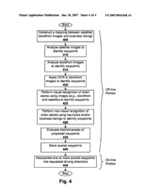

In the future, having the only bright red storefront on your block may bring you free advertising in online driving directions. Those would be a more “human-centric” and visually oriented set of driving directions.

When you receive driving directions from today’s online mapping programs, they often read like this:

> Stay on Main St. for 1.2 miles, and turn Right onto Center Street.

Wouldn’t it be better to get something more like:

> Go down Main Street past the Centerville Bank and the Titan’s Toys Emporium, and make a right on Center Street at the intersection with a McDonalds on it. If you see a Burger King, you’ve gone too far.

At the end of 2005, a Google patent application came out which described [using landmarks in travel directions](https://www.seobythesea.com/2005/12/human-friendly-driving-directions-from-google/) to make it easier to follow travel directions. I’ve been waiting patiently to see that folded into what Google offers with driving directions, but so far they haven’t been.

Was it one of those patent applications that appears, and provides something interesting, and then is never heard of again? Hard to tell. Another patent filing about [customized driving directions](https://www.seobythesea.com/2006/03/customizing-travel-directions-with-google/) was partially implemented. (See the Google Blogoscoped thread on [Google Maps With Multiple Destinations](http://blogoscoped.com/forum/80075.html), and the comment from Matt Cutts about being able to use drag and drop reordering to find the most efficient route.)

**Human-Centric Directions**

A new and related patent filing adds more, including an opportunity to have directions read to you by Google Maps:

[Generating Human-Centric Directions in Mapping Systems](http://appft1.uspto.gov/netacgi/nph-Parser?Sect1=PTO1&Sect2=HITOFF&d=PG01&p=1&u=%2Fnetahtml%2FPTO%2Fsrchnum.html&r=1&f=G&l=50&s1=%2220070016368%22.PGNR.&OS=DN/20070016368&RS=DN/20070016368)

Inventors: Charles Chapin, Michele Covell, Tiruvilwamalai Venkatraman Raman, Andrew R. Golding, and Jens Eilstrup Rasmussen
US Patent Application 20070016368
Published January 18, 2007
Filed: August 22, 2006

Abstract

> Digital mapping techniques are disclosed that provide visually-oriented information to the user, such as driving directions that include visual data points along the way of the driving route, thereby improving the user experience.
>
> The user may preview the route associated with the driving directions, where the preview is based on, for example, at least one of satellite images, storefront images, and heuristics and/or business listings. The visually-oriented information can be presented to the user in a textual, graphical, or verbal format, or some combination thereof.

The process for generating human-centric driving directions involves:

- Creating a route for someone requesting travel directions,
- The request would need to specify at least a target destination;
- Identifying distinctive waypoints along the route which can act as visual markers along the way,
- Including road names and road topology; and,
- incorporating one or more waypoints into travel directions.

**What Makes a Waypoint Distinctive?**

Identifying distinctive waypoints along the route would be done by:

- Identifying cross-streets intersecting each segment of the route, and;
- Identifying distinctive waypoints within route sub-segments between those cross-streets.

Waypoints are stored in a waypoint database, which lists businesses and their locations. Some of those businesses can pay an advertising fee to have their location used as a waypoint in travel directions.

These human-centric directions would use natural language to communicate travel directions and could be spoken directions.

The human-centric version of driving directions above was mine, but here’s one that the patent filing suggests we could see:

“Stay on Main St, you’ll pass a big Sears on your left, then turn right at the Dunkin Donuts”.

Large buildings, isolated buildings, stadiums, parks in urban areas, traffic lights and stop signs – these are things that could be used in this visual driving directions process. Other things that could be used include street-level storefront images, stores with large visible logos, stores of unusual colors, easily recognized stores with well-known brands, or distinctive appearances. So you might see a direction such as:

“Fred’s Shoe Repair is in the middle of the block, just past the bright purple store”.

A simulated drive-through might be available using satellite and street-level images, along with digital maps. Spoken directions could also be available.

This system might be available on desktops, mobile devices, and in-car navigation systems.

**Waypoint Identification and scoring**

The patent application goes into detail concerning waypoint identification and scoring, which leaves me to wonder if one aspect of optimizing for search engines in the future will involve painting buildings unusual and distinctive colors, with large and unique signs and logos that stand out. when you see passages like the following in a patent application, it does make you wonder:

> [0047] The storefront image processor 330 is programmed or otherwise configured to analyze storefront images. In one embodiment, this analysis is carried out at both a coarse level (e.g., width, height, color histograms) and a more refined level (e.g., segmentation into facade, doors, windows, roof, architectural elements such as pillars and balconies; decorative elements such as awnings, signage, neon lights, painted designs).
>
> Such analysis can be carried out, for example, using standard image-processing techniques (e.g., computer vision). Standard feature extraction algorithms typically extract high-level information from images, such as shapes, colors, etc. Pattern recognition algorithms can then be applied to classify the extracted information to “recognize” objects in the storefront images.

As does this one:

> In one particular embodiment, one or more of the following factors are considered in assigning a distinctiveness score:
>
> the magnitude of the difference of the waypoint and its surroundings such as neighbors and open space (e.g., bright red is far away from white in color-space);
>
> the scope of the difference (e.g., the only bright red building on an entire block is more distinctive than a bright red building with another bright red building 2 doors down);
>
> the salience of a waypoint (e.g., a bright red door is less salient than a bright red entire facade);
>
> the visibility of the waypoint (e.g., a building separated from its neighbors by an empty lot may be easier to spot than a store in a row of connected buildings);
>
> and the familiarity of the pattern associated with the waypoint (e.g., in the case of chain stores that have very familiar branding).

A user feedback system could be incorporated into these driving directions, which could include a GPS record of a trip or a form that people can use to comment with positive and negative feedback.

**Advertising**

Advertising could be based upon a cost per use model, for those who pay to be used as a waypoint, and may incorporate some type of targeted relevancy – such as showing camping equipment stores to people traveling to national parks.

**Conclusion**

The process of getting storefront images seems like it might be a labor-intensive process, but Microsoft has shown examples of something similar for their Virtual Earth program, and Google Earth includes a panning feature for some areas that let you see simulated street-level views.

It would be a lot of fun to see this kind of visual driving directions come out, but I’m probably not going to paint an office a distinctive color to stand out from the rest of the buildings in the neighborhood.
