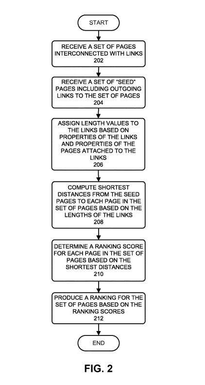

Compared *Added: July 16, 2019,* A Google Search Engineer on a thread at Hacker News told the world that Google stopped using the Stanford Version of PageRank back in 2006, which Barry Schwartz reported upon at Search Engine Roundtable in the post [Former Google Engineer: Google Hasn’t Used PageRank Since 2006](https://www.seroundtable.com/google-hasnt-used-pagerank-since-2006-27891.html) That search engineer was Jonathan Tang, who has been an inventor on at least one Google Patent in the past. Tang stated in a longer post the following:

> The comments here that PageRank is Google’s secret sauce also aren’t really true – Google hasn’t used PageRank since 2006. The ones about the search & clickthrough data being important are closer, but I suspect that if you made that public, you still wouldn’t have an effective Google competitor.

He told us this about the change away from that version of PageRank:

> They replaced it in 2006 with an algorithm that gives approximately similar results but is significantly faster to compute. The replacement algorithm is the number reported in the toolbar and what Google claims as PageRank (it even has a similar name, and so Google’s claim isn’t technically incorrect). Both algorithms are O(N log N), but the replacement has a much smaller constant on the log N factor because it does away with the need to iterate until the algorithm converges. That’s fairly important as the web grew from ~1-10M pages to 150B+.

Google originally filed the newer version of PageRank that this post was about with the USPTO in 2006. It describes PageRank as a link analysis approach in describing the patent and doesn’t refer to itself as PageRank. Still, it is easy to refer to it after reading the patent as a new version of PageRank.

I was asked what parameters seed sites in the trusted seed sets might contain, and the patent (both the original and the continuation version of the patent) tell us that information:

In the section of the patent description labeled “Link Graphs and Seed Sets” are some examples, based on this: ” In one embodiment of the present invention, seeds 102 are specially selected high-quality pages which provide good web connectivity to other non-seed pages.” The patent provides 2 examples: The Google Directory (It was still around when the patent was first filed) and the New York Times. We are also told: “Seed sets need to be reliable, diverse enough to cover a wide range of fields of public interests & well connected to other sites. In addition, they should have large numbers of useful outgoing links to facilitate identifying other useful & high-quality pages, acting as “hubs” on the web.”

Under the PageRank patent, ranking scores are given to pages based upon how far away they might be from those seed sets and based upon other features of those pages.

## PageRank Update by Google

The original PageRank patent, assigned to Stanford University, has expired. Google had an exclusive license to use PageRank. Google filed a PageRank update with a different algorithm behind it. That PageRank patent filed by Google has been updated. Without a doubt, it does cover PageRank, as it describes in the description to the patent, which tells us this about PageRank:

> A popular search engine developed by Google Inc. of Mountain View, Calif. uses PageRank.RTM. As a page-quality metric for efficiently guiding the processes of web crawling, index selection, and web page ranking. Generally, the PageRank technique computes and assigns a PageRank score to each web page it encounters on the web. The PageRank score serves as a measure of the relative quality of a given web page compared to other web pages. PageRank generally ensures that important and high-quality web pages receive high PageRank scores, which enables a search engine to efficiently rank the search results based on their associated PageRank scores.

~ [Producing a ranking for pages using distances in a web-link graph](http://patft.uspto.gov/netacgi/nph-Parser?Sect1=PTO1&Sect2=HITOFF&d=PALL&p=1&u=%2Fnetahtml%2FPTO%2Fsrchnum.htm&r=1&f=G&l=50&s1=9,953,049.PN.&OS=PN/9,953,049&RS=PN/9,953,049)

A continuation patent showing a PageRank update was granted today. The original version of this PageRank patent was filed in 2006. It reminded me of a lot of Yahoo’s TrustRank (which is cited by the patent’s applicants as one of a large number of documents that this new version of the patent is based upon.)

I first wrote about this new version of PageRank in the post titled, [Recalculating PageRank](https://www.seobythesea.com/2015/11/recalculating-pagerank/). It was originally filed in 2006, and the first claim in the patent read like this (note the mention of “Seed Pages”):

> What is claimed is:
>
> 1. A method for producing a ranking for pages on the web, comprising: receiving a plurality of web pages, wherein the plurality of web pages are interlinked with page links; receiving n seed pages, each seed page including at least one outgoing link to a respective web page in the plurality of web pages, wherein n is an integer greater than one; assigning, by one or more computers, a respective length to each page link and each outgoing link; identifying, by the one or more computers and from among the n seed pages, a kth-closest seed page to a first web page in the plurality of web pages according to the lengths of the links, wherein k is greater than one and less than n; determining a ranking score for the first web page from the shortest distance from the kth-closest seed page to the first web page and producing a ranking for the first web page from the ranking score.

The first claim in the newer version of this continuation PageRank patent is:

> What is claimed is:
>
> 1. A method, comprising: obtaining data identifying a set of pages to be ranked, wherein each page in the set of pages is connected to at least one other page in the set of pages by a page link; obtaining data identifying a set of n seed pages that each include at least one outgoing link to a page in the set of pages, wherein n is greater than one; accessing respective lengths assigned to one or more of the page links and one or more of the outgoing links; and for each page in the set of pages: identifying a kth-closest seed page to the page according to the respective lengths, wherein k is greater than one and less than n, determining the shortest distance from the kth-closest seed page to the page; and determining a ranking score for the page based on the determined shortest distance, wherein the ranking score is a measure of the relative quality of the page relative to other pages in the set of pages.

The Updated PageRank patent is:

[Producing a ranking for pages using distances in a web-link graph](http://patft.uspto.gov/netacgi/nph-Parser?Sect1=PTO1&Sect2=HITOFF&d=PALL&p=1&u=%2Fnetahtml%2FPTO%2Fsrchnum.htm&r=1&f=G&l=50&s1=9,953,049.PN.&OS=PN/9,953,049&RS=PN/9,953,049)
Inventors: Nissan Hajaj
Assignee: Google LLC
US Patent: 9,953,049
Granted: April 24, 2018
Filed: October 19, 2015

Abstract

> One embodiment of the present invention provides a system that produces a ranking for web pages. During operation, the system receives a set of pages to be ranked, wherein the set of pages are interconnected with links. The system also receives a set of seed pages which include outgoing links to the set of pages. The system then assigns lengths to the links based on the properties of the links and properties of the pages attached to the links. Next, the system computes the shortest distances from the set of seed pages to each page in the set of pages based on the lengths of the links between the pages. Next, the system determines a ranking score for each page in the pages based on the computed shortest distances. The system then produces a ranking for the pages based on the ranking scores for the set of pages.

Under the PageRank patent, we see how it might avoid manipulation by building trust into a link graph like this:

> One possible variation of PageRank that would reduce the effect of these techniques is to select a few “trusted” pages (also referred to as the seed pages) and discovers other pages that are likely to be good by following the links from the trusted pages. For example, the technique can use a set of high-quality seed pages (s.sub.1, s.sub.2, . . . , s.sub.n), and for each seed page i=1, 2, . . . , n, the system can iteratively compute the PageRank scores for the set of the web pages P using the formulae:
>
> .A-inverted..noteq..di-elect cons..function..times..fwdarw..times..function..times..function..fwdarw. ##EQU00002## where R.sub.i(s.sub.i)=1, and w(q.fwdarw.p) is an optional weight given to the link q.fwdarw.p based on its properties (with the default weight of 1).
>
> Generally, it is desirable to use many seed pages to accommodate the different languages and a wide range of fields in the fast-growing web content. Unfortunately, this variation of PageRank requires solving the entire system for each seed separately. Hence, as the number of seed pages increases, the complexity of computation increases linearly, limiting the number of seeds that can be practically used.
>
> Hence, what is needed is a method and an apparatus for producing a ranking for pages on the web using many diversified seed pages without the problems of the above-described techniques.

The summary of the PageRank patent describes it like this:

> One embodiment of the present invention provides a system that ranks pages on the web based on distances between the pages, wherein the pages are interconnected with links to form a link graph. More specifically, a set of high-quality seed pages is chosen as references for ranking the pages in the link graph. The shortest distances from the set of seed pages to each given page in the link graph are computed. Each of the shortest distances is obtained by summing lengths of a set of links that follows the shortest path from a seed page to a given page, wherein the length of a given link is assigned to the link based on properties of the link and properties of the page attached to the link. The computed shortest distances are then used to determine the ranking scores of the associated pages.

The PageRanl patent discusses the importance of a diversity of topics covered by seed sites and the value of a large set of seed sites. It also gives us a summary of crawling and ranking and searching like this:

> Crawling Ranking and Searching Processes
>
> FIG. 3 illustrates the crawling, ranking, and searching processes following an embodiment of the present invention. During the crawling process, web crawler crawls or otherwise searches through websites on the web to select web pages to be stored in the indexed form in a data center. In particular, the web crawler can prioritize the crawling process by using page rank scores. The selected web pages are then compressed, indexed, and ranked in (using the ranking process described above) before being stored in a data center.
>
> A search engine receives a query from a user through a web browser during a subsequent search process. This query specifies the number of terms to be searched for in the set of documents. In response to a query, the search engine uses the ranking information to identify highly-ranked documents that satisfy the query. The search engine then returns a response through the web browser, wherein the response contains matching pages along with ranking information and references to the identified documents.

I’m thinking about looking up the many articles cited in the patent and providing links to them because they seem to be tremendous resources about the Web. So I’ll likely publish those soon.

I’ve written a few posts about links. These were ones that I found interesting:

5/30/2006 – [Web Decay and Broken Links Can be Bad for Your Site](https://www.seobythesea.com/2006/05/web-decay-and-dead-links-can-be-bad-for-your-site/)
12/11/2007 – [Google Patent on Anchor Text Indexing and Crawl Rates](https://www.seobythesea.com/2007/12/google-patent-on-anchor-text-and-different-crawling-rates/)
1/10/2009 – [What is a Reciprocal Link?](https://www.seobythesea.com/2009/01/what-are-reciprocal-links-and-what-do-search-engines-think-of-them/)
5/11/2010 – [Google’s Reasonable Surfer: How the Value of a Link May Differ Based upon Link and Document Features and User Data](https://www.seobythesea.com/2010/05/googles-reasonable-surfer-how-the-value-of-a-link-may-differ-based-upon-link-and-document-features-and-user-data/)
8/24/2010 – [Google’s Affiliated Page Link Patent](https://www.seobythesea.com/2010/08/googles-affiliated-page-link-patent/)
7/13/2011 – [Google Patent Granted on PageRank Sculpting and Opinion Passing Links](https://www.seobythesea.com/2011/07/google-patent-granted-on-pagerank-sculpting-and-opinion-passing-links/)
11/12/2013 – [How Google Might Use the Context of Links to Identify Link Spam](https://www.seobythesea.com/2013/11/google-context-of-links-identify-link-spam/)
12-10-2014 – [A Replacement for PageRank?](https://www.seobythesea.com/2014/12/replacement-pagerank/)
4/24/2018 – [PageRank Update](https://www.seobythesea.com/2018/04/pagerank-updated/)

Last Updated July 16, 2019.
