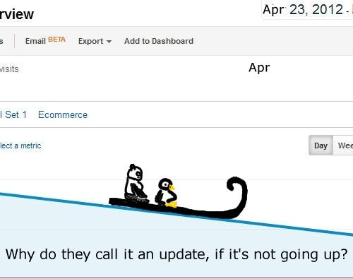

I was looking at the peaks and valleys of traffic in Google Analytics, and thinking of the Google Panda and Penguin updates, and couldn’t stop myself:

Wondering how long it will be before Google runs out of black and white animals to name updates after?
