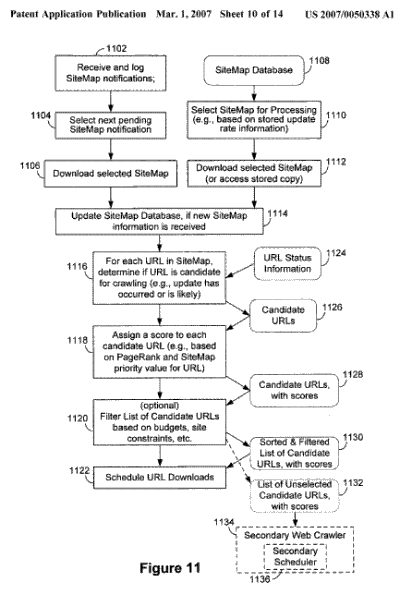

The mobile Web is moving towards us quickly, and search engines aren’t ignoring it. Google has been developing some ways to try to make it easier for people to get their sites into Google’s search index with their Google Sitemaps, and they’ve also developed a version of Sitemaps specifically for pages built for mobile devices.

Designers, search marketers, and site owners should be paying attention, too. Having a web site that may work well on smart phones, and on PDAs that can access the internet could provide a competitive advantage.

In December, I wrote a post about [How Google Might Decide to Index Your Site for Mobile Search](https://www.seobythesea.com/2006/12/how-google-might-decide-to-index-your-site-for-mobile-search/). It was a fairly simple overview of a patent application published by Google which provided some insight into what they might be looking for when deciding whether pages were mobile-friendly enough to be included in the Google Mobile Search index.

A new patent application from Google provides a look inside the processes of Google Sitemaps, and focuses upon the context of their mobile Sitemaps. Here’s a flowchart which shows part of how they work with submitted sitemaps:

If you’re interested in getting a some more technical technical knowledge about how Google’s Sitemap process works, you may want to spend some time reading through this patent filing.

[Mobile sitemaps](http://appft1.uspto.gov/netacgi/nph-Parser?Sect1=PTO1&Sect2=HITOFF&d=PG01&p=1&u=%2Fnetahtml%2FPTO%2Fsrchnum.html&r=1&f=G&l=50&s1=%2220070050338%22.PGNR.&OS=DN/20070050338&RS=DN/20070050338)
Invented by Alan C. Strohm, Feng Hu, Sascha B. Brawer, Maximilian Ibel, Ralph M. Keller, Narayanan Shivakumar, and Elad Gil
US Patent Application 20070050338
Published March 1, 2007
Filed: May 1, 2006

Abstract

> A method of analyzing documents or relationships between documents includes receiving a notification of an available metadata document containing information about one or more network-accessible documents, obtaining a document format indicator associated with the metadata document, selecting a document crawler using the document format indicator, and crawling at least some of the network-accessible documents using the selected document crawler.

Google Sitemaps are a good way to let the search engine know that you have pages that it may not have found or crawled yet, and may enable the search engine to include those pages in a crawl. Pages on your site that are included in a sitemap, but aren’t accessible through a text based link may still not rank well at all – so Google Sitemaps shouldn’t be considered a replacement for a strong navigational linking system throughout a site.

But if you have pages that are linked together through text-based links that Google just hasn’t found and crawled yet, there may be a benefit to having a sitemap. The patent application tells us:

> In some embodiments, information from the sitemaps may be incorporated into the computation of the page importance score.

The title to this patent application may be “Mobile Sitemaps” but the primary focus is on how Google’s Sitemaps work regardless of whether they are for mobile sites or Web sites.

Some Google pages on Mobile Sitemaps:

- [Small is beautiful](https://googleblog.blogspot.com/2005/08/small-is-beautiful.html)
- [Inside Google Sitemaps: Submitting mobile Sitemaps](http://sitemaps.blogspot.com/2005/08/submitting-mobile-sitemaps.html)
- Creating and submitting Mobile Sitemaps files
