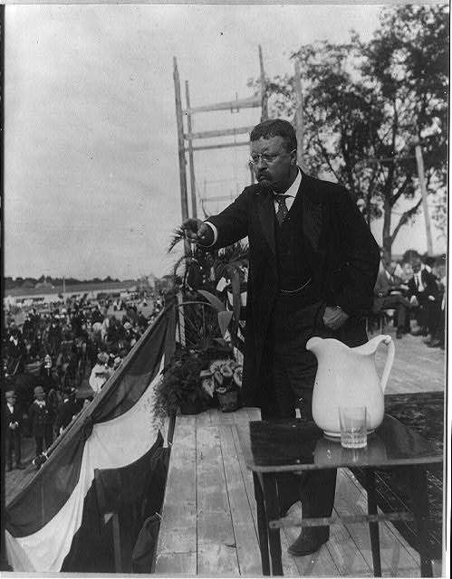

I’ve decided that it’s time for something of a change at SEO by the Sea, and so I am introducing Patent Free Fridays to the blog.

Patent Free Fridays do not always have to happen on a Friday, but they do have to be patent-free, at least if they don’t involve a patent that is from a search engine or a tech company. If I find a patent about how to make a better snowman (and there are a few out there), I might use it for a patent-free Friday.

If I write about finding out that an inventor in my town patented a flying motorcycle, and that I’ve now developed a habit of looking into the sky every time I walk out of my cottage, that could be a good patent-free Friday post. Unfortunately, rumor has it that he passed away (I don’t know if he was in an accident), but I don’t know if he had a protege or not, so I’m going to keep looking.

If I have an idea for an invention, and I write it up in a patent style, that also fits into patent-free Fridays.

I’m tired of seeing columnists at places such as Web Pro World write about me, calling me a “patent analyst.” It’s not something that I do for a living, or to support myself financially. It’s something that I do because I want to know what’s next, and I think to look at patents are a great way to do some business analysis, and get some hints about what the future might bring.

They also give me ideas for questions, but I can ask plenty of questions without patents. Once you start getting inspired with questions with thick legalese-based documents, you can find good questions in almost anything. And I’m intending to ask and answer some good questions with these patent-free Friday posts.

I may do some storytelling here or some opinion pieces. These shouldn’t reduce the amount of patent-based posts that I do. They are just a conscious decision to try something different and see how I like it.

If you have any questions or comments or ideas for things I should write about on Patent Free Fridays, let me know. I have a good topic for next Friday already.

I have to do this now. I’d like to ride that flying motorcycle someday.
